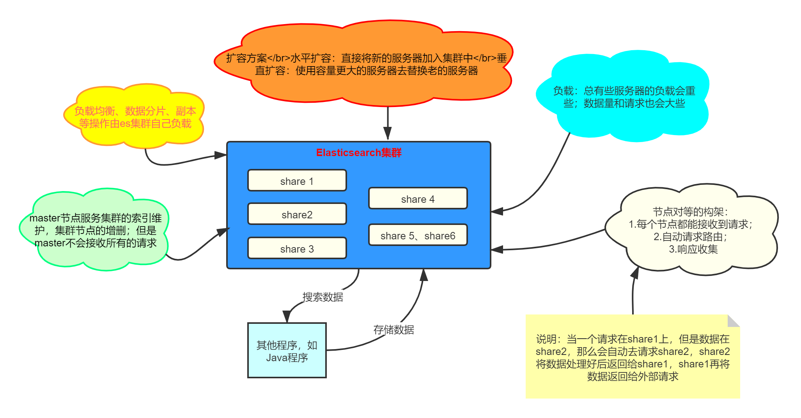
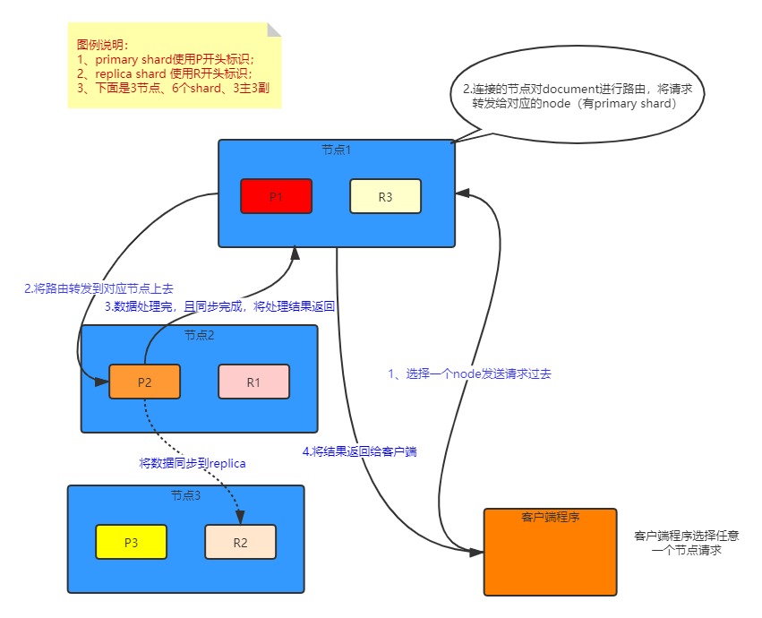
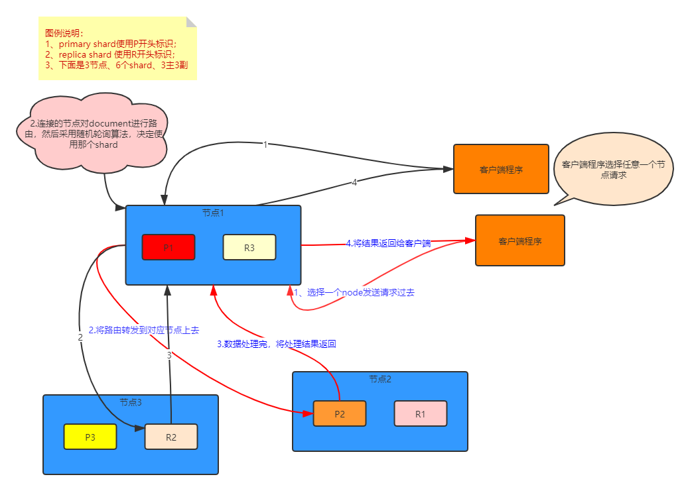
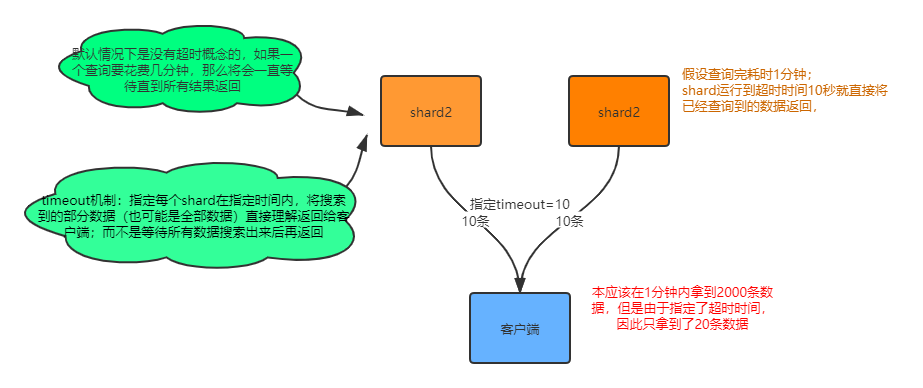
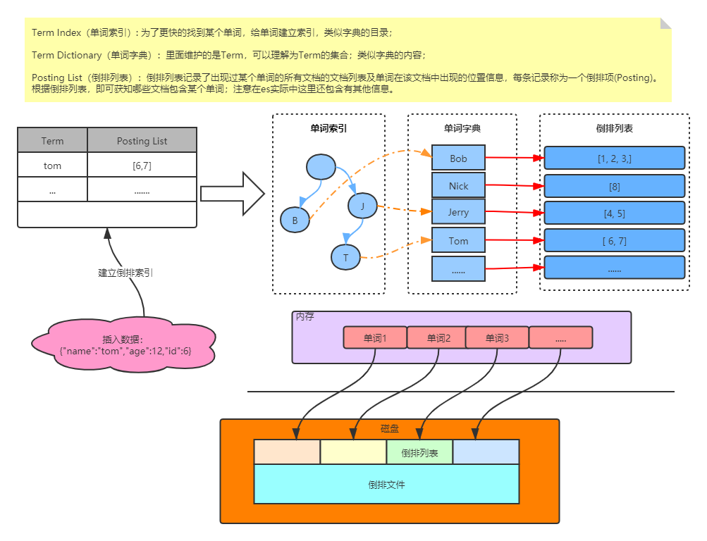
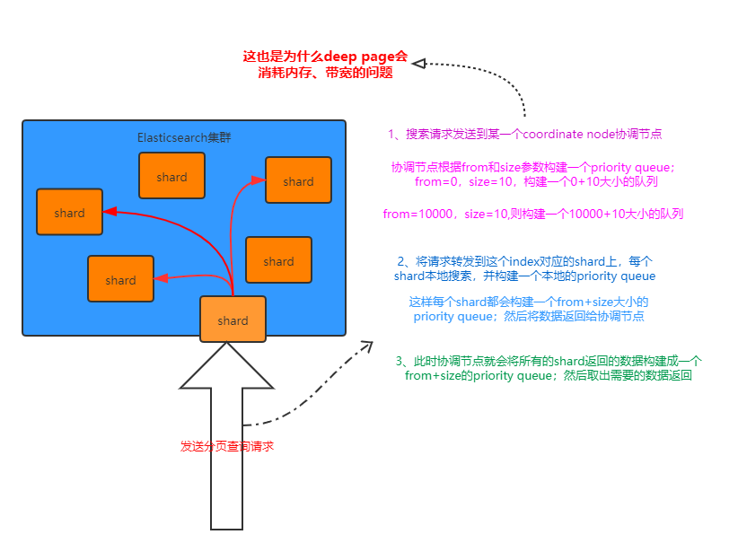
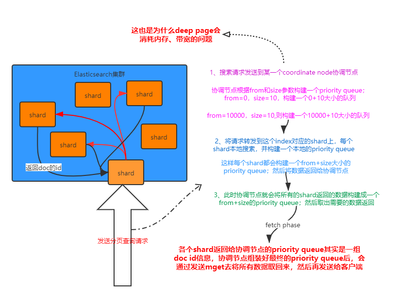
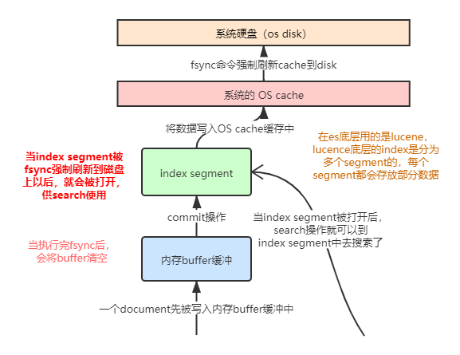
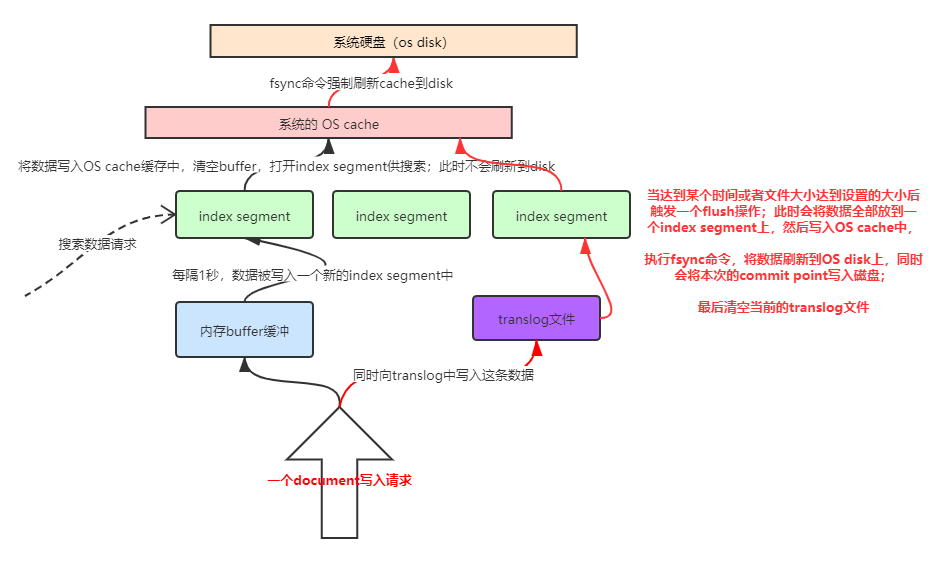
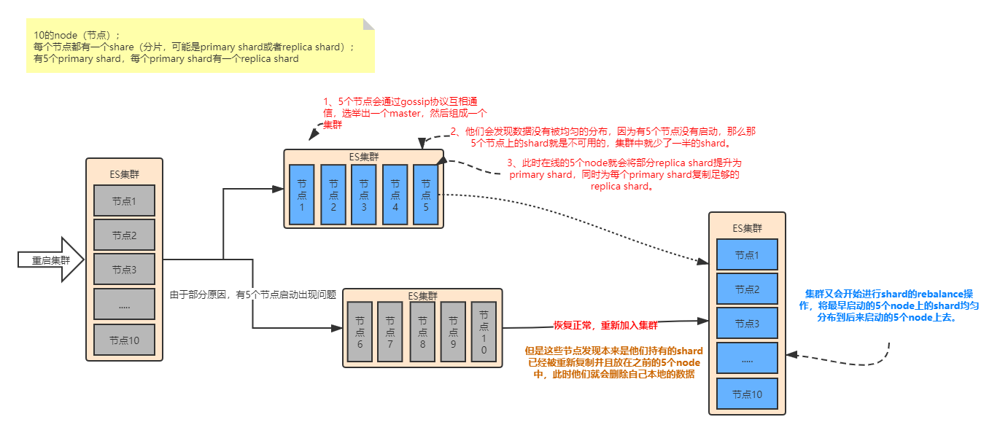

# ELK

-----------------------

## 概述

ELK是Elasticsearch、Logstash、Kibana的简称，这三者是核心套件实现日志采集、分析、展示，但并非全部。

Elasticsearch是实时全文搜索和分析引擎，提供搜集、分析、存储数据三大功能；是一套开放REST和JAVA API等结构提供高效搜索功能，可扩展的分布式系统。它构建于Apache Lucene搜索引擎库之上。

Logstash是一个用来搜集、分析、过滤日志的工具。它支持几乎任何类型的日志，包括系统日志、错误日志和自定义应用程序日志。它可以从许多来源接收日志，这些来源包括 syslog、消息传递（例如 RabbitMQ）和JMX，它能够以多种方式输出数据，包括电子邮件、websockets和Elasticsearch。

Kibana是一个基于Web的图形界面，用于搜索、分析和可视化存储在 Elasticsearch指标中的日志数据。它利用Elasticsearch的REST接口来检索数据，不仅允许用户创建他们自己的数据的定制仪表板视图，还允许他们以特殊的方式查询和过滤数据。

## 一、Elasticsearch基础

现在主流的搜索引擎大概就是：Lucene，Solr，ElasticSearch。这里是对ElasticSearch的学习。

### 1.1 Elasticsearch的功能
    
1. 分布式的搜索引擎和数据分析引擎
    
    搜索：百度，网站的站内搜索，IT系统的检索
    数据分析：电商网站，最近7天牙膏这种商品销量排名前10的商家有哪些；新闻网站，最近1个月访问量排名前3的新闻版块是哪些
    分布式，搜索，数据分析
    
2. 全文检索，结构化检索，数据分析
    
    全文检索：我想搜索商品名称包含牙膏的商品，select * from products where product_name like "%牙膏%"
    结构化检索：我想搜索商品分类为日化用品的商品都有哪些，select * from products where category_id='日化用品'
    部分匹配、自动完成、搜索纠错、搜索推荐
    数据分析：我们分析每一个商品分类下有多少个商品，select category_id,count(*) from products group by category_id
    
3. 对海量数据进行近实时的处理
    
    分布式：ES自动可以将海量数据分散到多台服务器上去存储和检索
    海联数据的处理：分布式以后，就可以采用大量的服务器去存储和检索数据，自然而然就可以实现海量数据的处理了
    近实时：检索个数据要花费1小时（这就不要近实时，离线批处理，batch-processing）；在秒级别对数据进行搜索和分析
    
    跟分布式/海量数据相反的：lucene，单机应用，只能在单台服务器上使用，最多只能处理单台服务器可以处理的数据量

### 1.2 Elasticsearch的适用场景

国外

 （1）维基百科，类似百度百科，牙膏，牙膏的维基百科，全文检索，高亮，搜索推荐
 
 （2）The Guardian（国外新闻网站），类似搜狐新闻，用户行为日志（点击，浏览，收藏，评论）+社交网络数据（对某某新闻的相关看法），数据分析，给到每篇新闻文章的作者，让他知道他的文章的公众反馈（好，坏，热门，垃圾，鄙视，崇拜）
 
 （3）Stack Overflow（国外的程序异常讨论论坛），IT问题，程序的报错，提交上去，有人会跟你讨论和回答，全文检索，搜索相关问题和答案，程序报错了，就会将报错信息粘贴到里面去，搜索有没有对应的答案
 
 （4）GitHub（开源代码管理），搜索上千亿行代码
 
 （5）电商网站，检索商品
 
 （6）日志数据分析，logstash采集日志，ES进行复杂的数据分析（ELK技术，elasticsearch+logstash+kibana）
 
 （7）商品价格监控网站，用户设定某商品的价格阈值，当低于该阈值的时候，发送通知消息给用户，比如说订阅牙膏的监控，如果高露洁牙膏的家庭套装低于50块钱，就通知我，我就去买
 
 （8）BI系统，商业智能，Business Intelligence。比如说有个大型商场集团，BI，分析一下某某区域最近3年的用户消费金额的趋势以及用户群体的组成构成，产出相关的数张报表，**区，最近3年，每年消费金额呈现100%的增长，而且用户群体85%是高级白领，开一个新商场。ES执行数据分析和挖掘，Kibana进行数据可视化

国内

 （9）国内：站内搜索（电商，招聘，门户，等等），IT系统搜索（OA，CRM，ERP，等等），数据分析（ES热门的一个使用场景）

### 1.3 elasticsearch的核心概念

    Elasticsearch			数据库
    
    -----------------------------------------
    
    Document			行
    Type				表（在7.x以后已经移除了，默认为_doc; 在6.x以后一个索引只能有一个type了，在5.x以前一个索引可以有多个type）
    Index				库

 （1）Near Realtime（NRT）：近实时，两个意思，从写入数据到数据可以被搜索到有一个小延迟（大概1秒）；基于es执行搜索和分析可以达到秒级

 （2）Cluster：集群，包含多个节点，每个节点属于哪个集群是通过一个配置（集群名称，默认是elasticsearch）来决定的，对于中小型应用来说，刚开始一个集群就一个节点很正常
 
 （3）Node：节点，集群中的一个节点，节点也有一个名称（默认是随机分配的），节点名称很重要（在执行运维管理操作的时候），默认节点会去加入一个名称为“elasticsearch”的集群，如果直接启动一堆节点，那么它们会自动组成一个elasticsearch集群，当然一个节点也可以组成一个elasticsearch集群

 （4）Document&field：文档，es中的最小数据单元，一个document可以是一条客户数据，一条商品分类数据，一条订单数据，通常用JSON数据结构表示，每个index下的type中，都可以去存储多个document。一个document里面有多个field，每个field就是一个数据字段。

 （5）Index：索引，包含一堆有相似结构的文档数据，比如可以有一个客户索引，商品分类索引，订单索引，索引有一个名称。一个index包含很多document，一个index就代表了一类类似的或者相同的document。比如说建立一个product index，商品索引，里面可能就存放了所有的商品数据，所有的商品document。
 
 （6）shard：单台机器无法存储大量数据，es可以将一个索引中的数据切分为多个shard，分布在多台服务器上存储。有了shard就可以横向扩展，存储更多数据，让搜索和分析等操作分布到多台服务器上去执行，提升吞吐量和性能。每个shard都是一个lucene index。
 
 （7）replica：任何一个服务器随时可能故障或宕机，此时shard可能就会丢失，因此可以为每个shard创建多个replica副本。replica可以在shard故障时提供备用服务，保证数据不丢失，多个replica还可以提升搜索操作的吞吐量和性能。primary shard（建立索引时一次设置，不能修改，默认5个），replica shard（随时修改数量，默认1个），默认每个索引10个shard，5个primary shard，5个replica shard，最小的高可用配置，是2台服务器。

### 1.4 使用docker安装Elasticsearch

1. 拉取docker镜像，由于国内网络原因，速度可能会比较慢或者无法下载；可以直接安装对应系统的安装包进行安装即可，基本都是解压运行即可。

    	docker pull elasticsearch:7.8.0

> 镜像下载慢可以配置国内的加速

编辑编辑`/etc/docker/daemon.json`文件

    vi /etc/docker/daemon.json

添加镜像加速地址(下面这个是网易的加速地址)：

    {
      "registry-mirrors": ["http://hub-mirror.c.163.com"]
    }
> 也可以使用申请阿里云容器镜像服务ACR[https://www.aliyun.com/product/acr]；申请成功后点击管理控制台，选择镜像中心->镜像加速获取地址。    
    
重启docker

    systemctl daemon-reload
    systemctl restart docker
   
2. 创建elasticsearch容器，并启动(这里使用单机版)

        docker run -d --name es7  -p 9200:9200 -p 9300:9300 -e "discovery.type=single-node" elasticsearch:7.8.0

3. 访问 `http://192.168.1.6:9200/`

如果正常返回则说明成功，类似：

    {
      "name" : "074c8527cecd",
      "cluster_name" : "docker-cluster",
      "cluster_uuid" : "YBNpiQm8Qxmd0ma7j-1uGw",
      "version" : {
        "number" : "7.8.0",
        "build_flavor" : "default",
        "build_type" : "docker",
        "build_hash" : "757314695644ea9a1dc2fecd26d1a43856725e65",
        "build_date" : "2020-06-14T19:35:50.234439Z",
        "build_snapshot" : false,
        "lucene_version" : "8.5.1",
        "minimum_wire_compatibility_version" : "6.8.0",
        "minimum_index_compatibility_version" : "6.0.0-beta1"
      },
      "tagline" : "You Know, for Search"
    }

## 二、Kibana

kibana的界面可以很方便的查看elasticsearch的信息，也可以做图表、指标等。同时提供控制台命令操作elasticsearch。

### 使用docker安装kibana

    # 拉取kibana的镜像
    docker pull kibana:7.8.0
    # 启动kibana
    docker run -d --name kibana --link 已经启动的elasticsearch的容器ID或者是名字:elasticsearch -p 5601:5601 kibana:7.8.0  
    # 例如
    docker run -d --name kibana --link es7:elasticsearch -p 5601:5601 kibana:7.8.0

通过`http://192.168.111.44:5601`访问kibana

> 如果需要中文界面在kibana.yml文件中添加 `i18n.locale: "zh-CN"`配置重启即可

### 通过kibana的Console来做elasticsearch的crud和相关配置

#### elasticsearch集群状态

    GET _cat/health?v

green：每个索引的primary shard和replica shard都是active状态的
yellow：每个索引的primary shard都是active状态的，但是部分replica shard不是active状态，处于不可用的状态
red：不是所有索引的primary shard都是active状态的，部分索引有数据丢失了

> 后面加v是为了打印出更多的信息

#### 索引相关操作

    # 查询所有索引
    GET _cat/indices?v
    # 创建索引
    PUT /索引名称?pretty
    # 删除索引
    DELETE /索引名称

#### 向elasticsearch中添加和修改数据;

语法, 使用POST或者PUT都可以，存在则更新否则创建；
> 区别在于没有加ID值时（没有ID会自动生成），只能用POST表示创建；
> 需要注意的是使用PUT做更新时，其实是直接覆盖，因此需要带上所有的数据；
  
    
    POST /索引名称/_doc
    POST /索引名称/_create
    
    POST /索引名称/_doc/数据的id值
    POST /索引名称/_create/数据的id值
    
    PUT /索引名称/_doc/数据的id值
    PUT /索引名称/_create/数据的id值

只更新指定字段的值：

    POST/索引名称/_update/数据的ID值 {
        "doc":{
            // 更新内容
        }
    }

#### 查询数据

    # 查询所有
    GET /索引名称/_search
    # 根据ID查询
    GET /索引名称/_doc/数据的id值

#### 删除数据

    DELETE /索引名称/_doc/数据的id值

> 删除使用的逻辑删除，之后会统一进行物理删除
    
#### 示例

    # 添加或更新替换
    POST /ecommerce/_doc/1
    {
      "name":"小米手机",
      "desc":"支持5G、全面屏6.4",
      "price":3000,
      "producer":"小米",
      "tags":["mobile","5G"]
    }
    
    # 添加或更新替换
    PUT /ecommerce/_doc/2
    {
      "name":"华为MacBook",
      "desc":"支持5G、全面屏15.2寸",
      "price":8000,
      "producer":"Huawei",
      "tags":["笔记本电脑","huawei"]
    }
    
    # 添加或更新替换
    POST /ecommerce/_create/3
    {
      "name":"华为P40 pro",
      "desc":"支持5G、超清摄像",
      "price":12000,
      "producer":"Huawei 成都",
      "tags":["mobile","huawei","5G"]
    }
    
    # 添加
    POST /ecommerce/_doc
    {
      "name":"Ipad mini 5",
      "desc":"7.9英寸",
      "price":4000,
      "producer":"apple",
      "tags":["笔记本电脑","apple"]
    }
    
    # 更新
    POST /ecommerce/_update/1
    {
      "doc": {
        "price":2000
      }
    }
    
    # 查询
    GET /ecommerce/_search
    GET /ecommerce/_doc/1

    # 删除
    DELETE /ecommerce/_doc/4

### elasticsearch查询语句示例

#### query string search

`query string search`就是将查询条件放到http的参数上

1、查询全部

    GET /ecommerce/_search

返回字段说明：

    took：耗费了几毫秒
    timed_out：是否超时
    _shards：数据拆成几个分片，所以对于搜索请求，会打到所有的primary shard（或者是它的某个replica shard也可以）
    hits.total：查询结果的数量，即几个document
    hits.max_score：score的含义，就是document对于一个search的相关度的匹配分数，越相关，就越匹配，分数也高
    hits.hits：包含了匹配搜索的document的详细数据

2、查询名称包含`华为`的商品,并且按照售价降序排序

    GET /ecommerce/_search?q=name:华为&sort=price:desc

3、只返回name、price字段

    GET /ecommerce/_search?_source=name,price

#### query DSL

DSL：Domain Specified Language，特定领域的语言

> http request body：请求体，可以用json的格式来构建查询语法，
> 比较方便，可以构建各种复杂的语法，比query string search肯定强大多了

查询所有match_all

    GET /ecommerce/_search
    {
        "query": { "match_all": {} }
    }

查询名称包含`华为`的商品，同时按照价格降序排序

    GET /ecommerce/_search
    {
      "query": {
        "match": {
          "name": "华为"
        }
      }
      , "sort": [
        {
          "price": {
            "order": "desc"
          }
        }
      ]
    }
    
分页查询

    GET /ecommerce/_search
    {
      "query": {
        "match_all": {}
      },
      "from": 2,
      "size": 2
    }
> from 从第几条开始，起始为0
> size 返回多少条记录

指定返回的字段

    GET /ecommerce/_search
    {
      "query": {
        "match_all": {}
      },
      "_source": ["name", "price"]
    }
    
#### query filter

对数据进行过滤

搜索商品名称包含`华为`，而且售价大于8000元的商品

    GET /ecommerce/_search
    {
    "query": {
     "bool": {
       "must": [
         {
           "match": {
             "name": "华为"
           }
         }
       ],
       "filter": [
         {
           "range": {
             "price": {
               "gt": 8000
             }
           }
         }
       ]
     }
    }
    }
    
    或者
    
    GET /ecommerce/_search
    {
      "query": {
        "bool": {
          "must": {
              "match": {
                "name": "华为"
              }
            }
          ,
          "filter": {
              "range": {
                "price": {
                  "gt": 8000
                }
              }
            }
        }
      }
    }
    
> bool 里面可以写多个条件

#### full-text search（全文检索）

全文检索会将输入的搜索串拆解开来，去倒排索引里面去一一匹配，只要能匹配上任意一个拆解后的单词，就可以作为结果返回
    
    GET /ecommerce/_search
    {
      "query":{
        "match": {
          "producer": "Huawei 成都"
        }
      }
    }

#### phrase search（短语搜索）

跟全文检索相对应相反，phrase search，要求输入的搜索串，必须在指定的字段文本中，完全包含一模一样的，才可以算匹配，才能作为结果返回

     GET /ecommerce/_search
     {
       "query": {
         "match_phrase": {
           "producer": "Huawei 成都"
         }
       }
     }
 
 
#### highlight search（高亮搜索结果）

高亮搜索结果就是将匹配的字段做标识，就像百度搜索中那些匹配的内容是红色显示

    GET /ecommerce/_search
    {
      "query": {
        "match": {
          "producer": "Huawei"
        }
      },
     "highlight": {
       "fields": {
         "producer": {}
       }
     }
    }

#### 聚合：计算每个tag下的商品数量

    GET /ecommerce/_search
    {
      "size": 0, 
      "aggs": {
       "group_by_tags":{
         "terms": {
           "field": "tags"
         }
       }
      }
    }
> group_by_tags 是随意取的一个名字，待会的查询统计结果会放到这个字段中
> 加size是不返回原始数据

上面那样操作会报错，需要先执行下面的语句，更新tags字段的fielddata属性设置为true

    PUT /ecommerce/_mapping
    {
      "properties":{
        "tags":{
          "type":"text",
          "fielddata":true
        }
      }
    }
    
#### 聚合：对名称中包含yagao的商品，计算每个tag下的商品数量

    GET /ecommerce/_search
    {
      "size": 0, 
      "query": {
        "match": {
          "name": "华为"
        }
      },
      "aggs": {
        "all_tags": {
          "terms": {
            "field": "tags"
          }
        }
      }
    }

> 先执行query条件查询，然后对结果做aggs聚合处理
    
    
#### 聚合：计算每个tag下的商品的平均价格（先分组再平均）

    GET /ecommerce/_search
    {
      "size": 0, 
      "aggs": {
        "group_by_tags": {
          "terms": {
            "field": "tags"
          },
          "aggs": {
            "avg_price": {
              "avg": {
                "field": "price"
              }
            }
          }
        }
      }
    }

#### 计算每个tag下的商品的平均价格，并且按照平均价格降序排序
	
	GET /ecommerce/_search
    {
      "size": 0
      , "aggs": {
        "all_tags": {
          "terms": {
            "field": "tags", "order": {
              "avg_price": "desc"
            }
          },
          "aggs": {
            "avg_price": {
              "avg": {
                "field": "price"
              }
            }
          }
        }
      }
    }

#### 按照指定的价格范围区间进行分组，然后在每组内再按照tag进行分组，最后再计算每组的平均价格

    GET /ecommerce/_search
    {
      "size": 0, 
      "aggs": {
        "group_by_price": {
          "range": {
            "field": "price",
            "ranges": [
              {
                "from": 0,
                "to": 5000
              },
              {
                "from": 6000
              }
            ]
          },
          "aggs": {
            "group_by_tags": {
              "terms": {
                "field": "tags"
              },
              "aggs": {
                "avg_price": {
                  "avg": {
                    "field": "price"
                  }
                }
              }
            }
          }
        }
      }
    }

### cerebo

这个是个es的监控软件，可以很方便的查询es集群的分片等情况，能集中管理alias和index template；在kibana中需要使用命令才可以实现，可以根据自己需要来安装。

拉取镜像：

    docker pull yannart/cerebro

启动容器：
    
    docker run -d -p 9000:9000 --name cerebro yannart/cerebro:latest

浏览器访问9000

    http://ip:9000

直接输入es的连接地址即可，如：`http://192.168.6.2:9200`

#### 在一台机器上导致连接失败的问题

由于资源有限，上面这些组件全部都放在了一机器上导致无法访问，需要打开防火墙开放端口才可以；

    查看防火墙状态
    systemctl status firewalld
    
    重启防火墙
    systemctl restart firewalld.service
    
    查看已经开放的端口
    firewall-cmd --zone=public --list-ports
 
    开放如下端口（第二个可选）
    firewall-cmd --zone=public --add-port=9200/tcp --permanent && firewall-cmd --reload
    firewall-cmd --zone=public --add-port=9300/tcp --permanent && firewall-cmd --reload
    firewall-cmd --zone=public --add-port=5601/tcp --permanent && firewall-cmd --reload
    firewall-cmd --zone=public --add-port=9000/tcp --permanent && firewall-cmd --reload

这样容器间就可以相互访问了（开启防火墙后可能需要重启docker服务才行）

## 三、Elasticsearch 的分布式集群

### shard&replica机制

 （1）index包含多个shard
 
 （2）每个shard都是一个最小工作单元，承载部分数据，lucene实例，完整的建立索引和处理请求的能力
 
 （3）增减节点时，shard会自动在nodes中负载均衡
 
 （4）primary shard和replica shard，每个document肯定只存在于某一个primary shard以及其对应的replica shard中，不可能存在于多个primary shard
 
 （5）replica shard是primary shard的副本，负责容错，以及承担读请求负载
 
 （6）primary shard的数量在创建索引的时候就固定了，replica shard的数量可以随时修改
 
 （7）primary shard的默认数量是5，replica默认是1，默认有10个shard，5个primary shard，5个replica shard
 
 （8）primary shard不能和自己的replica shard放在同一个节点上（否则节点宕机，primary shard和副本都丢失，起不到容错的作用），但是可以和其他primary shard的replica shard放在同一个节点上

 （9）相同primary shard的replica shard不能放在同一个节点上；（节点宕机时，replica shard副本都丢失，起不到容错的作用）

### 单node环境下创建index

（1）单node环境下，创建一个index，有3个primary shard，3个replica shard

（2）集群status是yellow

（3）这个时候，只会将3个primary shard分配到仅有的一个node上去，另外3个replica shard是无法分配的

（4）集群可以正常工作，但是一旦出现节点宕机，数据全部丢失，而且集群不可用，无法承接任何请求

## 四、Elasticsearch内部相关实现

### 并发数据修改控制
 
Elasticsearch内部是多线程异步并发的进行修改（即可能出现后修改的先处理），采用version进行乐观锁；

具体原理：Elasticsearch每次执行更新和删除操作成功时，它的version都会自动加1，
每次执行更新删除时会带上版本号，如果版本号不一致，则会放弃此次操作；
这样就保证了后修改的先执行的情况能够正常处理，不会被先修改的覆盖掉。

#### 示例：在更新的时候带上版本号参数

    POST /ecommerce/_update/2?version=3
    {
      "doc":{
        "tags":["laptop ", "Huawei"]
      }
    }

> 当版本号version不匹配的时候会更新失败

### 使用external version来进行乐观锁并发控制

es提供了一个feature，就是说，你可以不用它提供的内部_version版本号来进行并发控制，可以基于你自己维护的一个版本号来进行并发控制。

举个列子，假如你的数据在mysql里也有一份，然后你的应用系统本身就维护了一个版本号，无论是什么自己生成的，程序控制的。
这个时候，你进行乐观锁并发控制的时候，可能并不是想要用es内部的_version来进行控制，而是用你自己维护的那个version来进行控制。

    PUT /ecommerce/_doc/1?version=2&version_type=external
    {
        "name" : "小米10Pro",
        "desc" : "支持5G、全面屏6.4",
        "price" : 3000,
        "producer" : "小米",
        "tags" : [
          "xiaomi",
          "mobile",
          "5G"
        ]
    }
    
> 在后面多加一个`version_type=external`参数，只有version版本比当前ES维护的版本号大就可以更新成功

### partial update说明

语法（url地址后面可以加版本号?version=1）：

    POST /索引名称/_update/ID值
    {
      "doc":{
            // 更新字段信息
      }
    }

使用partial update进行更新其实际执行过程如下：

1. 内部先获取document；
2. 将传过来的field更新到document的json中去；
3. 将原来的document标记为删除状态；
4. 将修改后的新的document创建出来；

> 实际上和传统的全量替换几乎一样。
> 
> 如果document不存在会报错

同时partial update将自动执行基于version的乐观锁并发控制

设置在发送冲突时进行重试的次数

    POST /ecommerce/_update/1?retry_on_conflict=2
    {
      "doc": {
        "price":3000
      }
    }

#### 优点

1. 所有查询、修改和写回操作都发生在es的一个shard内部，几乎避免了所有的网络数据传输开销，提升性能；
2. 减少了查询和修改的时间间隔，能够有效的减少并发的冲突的情况；（因为其内部操作几乎在毫秒级别）

#### 示例

    POST /ecommerce/_update/1
    {
      "doc":{
            "name" : "小米10"
      }
    }

### es的脚本支持：groovy

#### 使用内置脚本来做累加操作

将price加1

    POST /ecommerce/_update/1
    {
      "script": "ctx._source.price+=1"
    }

#### 外置脚本

这个相当于关系型数据库的存储过程，将需要执行的脚本放到es的`config/scripts`目录下

如在`config/scripts`目录下创建一个名为`add-price.groovy`文件，在里面写入如下脚本：

    ctx._source.price+=add_price

执行这个脚本：

    POST /ecommerce/_update/1
    {
      "script": {
        "lang": "groovy",
        "file": "add-price",
        "params": {
          "add_price":1
        }
      }
    }

##### 示例删除document的脚本
在`config/scripts`目录下创建一个名为`del-doc.groovy`文件，在里面写入如下脚本：

    ctx.op = ctx._source.price>price?'delete':'none'

执行脚本

    POST /ecommerce/_update/1
    {
      "script": {
        "lang": "groovy",
        "file": "del-doc",
        "params": {
          "price":5000
        }
      }
    }

#### upsert的使用

解决当在执行更新时document不存在导致更新失败的问题。

    POST /ecommerce/_update/1
    {
      "script": "ctx._source.price+=1",
      "upsert": {
        "price":0,
        "tags":[]
      }
    }

> upsert就是没有的时候对document进行初始化

### _mget批量查询

普通的查询方式只能一条一条的查询，使用mget可以实现批量查询，减少网络开销

#### 查询ID为1和2的数据

不同的index

    GET /_mget
    {
      "docs":[
        {
          "_index":"ecommerce",
          "_id":1
        },
            {
          "_index":"goods",
          "_id":2
        }
        ]
    }

同一个index

    GET /ecommerce/_mget
    {
      "docs":[
        {
          "_id":1
        },
        {
          "_id":2
        }
        ]
    }
    
同一个index且相同的filed      

    GET /ecommerce/_mget
    {
      "ids":[1,2]
      
    }

对返回的source字段进行过滤

    GET /ecommerce/_mget
    {
      "docs":[
        {
          "_id":1,
          "_source":["price","name"]
        },
        {
          "_id":2,
          "_source":"price"
        },
        {
          "_id":3,
          "_source":false
        }
        ]
    }

> 注意直接用ids来查询时不能进行字段过滤

### _bulk批量增删改

create：创建
delete：删除
update：更新

    POST /_bulk
    {"delete":{"_index":"ecommerce","_id":3}}
    {"create":{"_index":"ecommerce","_id":3}}
    {"price":5000}
    {"update":{"_index":"ecommerce","_id":3}}
    {"doc":{"price":6000}}

> 一条语句不能有换行这些，直接一行
> 在create之后可以添加需要添加的属性
> update的更新属性需要加`doc`
> 如果在一个index中可以不写index，直接跟在url上即可

    POST /ecommerce/_bulk
    {"delete":{"_id":3}}
    {"create":{"_id":3}}
    {"price":5000}
    {"update":{"_id":3}}
    {"doc":{"price":6000}}

_bulk在执行的时候，如果其中有一条语句执行失败，不会影响其他的执行，会在返回结果中将异常提示返回

#### bulk size最佳大小

bulk request会加载到内存里，如果太大的话，性能反而会下降，因此需要反复尝试一个最佳的bulk size。
一般从1000到5000条数据开始，尝试逐渐增加。另外，如果看大小的话，最好是在5~15MB之间。

### 什么是distributed document store？

围绕着document在操作，其实就是把es当成了一个NoSQL存储引擎，一个可以存储文档类型数据的存储系统，操作里面的document。

适合的的应用程序类型

（1）数据量较大，es的分布式本质，可以帮助你快速进行扩容，承载大量数据

（2）数据结构灵活多变，随时可能会变化，而且数据结构之间的关系，非常复杂，如果我们用传统数据库，那是不是很坑，因为要面临大量的表

（3）对数据的相关操作，较为简单，比如就是一些简单的增删改查，用我们之前讲解的那些document操作就可以搞定

（4）NoSQL数据库，适用的也是类似于上面的这种场景

### document数据路由原理
（1）document路由到shard上是什么意思？

一个index的数据会被分为多片，每片都在一个shard中，因此一个document只能存在一个shard中；
当有一个document需要操作时，es就需要知道这个document是放在index的那个shard上的。
这个过程就称之为document的数据路由。

（2）路由算法：shard = hash(routing) % number_of_primary_shards

举个例子来简要说明哈这个算法：
    一个index有3个primary shard（分别为P0，P1，P2），每次增删改查一个document的时候，都会带过来一个routing number，
默认就是这个document的_id（可能是手动指定，也可能是自动生成）routing = _id，假设_id=1；将这个routing值传入一个hash函数中，产出一个routing值的hash值；
然后将hash函数产出的值对这个index的primary shard的数量求余数，根据这个余数的值决定document放在那个shard上

> 决定一个document在哪个shard上，最重要的一个值就是routing值，默认是_id，也可以手动指定，保证相同的routing值，每次过来，从hash函数中，产出的hash值一定是相同的；
> 这也是为什么ES启动后设置好primary_shards数量之后，primary_shards的数量不能再更改了的原因

### document增删改内部原理

（1）客户端选择一个node发送请求过去，这个node就是coordinating node（协调节点）
（2）coordinating node，对document进行路由，将请求转发给对应的node（有primary shard）
（3）实际的node上的primary shard处理请求，然后将数据同步到replica node
（4）coordinating node，如果发现primary node和所有replica node都搞定之后，就返回响应结果给客户端

### 写一致性原理以及quorum机制剖析

consistency，one（primary shard），all（all shard），quorum（default）

我们在发送任何一个增删改操作的时候，比如说`put /index/_doc/id`，都可以带上一个`consistency`参数，指明我们想要的写一致性是什么？
`put /index/_doc/id?consistency=quorum`

    one：要求我们这个写操作，只要有一个primary shard是active活跃可用的，就可以执行
    all：要求我们这个写操作，必须所有的primary shard和replica shard都是活跃的，才可以执行这个写操作
    quorum：默认的值，要求所有的shard中，必须是大部分的shard都是活跃的，可用的，才可以执行这个写操作

#### quorum机制，写之前必须确保大多数shard都可用（也就是半数以上）

计算公式：

    quroum = int( (primary + number_of_replicas) / 2 ) + 1，当number_of_replicas>1时才生效；active状态的的shard数>=quroum才可以执行
    
    
举个例子：

    3个primary shard，number_of_replicas=1，总共有3 + 3 * 1 = 6个shard
    quorum = int( (3 + 1) / 2 ) + 1 = 3
    所以，要求6个shard中至少有3个shard是active状态的，才可以执行写操作

#### 如果节点数少于quorum数量，可能导致quorum不齐全，进而导致无法执行任何写操作

如下2个例子：

例子1：3个primary shard，replica=1，要求至少3个shard是active，3个shard按照之前学习的shard&replica机制，必须在不同的节点上，如果说只有1台机器的话，是不是有可能出现说，3个shard都没法分配齐全，此时就可能会出现写操作无法执行的情况

例子2：1个primary shard，replica=3，quorum=((1 + 3) / 2) + 1 = 3，要求1个primary shard + 3个replica shard = 4个shard，其中必须有3个shard是要处于active状态的。如果这个时候只有2台机器的话，会出现什么情况呢？

因此es提供了一种特殊的处理场景，当number_of_replicas>1时才生效，因为假如说，就一个primary shard，replica=1，此时就2个shard
(1 + 1 / 2) + 1 = 2，要求必须有2个shard是活跃的，但是可能就1个node，此时就1个shard是活跃的，如果你不特殊处理的话，导致我们的单节点集群就无法工作

#### quorum不齐全时，wait，默认1分钟，timeout，100，30s

等待期间，期望活跃的shard数量可以增加，最后实在不行，就会timeout

我们其实可以在写操作的时候，加一个timeout参数，比如说`put /index/type/id?timeout=30`，这个就是自己去设定quorum不满足条件的时候，es的timeout时长，可以缩短，也可以增长

### document查询内部原理

1. 客户端发送请求到任意一个node，成为coordinate node
2. coordinate node对document进行路由，将请求转发到对应的node，此时会使用round-robin随机轮询算法，在primary shard以及其所有replica中随机选择一个，让读请求负载均衡
3. 接收请求的node返回document给coordinate node
4. coordinate node返回document给客户端
5. 特殊情况：document如果还在建立索引过程中，可能只有primary shard有，任何一个replica shard都没有，此时可能会导致无法读取到document，
但是document完成索引建立之后，primary shard和replica shard就都有了

### bulk api的奇特json格式与底层性能优化关系

bulk api奇特的json格式

    {"action": {"meta"}}\n
    {"data"}\n
    {"action": {"meta"}}\n
    {"data"}\n

1、bulk中的每个操作都可能要转发到不同的node的shard去执行

2、如果采用比较良好的json数组格式

允许任意的换行，整个可读性非常棒，读起来很爽，es拿到那种标准格式的json串以后，要按照下述流程去进行处理

* 将json数组解析为JSONArray对象，这个时候，整个数据，就会在内存中出现一份一模一样的拷贝，一份数据是json文本，一份数据是JSONArray对象
* 解析json数组里的每个json，对每个请求中的document进行路由
* 为路由到同一个shard上的多个请求，创建一个请求数组
* 将这个请求数组序列化
* 将序列化后的请求数组发送到对应的节点上去

3、耗费更多内存，更多的jvm gc开销

占用更多的内存可能就会积压其他请求的内存使用量，比如说最重要的搜索请求，分析请求，等等，此时就可能会导致其他请求的性能急速下降
另外的话，占用内存更多，就会导致java虚拟机的垃圾回收次数更多，更频繁，每次要回收的垃圾对象更多，耗费的时间更多，导致es的java虚拟机停止工作线程的时间更多

假如：一个bulk size的请求为10M，共计100个请求就是1GB的内存占用，假设转为json对象后为2GB，如果请求数量更多，那么消耗的内存就就更多了，同时Java虚拟机的垃圾回收也会更加的耗时，导致系统性能下降。

4、使用现在的奇特格式的优点

* 不用将其转换为json对象，不会出现内存中的相同数据的拷贝，直接按照换行符切割json
* 对每两个一组的json，读取meta，进行document路由
* 直接将对应的json发送到node上去

5、最大的优势在于，不需要将json数组解析为一个JSONArray对象形成一份大数据的拷贝，浪费内存空间，这样可以尽可能地保证性能

## 五、搜索引擎

### 5.1 search结果解析（search timeout机制说明）

    took：整个搜索请求花费了多少毫秒
    hits.total：本次搜索，返回了几条结果
    hits.max_score：本次搜索的所有结果中，最大的相关度分数是多少，每一条document对于search的相关度，_score分数越大，排位越靠前
    hits.hits：默认查询前10条数据，完整数据，_score降序排序
    timeout：默认无timeout，latency平衡completeness，手动指定timeout，timeout查询执行机制
    shards：shards fail的条件（primary和replica全部挂掉），不影响其他shard。默认情况下来说，一个搜索请求，会打到一个index的所有primary shard上去，每个primary shard都可能会有一个或多个replica shard，所以请求也可以到primary shard的其中一个replica shard上去。

带上超时参数：timeout=10ms，timeout=1s，timeout=1m

    GET /_search?timeout=10m

### 5.2 multi-index和multi-type搜索模式解析以及搜索原理

#### multi-index和multi-type搜索模式

如何一次性搜索多个index和多个type下的数据

    GET /_search：               所有索引，所有type下的所有数据都搜索出来
    GET /index1/_search：        指定一个index，搜索其下所有的数据
    GET /index1,index2/_search： 同时搜索两个index下的数据
    GET /*1,*2/_search：         按照通配符去匹配多个索引
    GET /_all/_search            可以代表搜索所有index下的数据

> 也可以加删除type属性，但是es

#### 简单的搜索原理

客户端发送一个请求，会将请求分发到所有的primary shard上执行，因为每一个shard上都包含部分数据，所有每一个shard上都可能包含搜索请求的结果；
如果primary shard有 replica shard，那么请求也会发送到replica shard上去处理

### 5.3 分页搜索以及deep paging性能问题

#### 使用es进行分页搜索的语法

size，from

    GET /_search?size=10
    GET /_search?size=10&from=0
    GET /_search?size=10&from=20

#### deep paging

搜索很深就是deep paging；会很耗费性能，应当尽量避免。比如查询临近最后一页的数据，而数据在各个分片上，最后需要将各个分片返回的数据进行综合处理，每个分片实际返回数据不是每页的条数。

### 5.4 快速掌握query string search语法以及_all metadata

#### query string基础语法

    GET /demo_index/_search?q=test_field:test
    GET /demo_index/_search?q=+test_field:test
    GET /demo_index/_search?q=-test_field:test

使用+号和没有+号是一样，表示包含指定的关键词；-号表示不含

#### _all metadata的原理和作用

    # 匹配包含test的数据
    GET /demo_index/_search?q=test

直接可以搜索所有的field，任意一个field包含指定的关键字就可以搜索出来。我们在进行中搜索的时候，不是对document中的每一个field都进行一次搜索；
    
es中的_all元数据，在建立索引的时候，每插入一条document，它里面包含了多个field，此时，es会自动将多个field的值，全部用字符串的方式串联起来，变成一个长的字符串，作为_all field的值，同时建立索引；
后面如果在搜索的时候，没有对某个field指定搜索，就默认搜索_all field，其中是包含了所有field的值的。
    
举个例子
    
    {
      "name": "tom",
      "age": 25,
      "email": "tom@1qq.com",
      "address": "beijing"
    }
    
`tom 25 tom@qq.com beijing`，作为这一条document的_all field的值，同时进行分词后建立对应的倒排索引；生产环境通常不使用

### 5.5 mapping到底是什么？

自动或手动为index中的type建立的一种数据结构和相关配置，简称为mapping。

当添加数据时会dynamic mapping，自动为我们建立index，创建type，以及type对应的mapping，mapping中包含了每个field对应的数据类型，以及如何分词等设置。

#### 示例

添加一些测试数据

    PUT /website/_doc/1
    {
      "post_date": "2020-01-01",
      "title": "my first article",
      "content": "this is my first article in this website",
      "author_id": 9527
    }
    
    PUT /website/_doc/2
    {
      "post_date": "2020-01-02",
      "title": "my second article",
      "content": "this is my second article in this website",
      "author_id": 9527
    }
    
    PUT /website/_doc/3
    {
      "post_date": "2020-01-03",
      "title": "my third article",
      "content": "this is my third article in this website",
      "author_id": 9527
    }

尝试如下搜索，只会返回1条数据：

    GET /website/_search?q=2020
    GET /website/_search?q=2020-01-02
    GET /website/_search?q=post_date:2020-01-01
    GET /website/_search?q=post_date:2020

查看mapping

    GET /website/_mapping

搜索结果为什么不一致，因为es自动建立mapping的时候，设置了不同的field不同的data type。不同的data type的分词、搜索等行为是不一样的。所以出现了_all field和post_date field的搜索表现不是我们所期望的

### 5.6 精确匹配与全文搜索的对比分析

#### 精确匹配（exact value）

2020-01-01，exact value，搜索的时候，2020-01-01，才能搜索出来；如果你输入一个01，是搜索不出来的

#### 全文搜索（full text）

* 缩写 vs. 全程：cn vs. china；如2020-01-01，2020 01 01，搜索2020，或者01，都可以搜索出来；china，搜索cn，也可以将china搜索出来
* 格式转化：like liked likes；likes，搜索like，也可以将likes搜索出来
* 大小写：Tom vs tom；Tom，搜索tom，也可以将Tom搜索出来
* 同义词：like vs love；like，搜索love，同义词，也可以将like搜索出来

所有全文搜索不只是匹配完整的一个值，而是可以对值进行拆分词语后（分词）进行匹配，也可以通过缩写、时态、大小写、同义词等进行匹配。

### 5.7 倒排索引核心原理

倒排索引（Inverted Index）也叫反向索引，有反向索引必有正向索引。通俗地来讲，正向索引是通过key找value，反向索引则是通过value找key。

doc1：I really liked my small dogs, and I think my mom also liked them.
doc2：He never liked any dogs, so I hope that my mom will not expect me to liked him.

分词，初步的倒排索引的建立

    |word  |doc1|doc2|
    |:     |:   |:   |
    |I     | *	|  * |
    |really| *  |    |
    |liked | *	|    |
    |my	   | *	|  * |
    |small | *	|    |
    |dogs  | *  |    |
    |and   | *  |    |
    ....

搜索`mother like little dog`，不可能有任何结果

这个是不是我们想要的搜索结果，因为在我们看来，mother和mom有区别吗？同义词，都是妈妈的意思。like和liked有区别吗？没有，都是喜欢的意思，只不过一个是现在时，一个是过去时。little和small有区别吗？同义词，都是小小的。dog和dogs有区别吗？狗，只不过一个是单数，一个是复数。

因此正常情况下在建立倒排索引的时候，会执行一个normalization操作，对拆分出的各个单词进行相应的处理，以提升后面搜索的时候能够搜索到相关联的文档的概率

重新建立倒排索引，加入normalization，再次用mother liked little dog搜索，就可以搜索到了

`mother like little dog`会先分词再normalization（时态的转换，单复数的转换，同义词的转换，大小写的转换）

    mother	--> mom
    like	--> like
    little	--> little
    dog	--> dog

doc1和doc2都会搜索出来

### 5.8 分词器的内部组成到底是什么，以及内置分词器的介绍

#### 什么是分词器

一个分词器，将一段文本拆分成一个一个的单个的单词，同时对每个单词进行normalization（时态转换，单复数转换），最后将处理好的结果才会拿去建立倒排索引。

切分词语，normalization（提升召回率【recall】）；具体包含如下：

    recall，召回率：搜索的时候，增加能够搜索到的结果的数量

    character filter：在一段文本进行分词之前，先进行预处理，比如说最常见的就是，过滤html标签（hello --> hello），& --> and（I&you --> I and you）

    tokenizer：分词，hello you and me --> hello, you, and, me

    token filter：lowercase，stop word，synonymom，dogs --> dog，liked --> like，Tom --> tom，a/the/an --> 干掉，mother --> mom，small --> little

### 5.9 query string的分词以及mapping

query string必须以和index建立时相同的analyzer进行分词

query string对exact value和full text的区别对待

> 不同类型的field，可能有的就是full text，有的就是exact value；因此上面进行搜索时查询结果不是我们预期的

#### 测试分词器

    GET /_analyze
    {
      "analyzer": "standard",
      "text": "Text to analyze"
    }

### 5.10 什么是mapping再次回炉透彻理解

* 往es里面直接插入数据，es会自动建立索引，同时建立type以及对应的mapping
* mapping中就自动定义了每个field的数据类型
* 不同的数据类型（比如说text和date），可能有的是exact value，有的是full text
* exact value，在建立倒排索引的时候，分词的时候，是将整个值一起作为一个关键词建立到倒排索引中的；full text，会经历各种各样的处理，分词，normaliztion（时态转换，同义词转换，大小写转换），才会建立到倒排索引中
* 同时呢，exact value和full text类型的field就决定了，在一个搜索过来的时候，对exact value field或者是full text field进行搜索的行为也是不一样的，会跟建立倒排索引的行为保持一致；比如说exact value搜索的时候，就是直接按照整个值进行匹配，full text query string，也会进行分词和normalization再去倒排索引中去搜索
* 可以用es的dynamic mapping，让其自动建立mapping，包括自动设置数据类型；也可以提前手动创建index和type的mapping，自己对各个field进行设置，包括数据类型，包括索引行为，包括分词器，等等

mapping，就是index的type的元数据，每个type都有一个自己的mapping，决定了数据类型，建立倒排索引的行为，还有进行搜索的行为

### 5.11 mapping的核心数据类型以及dynamic mapping    

#### 核心的数据类型

    string
    byte，short，integer，long
    float，double
    boolean
    date
#### dynamic mapping类型推测

    true or false	 -->	boolean
    123		         -->	long
    123.01		     -->	double
    2020-01-01	     -->	date
    "hello world es" -->	string/text

### 5.12 手动建立和修改mapping以及定制string类型数据是否分词

#### 如何建立索引

    analyzed      ------ 分词类型
    not_analyzed  ------ 不分词
    no            ------ 不分词同时不能被搜索

只能创建index时手动建立mapping，或者新增field mapping，但是不能update field mapping

    PUT /website
    {
      "mappings": {
        "properties": {
          "author_id": {
            "type": "long"
          },
          "title": {
            "type": "text",
            "analyzer": "english"
          },
          "content": {
            "type": "text"
          },
          "post_date": {
            "type": "date"
          },
          "publisher_id": {
            "type": "keyword"
          },
          "is_del": {
            "type":"boolean",
            "index":false
          }
        }
      }
    }

> "index":false 表示不加入索引
> "type": "keyword" 表示不分词，在7.x版本后not_analyzed已经被取消掉了

新增filed mapping

    PUT /website/_mapping
    {
      "properties":{
        
        "new_filed":{
          "type":"text",
          "index":false
        }
      }
    }

### 5.13 mapping复杂数据类型以及object类型数据底层结构

#### multivalue field

    { "tags": [ "tag1", "tag2" ]}

建立索引时与string是一样的，数据类型不能混

#### empty field

    null，[]，[null]

#### object field

    PUT /company/employee/1
    {
      "address": {
        "country": "china",
        "province": "guangdong",
        "city": "guangzhou"
      },
      "name": "jack",
      "age": 27,
      "join_date": "2020-01-01"
    }

对应这种object类型的底层数据存储示例

    "authors": [
        { "age": 26, "name": "Jack White"},
        { "age": 55, "name": "Tom Jones"},
        { "age": 39, "name": "Kitty Smith"}
    ]
    
    上面的会转换成下面这种：
    
    {
        "authors.age":    [26, 55, 39],
        "authors.name":   [jack, white, tom, jones, kitty, smith]
    }

### 5.14 search api的基础语法介绍
    
#### search api的基本语法

    GET /search
    {}

    GET /index1,index2/type1,type2/search
    {}

    GET /_search
    {
      "from": 0,
      "size": 10
    }

#### http协议中get是否可以带上request body
    
HTTP协议，一般不允许get请求带上request body，但是因为get更加适合描述查询数据的操作。

碰巧，很多浏览器，或者是服务器，也都支持GET+request body模式；如果遇到不支持的场景，也可以用POST /_search

### 5.15 快速上机动手实战Query DSL搜索语法

#### 示例什么是Query DSL

    GET /_search
    {
        "query": {
            "match_all": {}
        }
    }
#### Query DSL的基本语法
    {
        QUERY_NAME: {
            ARGUMENT: VALUE,
            ARGUMENT: VALUE,...
        }
    }

    {
        QUERY_NAME: {
            FIELD_NAME: {
                ARGUMENT: VALUE,
                ARGUMENT: VALUE,...
            }
        }
    }

示例

    GET /test_index/_search 
    {
      "query": {
        "match": {
          "test_field": "test"
        }
      }
    }
    
#### 如何组合多个搜索条件

初始数据：

    PUT /website/_doc/1
    {
      
      "title": "my elasticsearch article",
      "content": "es is very bad",
      "author_id": 110
    }
    
    PUT /website/_doc/2
    {
      
      "title": "my elasticsearch article",
      "content": "es is very good",
      "author_id": 111
    }
    
    PUT /website/_doc/3
    {
      
      "title": "my elasticsearch article",
      "content": "es is just so so",
      "author_id": 112
    }

1. title必须包含elasticsearch，content可以包含elasticsearch也可以不包含，author_id必须不为111

    GET /website/_search
    {
      "query": {
        "bool": {
          "must": [
            {
              "match": {
                "title": "elasticsearch"
              }
            }
          ],
          "should": [
            {
              "match": {
                "content": "elasticsearch"
              }
            }
          ],
          "must_not": [
            {
              "match": {
                "author_id": 111
              }
            }
          ]
        }
      }
    }    

示例2

    GET /website/_search
    {
      "query": {
        "bool": {
          "must": {
            "match": {
              "name": "tom"
            }
          },
          "should": [
            {
              "match": {
                "hired": true
              }
            },
            {
              "bool": {
                "must": {
                  "match": {
                    "personality": "good"
                  }
                },
                "must_not": {
                  "match": {
                    "rude": true
                  }
                }
              }
            }
          ],
          "minimum_should_match": 1
        }
      }
    }
    
> should 相当于or
> bool 相当于（）
> must 相当于and
> must_not 就是不等于  

### 5.16 filter与query深入对比解密：相关度，性能

#### filter与query示例

    PUT /company/_doc/1
    {
      "join_date": "2016-01-01",
      "age":33,
      "name":"tom cat"
    }
    
    PUT /company/_doc/2
    {
      "join_date": "2016-01-01",
      "age":29,
      "name":"jerry mouse"
    }

搜索请求：年龄必须大于等于30，同时join_date必须是2016-01-01

    GET /company/_search
    {
      "query": {
        "bool": {
          "must": [
            {
              "match": {
                "join_date": "2016-01-01"
              }
            }
          ],
          "filter": {
            "range": {
              "age": {
                "gte": 30
              }
            }
          }
        }
      }
    }

#### filter与query对比大解密

* filter，仅仅只是按照搜索条件过滤出需要的数据而已，不计算任何相关度分数，对相关度没有任何影响
* query，会去计算每个document相对于搜索条件的相关度，并按照相关度进行排序

一般来说，如果你是在进行搜索，需要将最匹配搜索条件的数据先返回，那么用query；如果只是要根据一些条件筛选出一部分数据，不关注其排序，那么用filter
除非是你的这些搜索条件，你希望越符合这些搜索条件的document越排在前面返回，那么这些搜索条件要放在query中；如果你不希望一些搜索条件来影响你的document排序，那么就放在filter中即可

#### filter与query性能

* filter，不需要计算相关度分数，不需要按照相关度分数进行排序，同时还有内置的自动cache最常使用filter的数据
* query，相反，要计算相关度分数，按照分数进行排序，而且无法cache结果

bool，must，must_not，should，filter
每个子查询都会计算一个document针对它的相关度分数，然后bool综合所有分数，合并为一个分数，当然filter是不会计算分数的

### 5.17 常用的各种query搜索语法

#### match all

    GET /_search
    {
        "query": {
            "match_all": {}
        }
    }

#### match

    GET /_search
    {
        "query": { "match": { "title": "my elasticsearch article" }}
    }

#### multi match

    GET /test_index/_search
    {
      "query": {
        "multi_match": {
          "query": "test",
          "fields": ["test_field", "test_field1"]
        }
      }
    }

#### range query

    GET /company/_search 
    {
      "query": {
        "range": {
          "age": {
            "gte": 30
          }
        }
      }
    }

#### term query

    GET /test_index/_search 
    {
      "query": {
        "term": {
          "test_field": "test hello"
        }
      }
    }

#### terms query

对tag指定多个分组词

    GET /_search
    {
        "query": { "terms": { "tag": [ "search", "full_text", "nosql" ] }}
    }

### 5.18 如何定位不合法的搜索以及其原因

    GET /company/_validate/query?explain
    {
      "query": {
        "match": {
          "name": "cat"
        }
      }
    }

一般用在那种特别复杂庞大的搜索下，比如一下子写了上百行的搜索，这个时候可以先用validate api去验证一下，搜索是否合法

### 5.19 如何定制搜索结果的排序规则

#### 默认排序规则

默认情况下，是按照_score降序排序的；然而，某些情况下，可能没有有用的_score，比如说filter

    GET /_search
    {
      "query": {
        "bool": {
          "filter": {
            "term": {
              "name": "cat"
            }
          }
        }
      }
    }

当然，也可以是constant_score

    GET /_search
    {
      "query": {
        "constant_score": {
          "filter": {
            "term": {
              "author_id": 1
            }
          }
        }
      }
    }

#### 定制排序规则

使用sort来定制排序规则

    GET /company/_search 
    {
      "query": {
        "constant_score": {
          "filter": {
            "range": {
              "age": {
                "gte": 25
              }
            }
          }
        }
      },
      "sort": [
        {
          "join_date": {
            "order": "asc"
          }
        }
      ]
    }

### 5.20 如何将一个field索引两次来解决字符串排序问题
如果对一个string field进行排序，结果往往不准确，因为分词后是多个单词，再排序就不是我们想要的结果了

通常解决方案是，将一个string field建立两次索引，一个分词，用来进行搜索；一个不分词，用来进行排序

示例：先创建索引

    PUT /website 
    {
      "mappings": {
        "properties": {
          "title": {
            "type": "text",
            "fields": {
              "raw": {
                "type": "keyword"
              }
            },
            "fielddata": true
          },
          "content": {
            "type": "text"
          },
          "post_date": {
            "type": "date"
          },
          "author_id": {
            "type": "long"
          }
        }
      }
    }

> 设置正排索引 "fielddata": true

添加初始数据

    PUT /website/_doc/1
    {
      "title": "first article",
      "content": "this is my first article",
      "post_date": "2017-01-01",
      "author_id": 110
    }
    
    PUT /website/_doc/2
    {
      "title": "second article",
      "content": "this is my second article",
      "post_date": "2018-01-01",
      "author_id": 111
    }   

执行查询

    GET /website/_search
    {
      "query": {
        "match_all": {}
      },
      "sort": [
        {
          "title.raw": {
            "order": "desc"
          }
        }
      ]
    }    

### 5.21 相关度评分TF&IDF算法    

#### TF&IDF算法介绍

* relevance score算法，简单来说，就是计算出，一个索引中的文本，与搜索文本，他们之间的关联匹配程度；
* Elasticsearch使用的是 term frequency/inverse document frequency算法，简称为TF/IDF算法；
* Term frequency：搜索文本中的各个词条在field文本中出现了多少次，出现次数越多，就越相关；
* Inverse document frequency：搜索文本中的各个词条在整个索引的所有文档中出现了多少次，出现的次数越多，就越不相关；

    举个例子：
       搜索请求：hello world
       
       doc1：hello, today is very good
       doc2：hi world, how are you
       
       比如说，在index中有1万条document，hello这个单词在所有的document中，一共出现了1000次；world这个单词在所有的document中，一共出现了100次；那么doc2的相关度越高

* Field-length norm：field内容长度，越长，相关度越弱       

### 5.22 内核级知识点之doc value初步探秘

搜索的时候，要依靠倒排索引；排序的时候，需要依靠正排索引，看到每个document的每个field，然后进行排序，所谓的正排索引，其实就是doc values；
在建立索引的时候，一方面会建立倒排索引，以供搜索用；一方面会建立正排索引，也就是doc values，以供排序，聚合，过滤等操作使用；
doc values是被保存在磁盘上的，此时如果内存足够，os会自动将其缓存在内存中，性能还是会很高；如果内存不足够，os会将其写入磁盘上；

倒排索引类似如下（对每个字段进行操作）：

    doc1的content字段内容: hello world you and me
    doc2的content字段内容: hi, world, how are you

对上面的内容进行分词，拆分为一个个单词(term)，建立类似如下的字典目录

|term|Posting List（倒排列表）|
|:--:|:--|
|world|[doc1,doc2]|
|hello|doc1|
|hi|doc2|
|...|....|

> Posting List（倒排列表）里面是文档的id

这样在搜索时根据term的索引（类似MySQL的索引）去找到符合的term进而找到对应的文档信息；

可以这样理解倒排索引：通过单词找到对应的倒排列表，根据倒排列表中的倒排项进而可以找到文档记录；过程类型如下图：

正排索引类似如下（对整个文档进行操作）：
    
    doc1内容: { "name": "jack", "age": 27 }
    doc2内容: { "name": "tom", "age": 30 }
    
    document	name		age
    doc1		jack		27
    doc2		tom		    30	

### 5.23 分布式搜索引擎内核解密之query phase
#### query phase

1. 搜索请求发送到某一个coordinate node，构构建一个priority queue，长度以paging操作from和size为准，默认为10
2. coordinate node将请求转发到所有shard，每个shard本地搜索，并构建一个本地的priority queue
3. 各个shard将自己的priority queue返回给coordinate node，并构建一个全局的priority queue

#### replica shard如何提升搜索吞吐量

一次请求要打到所有shard的一个replica/primary上去，如果每个shard都有多个replica，那么同时并发过来的搜索请求可以同时打到其他的replica上去

### 5.24 分布式搜索引擎内核解密之fetch phase

fetch phbase工作流程

1. coordinate node构建完priority queue之后，就发送mget请求去所有shard上获取对应的document
2. 各个shard将document返回给coordinate node
3. coordinate node将合并后的document结果返回给client客户端

一般搜索，如果不加from和size，就默认搜索前10条，按照_score排序

### 5.25 搜索相关参数梳理以及bouncing results问题解决方案       

#### preference

决定了哪些shard会被用来执行搜索操作

_primary, _primary_first, _local, _only_node:xyz, _prefer_node:xyz, _shards:2,3

bouncing results问题，两个document排序，field值相同；不同的shard上，可能排序不同；每次请求轮询打到不同的replica shard上；每次页面上看到的搜索结果的排序都不一样。这就是bouncing result，也就是跳跃的结果。

搜索的时候，是轮询将搜索请求发送到每一个replica shard（primary shard），但是在不同的shard上，可能document的排序不同

解决方案就是将preference设置为一个字符串，比如说user_id，让每个user每次搜索的时候，都使用同一个replica shard去执行，就不会看到bouncing results了

#### timeout

主要就是限定在一定时间内，将部分获取到的数据直接返回，避免查询耗时过长

#### routing

document文档路由，_id路由，routing=user_id，这样的话可以让同一个user对应的数据到一个shard上去

#### search_type

default：query_then_fetch

dfs_query_then_fetch，可以提升revelance sort精准度

### 5.26 基于scoll技术滚动搜索大量数据

如果一次性要查出来10万条数据，那么性能会很差，此时一般会采取用scoll滚动查询，一批一批的查，直到所有数据都查询完处理完。

使用scoll滚动搜索，可以先搜索一批数据，然后下次再搜索一批数据，以此类推，直到搜索出全部的数据来

scoll搜索会在第一次搜索的时候，保存一个当时的视图快照，之后只会基于该旧的视图快照提供数据搜索，如果这个期间数据变更，是不会让用户看到的

采用基于_doc进行排序的方式，性能较高

每次发送scroll请求，我们还需要指定一个scoll参数，指定一个时间窗口，每次搜索请求只要在这个时间窗口内能完成就可以了；

    GET /website/_search?scroll=1m
    {
      "query": {
        "match_all": {}
      },
      "sort": [ "_doc" ],
      "size": 3
    }

获得的结果会有一个scoll_id，下一次再发送scoll请求的时候，必须带上这个scoll_id

    GET /_search/scroll
    {
        "scroll": "1m", 
        "scroll_id" : "FGluY2x1ZGVfY29udGV4dF91dWlkDXF1ZXJ5QW5kRmV0Y2gBFHg3bnJvM01CYXBadGRjZ1FELWNqAAAAAAAADY8WdXVKQzR3TzVSMEtialVYM1gxbWkzZw=="
    }

## 六、索引管理

### 6.1 索引的创建、修改、删除

#### 创建索引

指定分片信息、mapping信息

    PUT /index_demo
    {
      "settings": {
        "number_of_shards": 1,
        "number_of_replicas": 0
      },
      "mappings": {
        "properties": {
          "name":{
            "type": "text"
          }
        }
      }
    }

使用默认的配置
    
    PUT /index_pretty?pretty

#### 修改索引

    PUT /index_demo/_settings
    {
      "number_of_replicas": 1
    }

#### 删除索引

    DELETE /index_demo
    DELETE /index_1,index_2
    DELETE /index_demo*
    DELETE /_all
     
     
     
### 6.2 修改分词器以及定制自己的分词器

#### 默认的分词器standard

* standard tokenizer：以单词边界进行切分
* standard token filter：什么都不做
* lowercase token filter：将所有字母转换为小写
* stop token filer（默认被禁用）：移除停用词，比如a the it等等

#### 修改分词器的设置

* 启用english停用词token filter（创建索引的时候才可以）

    PUT /index_demo
    {
      "settings": {
        "number_of_shards": 1,
        "number_of_replicas": 0,
        "analysis": {
          "analyzer": {
            "es_std":{
              "type": "standard",
              "stopwords": "_english_"
            }
          }
        }
      },
      "mappings": {
        "properties": {
          "name":{
            "type": "text"
          }
        }
      }
    }

测试定制的分词器的效果：

    # 使用定制的
    GET /index_demo/_analyze
    {
      "analyzer": "es_std",
      "text": "a dog is in the house"
    }
    
    # 使用默认的
    GET /index_demo/_analyze
    {
      "analyzer": "standard",
      "text":"a dog is in the house"
    }

#### 定制分词器

将`&`转换为and，`a 、the`不做处理，将html标签过滤掉，将字符转为小写的

    PUT /index_demo
    {
      "settings": {
        "analysis": {
          "char_filter": {
            "&_to_and": {
              "type": "mapping",
              "mappings": ["&=> and"]
            }
          },
          "filter": {
            "my_stopwords":{
              "type": "stop",
              "stopwords": ["the", "a"]
            }
          },
          "analyzer": {
            "my_analyzer":{
              "type":"custom",
              "char_filter": ["html_strip", "&_to_and"],
              "tokenizer":"standard",
              "filter":["lowercase","my_stopwords"]
            }
          }
        }
      }
    }    

测试定制的分词器

    GET /index_demo/_analyze
    {
      "text": "tom&jerry are a friend in the house, <a>, HAHA!!",
      "analyzer": "my_analyzer"
    }
    
    
    
### 6.3 深入探秘type底层数据结构

type，是一个index中用来区分类似的数据的，类似的数据，但是可能有不同的fields，而且有不同的属性来控制索引建立、分词器；
field的value，在底层的lucene中建立索引的时候，全部是opaque bytes类型，不区分类型的；
lucene是没有type的概念的，在document中，实际上将type作为一个document的field来存储，即_type，es通过_type来进行type的过滤和筛选；
一个index中的多个type，实际上是放在一起存储的，因此一个index下，不能有多个type重名，因为那样是无法处理的；
在es7中一个index只能有一个type，默认为_doc，不推荐去自定义了。

#### 举例说明

设置的mappings如下：

    {
       "ecommerce": {
          "mappings": {
            "_type": {
              "type": "string",
              "index": "not_analyzed"
            },
            "name": {
              "type": "string"
            }
            "price": {
              "type": "double"
            }
            "service_period": {
              "type": "string"
            }
            "eat_period": {
              "type": "string"
            }
          }
       }
    }

假设有如下2条数据存入

    {
      "name": "geli kongtiao",
      "price": 1999.0,
      "service_period": "one year"
    }

    {
      "name": "aozhou dalongxia",
      "price": 199.0,
      "eat_period": "one week"
    }

在底层的存储是这样子的

    {
      "_type": "elactronic_goods",
      "name": "geli kongtiao",
      "price": 1999.0,
      "service_period": "one year",
      "eat_period": ""
    }

    {
      "_type": "fresh_goods",
      "name": "aozhou dalongxia",
      "price": 199.0,
      "service_period": "",
      "eat_period": "one week"
    }

如果存入数据没有某个filed时，将会存入一个空值；假如说，将两个type的field完全不同，放在一个index下，那么就每条数据都至少有一半的field在底层的lucene中是空值，会有严重的性能问题；
因此在es7中一个index只能有一个type，默认为_doc，不推荐去自定义了。
    

### 6.4 mapping root object剖析 

#### root object

就是某个type对应的mapping json，包括了properties，metadata（_id，_source，_type），settings（analyzer），其他settings（比如include_in_all）

    PUT /index_demo
    {
      "mappings": {
        "properties": {
          
        }
      }
    }

#### properties

type，index，analyzer

    PUT /index_demo/_mapping
    {
      "properties": {
        "title": {
          "type": "text"
        }
      }
    }

#### _source

优点：

1. 查询的时候，直接可以拿到完整的document，不需要先拿document id，再发送一次请求拿document
2. partial update基于_source实现
3. reindex时，直接基于_source实现，不需要从数据库（或者其他外部存储）查询数据再修改
4. 可以基于_source定制返回field
5. debug query更容易，因为可以直接看到_source

如果不需要上述好处，可以禁用_source；但是不建议这么做[官方说明](https://www.elastic.co/guide/en/elasticsearch/reference/current/mapping-source-field.html#disable-source-field)

    PUT /index_demo
    {
      "mappings": {
        "_source": {"enabled": false}
      }
    }

#### 标识性metadata

_index，_type，_id

### 6.5 定制化自己的dynamic mapping

#### 定制dynamic策略

    true：遇到陌生字段，就进行dynamic mapping
    false：遇到陌生字段，就忽略
    strict：遇到陌生字段，就报错

示例：

    PUT /index_demo
    {
      "mappings": {
        "dynamic":"strict",
        "properties": {
          "title":{
            "type": "text"
          },
          "address":{
            "type": "object",
            "dynamic": true
          }
        }
      }
    }

测试数据添加是否可以成功    
    
    PUT /index_demo/_doc/1
    {
      "title":"this is firestone",
      "content":"this is content",
      "address":{
        "province":"北京",
        "city":"北京"
      }
    }

由于做了现在，因此上面这个会添加失败
    
    PUT /index_demo/_doc/1
    {
      "title":"this is firestone",
      "address":{
        "province":"北京",
        "city":"北京"
      }
    }

   
   
#### 定制dynamic mapping策略

默认会按照一定格式识别date，比如yyyy-MM-dd。但是如果某个field先过来一个2017-01-01的值，就会被自动dynamic mapping成date，
后面如果再来一个"hello world"之类的值，就会报错。可以手动关闭某个type的date_detection，如果有需要，自己手动指定某个field为date类型。

    PUT /index_demo/_mapping
    {
        "date_detection": false
    }
    
    
#### 定制自己的dynamic mapping template

    PUT /index_demo
    {
      "mappings": {
        "dynamic_templates": [
          {
            "en": {
              "match": "*_en",
              "match_mapping_type": "string",
              "mapping": {
                "type": "text",
                "analyzer": "english"
              }
            }
          }
        ]
      }
    }

测试   
   
    PUT index_demo/_doc/1
    {
     "title":"this is my first article"
    }
    
    PUT index_demo/_doc/2
    {
     "title_en":"this is my first article"
    }
    
    GET /index_demo/_search
    {
      "query":{
        "match": {
          "title": "is"
        }
      }
    }

title没有匹配到任何的dynamic模板，默认就是standard分词器，不会过滤停用词，is会进入倒排索引，用is来搜索是可以搜索到的；
title_en匹配到了dynamic模板，就是english分词器，会过滤停用词，is这种停用词就会被过滤掉，用is来搜索就搜索不到了；
    
    
### 6.6 基于scoll+bulk+索引别名实现零停机重建索引

#### 重建索引

一个field的设置是不能被修改的，如果要修改一个Field，那么应该重新按照新的mapping，建立一个index，然后将数据批量查询出来，重新用bulk api写入index中；
批量查询的时候，建议采用scroll api，并且采用多线程并发的方式来reindex数据，每次scoll就查询指定日期的一段数据，交给一个线程即可；

举个例子：

（1）一开始，依靠dynamic mapping，插入数据，但是不小心有些数据是2017-01-01这种日期格式的，所以title这种field被自动映射为了date类型，实际上它应该是string类型的。

    PUT /index_demo/_doc/1
    {
      "title":"2020-01-01"
    }
    
    PUT /index_demo/_doc/2
    {
      "title":"2020-01-02"
    }

（2）当后期向索引中加入string类型的title值的时候，就会报错。

    PUT /index_demo/_doc/3
    {
      "title":"es 入门"
    }

（3）如果此时想修改title的类型，是不可能的

    PUT /index_demo/_mapping
    {
      "properties":{
        "title":{
          "type":"text"
        }
      }
    }

（4）此时，唯一的办法，就是进行reindex，也就是说，重新建立一个索引，将旧索引的数据查询出来，再导入新索引

（5）如果旧索引的名字是old_index，新索引的名字是new_index，终端java应用，已经在使用old_index在操作了，难道还要去停止java应用，修改使用的index为new_index，才重新启动java应用吗？这个过程中，就会导致java应用停机，可用性降低

（6）所以说，给java应用一个别名，这个别名是指向旧索引的，java应用先用着，java应用先用goods_index alias来操作，此时实际指向的是旧的my_index

    PUT /index_demo/_alias/goods_index

（7）新建一个index，调整其title的类型为string

    PUT /index_demo_new
    {
      "mappings": {
        "properties": {
          "title":{
            "type":"text"
          }
        }
      }
    }

（8）使用scroll api将数据批量查询出来

    GET /index_demo/_search?scroll=1m
    {
      "query": {
        "match_all": {}
      },
      "sort": ["_doc"],
      "size": 1
    }

（9）采用bulk api将scoll查出来的一批数据，批量写入新索引

    POST /_bulk
    {"index":{"_index":"index_demo_new", "_id":"1"}}
    {"title":"2020-01-01"}

（10）反复循环8~9，查询一批又一批的数据出来，采取bulk api将每一批数据批量写入新索引

（11）将goods_index alias切换到my_index_new上去，java应用会直接通过index别名使用新的索引中的数据，java应用程序不需要停机，零提交，高可用

    POST /_aliases
    {
      "actions": [
        {
          "remove": {
            "index": "index_demo",
            "alias": "goods_index"
          }
        },
        {
          "add": {
            "index": "index_demo_new",
            "alias": "goods_index"
          }
        }
      ]
    }

（12）直接通过goods_index别名来查询，是否ok
    

## 七、内核原理

### 7.1 倒排索引组成结构以及其索引不可变原因

倒排索引，是适合用于进行搜索的

倒排索引的结构：

1. 包含这个关键词的document list
2. 包含这个关键词的所有document的数量：IDF（inverse document frequency）
3. 这个关键词在每个document中出现的次数：TF（term frequency）
4. 这个关键词在这个document中的次序
5. 每个document的长度：length norm
6. 包含这个关键词的所有document的平均长度

    word		doc1		doc2
    
    dog		     *		     *
    hello		 *
    you				         *

倒排索引不可变的好处

1. 不需要锁，提升并发能力，避免锁的问题
2. 数据不变，一直保存在os cache中，只要cache内存足够
3. filter cache一直驻留在内存，因为数据不变
4. 可以压缩，节省cpu和io开销

倒排索引不可变的坏处：每次都要重新构建整个索引

### 7.2 图解剖析document写入原理（buffer，segment，commit）

#### 基本流程

1. 数据写入buffer
2. commit point
3. buffer中的数据写入新的index segment
4. 等待在os cache中的index segment被fsync强制刷到磁盘上
5. 新的index sgement被打开，供search使用
6. buffer被清空

每次commit point时，会有一个.del文件，标记了哪些segment中的哪些document被标记为deleted;
搜索的时候，会依次查询所有的segment，从旧的到新的，比如被修改过的document，在旧的segment中，会标记为deleted，在新的segment中会有其新的数据

#### 优化后的流程
在基础流程中通常写入磁盘是比较耗时，因此无法实现NTR近实时的查询。主要瓶颈在于fsync实际发生磁盘IO写数据进磁盘，是很耗时的。

写入流程别改进如下：

（1）数据写入buffer
（2）每隔一定时间，buffer中的数据被写入segment文件，但是先写入os cache
（3）只要segment写入os cache，那就直接打开供search使用，不立即执行commit

数据写入os cache，并被打开供搜索的过程，叫做refresh，默认是每隔1秒refresh一次。
也就是说，每隔一秒就会将buffer中的数据写入一个新的index segment file，先写入os cache中。
所以，es是近实时的，数据写入到可以被搜索，默认是1秒。

`POST /index_demo/_refresh`，可以手动refresh，一般不需要手动执行，没必要，让es自己搞就可以了

比如现在的时效性要求，比较低，只要求一条数据写入es，一分钟以后才让我们搜索到就可以了，那么就可以调整refresh interval

    PUT /index_demo
    {
      "settings": {
        "refresh_interval": "30s" 
      }
    }

#### 最终优化流程

1. 数据写入buffer缓冲和translog日志文件
2. 每隔一秒钟，buffer中的数据被写入新的segment file，并进入os cache，此时segment被打开并供search使用
3. buffer被清空
4. 重复1~3，新的segment不断添加，buffer不断被清空，而translog中的数据不断累加
5. 当translog长度达到一定程度的时候，commit操作发生

5-1. buffer中的所有数据写入一个新的segment，并写入os cache，打开供使用
5-2. buffer被清空
5-3. 一个commit ponit被写入磁盘，标明了所有的index segment
5-4. filesystem cache中的所有index segment file缓存数据，被fsync强行刷到磁盘上
5-5. 现有的translog被清空，创建一个新的translog

#### 基于translog和commit point，如何进行数据恢复

fsync+清空translog，就是flush，默认每隔30分钟flush一次，或者当translog过大的时候，也会flush

`POST /index_demo/_flush`，一般来说别手动flush，让它自动执行就可以了

translog，每隔5秒被fsync一次到磁盘上。在一次增删改操作之后，当fsync在primary shard和replica shard都成功之后，那次增删改操作才会成功

但是这种在一次增删改时强行fsync translog可能会导致部分操作比较耗时，也可以允许部分数据丢失，设置异步fsync translog

    PUT /index_demo/_settings
    {
        "index.translog.durability": "async",
        "index.translog.sync_interval": "5s"
    }

#### 最后优化写入流程实现海量磁盘文件合并（segment merge，optimize）
每秒一个segment file，文件过多，而且每次search都要搜索所有的segment，很耗时

默认会在后台执行segment merge操作，在merge的时候，被标记为deleted的document也会被彻底物理删除

每次merge操作的执行流程

1. 选择一些有相似大小的segment，merge成一个大的segment
2. 将新的segment flush到磁盘上去
3. 写一个新的commit point，包括了新的segment，并且排除旧的那些segment
4. 将新的segment打开供搜索
5. 将旧的segment删除

`POST /index_demo/_optimize?max_num_segments=1`，尽量不要手动执行，让它自动默认执行就可以了

## 八、Java API初步使用

### CRUD

#### 老版本（下面的方法都是过期的，在es8开始将会被移除）

引入maven依赖：

    <dependency>
        <groupId>org.elasticsearch.client</groupId>
        <artifactId>transport</artifactId>
        <version>7.8.1</version>
    </dependency>

添加日志依赖（可选）：

    <dependency>
        <groupId>org.apache.logging.log4j</groupId>
        <artifactId>log4j-api</artifactId>
        <version>2.13.3</version>
    </dependency>
    <dependency>
        <groupId>org.apache.logging.log4j</groupId>
        <artifactId>log4j-core</artifactId>
        <version>2.13.3</version>
    </dependency>

代码测试

    public static void main(String[] args) throws Exception {

        // 构建client
        Settings settings = Settings.builder()
                .put("cluster.name", "docker-cluster")
                .build();
        TransportClient client = new PreBuiltTransportClient(settings)
                .addTransportAddress(new TransportAddress(InetAddress.getByName("192.168.111.40"), 9300));

        //addDoc(client);
        //getDoc(client);
        //updateDoc(client);
        delDoc(client);
        
        client.close();
    }

    /**
     * 添加
     */
    public static void addDoc(TransportClient client) throws IOException {
        IndexResponse response = client.prepareIndex("employee", "_doc", "1")
                .setSource(XContentFactory.jsonBuilder()
                        .startObject()
                        .field("user", "tom")
                        .field("age", 18)
                        .field("position", "scientist")
                        .field("country", "China")
                        .field("join_data", "2020-01-01")
                        .field("salary", 10000)
                        .endObject())
                .get();
        System.out.println(response.getResult());
    }

    /**
     * 查询
     */
    public static void getDoc(TransportClient client){
        GetResponse documentFields = client.prepareGet("employee", "_doc", "1").get();
        System.out.println(documentFields.getSourceAsString());
    }

    /**
     * 更新
     */
    public static void updateDoc(TransportClient client) throws IOException {
        UpdateResponse response = client.prepareUpdate("employee", "_doc", "1")
                .setDoc(XContentFactory.jsonBuilder()
                        .startObject()
                        .field("salary", 1000000)
                        .endObject())
                .get();
        System.out.println(response.getResult());
    }

    /**
     * 删除
     */
    public static void delDoc(TransportClient client){
        DeleteResponse response = client.prepareDelete("employee", "_doc", "1").get();
        System.out.println(response);
    }
    
    /***
     * 查询职位中包含scientist，并且年龄在28到40岁之间
     */
    public static void search(TransportClient client){
        SearchResponse response = client.prepareSearch("employee")
                .setQuery(QueryBuilders.boolQuery().must(QueryBuilders.matchQuery("position", "scientist"))
                        .filter(QueryBuilders.rangeQuery("age").gte(28).lte(40))).setFrom(0).setSize(2).get();
        System.out.println(response);
    }
    
    /***
     * 聚合查询(需要重建mapping)
     */
    public static void search2(TransportClient client){
        SearchResponse response = client.prepareSearch("employee")
                .addAggregation(AggregationBuilders.terms("group_by_country")
                        .field("country")
                        .subAggregation(AggregationBuilders.dateHistogram("group_by_join_date")
                                .field("joinDate")
                                .dateHistogramInterval(DateHistogramInterval.YEAR)
                                .subAggregation(AggregationBuilders.avg("avg_salary").field("salary")))
                ).execute().actionGet();

        System.out.println(response);
    }

> 重建mapping语句：

    PUT /employee
    {
      "mappings": {
        "properties": {
          "age": {
            "type": "long"
          },
          "country": {
            "type": "text",
            "fields": {
              "keyword": {
                "type": "keyword",
                "ignore_above": 256
              }
            },
            "fielddata": true
          },
          "joinData": {
            "type": "date"
          },
          "name": {
            "type": "text",
            "fields": {
              "keyword": {
                "type": "keyword",
                "ignore_above": 256
              }
            }
          },
          "position": {
            "type": "text",
            "fields": {
              "keyword": {
                "type": "keyword",
                "ignore_above": 256
              }
            }
          },
          "salary": {
            "type": "long"
          }
        }
      }
    }

#### 新版本

添加maven依赖：

    <dependency>
        <groupId>org.elasticsearch.client</groupId>
        <artifactId>elasticsearch-rest-high-level-client</artifactId>
        <version>7.8.1</version>
    </dependency>

代码测试

    public static void main(String[] args) throws IOException {
        HttpHost[] httpHost = {HttpHost.create("192.168.111.40:9200")};
        RestHighLevelClient restHighLevelClient = new RestHighLevelClient(RestClient.builder(httpHost));
        // addDoc(restHighLevelClient);
        // getDoc(restHighLevelClient);
        // updateDoc(restHighLevelClient);
        delDoc(restHighLevelClient);

        restHighLevelClient.close();
    }

    /**
     * 添加
     */
    public static void addDoc(RestHighLevelClient client) throws IOException {
        IndexRequest request = new IndexRequest("employee");
        request.id("1");
        request.source(XContentFactory.jsonBuilder()
                .startObject()
                .field("user", "tom")
                .field("age", 18)
                .field("position", "scientist")
                .field("country", "China")
                .field("join_data", "2020-01-01")
                .field("salary", 10000)
                .endObject());
        IndexResponse response = client.index(request, RequestOptions.DEFAULT);
        System.out.println(response.getResult());
    }

    /**
     * 查询
     */
    public static void getDoc(RestHighLevelClient client) throws IOException {
        // 通过ID来查询
        GetRequest request = new GetRequest("employee","1");
        GetResponse response = client.get(request, RequestOptions.DEFAULT);
        // 更丰富的查询条件
        /// SearchRequest searchRequest = new SearchRequest();
        /// client.search(searchRequest, RequestOptions.DEFAULT);

        System.out.println(response.getSourceAsString());
    }

    /**
     * 更新
     */
    public static void updateDoc(RestHighLevelClient client) throws IOException {
        UpdateRequest request = new UpdateRequest("employee", "1");
        request.doc(XContentFactory.jsonBuilder()
                .startObject()
                .field("salary", 1000000)
                .endObject());
        UpdateResponse response = client.update(request, RequestOptions.DEFAULT);
        System.out.println(response.getResult());
    }

    /**
     * 删除
     */
    public static void delDoc(RestHighLevelClient client) throws IOException {
        DeleteRequest request = new DeleteRequest("employee", "1");
        DeleteResponse response = client.delete(request, RequestOptions.DEFAULT);
        System.out.println(response);
    }  
    
     /**
     * 查询职位中包含scientist，并且年龄在28到40岁之间
     */
     public static void search(RestHighLevelClient client) throws IOException {
        SearchRequest request = new SearchRequest("employee");
        request.source(SearchSourceBuilder.searchSource()
                .query(QueryBuilders.boolQuery()
                        .must(QueryBuilders.matchQuery("position", "scientist"))
                        .filter(QueryBuilders.rangeQuery("age").gte("28").lte("28"))
                ).from(0).size(2)
        );
        SearchResponse search = client.search(request, RequestOptions.DEFAULT);
        System.out.println(JSONObject.toJSONString(search.getHits()));
     }

## 九、深度探索搜索技术

### 9.1 使用term filter来搜索数据

#### 准备测试数据

    POST /forum/_bulk
    { "index": { "_id": 1 }}
    { "articleID" : "XHDK-A-1293-#fJ3", "userID" : 1, "hidden": false, "postDate": "2020-09-09" }
    { "index": { "_id": 2 }}
    { "articleID" : "KDKE-B-9947-#kL5", "userID" : 1, "hidden": false, "postDate": "2020-09-10" }
    { "index": { "_id": 3 }}
    { "articleID" : "JODL-X-1937-#pV7", "userID" : 2, "hidden": false, "postDate": "2020-09-09" }
    { "index": { "_id": 4 }}
    { "articleID" : "QQPX-R-3956-#aD8", "userID" : 2, "hidden": true, "postDate": "2020-09-10" }

#### 查看mapping

    GET /forum/_mapping

查询结果：
    
    {
      "forum": {
        "mappings": {
          "article": {
            "properties": {
              "articleID": {
                "type": "text",
                "fields": {
                  "keyword": {
                    "type": "keyword",
                    "ignore_above": 256
                  }
                }
              },
              "hidden": {
                "type": "boolean"
              },
              "postDate": {
                "type": "date"
              },
              "userID": {
                "type": "long"
              }
            }
          }
        }
      }
    }
    
type=text，默认会设置两个field，一个是field本身，比如articleID，就是分词的；还有一个的就是field.keyword，articleID.keyword，默认不分词，会最多保留256个字符

#### 根据用户ID搜索帖子

    GET /forum/_search
    {
        "query" : {
            "constant_score" : { 
                "filter" : {
                    "term" : { 
                        "userID" : 1
                    }
                }
            }
        }
    }
    
term filter/query：对搜索文本不分词，直接拿去倒排索引中匹配，你输入的是什么，就去匹配什么；
比如如果对搜索文本进行分词的话，“helle world” --> 直接去倒排索引中匹配“hello world”；而不会去分词后再匹配。

#### 搜索没有隐藏的帖子

    GET /forum/_search
    {
        "query" : {
            "constant_score" : { 
                "filter" : {
                    "term" : { 
                        "hidden" : false
                    }
                }
            }
        }
    }

#### 根据发帖日期搜索帖子

    GET /forum/_search
    {
        "query" : {
            "constant_score" : { 
                "filter" : {
                    "term" : { 
                        "postDate" : "2020-09-09"
                    }
                }
            }
        }
    }

#### 根据帖子ID搜索帖子

    GET /forum/_search
    {
        "query" : {
            "constant_score" : { 
                "filter" : {
                    "term" : { 
                        "articleID" : "XHDK-A-1293-#fJ3"
                    }
                }
            }
        }
    }

上面那个查询不得任何结果

    GET /forum/_search
    {
        "query" : {
            "constant_score" : { 
                "filter" : {
                    "term" : { 
                        "articleID.keyword" : "XHDK-A-1293-#fJ3"
                    }
                }
            }
        }
    }

第一个为什么查询不到结果？前面讲了对应类型是text的es会建立2次索引，一个是分词一个不分词（在keyword中）；
使用term 进行查询时不会对其进行分词就开始查询，此时直接通过字段查询是取匹配分词的倒排索引自然也就匹配不到了；因此需要使用articleID.keyword去匹配。

> articleID.keyword，是es最新版本内置建立的field，就是不分词的。所以一个articleID过来的时候，会建立两次索引，一次是自己本身，是要分词的，分词后放入倒排索引；
> 另外一次是基于articleID.keyword，不分词，最多保留256个字符，直接一个字符串放入倒排索引中。
> term filter，对text过滤，可以考虑使用内置的field.keyword来进行匹配。但是有个问题，默认就保留256个字符，如果超过了就GG了。
> 所以尽可能还是自己去手动建立索引，指定not_analyzed。在最新版本的es中，不需要指定not_analyzed也可以，将type设为keyword即可。

#### 查看分词

    GET /forum/_analyze
    {
      "field": "articleID",
      "text": "XHDK-A-1293-#fJ3"
    }

默认是analyzed的text类型的field，建立倒排索引的时候，会对所有的articleID分词，分词以后，原本的articleID就没有了，只有分词后的各个word存在于倒排索引中。
term，是不对搜索文本分词的，但是articleID建立索引为 xhdk，a，1293，fj3，自然直接搜索也就没得结果了。

#### 重建索引

    DELETE /forum
    
    PUT /forum
    {
      "mappings": {
          "properties": {
            "articleID": {
              "type": "keyword"
            }
          }
        }
    }
执行上面的初始化数据语句，再次直接查询即可查询到结果

> term filter：根据exact value进行搜索，数字、boolean、date天然支持
> 相当于SQL中的单个where条件

### 9.2 filter执行原理深度剖析（bitset机制与caching机制）

* （1）在倒排索引中查找搜索串，获取document list；
* （2）为每个在倒排索引中搜索到的结果（doc list），构建一个bitset，就是一个二进制的数组，数组每个元素都是0或1，用来标识一个doc对一个filter条件是否匹配，如果匹配就是1，不匹配就是0，类似这样：[0, 0, 0, 1, 0, 1]；
这样尽可能用简单数据结构去实现复杂的功能，可以节省内存空间，提升性能；
* （3）遍历每个过滤条件对应的bitset，优先从最稀疏的开始搜索，查找满足所有条件的document

> 一次性其实可以在一个search请求中，发出多个filter条件，每个filter条件都会对应一个bitset；
遍历每个filter条件对应的bitset，先从最稀疏的开始遍历

    [0, 0, 0, 1, 0, 0]：比较稀疏
    [0, 1, 0, 1, 0, 1]

先遍历比较稀疏的bitset，就可以先过滤掉尽可能多的数据；

遍历所有的bitset，找到匹配所有filter条件的doc；就可以将document作为结果返回给client了

* （4）caching bitset，跟踪query，在最近256个query中超过一定次数的过滤条件，缓存其bitset。对于小segment（<1000，或<3%），不缓存bitset。

比如条件为postDate=2017-01-01，生成的bitset为[0, 0, 1, 1, 0, 0]，可以缓存在内存中，这样下次如果再有这个条件过来的时候，就不用重新扫描倒排索引，反复生成bitset，可以大幅度提升性能。

在最近的256个filter中，有某个filter超过了一定的次数，这个次数不固定，就会自动缓存这个filter对应的bitset。

segment（分片），filter针对小segment获取到的结果，可以不缓存，segment记录数<1000，或者segment大小<index总大小的3%。

segment数据量很小时，哪怕是扫描也很快；同时segment会在后台自动合并，小segment很快就会跟其他小segment合并成大segment，此时缓存也没有什么意义，因为这些小segment合并后很快就消失了。

filter比query的好处就在于会caching，实际上并不是一个filter返回的完整的doc list数据结果。而是filter bitset缓存完整的doc list数据结果。下次不用扫描倒排索引了。

* （5）filter大部分情况下来说，在query之前执行，先尽量过滤掉尽可能多的数据

query：是会计算doc对搜索条件的relevance score，还会根据这个score去排序

filter：只是简单过滤出想要的数据，不计算relevance score，也不排序

* （6）如果document有新增或修改，那么cached bitset会被自动更新；
即当document有新增或修改时，会自动更新到相关filter的bitset中缓存中。

* （7）以后只要是有相同的filter条件的，会直接来使用这个过滤条件对应的cached bitset即可快速将数据过滤出来返回。

### 9.3 基于bool组合多个filter条件来搜索数据

bool中可以通过must，must_not，should来组合多个过滤条件；bool可以嵌套,类似SQL中的and

#### 搜索发帖日期为2020-09-09，或者帖子ID为XHDK-A-1293-#fJ3的帖子，同时要求帖子的发帖日期绝对不为2020-09-09

类似SQL如下：

    SELECT
        * 
    FROM
        forum.article 
    WHERE
        ( post_date = '2020-09-09' OR article_id = 'XHDK-A-1293-#fJ3' ) 
        AND post_date != '2020-09-10'

es查询语句

    GET /forum/_search
    {
      "query": {
        "constant_score": {
          "filter": {
            "bool": {
              "should": [
                {"term": { "postDate": "2020-09-09" }},
                {"term": {"articleID": "XHDK-A-1293-#fJ3"}}
              ],
              "must_not": {
                "term": {
                  "postDate": "2020-09-10"
                }
              }
            }
          }
        }
      }
    }

> must 必须匹配 ，should 可以匹配其中任意一个即可，must_not 必须不匹配

#### 搜索帖子ID为XHDK-A-1293-#fJ3，或者是帖子ID为JODL-X-1937-#pV7而且发帖日期为2020-09-09的帖子

    GET /forum/_search 
    {
      "query": {
        "constant_score": {
          "filter": {
            "bool": {
              "should": [
                {
                  "term": {
                    "articleID": "XHDK-A-1293-#fJ3"
                  }
                },
                {
                  "bool": {
                    "must": [
                      {
                        "term":{
                          "articleID": "JODL-X-1937-#pV7"
                        }
                      },
                      {
                        "term": {
                          "postDate": "2020-09-09"
                        }
                      }
                    ]
                  }
                }
              ]
            }
          }
        }
      }
    }

### 9.4 使用terms搜索多个值以及多值搜索结果优化

    term: {"field": "value"}
    terms: {"field": ["value1", "value2"]}

sql中的in

    select * from tbl where col in ("value1", "value2")

#### 为帖子数据增加tag字段

    POST /forum/_bulk
    { "update": { "_id": "1"} }
    { "doc" : {"tag" : ["java", "hadoop"]} }
    { "update": { "_id": "2"} }
    { "doc" : {"tag" : ["java"]} }
    { "update": { "_id": "3"} }
    { "doc" : {"tag" : ["hadoop"]} }
    { "update": { "_id": "4"} }
    { "doc" : {"tag" : ["java", "elasticsearch"]} }

#### 搜索articleID为KDKE-B-9947-#kL5或QQPX-R-3956-#aD8的帖子，

    GET /forum/_search 
    {
      "query": {
        "constant_score": {
          "filter": {
            "terms": {
              "articleID": [
                "KDKE-B-9947-#kL5",
                "QQPX-R-3956-#aD8"
              ]
            }
          }
        }
      }
    }
    
#### 搜索tag中包含java的帖子

    GET /forum/_search
    {
        "query" : {
            "constant_score" : {
                "filter" : {
                    "terms" : { 
                        "tag" : ["java"]
                    }
                }
            }
        }
    }

#### 优化搜索结果，仅仅搜索tag只包含java的帖子

现有的数据结构无法完成要求，因此我们添加一个标识字段

    POST /forum/_bulk
    { "update": { "_id": "1"} }
    { "doc" : {"tag_cnt" : 2} }
    { "update": { "_id": "2"} }
    { "doc" : {"tag_cnt" : 1} }
    { "update": { "_id": "3"} }
    { "doc" : {"tag_cnt" : 1} }
    { "update": { "_id": "4"} }
    { "doc" : {"tag_cnt" : 2} }

执行查询语句
    
    GET /forum/_search
    {
      "query": {
        "constant_score": {
          "filter": {
            "bool": {
              "must": [
                {
                  "term": {
                    "tag_cnt": 1
                  }
                },
                {
                  "terms": {
                    "tag": ["java"]
                  }
                }
              ]
            }
          }
        }
      }
    }    

### 9.5 基于range filter来进行范围过滤

#### 为帖子数据增加浏览量的字段

    POST /forum/_bulk
    { "update": { "_id": "1"} }
    { "doc" : {"view_cnt" : 30} }
    { "update": { "_id": "2"} }
    { "doc" : {"view_cnt" : 50} }
    { "update": { "_id": "3"} }
    { "doc" : {"view_cnt" : 100} }
    { "update": { "_id": "4"} }
    { "doc" : {"view_cnt" : 80} }

#### 搜索浏览量在30~60之间的帖子

    GET /forum/_search
    {
      "query": {
        "constant_score": {
          "filter": {
            "range": {
              "view_cnt": {
                "gt": 30,
                "lt": 60
              }
            }
          }
        }
      }
    }

#### 搜索发帖日期在最近1个月的帖子

准备示例数据

    POST /forum/_bulk
    { "index": { "_id": 5 }}
    { "articleID" : "DHJK-B-1395-#Ky5", "userID" : 3, "hidden": false, "postDate": "2020-10-01", "tag": ["elasticsearch"], "tag_cnt": 1, "view_cnt": 10 }

执行查询语句

    GET /forum/_search 
    {
      "query": {
        "constant_score": {
          "filter": {
            "range": {
              "postDate": {
                "lt": "2020-10-10||-30d"
              }
            }
          }
        }
      }
    }

    GET /forum/_search 
    {
      "query": {
        "constant_score": {
          "filter": {
            "range": {
              "postDate": {
                "gt": "now-30d"
              }
            }
          }
        }
      }
    }

range相当于sql中的between，做范围过滤

### 9.6 手动控制全文检索结果的精准度

全文检索的时候，进行多个值的检索，有两种做法，match query；should；

控制搜索结果精准度：and operator，minimum_should_match

#### 为帖子数据增加标题字段

    POST /forum/_bulk
    { "update": { "_id": "1"} }
    { "doc" : {"title" : "this is java and elasticsearch blog"} }
    { "update": { "_id": "2"} }
    { "doc" : {"title" : "this is java blog"} }
    { "update": { "_id": "3"} }
    { "doc" : {"title" : "this is elasticsearch blog"} }
    { "update": { "_id": "4"} }
    { "doc" : {"title" : "this is java, elasticsearch, hadoop blog"} }
    { "update": { "_id": "5"} }
    { "doc" : {"title" : "this is spark blog"} }

#### 搜索标题中包含java或elasticsearch的blog

这个和之前的那个term query不一样。不是搜索exact value，是进行全文检索（full text）。
负责进行全文检索的是match query。当然，如果要检索的field，是not_analyzed类型的，那么match query也相当于term query。

    GET /forum/_search
    {
        "query": {
            "match": {
                "title": "java elasticsearch"
            }
        }
    }

#### 搜索标题中包含java和elasticsearch的

搜索结果精准控制的第一步：灵活使用and关键字，如果你是希望所有的搜索关键字都要匹配的，那么就用and，可以实现单纯match query无法实现的效果。

    GET /forum/_search
    {
      "query": {
        "match": {
          "title": {
            "query": "java elasticsearch",
            "operator": "and"
          }
        }
      }
    }
    

#### 搜索包含java，elasticsearch，spark，hadoop，4个关键字中，至少3个

控制搜索结果的精准度的第二步：指定一些关键字中，必须至少匹配其中的多少个关键字，才能作为结果返回

    GET /forum/_search
    {
      "query": {
        "match": {
          "title": {
            "query": "java elasticsearch spark hadoop",
            "minimum_should_match": "75%"
          }
        }
      }
    }

#### 用bool组合多个搜索条件，来搜索title

    GET /forum/_search
    {
      "query": {
        "bool": {
          "must": {
            "match": {
              "title": "java"
            }
          },
          "must_not": {
            "match": {
              "title": "spark"
            }
          },
          "should": [
            {
              "match": {
                "title": "hadoop"
              }
            },
            {
              "match": {
                "title": "elasticsearch"
              }
            }
          ]
        }
      }
    }    

#### bool组合多个搜索条件，如何计算relevance score？

must和should搜索对应的分数，加起来，除以must和should的总数

排名第一：java，同时包含should中所有的关键字，hadoop，elasticsearch
排名第二：java，同时包含should中的elasticsearch
排名第三：java，不包含should中的任何关键字

should是可以影响相关度分数的

must是确保谁必须有这个关键字，同时会根据这个must的条件去计算出document对这个搜索条件的relevance score
在满足must的基础之上，should中的条件，不匹配也可以，但是如果匹配的更多，那么document的relevance score就会更高

#### 搜索java，hadoop，spark，elasticsearch，至少包含其中3个关键字

默认情况下，should是可以不匹配任何一个的，比如上面的搜索中，this is java blog，就不匹配任何一个should条件
但是有个例外的情况，如果没有must的话，那么should中必须至少匹配一个才可以
比如下面的搜索，should中有4个条件，默认情况下，只要满足其中一个条件，就可以匹配作为结果返回

但是可以精准控制，should的4个条件中，至少匹配几个才能作为结果返回

    GET /forum/_search
    {
      "query": {
        "bool": {
          "should": [
            {
              "match": {
                "title": "java"
              }
            },
            {
              "match": {
                "title": "elasticsearch"
              }
            },
            {
              "match": {
                "title": "hadoop"
              }
            },
            {
              "match": {
                "title": "spark"
              }
            }
          ],
          "minimum_should_match": 3
        }
      }
    }

    

### 9.7 基于term+bool实现的multiword搜索底层原理剖析

#### 普通match如何转换为term+should

    {
        "match": { "title": "java elasticsearch"}
    }

使用诸如上面的match query进行多值搜索的时候，es会在底层自动将这个match query转换为bool的语法。
bool should，指定多个搜索词，同时使用term query

    {
      "bool": {
        "should": [
          { "term": { "title": "java" }},
          { "term": { "title": "elasticsearch"   }}
        ]
      }
    }

#### and match如何转换为term+must

    {
        "match": {
            "title": {
                "query":    "java elasticsearch",
                "operator": "and"
            }
        }
    }

转化为：

    {
      "bool": {
        "must": [
          { "term": { "title": "java" }},
          { "term": { "title": "elasticsearch"   }}
        ]
      }
    }

#### minimum_should_match如何转换
    
    {
        "match": {
            "title": {
                "query": "java elasticsearch hadoop spark",
                "minimum_should_match": "75%"
            }
        }
    }

转化为

    {
      "bool": {
        "should": [
          { "term": { "title": "java" }},
          { "term": { "title": "elasticsearch"   }},
          { "term": { "title": "hadoop" }},
          { "term": { "title": "spark" }}
        ],
        "minimum_should_match": 3 
      }
    }

### 9.8 基于boost的细粒度搜索条件权重控制

##### 需求：

搜索标题中包含java的帖子，同时呢，如果标题中包含hadoop或elasticsearch就优先搜索出来，
同时呢，如果一个帖子包含java hadoop，一个帖子包含java elasticsearch，包含hadoop的帖子要比elasticsearch优先搜索出来

##### 知识点：

搜索条件的权重，boost，可以将某个搜索条件的权重加大，此时当匹配这个搜索条件和匹配另一个搜索条件的document，
计算relevance score时，匹配权重更大的搜索条件的document，relevance score会更高，当然也就会优先被返回回来。
默认情况下，搜索条件的权重是相同的，都是1

    GET /forum/_search 
    {
      "query": {
        "bool": {
          "must": [
            {
              "match": {
                "title": "java"
              }
            }
          ],
          "should": [
            {
              "match": {
                "title": {
                  "query": "elasticsearch"
                }
              }
            },
            {
              "match": {
                "title": {
                  "query": "hadoop",
                  "boost": 5
                }
              }
            }
          ]
        }
      }
    }

### 9.9 多shard场景下relevance score不准确问题

#### 多shard场景下relevance score不准确问题

如果你的一个index有多个shard的话，可能搜索结果会不准确

#### 如何解决该问题？
* （1）生产环境下，数据量大，尽可能实现均匀分配

数据量很大的话，其实一般情况下，在概率学的背景下，es都是在多个shard中均匀路由数据的，路由的时候根据_id，负载均衡
比如说有10个document，title都包含java，一共有5个shard，那么在概率学的背景下，如果负载均衡的话，其实每个shard都应该有2个doc，title包含java
如果数据分布均匀的话，其实就没有刚才说的那个问题了

* （2）测试环境下，将索引的primary shard设置为1个，number_of_shards=1，index settings

如果只有一个shard，所有的document都在这个shard里面，也就没有这个问题了

* （3）测试环境下，搜索附带search_type=dfs_query_then_fetch参数，会将local IDF取出来计算global IDF

计算一个doc的相关度分数的时候，就会将所有shard对local IDF计算一下获取出来，然后在本地进行global IDF分数的计算，之后将所有shard的doc作为上下文来进行计算，也能确保准确性。
但是production生产环境下，不推荐这个参数，因为性能很差。

### 9.10 基于dis_max实现best fields策略进行多字段搜索

#### 为帖子数据增加content字段

    POST /forum/_bulk
    { "update": { "_id": "1"} }
    { "doc" : {"content" : "i like to write best elasticsearch article"} }
    { "update": { "_id": "2"} }
    { "doc" : {"content" : "i think java is the best programming language"} }
    { "update": { "_id": "3"} }
    { "doc" : {"content" : "i am only an elasticsearch beginner"} }
    { "update": { "_id": "4"} }
    { "doc" : {"content" : "elasticsearch and hadoop are all very good solution, i am a beginner"} }
    { "update": { "_id": "5"} }
    { "doc" : {"content" : "spark is best big data solution based on scala ,an programming language similar to java"} }

#### 搜索title或content中包含java或solution的帖子

    GET /forum/_search
    {
        "query": {
            "bool": {
                "should": [
                    { "match": { "title": "java solution" }},
                    { "match": { "content":  "java solution" }}
                ]
            }
        }
    }

#### 搜索结果分析

期望的是doc5，结果是doc2,doc4排在了前面

计算每个document的relevance score：每个query的分数，乘以matched query数量，除以总query数量

* 算一下doc4的分数

    { "match": { "title": "java solution" }}，针对doc4，是有一个分数的
    { "match": { "content":  "java solution" }}，针对doc4，也是有一个分数的

所以是两个分数加起来，比如说，1.1 + 1.2 = 2.3；matched query数量 = 2；总query数量 = 2；即：2.3 * 2 / 2 = 2.3

* 算一下doc5的分数

    { "match": { "title": "java solution" }}，针对doc5，是没有分数的
    { "match": { "content":  "java solution" }}，针对doc5，是有一个分数的

只有一个query是有分数的，比如2.3；matched query数量 = 1；总query数量 = 2；即：2.3 * 1 / 2 = 1.15

doc5的分数 = 1.15 < doc4的分数 = 2.3

#### best fields策略，dis_max

best fields策略，搜索到的结果，应该是某一个field中匹配到了尽可能多的关键词，被排在前面；而不是尽可能多的field匹配到了少数的关键词，排在了前面

dis_max语法，直接取多个query中，分数最高的那一个query的分数即可

    { "match": { "title": "java solution" }}，针对doc4，是有一个分数的，1.1
    { "match": { "content":  "java solution" }}，针对doc4，也是有一个分数的，1.2

取最大分数，1.2

    { "match": { "title": "java solution" }}，针对doc5，是没有分数的
    { "match": { "content":  "java solution" }}，针对doc5，是有一个分数的，2.3

取最大分数，2.3

然后doc4的分数 = 1.2 < doc5的分数 = 2.3，所以doc5就可以排在更前面的地方，符合我们的需要

    GET /forum/_search
    {
        "query": {
            "dis_max": {
                "queries": [
                    { "match": { "title": "java solution" }},
                    { "match": { "content":  "java solution" }}
                ]
            }
        }
    }

### 9.11 基于tie_breaker参数优化dis_max搜索效果

#### 搜索title或content中包含java beginner的帖子

    GET /forum/_search
    {
        "query": {
            "dis_max": {
                "queries": [
                    { "match": { "title": "java beginner" }},
                    { "match": { "body":  "java beginner" }}
                ]
            }
        }
    }

可能在实际场景中出现的一个情况是这样的：

* （1）某个帖子，doc1，title中包含java，content不包含java beginner任何一个关键词
* （2）某个帖子，doc2，content中包含beginner，title中不包含任何一个关键词
* （3）某个帖子，doc3，title中包含java，content中包含beginner
* （4）最终搜索，可能出来的结果是，doc1和doc2排在doc3的前面，而不是我们期望的doc3排在最前面

dis_max，只是取分数最高的那个query的分数而已

#### dis_max只取某一个query最大的分数，完全不考虑其他query的分数

#### 使用tie_breaker将其他query的分数也考虑进去

tie_breaker参数的意义，在于将其他query的分数，乘以tie_breaker，然后综合与最高分数的那个query的分数，综合在一起进行计算；
除了取最高分以外，还会考虑其他的query的分数；tie_breaker的值，在0~1之间，是个小数，就ok

    GET /forum/_search
    {
        "query": {
            "dis_max": {
                "queries": [
                    { "match": { "title": "java beginner" }},
                    { "match": { "body":  "java beginner" }}
                ],
                "tie_breaker": 0.3
            }
        }
    }

### 9.12 基于multi_match语法实现dis_max+tie_breaker

    GET /forum/_search
    {
      "query": {
        "multi_match": {
            "query":                "java solution",
            "type":                 "best_fields", 
            "fields":               [ "title^2", "content" ],
            "tie_breaker":          0.3,
            "minimum_should_match": "50%" 
        }
      } 
    }

    GET /forum/_search
    {
      "query": {
        "dis_max": {
          "queries":  [
            {
              "match": {
                "title": {
                  "query": "java beginner",
                  "minimum_should_match": "50%",
              "boost": 2
                }
              }
            },
            {
              "match": {
                "body": {
                  "query": "java beginner",
                  "minimum_should_match": "30%"
                }
              }
            }
          ],
          "tie_breaker": 0.3
        }
      } 
    }

minimum_should_match，主要是用来干嘛的？

去长尾 long tail，什么是长尾，比如你搜索5个关键词，但是很多结果只匹配1个关键词，其实跟你想要的结果相差甚远，这些结果就是长尾；
minimum_should_match，控制搜索结果的精准度，只有匹配一定数量的关键词的数据，才能返回

### 9.13 基于multi_match+most fiels策略进行multi-field搜索

从best-fields换成most-fields策略

best-fields策略，主要是将某一个field匹配尽可能多的关键词的doc优先返回回来

most-fields策略，主要是尽可能返回更多field匹配到某个关键词的doc，优先返回回来

    POST /forum/_mapping
    {
      "properties": {
          "sub_title": { 
              "type":     "text",
              "analyzer": "english",
              "fields": {
                  "std":   { 
                      "type":     "text",
                      "analyzer": "standard"
                  }
              }
          }
      }
    }

    POST /forum/_bulk
    { "update": { "_id": "1"} }
    { "doc" : {"sub_title" : "learning more courses"} }
    { "update": { "_id": "2"} }
    { "doc" : {"sub_title" : "learned a lot of course"} }
    { "update": { "_id": "3"} }
    { "doc" : {"sub_title" : "we have a lot of fun"} }
    { "update": { "_id": "4"} }
    { "doc" : {"sub_title" : "both of them are good"} }
    { "update": { "_id": "5"} }
    { "doc" : {"sub_title" : "haha, hello world"} }

    GET /forum/_search
    {
      "query": {
        "match": {
          "sub_title": "learning courses"
        }
      }
    }

sub_title用的是enligsh analyzer，所以还原了单词

为什么，因为如果我们用的是类似于english analyzer这种分词器的话，就会将单词还原为其最基本的形态，stemmer

    learning --> learn
    learned --> learn
    courses --> course

    GET /forum/_search
    {
       "query": {
            "multi_match": {
                "query":  "learning courses",
                "type":   "most_fields", 
                "fields": [ "sub_title", "sub_title.std" ]
            }
        }
    }

#### 与best_fields的区别

* （1）best_fields，是对多个field进行搜索，挑选某个field匹配度最高的那个分数，同时在多个query最高分相同的情况下，在一定程度上考虑其他query的分数。
简单来说，你对多个field进行搜索，就想搜索到某一个field尽可能包含更多关键字的数据。

优点：通过best_fields策略，以及综合考虑其他field，还有minimum_should_match支持，可以尽可能精准地将匹配的结果推送到最前面。

缺点：除了那些精准匹配的结果，其他差不多大的结果，排序结果不是太均匀，没有什么区分度了。

实际的例子：百度之类的搜索引擎，最匹配的到最前面，但是其他的就没什么区分度了

* （2）most_fields，综合多个field一起进行搜索，尽可能多地让所有field的query参与到总分数的计算中来，此时就会是个大杂烩，出现类似best_fields案例最开始的那个结果，结果不一定精准，
某一个document的一个field包含更多的关键字，但是因为其他document有更多field匹配到了，所以排在了前面；
因此需要建立类似sub_title.std这样的field，尽可能让某一个field精准匹配query string，贡献更高的分数，将更精准匹配的数据排到前面

优点：将尽可能匹配更多field的结果推送到最前面，整个排序结果是比较均匀的；

缺点：可能那些精准匹配的结果，无法推送到最前面

实际的例子：wiki，明显的most_fields策略，搜索结果比较均匀，但是的确要翻好几页才能找到最匹配的结果

### 9.14 使用most_fields策略进行cross-fields search弊端

cross-fields搜索，一个唯一标识，跨了多个field。
比如一个人，标识，是姓名；一个建筑，它的标识是地址。姓名可以散落在多个field中，比如first_name和last_name中，地址可以散落在country，province，city中。

跨多个field搜索一个标识，比如搜索一个人名，或者一个地址，就是cross-fields搜索

初步来说，如果要实现，可能用most_fields比较合适。因为best_fields是优先搜索单个field最匹配的结果，cross-fields本身就不是一个field的问题了。

    POST /forum/_bulk
    { "update": { "_id": "1"} }
    { "doc" : {"author_first_name" : "Peter", "author_last_name" : "Smith"} }
    { "update": { "_id": "2"} }
    { "doc" : {"author_first_name" : "Smith", "author_last_name" : "Williams"} }
    { "update": { "_id": "3"} }
    { "doc" : {"author_first_name" : "Jack", "author_last_name" : "Ma"} }
    { "update": { "_id": "4"} }
    { "doc" : {"author_first_name" : "Robbin", "author_last_name" : "Li"} }
    { "update": { "_id": "5"} }
    { "doc" : {"author_first_name" : "Tonny", "author_last_name" : "Peter Smith"} }

    GET /forum/_search
    {
      "query": {
        "multi_match": {
          "query":       "Peter Smith",
          "type":        "most_fields",
          "fields":      [ "author_first_name", "author_last_name" ]
        }
      }
    }

Peter Smith，匹配author_first_name，匹配到了Smith，这时候它的分数很高，为什么啊？？？

因为IDF分数高，IDF分数要高，那么这个匹配到的term（Smith），在所有doc中的出现频率要低，author_first_name field中，Smith就出现过1次

Peter Smith这个人，doc 1，Smith在author_last_name中，但是author_last_name出现了两次Smith，所以导致doc 1的IDF分数较低

问题1：只是找到尽可能多的field匹配的doc，而不是某个field完全匹配的doc

问题2：most_fields，没办法用minimum_should_match去掉长尾数据，就是匹配的特别少的结果

问题3：TF/IDF算法，比如Peter Smith和Smith Williams，搜索Peter Smith的时候，由于first_name中很少有Smith的，所以query在所有document中的频率很低，得到的分数很高，可能Smith Williams反而会排在Peter Smith前面

### 9.15 使用copy_to定制组合field解决cross-fields搜索弊端

上一讲，我们说了用most_fields策略，去实现cross-fields搜索，有3大弊端，而且搜索结果也显示出了这3大弊端

第一个办法：用copy_to，将多个field组合成一个field

问题其实就出在有多个field，有多个field以后，就很尴尬，我们要想办法将一个标识跨在多个field的情况，合并成一个field。
比如说，一个人名，本来是first_name，last_name，现在合并成一个full_name，这样就直接查full_name 就ok了。

    PUT /forum/_mapping
    {
      "properties": {
          "new_author_first_name": {
              "type":     "text",
              "copy_to":  "new_author_full_name" 
          },
          "new_author_last_name": {
              "type":     "text",
              "copy_to":  "new_author_full_name" 
          },
          "new_author_full_name": {
              "type":     "text"
          }
      }
    }

用了这个copy_to语法之后，就可以将多个字段的值拷贝到一个字段中，并建立倒排索引

    POST /forum/_bulk
    { "update": { "_id": "1"} }
    { "doc" : {"new_author_first_name" : "Peter", "new_author_last_name" : "Smith"} }
    { "update": { "_id": "2"} }	
    { "doc" : {"new_author_first_name" : "Smith", "new_author_last_name" : "Williams"} }
    { "update": { "_id": "3"} }
    { "doc" : {"new_author_first_name" : "Jack", "new_author_last_name" : "Ma"} }
    { "update": { "_id": "4"} }
    { "doc" : {"new_author_first_name" : "Robbin", "new_author_last_name" : "Li"} }
    { "update": { "_id": "5"} }
    { "doc" : {"new_author_first_name" : "Tonny", "new_author_last_name" : "Peter Smith"} }

    GET /forum/_search
    {
      "query": {
        "match": {
          "new_author_full_name": "Peter Smith"
        }
      }
    }
  
问题1：只是找到尽可能多的field匹配的doc，而不是某个field完全匹配的doc --> 解决，最匹配的document被最先返回

问题2：most_fields，没办法用minimum_should_match去掉长尾数据，就是匹配的特别少的结果 --> 解决，可以使用minimum_should_match去掉长尾数据

问题3：TF/IDF算法，比如Peter Smith和Smith Williams，搜索Peter Smith的时候，由于first_name中很少有Smith的，所以query在所有document中的频率很低，得到的分数很高，可能Smith Williams反而会排在Peter Smith前面 --> 解决，Smith和Peter在一个field了，所以在所有document中出现的次数是均匀的，不会有极端的偏差

### 9.16 使用原生cross-fiels技术解决搜索弊端

    GET /forum/_search
    {
      "query": {
        "multi_match": {
          "query": "Peter Smith",
          "type": "cross_fields", 
          "operator": "and",
          "fields": ["author_first_name", "author_last_name"]
        }
      }
    } 
    
问题1：只是找到尽可能多的field匹配的doc，而不是某个field完全匹配的doc --> 解决，要求每个term都必须在任何一个field中出现

问题2：most_fields，没办法用minimum_should_match去掉长尾数据，就是匹配的特别少的结果 --> 解决，既然每个term都要求出现，长尾肯定被去除掉了

问题3：TF/IDF算法，比如Peter Smith和Smith Williams，搜索Peter Smith的时候，由于first_name中很少有Smith的，
所以query在所有document中的频率很低，得到的分数很高，可能Smith Williams反而会排在Peter Smith前面 --> 计算IDF的时候，
将每个query在每个field中的IDF都取出来，取最小值，就不会出现极端情况下的极大值了    

### 9.17 掌握phrase matching搜索技术

如果我们要尽量让java和spark离的很近的document优先返回，要给它一个更高的relevance score，这就涉及到了proximity match，近似匹配

需求：

1. java spark，就靠在一起，中间不能插入任何其他字符，就要搜索出来这种doc
2. java spark，但是要求，java和spark两个单词靠的越近，doc的分数越高，排名越靠前

要实现上述两个需求，用match做全文检索，是搞不定的，必须得用proximity match，近似匹配

phrase match，proximity match：短语匹配，近似匹配

#### 使用match_phrase来查询包含`java and elasticsearch`的数据

    POST /forum/_bulk
    { "update": { "_id": "1"} }
    { "doc" : {"content" : "java elasticsearch is friend"} }
    { "update": { "_id": "2"} }
    { "doc" : {"content" : "java and elasticsearch very good"} }
    { "update": { "_id": "3"} }
    { "doc" : {"content" : "this is elasticsearch blog"} }
    { "update": { "_id": "4"} }
    { "doc" : {"content" : "this is java, elasticsearch, hadoop blog"} }
    { "update": { "_id": "5"} }
    { "doc" : {"content" : "this is spark blog"} }

使用match_phrase来查询包含`java and elasticsearch`的数据

    GET /forum/_search
    {
        "query": {
            "match_phrase": {
                "content": "java and elasticsearch"
            }
        }
    }

#### match_phrase的基本原理

这里举个简单例子来说明；有如下2个文档内容，我们需要 match_phrase匹配的是`java elasticsearch`

    doc1 : hello, java elasticsearch
    doc2 : hello, elasticsearch java

首先对文档内容建立类似如下的倒排索引，在value中保存了term（单词）的position（位置）

    hello -------------- [doc1(1), doc2(1)]  
    java --------------- [doc1(2), doc2(3)]
    elasticsearch ------ [doc1(3), doc2(2)]

这样在查询时先对查询的内容`java elasticsearch`进行分词得到`java`、`elasticsearch`然后根据倒排索引进行查询得到匹配的文档doc1,doc2;

现在对数据进一步做匹配处理：

doc1-->> java-doc1(2)，elasticsearch-doc1(3)；elasticsearch的position刚好比java的大1，符合实际的顺序，doc1 符合条件；

doc2-->> java-doc2(3)，elasticsearch-doc2(2)；elasticsearch的position比java的小1，不符合实际的顺序，doc2 不符合条件；

最终只有doc1符合条件。

### 9.18 基于slop参数实现近似匹配以及原理剖析和相关实验

    GET /forum/_search
    {
        "query": {
            "match_phrase": {
                "content": {
                    "query": "java elasticsearch",
                    "slop":  1
                }
            }
        }
    }
    
    
slop的含义：query string，搜索文本中的几个term，要经过几次移动才能与一个document匹配，这个移动的次数，就是slop；
这里设置slop的意思就是在匹配的过程中最多可以移动多少次；

> 其实，加了slop的phrase match，就是proximity match，近似匹配

### 9.19 混合使用match和近似匹配实现召回率与精准度的平衡

召回率：搜索一个java elasticsearch，总共有100个doc，能返回多少个doc作为结果，就是召回率（recall）

精准度：搜索一个java elasticsearch，能不能尽可能让包含java elasticsearch，或者是java和elasticsearch离的很近的doc，排在最前面，就是精准度（precision）

直接用match_phrase短语搜索，会导致必须所有term都在doc field中出现，而且距离在slop限定范围内，才能匹配上

match phrase和proximity match要求doc必须包含所有的term，才能作为结果返回；如果某一个doc可能就是有某个term没有包含，那么就无法作为结果返回

近似匹配的时候，召回率比较低，精准度太高了

但是有时我们希望的是匹配到几个term中的部分，就可以作为结果出来，这样可以提高召回率。
同时我们也希望用上match_phrase根据距离提升分数的功能，让几个term距离越近分数就越高，优先返回。
就是优先满足召回率意思，比如搜索java elasticsearch，包含java的也返回，包含elasticsearch的也返回，包含java和elasticsearch的也返回；
同时兼顾精准度，就是包含java和elasticsearch，同时java和elasticsearch离的越近的doc排在最前面

此时可以用bool组合match query和match_phrase query一起，来实现上述效果

    GET /forum/_search
    {
      "query": {
        "bool": {
          "must": {
            "match": { 
              "content": {
                "query": "java elasticsearch" 
              }
            }
          },
          "should": {
            "match_phrase": { 
              "content": {
                "query": "java elasticsearch",
                "slop":  50
              }
            }
          }
        }
      }
    }

> 在match query中java或elasticsearch或java elasticsearch，java和elasticsearch靠前，但是没法区分java和elasticsearch的距离，也许java和elasticsearch靠的很近，但是没法排在最前面
> match_phrase在slop以内，如果java elasticsearch能匹配上一个doc，那么就会对doc贡献自己的relevance score，如果java和elasticsearch靠的越近，那么就分数越高

### 9.20 使用rescoring机制优化近似匹配搜索的性能

#### match和phrase match(proximity match)区别

match： 只要简单的匹配到了一个term，就可以理解将term对应的doc作为结果返回，扫描倒排索引，扫描到了就ok

phrase match ：首先扫描到所有term的doc list; 找到包含所有term的doc list; 然后对每个doc都计算每个term的position，是否符合指定的范围; slop，需要进行复杂的运算，来判断能否通过slop移动，匹配一个doc

match query的性能比phrase match和proximity match（有slop）要高很多。因为后两者都要计算position的距离。
match query比phrase match的性能要高10倍，比proximity match的性能要高20倍。

但是别太担心，因为es的性能一般都在毫秒级别，match query一般就在几毫秒，或者几十毫秒，而phrase match和proximity match的性能在几十毫秒到几百毫秒之间，所以也是可以接受的。

优化proximity match的性能，一般就是减少要进行proximity match搜索的document数量。
主要思路就是，用match query先过滤出需要的数据，然后再用proximity match来根据term距离提高doc的分数，
同时proximity match只针对每个shard的分数排名前n个doc起作用，来重新调整它们的分数，这个过程称之为重计分(rescoring)。
因为一般用户会分页查询，只会看到前几页的数据，所以不需要对所有结果进行proximity match操作。

用我们刚才的说法，match + proximity match同时实现召回率和精准度

默认情况下，match也许匹配了1000个doc，proximity match全都需要对每个doc进行一遍运算，判断能否slop移动匹配上，然后去贡献自己的分数
但是很多情况下，match出来也许1000个doc，其实用户大部分情况下是分页查询的，所以可能最多只会看前几页，比如一页是10条，最多也许就看5页，就是50条
proximity match只要对前50个doc进行slop移动去匹配，去贡献自己的分数即可，不需要对全部1000个doc都去进行计算和贡献分数

    GET /forum/_search 
    {
      "query": {
        "match": {
          "content": "java elasticsearch"
        }
      },
      "rescore": {
        "window_size": 50,
        "query": {
          "rescore_query": {
            "match_phrase": {
              "content": {
                "query": "java elasticsearch",
                "slop": 50
              }
            }
          }
        }
      }
    }

### 9.21 实战前缀搜索、通配符搜索、正则搜索等技术

#### 前缀搜索

    GET /forum/_search
    {
      "query": {
        "prefix": {
          "articleID.keyword": {
            "value": "X"
          }
        }
      }
    }

前缀搜索的原理：prefix query不计算relevance score，与prefix filter唯一的区别就是，filter会cache bitset；扫描整个倒排索引。前缀越短，要处理的doc越多，性能越差，尽可能用长前缀搜索
        
前缀搜索，它是怎么执行的？性能为什么差呢？

根据前缀扫描完整个的倒排索引，一个个匹配将结果返回，这就是为什么性能差

#### 通配符搜索

跟前缀搜索类似，使用通配符去表达更加复杂的模糊搜索的语义，功能更加强大
        
5?-*5：5个字符 D 任意个字符5

    GET /forum/_search
    {
      "query": {
        "wildcard": {
          "articleID": {
            "value": "X?K*5"
          }
        }
      }
    }

> ?：任意字符; *：0个或任意多个字符

性能一样差，必须扫描整个倒排索引

#### 正则搜索

    GET /forum/_search
    {
      "query": {
        "regexp": {
          "articleID": "X[0-9].+"
        }
      }
    }
    
wildcard和regexp，与prefix原理一致，都会扫描整个索引，性能很差

### 9.22 实战match_phrase_prefix实现search-time搜索推荐

    GET /forum/_search
    {
      "query": {
        "match_phrase_prefix": {
          "content": "java e"
        }
      }
    }

原理跟match_phrase类似，唯一的区别，就是把最后一个term作为前缀去搜索

大致流程：

1. 搜索`java e`会先分词为java、e；
2. 然后java会进行match搜索对应的doc; 
3. e会作为前缀，去扫描整个倒排索引，找到所有w开头的doc;
4. 然后找到所有doc中，即包含java，又包含e开头的字符的doc; 根据你的slop去计算，看在slop范围内，能不能让java e，
正好跟doc中的java和e开头的单词的position相匹配；也可以指定slop，但是只有最后一个term会作为前缀。

max_expansions：指定prefix最多匹配多少个term，超过这个数量就不继续匹配了，限定性能

默认情况下，前缀要扫描所有的倒排索引中的term，去查找e打头的单词，但是这样性能太差。可以用max_expansions限定，e前缀最多匹配多少个term，就不再继续搜索倒排索引了。

尽量不要用，因为，最后一个前缀始终要去扫描大量的索引，性能可能会很差

### 9.23 实战通过ngram分词机制实现index-time搜索推荐

#### ngram和index-time搜索推荐原理

什么是ngram？按词语可以拆分的长度进行处理，下面举例说明：

quick，5种长度下的ngram

    ngram length=1，q u i c k
    ngram length=2，qu ui ic ck
    ngram length=3，qui uic ick
    ngram length=4，quic uick
    ngram length=5，quick

什么是edge ngram？固定首字母，然后依次叠加词；下面举例说明：

quick，根据首字母后进行ngram

    q
    qu
    qui
    quic
    quick

使用edge ngram将每个单词都进行进一步的分词切分，用切分后的ngram来实现前缀搜索推荐功能

搜索的时候，不用再根据一个前缀，然后扫描整个倒排索引了; 直接拿前缀去倒排索引中匹配即可，如果匹配上了，那么就好了。

#### ngram示例

设置ngram

    PUT /ngram-demo
    {
        "settings": {
            "analysis": {
                "filter": {
                    "autocomplete_filter": { 
                        "type":     "edge_ngram",
                        "min_gram": 1,
                        "max_gram": 20
                    }
                },
                "analyzer": {
                    "autocomplete": {
                        "type":      "custom",
                        "tokenizer": "standard",
                        "filter": [
                            "lowercase",
                            "autocomplete_filter" 
                        ]
                    }
                }
            }
        }
    }

查看分词
    
    GET /ngram-demo/_analyze
    {
      "analyzer": "autocomplete",
      "text": "quick brown"
    }

_mapping设置
    
    PUT /ngram-demo/_mapping
    {
      "properties": {
          "title": {
              "type":     "text",
              "analyzer": "autocomplete",
              "search_analyzer": "standard"
          }
      }
    }

添加测试数据    
    
    POST /ngram-demo/_bulk
    { "index": { "_id": 1 }}
    { "title" : "hello wiki", "userID" : 1, "hidden": false }

数据查询      
      
    GET /ngram-demo/_search
    {
      "query": {
        "match_phrase": {
          "title": "hello w"
        }
      }
    }

如果用match，只有hello的也会出来，全文检索，只是分数比较低；
推荐使用match_phrase，要求每个term都有，而且position刚好靠着1位，符合我们的期望的

### 9.24 深入揭秘TF&IDF算法以及向量空间模型算法

#### boolean model：
类似and这种逻辑操作符，先过滤出包含指定term的doc；比如：

    query "hello world" --> 过滤 --> hello / world / hello & world
    bool --> must/must not/should --> 过滤 --> 包含 / 不包含 / 可能包含
    doc --> 不打分数 --> 正或反 true or false --> 为了减少后续要计算的doc的数量，提升性能

#### 单个term在doc中的分数

* TF/IDF：

一个term在一个doc中，根据出现的次数给个分数，出现的次数越多，那么最后给的相关度评分就会越高

* IDF：inversed document frequency

一个term在所有的doc中，出现的次数越多，那么最后给的相关度评分就会越低

* length norm：搜索的那个field内容的长度，field长度越长，给的相关度评分越低; field长度越短，给的相关度评分越高

最后，会将这个term，对doc1的分数，综合TF，IDF，length norm，计算出来一个综合性的分数

* vector space model：多个term对一个doc的总分数

es会根据搜索词语在所有doc中的评分情况，计算出一个query vector(query向量)；
会给每一个doc，拿每个term计算出一个分数来，再拿所有term的分数组成一个doc vector；

画在一个图中，取每个doc vector对query vector的弧度，给出每个doc对多个term的总分数

每个doc vector计算出对query vector的弧度，最后基于这个弧度给出一个doc相对于query中多个term的总分数
弧度越大，分数月底; 弧度越小，分数越高

如果是多个term，那么就是线性代数来计算，无法用图表示

### 9.25 实战掌握四种常见的相关度分数优化方法

#### query-time boost

    GET /forum/_search
    {
      "query": {
        "bool": {
          "should": [
            {
              "match": {
                "title": {
                  "query": "java spark",
                  "boost": 2
                }
              }
            },
            {
              "match": {
                "content": "java spark"
              }
            }
          ]
        }
      }
    }

#### 重构查询结构
     
重构查询结果，在es新版本中，影响越来越小了。一般情况下，没什么必要的话，大家不用也行。
     
     GET /forum/article/_search 
     {
       "query": {
         "bool": {
           "should": [
             {
               "match": {
                 "content": "java"
               }
             },
             {
               "match": {
                 "content": "spark"
               }
             },
             {
               "bool": {
                 "should": [
                   {
                     "match": {
                       "content": "solution"
                     }
                   },
                   {
                     "match": {
                       "content": "beginner"
                     }
                   }
                 ]
               }
             }
           ]
         }
       }
     }

#### negative boost降低相关度

    GET /forum/_search 
    {
      "query": {
        "boosting": {
          "positive": {
            "match": {
              "content": "java"
            }
          },
          "negative": {
            "match": {
              "content": "spark"
            }
          },
          "negative_boost": 0.2
        }
      }
    }

> negative的doc，会乘以negative_boost，降低分数

#### constant_score

如果你压根儿不需要相关度评分，直接走constant_score加filter，所有的doc分数都是1，没有评分的概念了

    GET /forum/_search 
    {
      "query": {
        "bool": {
          "should": [
            {
              "constant_score": {
                "query": {
                  "match": {
                    "title": "java"
                  }
                }
              }
            },
            {
              "constant_score": {
                "query": {
                  "match": {
                    "title": "spark"
                  }
                }
              }
            }
          ]
        }
      }
    }

### 9.26 实战用function_score自定义相关度分数算法

我们可以做到自定义一个function_score函数，自己将某个field的值，跟es内置算出来的分数进行运算，然后由自己指定的field来进行分数的增强

数据准备

    POST /forum/_bulk
    { "update": { "_id": "1"} }
    { "doc" : {"follower_num" : 5} }
    { "update": { "_id": "2"} }
    { "doc" : {"follower_num" : 10} }
    { "update": { "_id": "3"} }
    { "doc" : {"follower_num" : 25} }
    { "update": { "_id": "4"} }
    { "doc" : {"follower_num" : 3} }
    { "update": { "_id": "5"} }
    { "doc" : {"follower_num" : 60} }

将搜索得到的分数，跟follower_num进行运算，由follower_num在一定程度上增强其分数；follower_num越大，那么分数就越高

    GET /forum/_search
    {
      "query": {
        "function_score": {
          "query": {
            "multi_match": {
              "query": "java spark",
              "fields": ["tile", "content"]
            }
          },
          "field_value_factor": {
            "field": "follower_num",
            "modifier": "log1p",
            "factor": 0.5
          },
          "boost_mode": "sum",
          "max_boost": 2
        }
      }
    }

如果只有field，那么会将每个doc的分数都乘以follower_num，如果有的doc follower是0，那么分数就会变为0，效果很不好。
因此一般会加个log1p函数，公式会变为，new_score = old_score * log(1 + number_of_votes)，这样出来的分数会比较合理；
再加个factor，可以进一步影响分数，new_score = old_score * log(1 + factor * number_of_votes)；
boost_mode，可以决定分数与指定字段的值如何计算，multiply，sum，min，max，replace；
max_boost，限制计算出来的分数不要超过max_boost指定的值

### 9.27 实战掌握误拼写时的fuzzy模糊搜索技术

搜索的时候，可能输入的搜索文本会出现误拼写的情况

fuzzy搜索技术 --> 自动将拼写错误的搜索文本，进行纠正，纠正以后去尝试匹配索引中的数据

实际想要hello，但是少写个o

    GET /forum/_search
    {
      "query": {
        "fuzzy": {
          "title": {
            "value": "hell",
            "fuzziness": 2
          }
        }
      }
    }

> fuzziness 指定的修订最大次数，默认为2

    GET /forum/_search
    {
      "query": {
        "match": {
          "title": {
            "query": "helio",
            "fuzziness": "AUTO",
            "operator": "and"
          }
        }
      }
    }

## 十、IK中文分词器

### 安装

从github上下载安装包（或者自己编译）：

    https://github.com/medcl/elasticsearch-analysis-ik

将解压后的文件放到es的docker容器中（也可以做个文件目录的映射）：

    docker cp /home/ik es7:/usr/share/elasticsearch/plugins/

> ik目录就是解压后的文件目录
> 如果不确定plugins目录在哪儿，可以通过`docker exec -it es7 /bin/bash`命令进入容器内查看

然后重启es

    docker restart es7

### ik分词器基础知识

两种analyzer，根据自己的需要选择，但是一般是选用ik_max_word

ik_max_word: 会将文本做最细粒度的拆分，比如会将“中华人民共和国国歌”拆分为“中华人民共和国,中华人民,中华,华人,人民共和国,人民,人,民,共和国,共和,和,国国,国歌”，会穷尽各种可能的组合；

ik_smart: 会做最粗粒度的拆分，比如会将“中华人民共和国国歌”拆分为“中华人民共和国,国歌”。

### ik分词器的使用

配置mapping：

    PUT /news
    {
      "mappings": {
        "properties": {
          "content":{
            "type": "text",
            "analyzer": "ik_max_word"
          }
        }
      }
    }

### IK分词器配置文件讲解以及自定义词库

    IKAnalyzer.cfg.xml：用来配置自定义词库
    main.dic：ik原生内置的中文词库，总共有27万多条，只要是这些单词，都会被分在一起
    quantifier.dic：放了一些单位相关的词
    suffix.dic：放了一些后缀
    surname.dic：中国的姓氏
    stopword.dic：英文停用词

ik原生最重要的两个配置文件

main.dic：包含了原生的中文词语，会按照这个里面的词语去分词

stopword.dic：包含了英文的停用词，停用词，stopword

一般，像停用词，会在分词的时候，直接被干掉，不会建立在倒排索引中

### 自定义词库    

（1）自己建立词库：每年都会涌现一些特殊的流行词，网红，蓝瘦香菇，喊麦，鬼畜，一般不会在ik的原生词典里

自己补充自己的最新的词语，到ik的词库里面去

在IKAnalyzer.cfg.xml中配置自定义的词，ext_dict，custom/mydict.dic

补充自己的词语，然后需要重启es，才能生效

（2）自己建立停用词库：比如了，的，啥，么，我们可能并不想去建立索引，让人家搜索

custom/ext_stopword.dic，已经有了常用的中文停用词，可以补充自己的停用词，然后重启es

### 修改IK分词器源码来基于mysql热更新词库

热更新

每次都是在es的扩展词典中，手动添加新词语，很坑
（1）每次添加完，都要重启es才能生效，非常麻烦
（2）es是分布式的，可能有数百个节点，你不能每次都一个一个节点上面去修改

es不停机，直接我们在外部某个地方添加新的词语，es中立即热加载到这些新词语

热更新的方案

（1）修改ik分词器源码，然后手动支持从mysql中每隔一定时间，自动加载新的词库
（2）基于ik分词器原生支持的热更新方案，部署一个web服务器，提供一个http接口，通过modified和tag两个http响应头，来提供词语的热更新

用第一种方案，第二种，ik git社区官方都不建议采用，觉得不太稳定

## 十一、ICU分词器

ICU Analysis插件是一组将Lucene ICU模块集成到Elasticsearch中的库。 
本质上，ICU的目的是增加对Unicode和全球化的支持，以提供对亚洲语言更好的文本分割分析，还有大量对除英语外其他语言进行正确匹配和排序所必须的分词过滤器。

## 十二、深入聚合数据分析

### 12.1 bucket与metric两个核心概念

bucket：就是对数据进行分组，类似MySQL中的group

metric：对一个数据分组执行的统计；metric就是对一个bucket执行的某种聚合分析的操作，比如说求平均值，求最大值，求最小值

### 12.2 家电卖场案例以及统计哪种颜色电视销量最高

以一个家电卖场中的电视销售数据为背景，来对各种品牌，各种颜色的电视的销量和销售额，进行各种各样角度的分析

#### 初始化数据

    PUT /tvs
    {
        "mappings": {
            "properties": {
                "price": {
                    "type": "long"
                },
                "color": {
                    "type": "keyword"
                },
                "brand": {
                    "type": "keyword"
                },
                "sold_date": {
                    "type": "date"
                }
            }
        }
    }
 
添加数据    
    
    POST /tvs/_bulk
    { "index": {}}
    { "price" : 1000, "color" : "红色", "brand" : "长虹", "sold_date" : "2019-10-28" }
    { "index": {}}
    { "price" : 2000, "color" : "红色", "brand" : "长虹", "sold_date" : "2019-11-05" }
    { "index": {}}
    { "price" : 3000, "color" : "绿色", "brand" : "小米", "sold_date" : "2019-05-18" }
    { "index": {}}
    { "price" : 1500, "color" : "蓝色", "brand" : "TCL", "sold_date" : "2019-07-02" }
    { "index": {}}
    { "price" : 1200, "color" : "绿色", "brand" : "TCL", "sold_date" : "2019-08-19" }
    { "index": {}}
    { "price" : 2000, "color" : "红色", "brand" : "长虹", "sold_date" : "2019-11-05" }
    { "index": {}}
    { "price" : 8000, "color" : "红色", "brand" : "三星", "sold_date" : "2020-01-01" }
    { "index": {}}
    { "price" : 2500, "color" : "蓝色", "brand" : "小米", "sold_date" : "2020-02-12" }

#### 统计哪种颜色的电视销量最高

    GET /tvs/_search
    {
        "size" : 0,
        "aggs" : { 
            "popular_colors" : { 
                "terms" : { 
                  "field" : "color"
                }
            }
        }
    }
> size：只获取聚合结果，而不要执行聚合的原始数据
> aggs：固定语法，要对一份数据执行分组聚合操作
> popular_colors：就是对每个aggs，都要起一个名字，这个名字是随机的，你随便取什么都ok
> terms：根据字段的值进行分组
> field：根据指定的字段的值进行分组

返回结果说明：

* hits.hits：我们指定了size是0，所以hits.hits就是空的，否则会把执行聚合的那些原始数据给你返回回来
* aggregations：聚合结果
* popular_color：我们指定的某个聚合的名称
* buckets：根据我们指定的field划分出的buckets
* key：每个bucket对应的那个值
* doc_count：这个bucket分组内，有多少个数据
* 数量，其实就是这种颜色的销量

每种颜色对应的bucket中的数据的默认的排序规则：按照doc_count降序排序

### 12.3 实战bucket+metric：统计每种颜色电视平均价格

    GET /tvs/_search
    {
       "size" : 0,
       "aggs": {
          "colors": {
             "terms": {
                "field": "color"
             },
             "aggs": { 
                "avg_price": { 
                   "avg": {
                      "field": "price" 
                   }
                }
             }
          }
       }
    }    

### 12.4 bucket嵌套实现颜色+品牌的多层下钻分析

统计每个颜色的平均价格，同时统计每个颜色下每个品牌的平均价格

    GET /tvs/_search 
    {
      "size": 0,
      "aggs": {
        "group_by_color": {
          "terms": {
            "field": "color"
          },
          "aggs": {
            "color_avg_price": {
              "avg": {
                "field": "price"
              }
            },
            "group_by_brand": {
              "terms": {
                "field": "brand"
              },
              "aggs": {
                "brand_avg_price": {
                  "avg": {
                    "field": "price"
                  }
                }
              }
            }
          }
        }
      }
    }

这里需要知道的是es是根据语句顺序执行的，就像人去读取执行一样。

### 12.5 掌握更多metrics：统计每种颜色电视最大最小价格

更多的metric

    count：bucket，terms，自动就会有一个doc_count，就相当于是count
    avg：avg aggs，求平均值
    max：求一个bucket内，指定field值最大的那个数据
    min：求一个bucket内，指定field值最小的那个数据
    sum：求一个bucket内，指定field值的总和

    GET /tvs/_search
    {
       "size" : 0,
       "aggs": {
          "colors": {
             "terms": {
                "field": "color"
             },
             "aggs": {
                "avg_price": { "avg": { "field": "price" } },
                "min_price" : { "min": { "field": "price"} }, 
                "max_price" : { "max": { "field": "price"} },
                "sum_price" : { "sum": { "field": "price" } } 
             }
          }
       }
    }

### 12.6 实战histogram按价格区间统计电视销量和销售额

histogram：类似于terms，也是进行bucket分组操作，接收一个field，按照这个field的值的各个范围区间，进行bucket分组操作；比如：

    "histogram":{ 
      "field": "price",
      "interval": 2000
    },

interval：2000，划分范围，0~2000，2000~4000，4000~6000，6000~8000，8000~10000分组

根据price的值，比如2500，看落在哪个区间内，比如2000~4000，此时就会将这条数据放入2000~4000对应的那个bucket中

bucket划分的方法，terms，将field值相同的数据划分到一个bucket中；bucket有了之后，去对每个bucket执行avg，count，sum，max，min，等各种metric聚合分析操作

    GET /tvs/_search
    {
       "size" : 0,
       "aggs":{
          "price":{
             "histogram":{ 
                "field": "price",
                "interval": 2000
             },
             "aggs":{
                "revenue": {
                   "sum": { 
                     "field" : "price"
                   }
                 }
             }
          }
       }
    }

### 12.7 实战date histogram之统计每月电视销量

* histogram，按照某个值指定的interval划分；
* date histogram，按照我们指定的某个date类型的日期field，以及日期interval，按照一定的日期间隔，去划分；

    GET /tvs/_search
    {
       "size" : 0,
       "aggs": {
          "sales": {
             "date_histogram": {
                "field": "sold_date",
                "interval": "month", 
                "format": "yyyy-MM-dd",
                "min_doc_count" : 0, 
                "extended_bounds" : { 
                    "min" : "2019-01-01",
                    "max" : "2020-12-31"
                }
             }
          }
       }
    }
    
min_doc_count：即使某个日期interval，2019-01-01~2019-01-31中，一条数据都没有，那么这个区间也是要返回的，不然默认是会过滤掉这个区间的

extended_bounds：min，max：划分bucket的时候，会限定在这个起始日期，和截止日期内

### 12.8 下钻分析之统计每季度每个品牌的销售额

    GET /tvs/_search
    {
      "size": 0,
      "aggs": {
        "group_by_sold_date": {
          "date_histogram": {
            "field": "sold_date",
            "interval": "quarter",
            "format": "yyyy-MM-dd",
            "min_doc_count": 0,
            "extended_bounds": {
              "min": "2016-01-01",
              "max": "2017-12-31"
            }
          },
          "aggs": {
            "group_by_brand": {
              "terms": {
                "field": "brand"
              },
              "aggs": {
                "sum_price": {
                  "sum": {
                    "field": "price"
                  }
                }
              }
            },
            "total_sum_price": {
              "sum": {
                "field": "price"
              }
            }
          }
        }
      }
    }

### 12.9 搜索+聚合：统计指定品牌下每个颜色的销量

    GET /tvs/_search 
    {
      "size": 0,
      "query": {
        "term": {
          "brand": {
            "value": "小米"
          }
        }
      },
      "aggs": {
        "group_by_color": {
          "terms": {
            "field": "color"
          }
        }
      }
    }
    
es的任何的聚合，都必须在搜索出来的结果数据中进行聚合分析操作。

### 12.10 global bucket：单个品牌与所有品牌销量对比

一个聚合操作，必须在query的搜索结果范围内执行

上面的需求需要出来两个结果，一个结果，是基于query搜索结果来聚合的; 一个结果，是对所有数据执行聚合的

    GET /tvs/_search 
    {
      "size": 0, 
      "query": {
        "term": {
          "brand": {
            "value": "长虹"
          }
        }
      },
      "aggs": {
        "single_brand_avg_price": {
          "avg": {
            "field": "price"
          }
        },
        "all": {
          "global": {},
          "aggs": {
            "all_brand_avg_price": {
              "avg": {
                "field": "price"
              }
            }
          }
        }
      }
    }
    
global：就是global bucket，就是将所有数据纳入聚合的scope，而不管之前的query

### 12.11 过滤+聚合：统计价格大于1200的电视平均价格

搜索+聚合
过滤+聚合

    GET /tvs/_search 
    {
      "size": 0,
      "query": {
        "constant_score": {
          "filter": {
            "range": {
              "price": {
                "gte": 1200
              }
            }
          }
        }
      },
      "aggs": {
        "avg_price": {
          "avg": {
            "field": "price"
          }
        }
      }
    }

### 12.12 bucket filter：统计牌品最近一个月的平均价格

    GET /tvs/_search 
    {
      "size": 0,
      "query": {
        "term": {
          "brand": {
            "value": "长虹"
          }
        }
      },
      "aggs": {
        "recent_150d": {
          "filter": {
            "range": {
              "sold_date": {
                "gte": "now-150d"
              }
            }
          },
          "aggs": {
            "recent_150d_avg_price": {
              "avg": {
                "field": "price"
              }
            }
          }
        },
        "recent_140d": {
          "filter": {
            "range": {
              "sold_date": {
                "gte": "now-140d"
              }
            }
          },
          "aggs": {
            "recent_140d_avg_price": {
              "avg": {
                "field": "price"
              }
            }
          }
        },
        "recent_130d": {
          "filter": {
            "range": {
              "sold_date": {
                "gte": "now-130d"
              }
            }
          },
          "aggs": {
            "recent_130d_avg_price": {
              "avg": {
                "field": "price"
              }
            }
          }
        }
      }
    }

bucket filter：对不同的bucket下的aggs，进行filter

### 12.13 排序：按每种颜色的平均销售额降序排序

默认排序，是按照每个bucket的doc_count降序来排的

    GET /tvs/_search 
    {
      "size": 0,
      "aggs": {
        "group_by_color": {
          "terms": {
            "field": "color"
          },
          "aggs": {
            "avg_price": {
              "avg": {
                "field": "price"
              }
            }
          }
        }
      }
    }

指定排序规则

    GET /tvs/_search 
    {
      "size": 0,
      "aggs": {
        "group_by_color": {
          "terms": {
            "field": "color",
            "order": {
              "avg_price": "asc"
            }
          },
          "aggs": {
            "avg_price": {
              "avg": {
                "field": "price"
              }
            }
          }
        }
      }
    }

### 12.14 颜色+品牌下钻分析时按最深层metric进行排序

    GET /tvs/_search 
    {
      "size": 0,
      "aggs": {
        "group_by_color": {
          "terms": {
            "field": "color"},
          "aggs": {
            "group_by_brand": {
              "terms": {
                "field": "brand",
                "order": {
                  "avg_price": "desc"
                }
              },
              "aggs": {
                "avg_price": {
                  "avg": {
                    "field": "price"
                  }
                }
              }
            }
          }
        }
      }
    }

### 12.15 易并行聚合算法，三角选择原则，近似聚合算法

#### 易并行聚合算法：max

有些聚合分析的算法，是很容易就可以并行的，比如说max，只需要各个节点单独求最大，然后将结果返回再求最大值即可。

有些聚合分析的算法，是不好并行的，比如count(distinct)，并不是在每个node上，直接就去重求和就可以的，因为数据可能会很多，同时各个节点之间也有重复数据的情况；

因此为提高性能es会采取近似聚合的方式，就是采用在每个node上进行近估计的方式，得到最终的结论；
近似估计后的结果，不完全准确，但是速度会很快，一般会达到完全精准的算法的性能的数十倍

#### 三角选择原则

精准+实时+大数据 --> 选择2个

* （1）精准+实时: 没有大数据，数据量很小，那么一般就是单机跑，随便你则么玩儿就可以
* （2）精准+大数据：hadoop，批处理，非实时，可以处理海量数据，保证精准，可能会跑几个小时
* （3）大数据+实时：es，不精准，近似估计，可能会有百分之几的错误率

#### 近似聚合算法

如果采取近似估计的算法：延时在100ms左右，0.5%错误

如果采取100%精准的算法：延时一般在5s~几十s，甚至几十分钟、几个小时， 0%错误

### 12.16 cardinality去重算法以及每月销售品牌数量统计

cartinality metric：对每个bucket中的指定的field进行去重，取去重后的count，类似于count(distcint)

    GET /tvs/_search
    {
      "size" : 0,
      "aggs" : {
          "months" : {
            "date_histogram": {
              "field": "sold_date",
              "interval": "month"
            },
            "aggs": {
              "distinct_colors" : {
                  "cardinality" : {
                    "field" : "brand"
                  }
              }
            }
          }
      }
    }

### 12.17 cardinality算法之优化内存开销以及HLL算法

cardinality，count(distinct)，5%的错误率，性能在100ms左右

#### precision_threshold优化准确率和内存开销

    GET /tvs/_search
    {
        "size" : 0,
        "aggs" : {
            "distinct_brand" : {
                "cardinality" : {
                  "field" : "brand",
                  "precision_threshold" : 100 
                }
            }
        }
    }

brand去重，如果brand的unique value在precision_threshold个以内，cardinality，几乎保证100%准确

cardinality算法，会占用precision_threshold * 8 byte 内存消耗，100 * 8 = 800个字节；
占用内存很小,而且unique value如果的确在值以内，那么可以确保100%准确；数百万的unique value，错误率在5%以内

precision_threshold，值设置的越大，占用内存越大，1000 * 8 = 8000 / 1000 = 8KB，可以确保更多unique value的场景下，100%的准确

#### HyperLogLog++ (HLL)算法性能优化

cardinality底层算法：HLL算法，HLL算法的性能

对所有的uqniue value取hash值，通过hash值近似去求distcint count，存在误差

默认情况下，发送一个cardinality请求的时候，会动态地对所有的field value，取hash值; 将取hash值的操作，前移到建立索引的时候

构建hash

    PUT /tvs
    {
      "mappings": {
          "properties": {
            "brand": {
              "type": "text",
              "fields": {
                "hash": {
                  "type": "murmur3" 
                }
              }
            }
          }
        }
    }
    
基于hash进行去重查询   
    
    GET /tvs/_search
    {
        "size" : 0,
        "aggs" : {
            "distinct_brand" : {
                "cardinality" : {
                  "field" : "brand.hash",
                  "precision_threshold" : 100 
                }
            }
        }
    }

### 12.18 percentiles百分比算法以及网站访问时延统计

需求：比如有一个网站，记录下了每次请求的访问的耗时，需要统计tp50，tp90，tp99

* tp50：50%的请求的耗时最长在多长时间
* tp90：90%的请求的耗时最长在多长时间
* tp99：99%的请求的耗时最长在多长时间

设置mapping
    
    PUT /website
    {
        "mappings": {
          "properties": {
              "latency": {
                  "type": "long"
              },
              "province": {
                  "type": "keyword"
              },
              "timestamp": {
                  "type": "date"
              }
          }
        }
    }

添加数据
    
    POST /website/_bulk
    { "index": {}}
    { "latency" : 105, "province" : "江苏", "timestamp" : "2016-10-28" }
    { "index": {}}
    { "latency" : 83, "province" : "江苏", "timestamp" : "2016-10-29" }
    { "index": {}}
    { "latency" : 92, "province" : "江苏", "timestamp" : "2016-10-29" }
    { "index": {}}
    { "latency" : 112, "province" : "江苏", "timestamp" : "2016-10-28" }
    { "index": {}}
    { "latency" : 68, "province" : "江苏", "timestamp" : "2016-10-28" }
    { "index": {}}
    { "latency" : 76, "province" : "江苏", "timestamp" : "2016-10-29" }
    { "index": {}}
    { "latency" : 101, "province" : "新疆", "timestamp" : "2016-10-28" }
    { "index": {}}
    { "latency" : 275, "province" : "新疆", "timestamp" : "2016-10-29" }
    { "index": {}}
    { "latency" : 166, "province" : "新疆", "timestamp" : "2016-10-29" }
    { "index": {}}
    { "latency" : 654, "province" : "新疆", "timestamp" : "2016-10-28" }
    { "index": {}}
    { "latency" : 389, "province" : "新疆", "timestamp" : "2016-10-28" }
    { "index": {}}
    { "latency" : 302, "province" : "新疆", "timestamp" : "2016-10-29" }

统计数据

    GET /website/_search 
    {
      "size": 0,
      "aggs": {
        "latency_percentiles": {
          "percentiles": {
            "field": "latency",
            "percents": [
              50,
              95,
              99
            ]
          }
        },
        "latency_avg": {
          "avg": {
            "field": "latency"
          }
        }
      }
    }

50%的请求，数值的最大的值是多少，不是完全准确的

    GET /website/_search 
    {
      "size": 0,
      "aggs": {
        "group_by_province": {
          "terms": {
            "field": "province"
          },
          "aggs": {
            "latency_percentiles": {
              "percentiles": {
                "field": "latency",
                "percents": [
                  50,
                  95,
                  99
                ]
              }
            },
            "latency_avg": {
              "avg": {
                "field": "latency"
              }
            }
          }
        }
    }

### 12.19 percentiles rank以及网站访问时延SLA统计    

SLA：就是你提供的服务的标准

我们的网站的提供的访问延时的SLA，确保所有的请求100%，都必须在200ms以内，大公司内，一般都是要求100%在200ms以内

如果超过1s，则需要升级到A级故障，代表网站的访问性能和用户体验急剧下降

需求：在200ms以内的，有百分之多少，在1000毫秒以内的有百分之多少，percentile ranks metric

这个percentile ranks，其实比pencentile还要常用

按照品牌分组，计算，电视机，售价在1000占比，2000占比，3000占比

    GET /website/_search 
    {
      "size": 0,
      "aggs": {
        "group_by_province": {
          "terms": {
            "field": "province"
          },
          "aggs": {
            "latency_percentile_ranks": {
              "percentile_ranks": {
                "field": "latency",
                "values": [
                  200,
                  1000
                ]
              }
            }
          }
        }
      }
    }
    
percentile的优化：TDigest算法，用很多的节点来执行百分比的计算，近似估计，有误差，节点越多，越精准

compression：限制节点数量最多 compression * 20 = 2000个node去计算；默认100；越大，占用内存越多，越精准，性能越差

一个节点占用32字节，100 * 20 * 32 = 64KB

如果你想要percentile算法越精准，compression可以设置的越大

### 12.20 基于doc value正排索引的聚合内部原理

* 聚合分析的内部原理是什么？
* aggs，term，metric avg max这些执行一个聚合操作的时候，内部原理是怎样的呢？
* 用了什么样的数据结构去执行聚合？是不是用的倒排索引？

### 12.21 doc value机制内核级原理深入探秘

#### doc value原理

* （1）index-time生成

PUT/POST的时候，就会生成doc value数据，也就是正排索引

* （2）核心原理与倒排索引类似

正排索引，也会写入磁盘文件中，然后呢，os cache先进行缓存，以提升访问doc value正排索引的性能
如果os cache内存大小不足够放得下整个正排索引，doc value，就会将doc value的数据写入磁盘文件中

* （3）性能问题：给jvm更少内存，64g服务器，给jvm最多16g

es官方是建议，es大量是基于os cache来进行缓存和提升性能的，不建议用jvm内存来进行缓存，那样会导致一定的gc开销和oom问题；
给jvm更少的内存，给os cache更大的内存；64g服务器，给jvm最多16g，几十个g的内存给os cache；
os cache可以提升doc value和倒排索引的缓存和查询效率

#### column压缩

    doc1: 550
    doc2: 550
    doc3: 500

合并相同值，550，doc1和doc2都保留一个550的标识即可

    （1）所有值相同，直接保留单值
    （2）少于256个值，使用table encoding模式：一种压缩方式
    （3）大于256个值，看有没有最大公约数，有就除以最大公约数，然后保留这个最大公约数

    doc1: 36
    doc2: 24

6 --> doc1: 6, doc2: 4 --> 保留一个最大公约数6的标识，6也保存起来

如果没有最大公约数，采取offset结合压缩的方式：

#### disable doc value

如果的确不需要doc value，比如聚合等操作，那么可以禁用，减少磁盘空间占用

    PUT /my_index
    {
      "mappings": {
          "properties": {
            "my_field": {
              "type":       "keyword"
              "doc_values": false 
            }
          }
        }
    }

### 12.22 string field聚合实验以及fielddata原理初探

#### 对于分词的field执行aggregation，发现报错

    GET /test_index/_search 
    {
      "aggs": {
        "group_by_test_field": {
          "terms": {
            "field": "test_field"
          }
        }
      }
    }

对分词的field，直接执行聚合操作，会报错，大概意思是说，你必须要打开fielddata，然后将正排索引数据加载到内存中，才可以对分词的field执行聚合操作，而且会消耗很大的内存

#### 给分词的field，设置fielddata=true，发现可以执行，但是结果似乎不是我们需要的

如果要对分词的field执行聚合操作，必须将fielddata设置为true

    POST /test_index/_mapping
    {
      "properties": {
        "test_field": {
          "type": "text",
          "fielddata": true
        }
      }
    }

    GET /test_index/_search 
    {
      "size": 0, 
      "aggs": {
        "group_by_test_field": {
          "terms": {
            "field": "test_field"
          }
        }
      }
    }
#### 使用内置field不分词，对string field进行聚合

    GET /test_index/_search 
    {
      "size": 0,
      "aggs": {
        "group_by_test_field": {
          "terms": {
            "field": "test_field.keyword"
          }
        }
      }
    }
    
如果对不分词的field执行聚合操作，直接就可以执行，不需要设置fieldata=true

#### 分词field+fielddata的工作原理

doc value --> 不分词的所有field，可以执行聚合操作 --> 如果某个field不分词，那么在创建索引时（index-time）就会自动生成doc value --> 针对这些不分词的field执行聚合操作的时候，自动就会用doc value来执行

分词field，是没有doc value的，在index-time，如果某个field是分词的，那么是不会给它建立doc value正排索引的，因为分词后，占用的空间过于大，所以默认是不支持分词field进行聚合的

分词field默认没有doc value，所以直接对分词field执行聚合操作，是会报错的

对于分词field，必须打开和使用fielddata，完全存在于纯内存中，结构和doc value类似；如果是ngram或者是大量term，那么必将占用大量的内存。

如果一定要对分词的field执行聚合，那么必须将fielddata=true，然后es就会在执行聚合操作的时候，现场将field对应的数据，建立一份fielddata正排索引，fielddata正排索引的结构跟doc value是类似的，
但是只会将fielddata正排索引加载到内存中来，然后基于内存中的fielddata正排索引执行分词field的聚合操作

如果直接对分词field执行聚合，报错，才会让我们开启fielddata=true，告诉我们，会将fielddata uninverted index，正排索引，加载到内存，会耗费内存空间

为什么fielddata必须在内存？因为大家自己思考一下，分词的字符串，需要按照term进行聚合，需要执行更加复杂的算法和操作，如果基于磁盘和os cache，那么性能会很差

### 12.23 fielddata内存控制以及circuit breaker断路器

#### fielddata核心原理

fielddata加载到内存的过程是懒加载的，对一个分词 field执行聚合时，才会加载，而且是field-level加载的；

一个index的一个field，所有doc都会被加载，而不是少数doc；不是index-time创建，是query-time创建

#### fielddata内存限制

* indices.fielddata.cache.size: 20%，超出限制，清除内存已有fielddata数据
* fielddata占用的内存超出了这个比例的限制，那么就清除掉内存中已有的fielddata数据
* 默认无限制，限制内存使用，但是会导致频繁evict和reload，大量IO性能损耗，以及内存碎片和gc

#### 监控fielddata内存使用

    GET /_stats/fielddata?fields=*
    GET /_nodes/stats/indices/fielddata?fields=*
    GET /_nodes/stats/indices/fielddata?level=indices&fields=*

#### circuit breaker

如果一次query load的feilddata超过总内存，就会发生内存溢出（OOM）

circuit breaker会估算query要加载的fielddata大小，如果超出总内存，就短路，query直接失败

    indices.breaker.fielddata.limit：fielddata的内存限制，默认60%
    indices.breaker.request.limit：执行聚合的内存限制，默认40%
    indices.breaker.total.limit：综合上面两个，限制在70%以内

#### fielddata filter的细粒度内存加载控制

    POST /test_index/_mapping
    {
      "properties": {
        "my_field": {
          "type": "text",
          "fielddata": { 
            "filter": {
              "frequency": { 
                "min": 0.01, 
                "min_segment_size": 500  
              }
            }
          }
        }
      }
    }
 
min：仅仅加载至少在1%的doc中出现过的term对应的fielddata

比如说某个值，hello，总共有1000个doc，hello必须在10个doc中出现，那么这个hello对应的fielddata才会加载到内存中来

min_segment_size：少于500 doc的segment不加载fielddata

加载fielddata的时候，也是按照segment去进行加载的，某个segment里面的doc数量少于500个，那么这个segment的fielddata就不加载

一般不会去设置它，知道就好

#### fielddata预加载机制以及序号标记预加载

如果真的要对分词的field执行聚合，那么每次都在query-time现场生产fielddata并加载到内存中来，速度可能会比较慢

我们是不是可以预先生成加载fielddata到内存中来？

#### fielddata预加载

    POST /test_index/_mapping
    {
      "properties": {
        "test_field": {
          "type": "string",
          "fielddata": {
            "loading" : "eager" 
          }
        }
      }
    }

query-time的fielddata生成和加载到内存，变为index-time，建立倒排索引的时候，会同步生成fielddata并且加载到内存中来，
这样的话，对分词field的聚合性能当然会大幅度增强

#### 序号标记预加载

global ordinal原理解释

    doc1: status1
    doc2: status2
    doc3: status2
    doc4: status1

有很多重复值的情况，会进行global ordinal标记，类似下面

    status1 --> 0
    status2 --> 1

这样doc中可以这样存储

    doc1: 0
    doc2: 1
    doc3: 1
    doc4: 0

建立的fielddata也会是这个样子的，这样的好处就是减少重复字符串的出现的次数，减少内存的消耗

    POST /test_index/_mapping
    {
      "properties": {
        "test_field": {
          "type": "string",
          "fielddata": {
            "loading" : "eager_global_ordinals" 
          }
        }
      }
    }

### 12.24 海量bucket优化机制：从深度优先到广度优先

当buckets数量特别多的时候，深度优先和广度优先的原理

## 十三、数据建模实战

### 13.1 关系型与document类型数据模型对比

关系型数据库的数据模型：三范式 --> 将每个数据实体拆分为一个独立的数据表，同时使用主外键关联关系将多个数据表关联起来 --> 确保没有任何冗余的数据；

es的数据模型：类似于面向对象的数据模型，将所有由关联关系的数据，放在一个doc json类型数据中，整个数据的关系，还有完整的数据，都放在了一起。

### 13.2 通过应用层join实现用户与博客的关联

在构造数据模型的时候，还是将有关联关系的数据，然后分割为不同的实体，类似于关系型数据库中的模型   
   
用户信息：
    
    PUT /website-users/1 
    {
      "name":     "小鱼儿",
      "email":    "xiaoyuer@sina.com",
      "birthday":      "1980-01-01"
    }

用户发布的博客

    PUT /website-blogs/1
    {
      "title":    "我的第一篇博客",
      "content":     "这是我的第一篇博客，开通啦！！！"
      "userId":     1 
    }

在进行查询时就属于应用层的join，在应用层先查出一份数据（查用户信息），然后再查出一份数据（查询博客信息），进行关联

优点和缺点

* 优点：数据不冗余，维护方便
* 缺点：应用层join，如果关联数据过多，导致查询过大，性能很差

### 13.3 通过数据冗余实现用户与博客的关联
    
    PUT /website-users/1
    {
      "name":     "小鱼儿",
      "email":    "xiaoyuer@sina.com",
      "birthday":      "1980-01-01"
    }

这里面冗余用户名字段

    PUT /website-blogs/_doc/1
    {
      "title": "小鱼儿的第一篇博客",
      "content": "大家好，我是小鱼儿。。。",
      "userInfo": {
        "userId": 1,
        "username": "小鱼儿"
      }
    }

冗余数据，就是将可能会进行搜索的条件和要搜索的数据，放在一个doc中

优点和缺点

* 优点：性能高，不需要执行两次搜索
* 缺点：数据冗余，维护成本高；比如某个字段更新后，需要更新相关的doc

### 13.4 对每个用户发表的博客进行分组

添加测试数据：

    POST /website_users/_doc/3
    {
      "name": "黄药师",
      "email": "huangyaoshi@sina.com",
      "birthday": "1970-10-24"
    }
    
    PUT /website_blogs/_doc/3
    {
      "title": "我是黄药师",
      "content": "我是黄药师啊，各位同学们！！！",
      "userInfo": {
        "userId": 1,
        "userName": "黄药师"
      }
    }
    
    PUT /website_users/_doc/2
    {
      "name": "花无缺",
      "email": "huawuque@sina.com",
      "birthday": "1980-02-02"
    }
    
    PUT /website_blogs/_doc/4
    {
      "title": "花无缺的身世揭秘",
      "content": "大家好，我是花无缺，所以我的身世是。。。",
      "userInfo": {
        "userId": 2,
        "userName": "花无缺"
      }
    }

对每个用户发表的博客进行分组

    GET /website_blogs/_search 
    {
      "size": 0, 
      "aggs": {
        "group_by_username": {
          "terms": {
            "field": "userInfo.userName.keyword"
          },
          "aggs": {
            "top_blogs": {
              "top_hits": {
                "_source": {
                  "includes": "title"
                }, 
                "size": 5
              }
            }
          }
        }
      }
    }

### 13.5 对文件系统进行数据建模以及文件搜索实战

数据建模，对类似文件系统这种的有多层级关系的数据进行建模

#### 文件系统数据构造

    PUT /fs
    {
      "settings": {
        "analysis": {
          "analyzer": {
            "paths": { 
              "tokenizer": "path_hierarchy"
            }
          }
        }
      }
    }

path_hierarchy示例说明：当文件路径为`/a/b/c/d` 执行path_hierarchy建立如下的分词 `/a/b/c/d`, `/a/b/c`, `/a/b`, `/a`

    PUT /fs/_mapping
    {
      "properties": {
        "name": { 
          "type":  "keyword"
        },
        "path": { 
          "type":  "keyword",
          "fields": {
            "tree": { 
              "type":     "text",
              "analyzer": "paths"
            }
          }
        }
      }
    }

添加数据

    PUT /fs/_doc/1
    {
      "name":     "README.txt", 
      "path":     "/workspace/projects/helloworld", 
      "contents": "这是我的第一个elasticsearch程序"
    }

#### 对文件系统执行搜索

文件搜索需求：查找一份，内容包括elasticsearch，在/workspace/projects/hellworld这个目录下的文件

    GET /fs/_search 
    {
      "query": {
        "bool": {
          "must": [
            {
              "match": {
                "contents": "elasticsearch"
              }
            },
            {
              "constant_score": {
                "filter": {
                  "term": {
                    "path": "/workspace/projects/helloworld"
                  }
                }
              }
            }
          ]
        }
      }
    }

搜索需求2：搜索/workspace目录下，内容包含elasticsearch的所有的文件

    GET /fs/_search 
    {
      "query": {
        "bool": {
          "must": [
            {
              "match": {
                "contents": "elasticsearch"
              }
            },
            {
              "constant_score": {
                "filter": {
                  "term": {
                    "path.tree": "/workspace"
                  }
                }
              }
            }
          ]
        }
      }
    }

### 13.6 基于全局锁实现悲观锁并发控制

如果多个线程，都过来要给/workspace/projects/helloworld下的README.txt修改文件名，需要处理出现多线程的并发安全问题；

#### 全局锁的上锁

    PUT /fs/_doc/global/_create
    {}

* fs: 你要上锁的那个index
* _doc: 就是你指定的一个对这个index上全局锁的一个type
* global: 就是你上的全局锁对应的这个doc的id
* _create：强制必须是创建，如果/fs/lock/global这个doc已经存在，那么创建失败，报错

删除锁

    DELETE /fs/_doc/global

这个其实就是插入了一条带ID的数据，操作完了再删除，这样其他的就可以继续操作（如果程序挂掉了,没有来得及删除锁咋整??）

### 13.7 基于document锁实现悲观锁并发控制

通过脚本来加锁，锁具体某个ID的文档

    POST /fs/_doc/1/_update
    {
      "upsert": { "process_id": 123 },
      "script": "if ( ctx._source.process_id != process_id ) { assert false }; ctx.op = 'noop';"
      "params": {
        "process_id": 123
      }
    }

### 13.8 基于共享锁和排他锁实现悲观锁并发控制

共享锁和排他锁的说明（相当于读写分离）：

* 共享锁：这份数据是共享的，然后多个线程过来，都可以获取同一个数据的共享锁，然后对这个数据执行读操作
* 排他锁：是排他的操作，只能一个线程获取排他锁，然后执行增删改操作

### 13.9 基于nested object实现博客与评论嵌套关系

#### 做一个实验，引出来为什么需要nested object

    PUT /website/_doc/6
    {
      "title": "花无缺发表的一篇帖子",
      "content":  "我是花无缺，大家要不要考虑一下投资房产和买股票的事情啊。。。",
      "tags":  [ "投资", "理财" ],
      "comments": [ 
        {
          "name":    "小鱼儿",
          "comment": "什么股票啊？推荐一下呗",
          "age":     28,
          "stars":   4,
          "date":    "2016-09-01"
        },
        {
          "name":    "黄药师",
          "comment": "我喜欢投资房产，风，险大收益也大",
          "age":     31,
          "stars":   5,
          "date":    "2016-10-22"
        }
      ]
    }

被年龄是28岁的黄药师评论过的博客，搜索

    GET /website/_search
    {
      "query": {
        "bool": {
          "must": [
            { "match": { "comments.name": "黄药师" }},
            { "match": { "comments.age":  28      }} 
          ]
        }
      }
    }

这样的查询结果不是我们期望的

object类型底层数据结构，会将一个json数组中的数据，进行扁平化；类似：

    {
      "title":            [ "花无缺", "发表", "一篇", "帖子" ],
      "content":             [ "我", "是", "花无缺", "大家", "要不要", "考虑", "一下", "投资", "房产", "买", "股票", "事情" ],
      "tags":             [ "投资", "理财" ],
      "comments.name":    [ "小鱼儿", "黄药师" ],
      "comments.comment": [ "什么", "股票", "推荐", "我", "喜欢", "投资", "房产", "风险", "收益", "大" ],
      "comments.age":     [ 28, 31 ],
      "comments.stars":   [ 4, 5 ],
      "comments.date":    [ 2016-09-01, 2016-10-22 ]
    }

#### 引入nested object类型，来解决object类型底层数据结构导致的问题

修改mapping，将comments的类型从object设置为nested

    PUT /website
    {
      "mappings": {
          "properties": {
            "comments": {
              "type": "nested", 
              "properties": {
                "name":    { "type": "text"  },
                "comment": { "type": "text"  },
                "age":     { "type": "short"   },
                "stars":   { "type": "short"   },
                "date":    { "type": "date"    }
              }
            }
          }
        }
    }

执行查询

    GET /website/_search 
    {
      "query": {
        "bool": {
          "must": [
            {
              "match": {
                "title": "花无缺"
              }
            },
            {
              "nested": {
                "path": "comments",
                "query": {
                  "bool": {
                    "must": [
                      {
                        "match": {
                          "comments.name": "黄药师"
                        }
                      },
                      {
                        "match": {
                          "comments.age": 28
                        }
                      }
                    ]
                  }
                }
              }
            }
          ]
        }
      }
    }

### 13.10 对嵌套的博客评论数据进行聚合分析

聚合数据分析的需求1：按照评论日期进行bucket划分，然后拿到每个月的评论的评分的平均值

    GET /website/_search 
    {
      "size": 0, 
      "aggs": {
        "comments_path": {
          "nested": {
            "path": "comments"
          }, 
          "aggs": {
            "group_by_comments_date": {
              "date_histogram": {
                "field": "comments.date",
                "calendar_interval": "month",
                "format": "yyyy-MM"
              },
              "aggs": {
                "avg_stars": {
                  "avg": {
                    "field": "comments.stars"
                  }
                }
              }
            }
          }
        }
      }
    }

查询示例2

    GET /website/_search 
    {
      "size": 0,
      "aggs": {
        "comments_path": {
          "nested": {
            "path": "comments"
          },
          "aggs": {
            "group_by_comments_age": {
              "histogram": {
                "field": "comments.age",
                "interval": 10
              },
              "aggs": {
                "reverse_path": {
                  "reverse_nested": {}, 
                  "aggs": {
                    "group_by_tags": {
                      "terms": {
                        "field": "tags.keyword"
                      }
                    }
                  }
                }
              }
            }
          }
        }
      }
    }

## 十四、高级操作（使用较少）

### 14.1 基于term vector深入探查数据的情况

    GET /twitter/tweet/1/_termvectors
    GET /twitter/tweet/1/_termvectors?fields=text

    GET /my_index/my_type/1/_termvectors
    {
      "fields" : ["fullname"],
      "offsets" : true,
      "positions" : true,
      "term_statistics" : true,
      "field_statistics" : true
    }

### 14.2 深入剖析搜索结果的highlight高亮显示

#### 简单示例

    GET /blog_website/_search 
    {
      "query": {
        "match": {
          "title": "博客"
        }
      },
      "highlight": {
        "fields": {
          "title": {}
        }
      }
    }

<em></em>表现，会变成红色，所以说你的指定的field中，如果包含了那个搜索词的话，就会在那个field的文本中，对搜索词进行红色的高亮显示

    GET /blog_website/blogs/_search 
    {
      "query": {
        "bool": {
          "should": [
            {
              "match": {
                "title": "博客"
              }
            },
            {
              "match": {
                "content": "博客"
              }
            }
          ]
        }
      },
      "highlight": {
        "fields": {
          "title": {},
          "content": {}
        }
      }
    }

> highlight中的field，必须跟query中的field一一对齐的

#### 三种highlight介绍
     
plain highlight，lucene highlight，默认
     
posting highlight，index_options=offsets
     
* （1）性能比plain highlight要高，因为不需要重新对高亮文本进行分词
* （2）对磁盘的消耗更少
* （3）将文本切割为句子，并且对句子进行高亮，效果更好

    GET /blog_website/_search 
    {
      "query": {
        "match": {
          "content": "博客"
        }
      },
      "highlight": {
        "fields": {
          "content": {}
        }
      }
    }

其实可以根据你的实际情况去考虑，一般情况下，用plain highlight也就足够了，不需要做其他额外的设置；
如果对高亮的性能要求很高，可以尝试启用posting highlight；
如果field的值特别大，超过了1M，那么可以用fast vector highlight

#### 设置高亮html标签，默认是<em>标签

    GET /blog_website/_search 
    {
      "query": {
        "match": {
          "content": "博客"
        }
      },
      "highlight": {
        "pre_tags": ["<tag1>"],
        "post_tags": ["</tag2>"], 
        "fields": {
          "content": {
            "type": "plain"
          }
        }
      }
    }

#### 高亮片段fragment的设置

    GET /blog_website/_search
    {
        "query" : {
            "match": { "user": "kimchy" }
        },
        "highlight" : {
            "fields" : {
                "content" : {"fragment_size" : 150, "number_of_fragments" : 3, "no_match_size": 150 }
            }
        }
    }

fragment_size: 你一个Field的值，比如有长度是1万，但是你不可能在页面上显示这么长；设置要显示出来的fragment文本判断的长度，默认是100；

number_of_fragments：你可能你的高亮的fragment文本片段有多个片段，你可以指定就显示几个片段

### 14.3 使用search template将搜索模板化

搜索模板，search template，高级功能，就可以将我们的一些搜索进行模板化，然后的话，每次执行这个搜索，就直接调用模板，给传入一些参数就可以了

#### 基础示例

    GET /website_blogs/_search/template
    {
      "source": {
        "query": {
          "match": {
            "{{field}}": "{{value}}"
          }
        }
      },
      "params": {
        "field": "title",
        "value": "黄药师"
      }
    }

这个部分可以改为脚本文件，替换为"file":"search_by_title"

        "query": {
          "match": {
            "{{field}}": "{{value}}"
          }
        }
        
#### 使用josn串

    GET /website_blogs/_search/template
    {
      "source": "{\"query\": {\"match\": {{#toJson}}matchCondition{{/toJson}}}}",
      "params": {
        "matchCondition": {
          "title": "黄药师"
        }
      }
    }

#### 使用join

    GET /website_blogs/_search/template
    {
      "source": {
        "query": {
          "match": {
            "title": "{{#join delimiter=' '}}titles{{/join delimiter=' '}}"
          }
        }
      },
      "params": {
        "titles": ["黄药师", "花无缺"]
      }
    }

类比：

    GET /website_blogs/_search/
    {
      "query": { 
        "match" : { 
          "title" : "黄药师 花无缺" 
        } 
      }
    }

#### conditional

es的config/scripts目录下，预先保存这个复杂的模板，后缀名是.mustache，文件名是conditonal

内容如下：

    {
      "query": {
        "bool": {
          "must": {
            "match": {
              "line": "{{text}}" 
            }
          },
          "filter": {
            {{#line_no}} 
              "range": {
                "line_no": {
                  {{#start}} 
                    "gte": "{{start}}" 
                    {{#end}},{{/end}} 
                  {{/start}} 
                  {{#end}} 
                    "lte": "{{end}}" 
                  {{/end}} 
                }
              }
            {{/line_no}} 
          }
        }
      }
    }
    
查询语句
    
    GET /website_blogs/_search/template
    {
      "file": "conditional",
      "params": {
        "text": "博客",
        "line_no": true,
        "start": 1,
        "end": 10
      }
    }

#### 保存search template

config/scripts，.mustache 

提供一个思路

比如一般在大型的团队中，可能不同的人，都会想要执行一些类似的搜索操作；
这个时候，有一些负责底层运维的一些同学，就可以基于search template，封装一些模板出来，然后是放在各个es进程的scripts目录下的；
其他的团队，其实就不用各个团队自己反复手写复杂的通用的查询语句了，直接调用某个搜索模板，传入一些参数就好了

### 14.4 基于completion suggest实现搜索提示

suggest，completion suggest，自动完成，搜索推荐，搜索提示 --> 自动完成，auto completion

比如我们在百度，搜索，你现在搜索“大话西游” --> 百度，自动给你提示，“大话西游电影”，“大话西游小说”， “大话西游手游”

不需要所有想要的输入文本都输入完，搜索引擎会自动提示你可能是你想要搜索的那个文本

#### 初始化数据

    PUT /news_website
    {
      "mappings": {
          "properties" : {
            "title" : {
              "type": "text",
              "analyzer": "ik_max_word",
              "fields": {
                "suggest" : {
                  "type" : "completion",
                  "analyzer": "ik_max_word"
                }
              }
            },
            "content": {
              "type": "text",
              "analyzer": "ik_max_word"
            }
          }
        }
    }
    
completion，es实现的时候，是非常高性能的，其构建不是倒排索引，也不是正拍索引，就是单独用于进行前缀搜索的一种特殊的数据结构，
而且会全部放在内存中，所以auto completion进行的前缀搜索提示，性能是非常高的。

    PUT /news_website/_doc/1
    {
      "title": "大话西游电影",
      "content": "大话西游的电影时隔20年即将在2017年4月重映"
    }
    PUT /news_website/_doc/2
    {
      "title": "大话西游小说",
      "content": "某知名网络小说作家已经完成了大话西游同名小说的出版"
    }
    PUT /news_website/_doc/3
    {
      "title": "大话西游手游",
      "content": "网易游戏近日出品了大话西游经典IP的手游，正在火爆内测中"
    }

#### 执行查询

    GET /news_website/_search
    {
      "suggest": {
        "my-suggest" : {
          "prefix" : "大话西游",
          "completion" : {
            "field" : "title.suggest"
          }
        }
      }
    }

直接查询

    GET /news_website/_search
    {
      "query": {
        "match": {
          "content": "大话西游电影"
        }
      }
    }

### 14.5 使用动态映射模板定制自己的映射策略

比如我们本来没有某个type，或者没有某个field，但是希望在插入数据的时候，es自动为我们做一个识别，动态映射出这个type的mapping，包括每个field的数据类型，一般用的动态映射，dynamic mapping

这里有个问题，如果我们对dynamic mapping有一些自己独特的需求，比如es默认的，如经过识别到一个数字，field: 10，默认是搞成这个field的数据类型是long，再比如说，如果我们弄了一个field : "10"，默认就是text，还会带一个keyword的内置field。我们没法改变。

但是我们现在就是希望动态映射的时候，根据我们的需求去映射，而不是让es自己按照默认的规则去玩儿

dyanmic mapping template，动态映射模板

我们自己预先定义一个模板，然后插入数据的时候，相关的field，如果能够根据我们预先定义的规则，匹配上某个我们预定义的模板，那么就会根据我们的模板来进行mapping，决定这个Field的数据类型

#### 根据类型匹配映射模板

动态映射模板，有两种方式，第一种，是根据新加入的field的默认的数据类型，来进行匹配，匹配上某个预定义的模板；
第二种，是根据新加入的field的名字，去匹配预定义的名字，或者去匹配一个预定义的通配符，然后匹配上某个预定义的模板

##### 根据默认类型来

    PUT my_index
    {
      "mappings": {
        "dynamic_templates": [
          {
            "integers": {
              "match_mapping_type": "long",
              "mapping": {
                "type": "integer"
              }
            }
          },
          {
            "strings": {
              "match_mapping_type": "string",
              "mapping": {
                "type": "text",
                "fields": {
                  "raw": {
                    "type": "keyword",
                    "ignore_above": 500
                  }
                }
              }
            }
          }
        ]
      }
    }

##### 根据字段名配映射模板

    PUT /my_index 
    {
      "mappings": {
        "dynamic_templates": [
          {
            "string_as_integer": {
              "match_mapping_type": "string",
              "match": "long_*",
              "unmatch": "*_text",
              "mapping": {
                "type": "integer"
              }
            }
          }
        ]
      }
    }

### 14.6 学习使用geo point地理位置数据类型

设置类型

    PUT /hotel
    {
      "mappings": {
        "properties": {
          "location":{
            "type": "geo_point"
          }
        }
      }
    }

添加数据
    
    PUT /hotel/_doc/1
    {
      "name":"四季酒店",
      "location":{
        "lat":30.558456,
        "lon":104.073273
      }
    }

> lat: 纬度，lon：经度

    PUT /hotel/_doc/2
    {
      "name":"成都威斯凯尔凯特酒店",
      "location":"30.5841,104.061939"
    }

    PUT /hotel/_doc/3
    {
      "name":"北京天安门广场",
      "location":{
        "lat":39.909187,
        "lon":116.397451
      }
    }

> 纬度在前，经度在后    
    
#### 查询范围内的数据（左上角和右下角的点组成的矩形内的坐标）

    GET /hotel/_search
    {
      "query": {
        "geo_bounding_box": {
          "location": {
            "top_left": {
              "lat": 40,
              "lon": 100
            },
            "bottom_right":{
               "lat": 30,
              "lon": 106
            }
          }
        }
      }
    }       

#### 查询包含成都，且在指定区域的数据

    GET /hotel/_search
    {
      "query": {
        "bool": {
          "must": [
            {
              "match": {
                "name": "成都"
              }
            }
          ],
          "filter": {
            "geo_bounding_box": {
              "location": {
                "top_left": {
                  "lat": 40,
                  "lon": 100
                },
                "bottom_right": {
                  "lat": 30,
                  "lon": 106
                }
              }
            }
          }
        }
      }
    } 

#### 搜索多个点组成的多边型内

    GET /hotel/_search
    {
      "query": {
        "bool": {
          "must": [
            {"match_all": {}}
          ],
          "filter": [
            {
            "geo_polygon": {
              "location": {
                "points": [
                  {
                    "lat": 40,
                  "lon": 100
                  },
                  {
                   "lat": 30,
                  "lon": 106
                  },
                  {
                   "lat": 35,
                  "lon": 120
                  }
                ]
              }
            }
            }
          ]
        }
      }
    }    

#### 搜索指定坐标100km范围内的 

    GET /hotel/_search
    {
      "query": {
        "bool": {
          "must": [
            {
              "match_all": {}
            }
          ],
          "filter": [
            {
              "geo_distance": {
                "distance": "100km",
           
                "location": {
                  "lat": 30,
                  "lon": 116
                }
              }
            }
          ]
        }
      }
    } 

#### 统计距离100~300米内的酒店数

    GET /hotel/_search
    {
    "size": 0, 
      "aggs": {
        "agg_by_distance_range": {
          "geo_distance": {
            "field": "location",
            "origin": {
              "lat": 30,
              "lon": 106
            },
            "unit": "mi", 
            "ranges": [
              {
                "from": 100,
                "to": 300
              }
            ]
          }
        }
      }
    }

## 十五、熟练掌握ES Java API

### 15.1 集群自动探查以及汽车零售店案例背景

#### client集群自动探查

默认情况下，是根据我们手动指定的所有节点，依次轮询这些节点，来发送各种请求的，如下面的代码，我们可以手动为client指定多个节点

    RestHighLevelClient client = new RestHighLevelClient(RestClient.builder(new HttpHost("192.168.6.1", 9200)
        , new HttpHost("192.168.6.2", 9200)));
        
但是问题是，如果我们有成百上千个节点呢？难道也要这样手动添加吗？

因此es client提供了一种集群节点自动探查的功能，打开这个自动探查机制以后，es client会根据我们手动指定的几个节点连接过去，
然后通过集群状态自动获取当前集群中的所有data node，然后用这份完整的列表更新自己内部要发送请求的node list。
默认每隔5秒钟，就会更新一次node list。

        // 老版本的写法
        Settings settings = Settings.builder()
                .put("cluster.name", "docker-cluster")
                // 设置集群节点自动发现
                .put("client.transport.sniff", true)
                .build();

注意，es client是不会将Master node纳入node list的，因为要避免给master node发送搜索等请求。

这样的话，我们其实直接就指定几个master node，或者1个node就好了，client会自动去探查集群的所有节点，而且每隔5秒还会自动刷新。

### 15.2 基于upsert实现汽车最新价格的调整

建立mapper

    PUT /car_shop
    {
      "mappings": {
          "properties": {
            "brand": {
              "type": "text",
              "analyzer": "ik_max_word",
              "fields": {
                "raw": {
                  "type": "keyword"
                }
              }
            },
            "name": {
              "type": "text",
              "analyzer": "ik_max_word",
              "fields": {
                "raw": {
                  "type": "keyword"
                }
              }
            }
          }
        }
    }

Java代码实现存在则更新否则添加

    IndexRequest indexRequest = new IndexRequest("car_shop");
            indexRequest.id("1");
            indexRequest.source(XContentFactory.jsonBuilder()
                    .startObject()
                    .field("brand", "宝马")
                    .field("name", "宝马320")
                    .field("price", 320000)
                    .field("produce_date", "2020-01-01")
                    .endObject());
    
    UpdateRequest updateRequest = new UpdateRequest("car_shop", "1");
    updateRequest.doc(XContentFactory.jsonBuilder()
            .startObject()
            .field("price", 320000)
            .endObject()).upsert(indexRequest);

    UpdateResponse response = restHighLevelClient.update(updateRequest, RequestOptions.DEFAULT);
    System.out.println(response.getResult());

### 15.3 基于mget实现多辆汽车的配置与价格对比

场景：一般我们都可以在一些汽车网站上，或者在混合销售多个品牌的汽车4S店的内部，都可以在系统里调出来多个汽车的信息，放在网页上，进行对比

mget：一次性将多个document的数据查询出来，放在一起显示。

    PUT /car_shop/_doc/2
    {
        "brand": "奔驰",
        "name": "奔驰C200",
        "price": 350000,
        "produce_date": "2020-01-05"
    }

Java代码：

    MultiGetRequest multiGetRequest = new MultiGetRequest();
    multiGetRequest.add("car_shop", "1");
    multiGetRequest.add("car_shop", "2");

    MultiGetResponse multiGetResponse = restHighLevelClient.mget(multiGetRequest, RequestOptions.DEFAULT);
    MultiGetItemResponse[] responses = multiGetResponse.getResponses();
    for(MultiGetItemResponse response:responses){
        System.out.println(response.getResponse().getSourceAsMap());
    }

### 15.4 基于bulk实现多4S店销售数据批量上传

业务场景：有一个汽车销售公司，拥有很多家4S店，这些4S店的数据，都会在一段时间内陆续传递过来，汽车的销售数据，
现在希望能够在内存中缓存比如1000条销售数据，然后一次性批量上传到es中去。

Java代码：

    BulkRequest bulkRequest = new BulkRequest();

    // 添加数据
    JSONObject car = new JSONObject();
    car.put("brand", "奔驰");
    car.put("name", "奔驰C200");
    car.put("price", 350000);
    car.put("produce_date", "2020-01-05");
    car.put("sale_price", 360000);
    car.put("sale_date", "2020-02-03");
    bulkRequest.add(new IndexRequest("car_sales").id("3").source(car.toJSONString(), XContentType.JSON));

    // 更新数据
    bulkRequest.add(new UpdateRequest("car_shop", "2").doc(jsonBuilder()
            .startObject()
            .field("sale_price", "290000")
            .endObject()));

    // 删除数据
    bulkRequest.add(new DeleteRequest("car_shop").id("1"));

    BulkResponse bulk = restHighLevelClient.bulk(bulkRequest, RequestOptions.DEFAULT);
    System.out.println(bulk.hasFailures() +" " +bulk.buildFailureMessage());

### 15.5 基于scroll实现月度销售数据批量下载

当需要从es中下载大批量的数据时，比如说做业务报表时需要将数据导出到Excel中，如果数据有几十万甚至是上百万条数据，此时可以使用scroll对大量的数据批量的获取和处理

    // 创建查询请求，设置index
    SearchRequest searchRequest = new SearchRequest("car_shop");
    // 设定滚动时间间隔,60秒,不是处理查询结果的所有文档的所需时间
    // 游标查询的过期时间会在每次做查询的时候刷新，所以这个时间只需要足够处理当前批的结果就可以了
    searchRequest.scroll(TimeValue.timeValueMillis(60000));

    // 构建查询条件
    SearchSourceBuilder searchSourceBuilder = new SearchSourceBuilder();
    searchSourceBuilder.query(QueryBuilders.matchQuery("brand", "奔驰"));
    // 每个批次实际返回的数量
    searchSourceBuilder.size(2);
    searchRequest.source(searchSourceBuilder);

    SearchResponse searchResponse = restHighLevelClient.search(searchRequest, RequestOptions.DEFAULT);

    // 获取第一页的
    String scrollId = searchResponse.getScrollId();
    SearchHit[] searchHits = searchResponse.getHits().getHits();

    int page = 1;
    //遍历搜索命中的数据，直到没有数据
    while (searchHits != null && searchHits.length > 0) {
        System.out.println(String.format("--------第%s页-------", page++));
        for (SearchHit searchHit : searchHits) {
            System.out.println(searchHit.getSourceAsString());
        }
        System.out.println("=========================");

        SearchScrollRequest scrollRequest = new SearchScrollRequest(scrollId);
        scrollRequest.scroll(TimeValue.timeValueMillis(60000));
        try {
            searchResponse = restHighLevelClient.scroll(scrollRequest, RequestOptions.DEFAULT);
        } catch (IOException e) {
            e.printStackTrace();
        }

        scrollId = searchResponse.getScrollId();
        searchHits = searchResponse.getHits().getHits();
    }

    // 清除滚屏任务
    ClearScrollRequest clearScrollRequest = new ClearScrollRequest();
    // 也可以选择setScrollIds()将多个scrollId一起使用
    clearScrollRequest.addScrollId(scrollId);
    ClearScrollResponse clearScrollResponse = restHighLevelClient.clearScroll(clearScrollRequest,RequestOptions.DEFAULT);
    System.out.println("succeeded:" + clearScrollResponse.isSucceeded());

> 所有数据获取完毕之后，需要手动清理掉 scroll_id 。
> 虽然es 会有自动清理机制，但是 scroll_id 的存在会耗费大量的资源来保存一份当前查询结果集映像，并且会占用文件描述符。所以用完之后要及时清理

### 15.6 基于search template实现按品牌分页查询模板

    Map<String, Object> params = new HashMap<>(1);
    params.put("brand", "奔驰");

    SearchTemplateRequest templateRequest = new SearchTemplateRequest();
    templateRequest.setScript("{\n" +
            "  \"query\": {\n" +
            "    \"match\": {\n" +
            "      \"brand\": \"{{brand}}\" \n" +
            "    }\n" +
            "  }\n" +
            "}\n");
    templateRequest.setScriptParams(params);
    templateRequest.setScriptType(ScriptType.INLINE);
    templateRequest.setRequest(new SearchRequest("car_shop"));

    SearchTemplateResponse templateResponse = restHighLevelClient.searchTemplate(templateRequest, RequestOptions.DEFAULT);
    SearchHit[] hits = templateResponse.getResponse().getHits().getHits();
    if(null!=hits && hits.length!=0){
        for (SearchHit hit : hits) {
            System.out.println(hit.getSourceAsString());
        }
    }else {
        System.out.println("无符合条件的数据");
    }

### 15.7 对汽车品牌进行全文检索、精准查询和前缀搜索

    @Test
    public void fullSearch() throws IOException {
        
        SearchSourceBuilder searchSourceBuilder = new SearchSourceBuilder();
        searchSourceBuilder.query(QueryBuilders.matchQuery("brand", "奔驰"));
        search(searchSourceBuilder);
        System.out.println("-----------------------------");

        searchSourceBuilder = new SearchSourceBuilder();
        searchSourceBuilder.query(QueryBuilders.multiMatchQuery("宝马", "brand", "name"));
        search(searchSourceBuilder);
        System.out.println("-----------------------------");

        searchSourceBuilder = new SearchSourceBuilder();
        searchSourceBuilder.query(QueryBuilders.prefixQuery("name", "奔"));
        search(searchSourceBuilder);
        System.out.println("-----------------------------");

    }

    private void search(SearchSourceBuilder searchSourceBuilder) throws IOException {
        SearchRequest searchRequest = new SearchRequest("car_shop");
        searchRequest.source(searchSourceBuilder);
        SearchResponse searchResponse = restHighLevelClient.search(searchRequest, RequestOptions.DEFAULT);
        SearchHit[] searchHits = searchResponse.getHits().getHits();
        if(searchHits!=null && searchHits.length!=0){
            for (SearchHit searchHit : searchHits) {
                System.out.println(searchHit.getSourceAsString());
            }
        }
    }

### 15.8 对汽车品牌进行多种的条件组合搜索

    SearchSourceBuilder searchSourceBuilder = new SearchSourceBuilder();
        searchSourceBuilder.query(QueryBuilders.boolQuery()
                .must(QueryBuilders.matchQuery("brand", "奔驰"))
                .mustNot(QueryBuilders.termQuery("name.raw", "奔驰C203"))
                .should(QueryBuilders.termQuery("produce_date", "2020-01-02"))
                .filter(QueryBuilders.rangeQuery("price").gte("280000").lt("500000"))
        );
        
    SearchRequest searchRequest = new SearchRequest("car_shop");
    searchRequest.source(searchSourceBuilder);
    SearchResponse searchResponse = restHighLevelClient.search(searchRequest, RequestOptions.DEFAULT);
    SearchHit[] searchHits = searchResponse.getHits().getHits();
    if(searchHits!=null && searchHits.length!=0){
     for (SearchHit searchHit : searchHits) {
         System.out.println(searchHit.getSourceAsString());
     }
    }

### 基于地理位置对周围汽车4S店进行搜索

需要将字段类型设置坐标类型

    POST /car_shop/_mapping
    {
      "properties": {
          "pin": {
              "properties": {
                  "location": {
                      "type": "geo_point"
                  }
              }
          }
      }
    }

添加数据
    
    PUT /car_shop/_doc/5
    {
        "name": "上海至全宝马4S店",
        "pin" : {
            "location" : {
                "lat" : 40.12,
                "lon" : -71.34
            }
        }
    }

#### 搜索两个坐标点组成的一个区域

    SearchSourceBuilder searchSourceBuilder = new SearchSourceBuilder();
    searchSourceBuilder.query(QueryBuilders.geoBoundingBoxQuery("pin.location")
            .setCorners(40.73, -74.1, 40.01, -71.12));

#### 指定一个区域，由三个坐标点，组成，比如上海大厦，东方明珠塔，上海火车站

    searchSourceBuilder = new SearchSourceBuilder();
    List<GeoPoint> points = new ArrayList<>();
    points.add(new GeoPoint(40.73, -74.1));
    points.add(new GeoPoint(40.01, -71.12));
    points.add(new GeoPoint(50.56, -90.58));
    searchSourceBuilder.query(QueryBuilders.geoPolygonQuery("pin.location", points));

#### 搜索距离当前位置在200公里内的4s店

    searchSourceBuilder = new SearchSourceBuilder();
    searchSourceBuilder.query(QueryBuilders.geoDistanceQuery("pin.location")
            .point(40, -70).distance(200, DistanceUnit.KILOMETERS));    

## 十六、集群部署

es集群部署需要考虑：内存(es对内存消耗比较大)、cpu、磁盘读写、网络

> 一般数据量在10亿以内的规模，提供5台以上的机器，每台机器的配置到8核64G的配置，基本就合适了。

如果业务量小的话，使用单机版的即可；需要集群的话建议直接购买成品（阿里云、腾讯云都有）；实际购买服务器的费用、带宽费用这些加起来自建集群
可能会更贵。当然如果集群数量很大还是自建吧。

但是如果一个小集群，就10个以内的节点，那就所有节点都可以作为master eligible node以及data node即可，超过10个node的集群再单独拆分master和data node吧

如果你的节点数量小于10个，小集群，那所有的node，就不要做额外的配置了，master eligible node，同时也是data node

### 16.1 为集群设置一些重要参数

es的默认参数是非常好的，适合绝大多数的情况，尤其是一些性能相关的配置。因此刚开始部署一个生产环境下的es集群时，几乎所有的配置参数都可以用默认的设置。
在es的性能调优中，真的很少有那种魔法调优，就是某个参数一调节，直接性能提升上百倍。
即使有这种参数，es官方也早就将其设置为默认的最佳值了。

但是在生产环境中，还是有极少数跟公司和业务相关的配置是需要我们修改的。这些设置是和公司、业务相关联的，是没法预先给予最好的默认配置的。

#### 集群名称和节点名称

默认情况下，es会启动一个名称为elasticsearch的集群。通常建议一定要将自己的集群名称重新进行命名，
主要是为避免公司网络环境中，也许某个开发人员的开发机会无意中加入你的集群。
比如说将你的集群名称命名为`elasticsearch_xxx`。在`elasticsearch.yml`中，可以设置集群名称：`cluster.name: elasticsearch_xxx`。

此外，每个node启动的时候，es也会分配一个随机的名称。这个也不适合在生产环境中，因为这会导致我们没法记住每台机器。
而且每次重启节点都会随机分配，就导致node名称每次重启都会变化。因此通常我们在生产环境中是需要给每个node都分配一个名称的。在elasticsearch.yml中配置即可：`node.name: elasticsearch_002_xx`。

#### 文件路径

* （1）数据目录、日志目录以及插件目录

默认情况下，es会将plugin，log，还有data ，config，file都放在es的安装目录中。
这有一个问题，就是在进行es升级的时候，可能会导致这些目录被覆盖掉。导致我们丢失之前安装好的plugin，已有的log，还有已有的数据，以及配置好的配置文件。

所以一般建议在生产环境中，必须将这些重要的文件路径，都重新设置一下，放在es安装目录之外。

    path.data：用于设置数据文件的目录；
    path.logs：用于设置日志文件的目录
    path.plugins：用于设置插件存放的目录

> path.data可以指定多个目录，用逗号分隔即可。如果多个目录在不同的磁盘上，那么这就是一个最简单的RAID 0的方式，将数据在本地进行条带化存储了，可以提升整体的磁盘读写性能。es会自动将数据在多个磁盘的多个目录中条带化存储数据

一般建议的目录地址是：

    mkdir -p /var/log/elasticsearch
    mkdir -p /var/data/elasticsearch
    mkdir -p /var/plugin/elasticsearch
    mkdir -p /etc/elasticsearch

    path.logs: /var/log/elasticsearch
    path.data: /var/data/elasticsearch
    path.plugins: /var/plugin/elasticsearch

    config：/etc/elasticsearch

* （2）配置文件目录

es有两个配置文件，elasticsearch.yml，用于配置es，还有一个log4j.properties用来配置es日志打印。
这些文件都被放在config目录下，默认就是ES_HOME/config。可以通过下面的命令来重新设置：`./bin/elasticsearch -Epath.conf=/path/to/my/config/`。

配置文件的格式是yaml格式的

### 16.2 针对生产集群的脑裂问题专门定制的重要参数

脑裂问题：简单来说就是一个集群中存在两个master，因为master是集群中非常重要的一个角色，主宰了集群状态的维护，以及shard的分配，因此如果有两个master，可能会导致数据破坏。

`discovery.zen.minimum_master_nodes`：参数对于集群的可靠性来说，是非常重要的。这个设置可以预防脑裂问题，也就是一个集群中存在两个master。

如果为做相关配置，假如因为网络的故障，导致一个集群被划分成了两片，每片都有多个node，以及一个master，那么集群中就出现了两个master了。
那么那个参数的作用，就是告诉es直到有足够的master候选节点时，才可以选举出一个master，否则就不要选举出一个master。
这个参数必须被设置为集群中master候选节点的quorum数量，也就是大多数。至于quorum的算法，就是：master候选节点数量 / 2 + 1。

#### quorum数量计算举例：

1. 有10个节点，都能维护数据，也可以是master候选节点，那么：quorum = 10/2+1 = 6。
2. 有三个master候选节点，还有100个数据节点，那么：quorum= 3/2+1 = 2
3. 有2个节点，都可以是master候选节点，那么：quorum= 2/2+1 = 2。
此时就有问题了，因为如果一个node挂掉了，那么剩下一个master候选节点，是无法满足quorum数量的，也就无法选举出新的master，集群就彻底挂掉了。
因此就只能将这个参数设置为1，但是这就无法阻止脑裂的发生了。

#### 通过API修改quorum配置

因为es集群是可以动态增加和下线节点的，所以可能随时会改变quorum。因此这个参数也是可以通过api随时修改的，特别是在节点上线和下线的时候，都需要作出对应的修改。而且一旦修改过后，这个配置就会持久化保存下来。

    PUT /_cluster/settings
    {
        "persistent" : {
            "discovery.zen.minimum_master_nodes" : 2
        }
    }

### 16.3 针对集群重启时的shard恢复耗时过长问题定制的重要参数

由于shard recovery配置以及集群重启时的无意义shard重分配问题会导致shard恢复耗时过长。

#### 默认配置下，shard恢复过程

在这个过程中，这些shard重新复制，移动，删除，再次移动的过程，会大量的耗费网络和磁盘资源。
对于数据量庞大的集群，可能导致每次集群重启时，都有TB级别的数据无端移动，可能导致集群启动会耗费很长时间。

但是如果所有的节点都可以等待整个集群中的所有节点都完全上线之后，所有的数据都有了以后，再决定是否要复制和移动shard，情况就会好很多。

#### 设置`gateway.recover_after_nodes`、`gateway.expected_nodes`、`gateway.recover_after_time`参数来解决集群重启慢的问题

* `gateway.recover_after_nodes`：这个参数可以让es直到有足够的node都上线之后，再开始shard recovery的过程，具体根据集群中节点的数量来决定；如：gateway.recover_after_nodes:5
* `gateway.expected_nodes`：设置一个集群中至少要有多少个node；如：gateway.expected_nodes:10
* `gateway.recover_after_time`：等待node的时间；如：gateway.recover_after_time:5m

经过上面的配置之后，es集群的行为会变成下面这样，等待至少8个节点在线，然后等待最多5分钟，或者10个节点都在线，开始shard recovery的过程。
这样就可以避免少数node启动时，就立即开始shard recovery，消耗大量的网络和磁盘资源，甚至可以将shard recovery过程从数小时缩短为数分钟。

### 16.4 绝对不能随意调节jvm和thread pool的原因

es中很多配置参数保持默认就可以，随意调节反而可能导致性能下降。

#### jvm gc

jvm使用垃圾回收器来释放掉不用的内存，千万不要去调节默认的垃圾回收行为。es默认用的垃圾回收器是CMS。
CMS回收器是并发式的回收器，能够跟应用程序工作线程并发工作，最大程度减少垃圾回收时的服务停顿时间。
但是CMS还是会有两个停顿阶段，同时在回收特别大的heap时也会有一些问题。
尽管有一些缺点，但是CMS对于要求低延时请求响应的软件来说，还是最佳的垃圾回收器，因此官方的推荐就是使用CMS垃圾回收器。

有一种最新的垃圾回收器叫做G1。G1回收器可以比CMS提供更少的回收停顿时间，而且能够这对大heap有更好的回收表现。
它会将heap划分为多个region，然后自动预测哪个region会有最多可以回收的空间。通过回收那些region，就可以最小化停顿时长，而且可以针对大heap进行回收。
听起来还挺不错的，但是不幸的是，G1还是比较年轻的一种垃圾回收器，而且经常会发现一些新的bug，这些bug可能会导致jvm挂掉。
lucene的测试套件就检查出来了G1的一些bug。因此es官方不推荐现在使用G1垃圾回收器，也许在不久的未来，等G1更加稳定的时候，可以使用G1。

#### thread pool

每个人都很喜欢去调优线程池，而且大部分人都特别喜欢增加线程池的线程数量，无论是大量的写入，还是大量的搜索，或者是感觉服务器的cpu idle空闲率太高，都会增加更多的线程。
在es中，默认的thread pool设置是非常合理的，对于所有的thread pool，除了搜索的线程池，都是线程数量设置的跟cpu core一样多的。
如果我们有8个cpu core，那么就可以并行运行8个线程。那么对于大部分的线程池来说，分配8个线程就是最合理的数量。

不过搜索会有一个更加大的thread pool，一般被配置为：cpu core * 3 / 2 + 1。

也许我们会觉得有些线程可能会因为磁盘IO等操作block住，所以我们需要更多的线程。但是在es中这并不是一个问题，大多数的磁盘IO操作都是由lucene的线程管理的，而不是由es管理的，
因此es的线程不需要关心这个问题。此外，thread pool还会通过在彼此之间传递任务来协作执行，我们不需要担心某一个网络线程会因为等待一次磁盘写操作，而导致自己被block住，无法处理网络请求。
网络线程可以将那个磁盘写操作交给其他线程池去执行，然后自己接着回来处理网络请求。

其实我们的进程的计算能力是有限的，分配更多的线程只会强迫cpu在多个线程上下文之间频繁来回切换。
一个cpu core在同一时间只能运行一条线程，所以如果cpu要切换到另外一个线程去执行，需要将当前的state保存起来，然后加载其他的线程进来执行。
如果线程上下文切换发生在一个cpu core内，那么还好一些，但是如果在多个cpu core之间发生线程上下文切换，那么还需要走一个cpu core内部的通信。
这种线程上下文切换会消耗掉很多的cpu资源，对于现在的cpu来说，每次线程上下文切换，都会导致30微秒的时间开销，所以宁愿将这些时间花费在任务的处理上。

### 16.5 jvm和服务器内存分配的最佳实践以及原理分析

生产环境部署es其内存应该如何分配；比如现在一台机器上有64G的内存，或者32G的内存，那么一般来说应该分配多少个G的内存给es的jvm heap？

#### jvm heap分配

es默认会给jvm heap分配2个G的大小，对应生产环境可以根据机器配置进行调整；通过在jvm.options文件里面去设置jvm相关的参数，
但是要注意-Xms和-Xmx最小和最大堆内存一定设置的一样，避免运行过程中的jvm heap resize，那会是一个非常耗时的过程。

#### 将机器上少于一半的内存分配给es

由于es是基于lucene进行封装的，而lucene的设计是要使用底层的os filesystem cache来缓存数据结构，因此会消耗大量的内存；因此不能将es的jvm heap size设置的过大；
一般建议的是，将50%的内存分配给es jvm heap，然后留50%的内存给os cache。

一个常见的问题就是将es进程的jvm heap size设置的过于大了。比如我们有一台64G的机器，可能我们甚至想要给es jvm size设置64G内存。
但是这是错误的。大家可能会觉得说，直接将机器上的可用的内存都分配给es jvm heap，性能是绝对高的，因为大量的数据都可以缓存在内存里面。

#### 不要给jvm分配超过32G内存

不要将过多的内存分配给es的jvm heap；因为heap小于32G的的时候jvm会用一种技术来压缩对象的指针（object pointer）。
在java中，所有的对象都会被分配到heap中，然后被一个pointer给引用。object pointer会指向heap中的对象，引用的是二进制格式的地址。

对于32位的系统来说，jvm最大的heap size就是4G，解释一下：32位（0和1值），0和1在32位的组合是2^32次方的字节，除以1024就是多少k，再除以1024就是多少mb，再除以1024就是多少gb，最后算下来就是4G。
对于64位的系统来说，heap size可以更大，但是64位的object pointer会耗费更多的空间，因为object pointer更大了。
比浪费更多内存空间更恶劣的是，过大的object pointer会在cpu，main memory和LLC、L1等多级缓存间移动数据的时候，吃掉更多的带宽。

所以jvm用了一种技术，叫做compressed oops来解决object pointer耗费过大空间的问题。这个技术的核心思想是，不要让object pointer引用内存中的二进制地址，
而是让object pointer引用object offset。这就意味着32位的pointer可以引用400万个对象，而不是400万字节。这也意味着，使用32位的pointer，最大的heap大小可以到32G。
此时只要heap size在32G以内，jvm就会自动启用32位的object pointer，因为32位的对象指针，足够引用32G的内存了，就可以用32位的pointer替代64位的pointer。但是32位的pointer比64位的pointer可以耗费更少的内存耗费。

如果给jvm heap分配的内存小于32G，此时jvm会自动使用32位的object pointer，同时是让pointer指向对象的offset，32位的object pointer就足以引用32G的内存，
同时32位的pointer占用的内存空间很少，对cpu和memory之间移动数据的带宽开销也很少。这个过程就叫做compressed oops。

一旦越过32G这个界限，就是给jvm heap分配超过32G的内存，就没有办法用32位的pointer+引用object offset的模式了，
因为32位的pointer最多引用32G的内存，超过了32G，就没法用32位pointer。不用32位pointer，就只能用64位pointer，才能引用超过32G的内存空间。
此时pointer就会退回到传统的object pointer引用对象的二进制地址的模式，object pinter的大小会急剧增长，更多的cpu到内存的带宽会被占据，更多的内存被耗费。
实际上，不用compressed oops时，如果给jvm heap分配一个40~50G的内存的可用空间，实际上object pointer可能都要占据十几G的内存空间，可用的空间量可能跟使用了compressed oops时的32GB内存的可用空间，20多个G，几乎是一样的。

因此，即使我们有很多内存，但是还是要分配给heap在32GB以内，否则的话浪费更多的内存，降低cpu性能，而且会让jvm回收更大的heap。

综上所述，如果给jvm heap分配超过32G的内存，实际上是没有什么意义的，因为用64位的pointer，1/3的内存都给object pointer给占据了，这段内存空间就浪费掉了。
还不如分配32G以内，启用compressed oops，可用空间跟你分配50个G的内存，是一样的。

因为32G的限制，如果es要处理的数据量上亿的话，几亿，或者十亿以内的规模，建议用64G的内存的机器比较合适，有个5台机器差不多就足够了。给jvm heap分配32G，留下32G给os cache。

#### 在32G以内的具体应该设置heap为多大？

根据具体情况而定的，不是固定死的，根据不同的操作系统以及jvm版本而定。一般而言，将jvm heap size设置小于等于31G比较安全一些。
主要是要确保设置的这个jvm heap大小，可以让es启用compressed oops这种优化机制。此外，可以给jvm option加入-XX:+PrintFlagsFinal，然后可以打印出来UseCompressedOops是否为true。
可以通过这种方式找到最佳的内存设置。可以不断调节内存大小，然后观察是否启用compressed oops。

在es启动日志中，可以查看compressed oops是否开启，如下面的字样：

    [2015-12-16 13:53:33,417][INFO ][env] [Illyana Rasputin] heap size [989.8mb], compressed ordinary object pointers [true]。

#### 对于有1TB内存的超大内存机器该如何分配？

如果部署机器是一台超级服务器，内存资源甚至达到了1TB，或者512G，128G，该怎么办？首先es官方是建议避免用这种超级服务器来部署es集群的，
但是如果只有这种机器可以用的话，要考虑以下几点：

* （1）我们是否在做大量的全文检索？考虑一下分配4~32G的内存给es进程，同时给lucene留下其余所有的内存用来做os filesystem cache。
所有的剩余的内存都会用来cache segment file，而且可以提供非常高性能的搜索，几乎所有的数据都是可以在内存中缓存的，es集群的性能会非常高

* （2）是否在做大量的排序或者聚合操作？聚合操作是不是针对数字、日期或者未分词的string？如果是的，那么还是给es 4~32G的内存即可，
其他的留给es filesystem cache，可以将聚合好用的正排索引，doc values放在os cache中

* （3）如果在针对分词的string做大量的排序或聚合操作？如果是，那么就需要使用field data，这就得给jvm heap分配更大的内存空间。
此时不建议运行一个节点在机器上，而是运行多个节点在一台机器上，那么如果我们的服务器有128G的内存，可以运行两个es节点，然后每个节点分配32G的内存，
剩下64G留给os cache。如果在一台机器上运行多个es node，建议设置：cluster.routing.allocation.same_shard.host: true。这会避免在同一台物理机上分配一个primary shard和它的replica shard。

#### swapping

如果频繁的将es进程的内存swap到磁盘上，绝对会是一个服务器的性能杀手。想象一下，内存中的操作都是要求快速完成的，如果需要将内存页的数据从磁盘swap回main memory，性能会有多差。
如果内存被swap到了磁盘，那么100微秒的操作会瞬间变成10毫秒，那么如果是大量的这种内存操作呢？这会导致性能急剧下降。

因此通常建议彻底关闭机器上的swap，swapoff -a，如果要永久性关闭，需要在/etc/fstab中配置

如果没法完全关闭swap，那么可以尝试调低swappiness，这个值是控制os会如何将内存swap到磁盘的。这会在正常情况下阻止swap，但是在紧急情况下，还是会swap。
一般用sysctl来设置，vm.swappiness = 1。如果swappiness也不能设置，那么就需要启用mlockall，这就可以让我们的jvm lock住自己的内存不被swap到磁盘上去，
在elasticsearch.yml中可以设置：bootstrap.mlockall: true。

#### 重要的操作系统设置（swapping、virutal memory等）

##### 1、系统的重要配置

理想情况下，es应该单独在一个服务器上运行，能够使用服务器上的所有资源。为了达到上述目标，需要配置操作系统，来允许用户运行es并且获取比默认情况下更多的资源。

在生产环境中下面的一些设置必须配置一下：

* （1）禁止swapping
* （2）确保拥有足够的虚拟内存
* （3）确保拥有足够的线程数量

默认情况下，es会假设你是在开发模式下运行的。如果上面的任何配置没有正确的设置，那么会输出一些warning到日志文件中，但是还是可以启动es进程的。
但是如果配置了网络设置，比如network.host，es会认为是运行在生产环境中的，然后就会将上述warning升级为exception。
这些exception会阻止es节点启动。这是一个重要的安全保障措施来确保不会因为错误的配置了es server，而导致数据丢失。

##### 2、配置系统设置

在/etc/security/limits.conf中，可以配置系统设置；也可以用ulimit临时配置系统设置。
在linux操作系统中，ulimit可以用来临时的改变资源限制。通常需要用root权限来设置ulimit。

如果要设置file descriptor为65536，可以用如下的命令来设置：

    ulimit -n 65536

但是在linux操作系统中，实际上永久性的资源限制可以通过编辑/etc/security/limits.conf文件来设置。比如要设置file descriptor，可以再limits.conf中加入下面的行：

    elasticsearch - nofile 65536

在下一次elasticsearch用户开启一个新的会话时就会生效

一般建议通过jvm.options配置文件来设置es的jvm option。默认的地址是config/jvm.options；每行是一个jvm argument。
此外，如也可以通过ES_JAVA_OPTS环境变量来设置jvm option，比如下面的命令：

    export ES_JAVA_OPTS="$ES_JAVA_OPTS -Djava.io.tmpdir=/path/to/temp/dir"

##### 3、禁止swapping

大多数操作系统都会使用尽量多的内存来进行file system cache，并且尽量将不经常使用的java应用的内存swap到磁盘中去。
这会导致jvm heap的部分内存，甚至是用来执行代码的内存页被swap到磁盘中去。

swapping对于性能来说是非常差劲的，为了es节点的稳定性考虑，应该尽量避免这种swapping。
因为swapping会导致gc过程从毫秒级变成分钟级，在gc的时候需要将内存从磁盘中swapping到内存里，特别耗时，这会导致es节点响应请求变得很慢，甚至导致es node跟cluster失联。
在一个弹性的分布式系统中，让操作系统kill掉某一个节点，是很高效的。

有三种方法可以disable swapping。推荐的option是彻底禁用swap，如果做不到的化，也得尽量最小化swappiness的影响，比如通过lock memory的方法。

* （1）禁用所有的swapping file；通常来说，es进程会在一个节点上单独运行，那么es进程的内存使用是由jvm option控制的。可以使用下面的命令临时性禁止`swap：swapoff -a`。
要永久性的禁止swap，需要修改/etc/fstab文件，然后将所有包含swap的行都注释掉。
* （2）配置swappiness；另外一个方法就是通过sysctl，将vm.swappiness设置为1，这可以尽量减少linux内核swap的倾向，在正常情况下，就不会进行swap，但是在紧急情况下，还是会进行swap操作。`sysctl -w vm.swappiness=1`
* （3）启用bootstrap.memory_lock；最后一个选项，就是用mlockall，将es jvm进程的address space锁定在内存中，阻止es内存被swap out到磁盘上去。在config/elasticsearch.yml中，可以配置：`bootstrap.memory_lock: true`

`GET _nodes?filter_path=**.mlockall`，通过这行命令可以检查mlockall是否开启了；如果发现mlockall是false，那么意味着mlockall请求失败了。会看到一行日志，unable to lock jvm memory。
最大可能的原因，就是在linux系统中，启动es进程的用户没有权限去lock memory，需要通过以下方式进行授权：

    ulimit -l unlimited

    /etc/security/limits.conf，memlock设置为unlimited

另外一个原因可能是临时目录使用noexec option来mount了。可以通过指定一个新的临时目录来解决

    export ES_JAVA_OPTS="$ES_JAVA_OPTS -Djava.io.tmpdir=/path/to/temp/dir"

当然也可以通过在jvm.options文件中来设置java.io.tmpdir

##### 4、虚拟内存

es使用hybrid mmapfs / niofs目录来存储index数据，操作系统的默认mmap count限制是很低的，可能会导致内存耗尽的异常。
需要提升mmap count的限制：`sysctl -w vm.max_map_count=262144`；
如果要永久性设置这个值，要修改/etc/sysctl.conf，将vm.max_map_count的值修改一下，重启过后，用sysctl vm.max_map_count来验证一下数值是否修改成功

es同时会用NioFS和MMapFS来处理不同的文件，需要设置最大的map，这样才能有足够的虚拟内存来给mmapped文件使用，可以用sysctl来设置：`sysctl -w vm.max_map_count=262144`。
还可以再/etc/sysctl.conf中，对vm.max_map_count来设置。

##### 5、设置线程的数量

es用了很多线程池来应对不同类型的操作，在需要的时候创建新的线程是很重要的。要确保es用户能创建的最大线程数量至少在2048以上。
可以通过ulimit -u 2048来临时设置，也可以在/etc/security/limits.conf中设置nproc为2048来永久性设置。

### 16.6 production mode下启动时的bootstrap check

#### 1、bootstrap check

经常会碰到一些es的用户，遇到一些奇怪的问题，主要是因为他们没有配置一些重要的设置。在es以前的老版本中，对这些设置错误的配置，会在日志里记录一些warning告警。
但是有时候用户会忽略这些日志中的告警信息。为了确保这些错误配置告警信息可以引起用户的注意，es的新版本中引入了bootstrap check，也就是启动时检查。
这些启动时检查操作，会检查许多es和系统的设置，将这些配置的值跟es期望的安全值去进行比较。如果es在development mode下，那么失败的检查仅仅在日志中打印warning。如果es运行在生产模式下，任何启动时检查的失败都会导致es拒绝启动。

#### 2、development mode vs. production mode

默认情况下，es绑定到localhost hostname，来进行http和内部通信。这对于下载es并简单试用一下，包括日常的开发，都是非常方便的，但是对于生产环境是不行的。
如果要组件一个es集群，es实例必须能够通过内部通信协议互相连通，所必须绑定通信到一个外部的接口上。因此如果一个es实例没有绑定通信到外部接口（默认情况下），那么就认为es是处于开发模式下。反之，如果绑定通信到外部接口，那么就是处于生产模式下。
可以通过http.host和transport.host，单独配置http的传输。这就可以配置一个es实例通过http可达，但是却不触发生产模式。

因为有时用户需要将通信绑定到外部解耦来测试client的调用。对于这种场景，es提供了single-node恢复模式（将discovery.type设置为single-node），配置过后，一个节点会选举自己作为master，而且不会跟其他任何节点组成集群。

如果在生产模式下运行一个single node实例，就可以规避掉启动时检查（不要将通信绑定到外部接口，或者将通信绑定到外部接口，但是设置discovery type为single-node）。
在这种场景下，可以设置es.enforce.bootstrap.checks为true（通过jvm参数来设置），来强制bootstrap check的执行。

#### 3、heap size check

如果jvm启动的时候设置的初始队大小和最大堆大小不同，可能会导致es运行期间的暂停，因为jvm堆在系统运行期间可能会改变大小。为了避免这种jvm resize导致的es进程暂停，建议启动jvm时，将初始堆大小和最大堆大小设置的相等。
除此之外，如果bootstrap.memory_lock被启用了，jvm会在启动期间锁定jvm的初始大小。

如果要通过heap size check，就必须合理设置heap size。默认情况下，es的jvm堆的最小和最大大小都是2g。
如果在生产环境中使用，应该配置合理的heap size确保es有足够的堆内存可以使用。在jvm.options中设置的Xms和Xmx会用来分配jvm堆内存带澳。
这些设置的值依赖于服务器上可用的总内存大小。下面是一些最佳实践的建议：

* （1）将heap的最小和最大大小设置为一样大；
* （2）es有更多的heap大小，就有更多的内存用来进行缓存，但是过大的jvm heap可能会导致长时间的gc停顿；
* （3）不要设置最大heap size超过物理内存的50%，这样才能给核心的file system cache留下足够的内存；
* （4）不要将Xmx设置超过32GB，否则jvm无法启用compressed oops，将对象指针进行压缩，确认日志里有`heap size [1.9gb], compressed ordinary object pointers [true]`
* （5）更好的选择是，heap size设置的小于zero-based compressed ooops，也就是26GB，但是有时也可以是30GB。
通过`-XX:+UnlockDiagnosticVMOptions -XX:+PrintCompressedOopsMode`开启对应，确认有`heap address: 0x000000011be00000, size: 27648 MB, zero based Compressed Oops`，而不是`heap address: 0x0000000118400000, size: 28672 MB, Compressed Oops with base: 0x00000001183ff000`
* （6）在jvm.options文件中，可以通过如下方式来配置heap size

        -Xms2g 
        -Xmx2g

* （7）也可以通过ES_JAVA_OPTS环境变量来设置heap size

        ES_JAVA_OPTS="-Xms2g -Xmx2g"

#### 4、file descriptor check

file descriptor是unix操作系统的一种数据结构，用来track打开的文件。在unix操作系统中，所有东西都是file。
比如，file可以是物理文件，虚拟文件，或者网络socket。es需要大量的file descriptor，比如每个shard都由多个segment和其他文件组成，还有跟其他节点之间的网络通信连接。

因为es要使用大量的file descriptor，所以如果file descriptor耗尽的话，会是一场灾难，甚至可能会导致数据丢失。尽量给es的file descriptor提升到65536，甚至更高。
可以在/etc/security/limits.conf中，设置nofile为65536。

    GET _nodes/stats/process?filter_path=**.max_file_descriptors

可以用上面这行代码检查每个node上的file descriptor数量。

lucene会使用大量的文件，同时es也会使用大量的socket在节点间和client间进行通信，这些都是需要大量的file descriptor的。但是通常来说，现在的linux操作系统，都是给每个进程默认的1024个file descriptor的，这对于一个es进程来说是远远不够的。
因此需要将es进程的file descriptor增加到非常非常大，比如说65535个。一般需要根据我们的操作系统的文档来查看如何设置file descriptor。然后可以直接对es集群查看GET，来确认file descriptor的数量：

#### 5、memory lock check

如果jvm进行一个major gc的话，那么就会涉及到heap中的每一个内存页，此时如果任何一个内存页被swap到了磁盘上，那么此时就会被swap回内存中。
这就会导致很多的磁盘读写开销，而这些磁盘读写开销如果节省下来，可以让es服务更多的请求。有很多方法可以配置系统禁止swap。其中一种方法就是让jvm去lock heap内存在物理内存中，设置bootstrap.memory_lock即可。

    GET _nodes?filter_path=**.mlockall

检查一下，mlockall是否开启，如果是false，那么说明lock memory失败了，而且日志里可能会有`unable to lock jvm memory`的字样。

可能就是因为运行es的用户没有lock memory的权限，此时就需要进行授权

    /etc/security/limits.conf

设置memlock为unlimited即可完成授权

另外一个原因导致lock memory失败，可能是因为临时目录，/tmp用noexec option来mount了。那么就需要设置`ES_JAVA_OPTS，export ES_JAVA_OPTS="$ES_JAVA_OPTS -Djava.io.tmpdir=/path/to/temp/dir"`或者在jvm.options中设置这个参数

#### 6、maximum number of thread check

es会将每个请求拆分成多个stage，然后将stage分配到不同线程池中去执行。在es中有多个线程池来执行不同的任务。所以es会创建许多的线程。最大线程数量的检查会确保，es实例有权限去创建足够的线程。
如果要通过这个检查，必须允许es进程能够创建超过2048个线程。`/etc/security/limits.conf`在这个文件中用nproc来设置

#### 7、maximum size virtual memory check

es使用mmap来将索引映射到es的address space中，这可以让jvm heap外但是内存中的索引数据，可以有非常快的读写速度。因此es需要拥有unlimited address space。最大虚拟内存大小的检查，会要求es进程有unlimited address space。
`/etc/security/limits.conf`，设置as为unlimited

#### 8、maximum map count check

要高效使用mmap的话，es同样要求创建许多memory-mapped area。因此要求linux内核允许进程拥有至少262144个memory-mapped area，需要通过sysctl设置vm.max_map_count至少超过262144。

#### 9、client jvm check

jvm有两种模式，client jvm和server jvm。不同的jvm会用不同的编译器来从java源码生成可执行机器代码。client jvm被优化了来减少startup time和内存占用，server jvm被优化了来最大化性能。
两种jvm之间的性能区别是很明显的。client jvm check会确保es没有运行在client jvm下。必须使用server jvm模式来启动es，而server jvm是默认的。

#### 10、use serial collector check

针对不同工作负载，jvm提供了不同的垃圾回收器。串行化垃圾回收期对于单cpu机器或者小内存，是很有效的。
但是对于es来说，用串行化垃圾回收器，会成为一场性能上的灾难。因此这个check会确保es没有被配置使用串行化垃圾回收器。es默认的就是cms垃圾回收器。

#### 11、system call filter check

es会根据不同的操作系统来安装system call filter，用来阻止执行作为defense机制的fork相关system call，进而避免任意代码执行的攻击。
这个check会检查是否允许system call filter，然后安装这些system call filter。避免bootstrap.system_call_filter设置为false。

#### 12、OnError and OnOutOfMemoryError check

jvm参数，OnError和OnOutOfMemoryError允许在jvm遇到了fatal error或者是OutOfMemoryErro的时候，执行我们预定义的命令。
然而，默认情况下，es system call filter是启用的，这些filter是阻止forking操作的。因此，用OnError和OnOutOfMemroyError和system call filter是不兼容的。
这个check会检查，如果启用了system call filter，还设置了这两个jvm option，那么就不能启动。所以不要在jvm option中设置这两个参数。

#### 13、early-access check

jdk提供了early-access快照，为即将到来的版本。这些版本不适合用作生产环境。这个check会检查有没有使用jdk的early-access快照版本。我们应该用jdk稳定版本，而不是试用版本。

#### 14、G1 GC check

jdk 8的jvm早期版本中的g1 gc，有已知的问题可能导致索引破损。在JDK 8u40之前的版本都有这个问题。这个check会检查是否使用了那种早期的JDk版本。

### 16.7 各个节点以daemon模式运行以及优雅关闭

#### 1、以daemon模式运行

在生产环境中，会使用daemon进程的方式来启动es，而不是直接采用前台进程的方式来启动es，具体命令如下

    ./bin/elasticsearch -d -p pid

上面命令中的-d option用来指定es以daemon进程方式启动，并且-p option指定将进程id记录在指定文件中。es启动后，日志信息可以在ES_HOME/logs目录中查看。
此外，启动es进程的时候，还可以直接覆盖一些配置，使用-E即可，如下面的命令，通常用于调试集群参数时，方便快速调节参数，查看效果。

* （1）log4j的配置不能有空格
* （2）创建专门运行elasticsearch的用户，并授权；es其实是禁止用root用户去启动es进程的，那么可以加一个配置来允许用root去启动，但是不建议这样做。

    adduser elasticsearch
    passwd elasticsearch

    chown -R elasticsearch /usr/local/elasticsearch
    chown -R elasticsearch /var/log/elasticsearch
    chown -R elasticsearch /var/data/elasticsearch
    chown -R elasticsearch /var/plugin/elasticsearch
    chown -R elasticsearch /etc/elasticsearch
    chown -R elasticsearch /usr/local/tmp

* （3）修改/etc/security/limits.conf中的用户为elasticsearch，而不是root
* （4）加入memlock的soft unlimited
* （5）path.plugins失效，删除这一行配置
* （6）jvm.options看来还是用的老的目录中的配置文件
* （7）将es的bin加入环境变量PATH中
* （8）切换到elasticsearch用户来启动es进程：`su elasticsearch` `elasticsearch -d -Epath.conf=/etc/elasticsearch`

#### 2、访问es

一般建议在管理机上安装一个curl工具，可以手工发送rest api请求
可以对启动了es的节点的9200端口，发送一个GET /请求，可以看看es是否启动成功

    curl -XGET elasticsearch02:9200
    curl -XGET elasticsearch02:9200/_cat/nodes?v

#### 3、停止es

优雅的关闭es，可以确保es关闭的很干净，并且优雅关闭资源。举例来说，如果node在一个合理的顺序下关闭了，首先会将自己从cluster中优雅移除，fsync translog日志到磁盘中去，然后执行其他相关的cleanup活动。
如果我们将es用service的方式来运行，那么可以通过server管理功能来停止es。如果我们是直接启动es的，可以control-C停止es，或者是发送SEGTERM信号给es进程

    jps | grep Elasticsearch
    kill -SIGTERM 15516

如果es发生了fatal error，类似out of memory error，代码bug，或者io error，等等。
当es发现jvm有一个fatal error，就会尝试记录在log里面，然后尝试去停止jvm。此时es是不会按照优雅关闭的模式去执行的，而是会直接关闭，并且返回一个错误码

    JVM internal error 					128
    Out of memory error 				127
    Stack overflow error 				126
    Unknown virtual machine error 		125
    Serious I/O error 					124
    Unknown fatal error 				1

### 16.8 生产集群备份恢复之部署hadoop hdfs分布式文件存储系统

* hadoop是当前大数据领域的事实上的一个标准
* hadoop hdfs，提供的是分布式的文件存储，数据存储
* hadoop yarn，提供的是分布式的资源调度
* hadoop mapreduce，提供的是分布式的计算引擎，跑在yarn上面的，由yarn去做资源调度
* hadoop hive，提供的是分布式的数据仓库引擎，基于mapreduce
* hadoop hbase，提供的是分布式的NoSQL数据库，基于hdfs去做的

使用hadoop hdfs做文档存储

### 16.9 es生产集群备份恢复之基于snapshot+hdfs进行数据备份

#### 1、es集群数据备份

任何一个存储数据的软件，都需要定期的备份数据。es replica提供了运行时的高可用保障机制，可以容忍少数的节点故障和部分数据的丢失，但是整体上却不会丢失任何数据，而且不会影响集群运行。
但是replica没法进行灾难性的数据保护，比如说机房彻底停电，所有机器全部当即，等等情况。对于这种灾难性的故障，我们就需要对集群中的数据进行备份了，集群中数据的完整备份。

要备份集群数据，就要使用snapshot api。这个api会将集群当前的状态和数据全部存储到一个外部的共享目录中去，比如NAS，或者hdfs。而且备份过程是非常智能的，第一次会备份全量的数据，但是接下来的snapshot就是备份两次snapshot之间的增量数据了。
数据是增量进入es集群或者从es中删除的，那么每次做snapshot备份的时候，也会自动在snapshot备份中增量增加数据或者删除部分数据。因此这就意味着每次增量备份的速度都是非常快的。

如果要使用这个功能，我们需要有一个预先准备好的独立于es之外的共享目录，用来保存我们的snapshot备份数据。es支持多种不同的目录类型：shared filesystem，比如NAS；Amazon S3；hdfs；Azure Cloud。
不过对于国内的情况而言，其实NAS应该很少用，一般来说，就用hdfs会比较多一些，跟hadoop这种离线大数据技术栈整合起来使用。

#### 2、创建备份仓库

* （1）创建和查询仓库的命令

    PUT _snapshot/my_backup 
    {
        "type": "fs", 
        "settings": {
            "location": "/mount/backups/my_backup" 
        }
    }

这里用了shared filesystem作为仓库类型，包括了仓库名称以及仓库类型是fs，还有仓库的地址。这个里面就包含了仓库的一些必要的元数据了。
可能还有其他的一些参数可以配置，主要是基于我们的node和网络的性能来配置。max_snapshot_bytes_per_sec，这个参数用于指定数据从es灌入仓库的时候，进行限流，默认是20mb/s。
max_restore_bytes_per_sec，这个参数用于指定数据从仓库中恢复到es的时候，进行限流，默认也是20mb/s。假如说网络是非常快速的，那么可以提高这两个参数的值，可以加快每次备份和恢复的速度，比如下面：

    POST _snapshot/my_backup/ 
    {
        "type": "fs",
        "settings": {
            "location": "/mount/backups/my_backup",
            "max_snapshot_bytes_per_sec" : "50mb", 
            "max_restore_bytes_per_sec" : "50mb"
        }
    }

创建一个仓库之后，就可以查看这个仓库的信息了：`GET /_snapshot/my_backup`，或者是查看所有的仓库，`GET /_snapshot/_all`。可能返回如下的信息：

    {
      "my_backup": {
        "type": "fs",
        "settings": {
          "compress": true,
          "location": "/mount/backups/my_backup"
        }
      }
    }

* （2）基于hdfs创建仓库

但是其实如果在国内使用es的话，还是建议跟hadoop生态整合使用，不要用那种shared filesystem。可以用hadoop生态的hdfs分布式文件存储系统。
首先先要安装repository-hdfs的插件：bin/elasticsearch-plugin install repository-hdfs，必须在每个节点上都安装，然后重启整个集群。

    kill -SIGTERM 15516

    su elasticsearch
    elasticsearch -d -Epath.conf=/etc/elasticsearch
    
    curl -XGET elasticsearch02:9200/_cat/nodes?v

在3个hdfs node上，都加入hdfs-site.xml，禁止权限检查，如果要修改这个配置文件，要先在/usr/local/hadoop/sbin，运行./stop-dfs.sh，停止整个hdfs集群，然后在3个node上，都修改hdfs-site.xml，加入下面的配置，禁止权限的检查

    <property>
      <name>dfs.permissions</name>
      <value>false</value>
    </property>

hdfs snapshot/restore plugin是跟最新的hadoop 2.x整合起来使用的，目前是hadoop 2.7.1。所以如果我们使用的hadoop版本跟这个es hdfs plugin的版本不兼容，那么考虑在hdfs plugin的文件夹里，
将hadoop相关jar包都替换成我们自己的hadoop版本对应的jar包。即使hadoop已经在es所在机器上也安装了，但是为了安全考虑，还是应该将hadoop jar包放在hdfs plugin的目录中。

安装好了hdfs plugin之后，就可以创建hdfs仓库了，用如下的命令即可：

    curl -XGET 'http://localhost:9200/_count?pretty' -d '
    {
        "query": {
            "match_all": {}
        }
    }
    '

    curl -XPUT 'http://elasticsearch02:9200/_snapshot/my_hdfs_repository2' -d '
    {
      "type": "hdfs",
      "settings": {
        "uri": "hdfs://elasticsearch02:9000/",
        "path": "elasticsearch/respositories/my_hdfs_repository",
        "conf.dfs.client.read.shortcircuit": "false",
        "max_snapshot_bytes_per_sec" : "50mb", 
        "max_restore_bytes_per_sec" : "50mb"
      }
    }'

* （3）验证仓库

如果一个仓库被创建好之后，我们可以立即去验证一下这个仓库是否可以在所有节点上正常使用。verify参数都可以用来做这个事情，比如下面的命令。这个命令会返回一个node列表，证明那些node都验证过了这个仓库是ok的，可以使用的

    curl -XPOST 'http://elasticsearch02:9200/_snapshot/my_hdfs_repository/_verify'

先停止整个es集群，然后在3个节点上，都加入下面的配置，然后用elasticsearch账号重启整个es集群

    /usr/local/elasticsearch/plugins/repository-hdfs/plugin-security.policy

      permission java.lang.RuntimePermission "accessDeclaredMembers";
      permission java.lang.RuntimePermission "getClassLoader";
      permission java.lang.RuntimePermission "shutdownHooks";
      permission java.lang.reflect.ReflectPermission "suppressAccessChecks";
      permission javax.security.auth.AuthPermission "doAs";
      permission javax.security.auth.AuthPermission "getSubject";
      permission javax.security.auth.AuthPermission "modifyPrivateCredentials";
      permission java.security.AllPermission;
      permission java.util.PropertyPermission "*", "read,write";
      permission javax.security.auth.PrivateCredentialPermission "org.apache.hadoop.security.Credentials * \"*\"", "read";
  
    /usr/local/elasticsearch/config/jvm.options  
    
    -Djava.security.policy=file:////usr/local/elasticsearch/plugins/repository-hdfs/plugin-security.policy

#### 3、对索引进行snapshotting备份

* （1）对所有open的索引进行snapshotting备份

一个仓库可以包含多分snapshot，每个snapshot是一部分索引的备份数据，创建一份snapshot备份时，我们要指定要备份的索引。比如下面这行命令：PUT _snapshot/my_hdfs_repository/snapshot_1，这行命令就会将所有open的索引都放入一个叫做snapshot_1的备份，并且放入my_backup仓库中。这个命令会立即返回，然后备份操作会被后台继续进行。如果我们不希望备份操作以后台方式运行，而是希望在前台发送请求时等待备份操作执行完成，那么可以加一个参数即可，比如下面这样：PUT _snapshot/my_backup/snapshot_1?wait_for_completion=true。

    curl -XPUT 'http://elasticsearch02:9200/_snapshot/my_hdfs_repository/snapshot_1'

* （2）对指定的索引进行snapshotting备份

默认的备份是会备份所有的索引，但是有的时候，可能我们不希望备份所有的索引，有些可能是不重要的数据，而且量很大，没有必要占用我们的hdfs磁盘资源，那么可以指定备份少数重要的数据即可。此时可以使用下面的命令去备份指定的索引：

    PUT _snapshot/my_backup/snapshot_2
    {
        "indices": "index_1,index_2",
        "ignore_unavailable": true,
        "include_global_state": false,
        "partial": true
    }

ignore_unavailable如果设置为true的话，那么那些不存在的index就会被忽略掉，不会进行备份过程中。默认情况下，这个参数是不设置的，那么此时如果某个index丢失了，会导致备份过程失败。
设置include_global_state为false，可以阻止cluster的全局state也作为snapshot的一部分被备份。默认情况下，如果某个索引的部分primary shard不可用，那么会导致备份过程失败，那么此时可以将partial设置为true。

而且snapshotting的过程是增量进行的，每次执行snapshotting的时候，es会分析已经存在于仓库中的snapshot对应的index file，然后仅仅备份那些自从上次snapshot之后新创建的或者有过修改的index files。
这就允许多个snapshot在仓库中可以用一种紧凑的模式来存储。而且snapshotting过程是不会阻塞所有的es读写操作的，然而，在snapshotting开始之后，写入index中的数据，是不会反应到这次snapshot中的。
每次snapshot除了创建一份index的副本之外，还可以保存全局的cluster元数据，里面包含了全局的cluster设置和template。

每次只能执行一次snapshot操作，如果某个shard正在被snapshot备份，那么这个shard此时就不能被移动到其他node上去，这会影响shard rebalance的操作。只有在snapshot结束之后，这个shard才能够被移动到其他的node上去。

#### 4、查看snapshot备份列表

一旦我们在仓库中备份了一些snapshot之后，就可以查看这些snapshot相关的详细信息了，使用这行命令就可以查看指定的snapshot的详细信息：GET _snapshot/my_backup/snapshot_2，结果大致如下所示。
当然也可以查看所有的snapshot列表，GET _snapshot/my_backup/_all。

    curl -XGET 'http://elasticsearch02:9200/_snapshot/my_hdfs_repository/snapshot_1?pretty'

    {
      "snapshots" : [
        {
          "snapshot" : "snapshot_1",
          "uuid" : "x8DXcrp2S0md-BC9ftYZqw",
          "version_id" : 5050099,
          "version" : "5.5.0",
          "indices" : [
            "my_index"
          ],
          "state" : "SUCCESS",
          "start_time" : "2017-07-08T19:54:54.914Z",
          "start_time_in_millis" : 1499543694914,
          "end_time" : "2017-07-08T19:54:56.886Z",
          "end_time_in_millis" : 1499543696886,
          "duration_in_millis" : 1972,
          "failures" : [ ],
          "shards" : {
            "total" : 5,
            "failed" : 0,
            "successful" : 5
          }
        }
      ]
    }

#### 5、删除snapshot备份

如果要删除过于陈旧的snapshot备份快照，那么使用下面这行命令即可：DELETE _snapshot/my_backup/snapshot_2。记住，一定要用api去删除snapshot，不要自己手动跑到hdfs里删除这个数据。
因为snapshot是增量的，有可能很多snapshot依赖于底层的某一个公共的旧的snapshot segment。但是delete api是理解数据如何增量存储和互相依赖的，所以可以正确的删除那些不用的数据。
如果我们自己手工进行hdfs文件删除，可能导致我们的backup数据破损掉，就无法使用了。

    curl -XDELETE 'http://elasticsearch02:9200/_snapshot/my_hdfs_repository/snapshot_1'

#### 6、监控snapshotting的进度

使用wait_for_completion可以在前台等待备份完成，但是实际上也没什么必要，因为可能要备份的数据量特别大，难道还等待1个小时？
看着是不太现实的，所以一般还是在后台运行备份过程，然后使用另外一个监控api来查看备份的进度，首先可以获取一个snapshot ID：GET _snapshot/my_backup/snapshot_3。
如果这个snapshot还在备份过程中，此时我们就可以看到一些信息，比如什么时候开始备份的，已经运行了多长时间，等等。然而，这个api用了跟snapshot一样的线程池去执行，如果我们在备份非常大的shard，进度的更新可能会非常之慢。
一个更好的选择是用_status API，GET _snapshot/my_backup/snapshot_3/_status，这个api立即返回最详细的数据。这里我们可以看到总共有几个shard在备份，已经完成了几个，还剩下几个，包括每个索引的shard的备份进度：

    curl -XGET 'http://elasticsearch02:9200/_snapshot/my_hdfs_repository/snapshot_1'

#### 7、取消snapshotting备份过程

如果想要取消一个正在执行的snapshotting备份过程，比如发现备份时间过于长，希望先取消然后在晚上再运行，或者是因为不小心误操作发起了一次备份操作，这个时候就可以运行下面这条命令：DELETE _snapshot/my_backup/snapshot_3。
也就是立即删除这个snapshot，这个命令会去取消snapshot的过程，同时将备份了一半的仓库中的数据给删除掉。

    curl -XDELETE 'http://elasticsearch02:9200/_snapshot/my_hdfs_repository/snapshot_1'

### 16.10 生产集群备份恢复之基于snapshot+hdfs+restore进行数据恢复

#### 1、基于snapshot的数据恢复

正经备份，一般来说，是在一个shell脚本里，用crontab做一个定时，比如每天凌晨1点，就将所有的数据做一次增量备份，当然，如果数据量较大，每小时做一次也ok。shell脚本里，就用curl命令，自动发送一个snapshot全量数据的请求。
那么这样的话，就会自动不断的去做增量备份。

两次snapshot是有关联关系的，因为第二次snapshot是基于第一次snapshot的数据，去做的增量备份。如果要做数据恢复，比如误删除，不小心将整个index给删除掉了，数据丢了，很简单，直接用最新的那个snapshot就可以了，比如snapshot_20170722。

如果是做了一些错误的数据操作，举个例子，今天程序有个bug，写入es中的数据都是错误的，需要清洗数据，重新导入。
这个时候，虽然最新的 snapshot_20200822，但是也可以手动选择 snapshot_20200821 snapshot，去做恢复，相当于是将数据恢复到20200821号的数据情况，忽略掉20200822号的数据的变更，然后重新去导入数据。

如果用一些脚本定期备份数据之后，那么在es集群故障，导致数据丢失的时候，就可以用_restore api进行数据恢复了。比如下面这行命令：POST _snapshot/my_hdfs_repository/snapshot_1/_restore。
这个时候，会将那个snapshot中的所有数据恢复到es中来，如果snapshot_1中包含了5个索引，那么这5个索引都会恢复到集群中来。不过我们也可以选择要从snapshot中恢复哪几个索引。
我们还可以通过一些option来重命名索引，恢复索引的时候将其重命名为其他的名称。在某些场景下，比如我们想恢复一些数据但是不要覆盖现有数据，然后看一下具体情况，用下面的命令即可恢复数据，并且进行重命名操作：

    POST /_snapshot/my_hdfs_repository/snapshot_1/_restore
    {
        "indices": "index_1", 
        "ignore_unavailable": true,
        "include_global_state": true,
        "rename_pattern": "index_(.+)", 
        "rename_replacement": "restored_index_$1" 
    }

这个restore过程也是在后台运行的，如果要在前台等待它运行完，那么可以加上wait_for_completion flag：POST _snapshot/my_backup/snapshot_1/_restore?wait_for_completion=true。
restore过程只能针对已经close掉的index来执行，而且这个index的shard还必须跟snapshot中的index的shard数量是一致的。
restore操作会自动在恢复好一个index之后open这个index，或者如果这些index不存在，那么就会自动创建这些index。如果通过include_global_state存储了集群的state，还会同时恢复一些template。
默认情况下，如果某个索引在恢复的时候，没有在snapshot中拥有所有的shard的备份，那么恢复操作就会失败，比如某个shard恢复失败了。但是如果将partial设置为true，那么在上述情况下，就还是可以进行恢复操作得。
不过在恢复之后，会自动重新创建足够数量的replica shard。此外，还可以在恢复的过程中，修改index的一些设置，比如下面的命令：

    POST /_snapshot/my_backup/snapshot_1/_restore
    {
      "indices": "index_1",
      "index_settings": {
        "index.number_of_replicas": 0
      },
      "ignore_index_settings": [
        "index.refresh_interval"
      ]
    }

#### 2、监控restore的进度

从一个仓库中恢复数据，其实内部机制跟从其他的node上恢复一个shard是一样的。如果要监控这个恢复的过程，可以用recovery api，比如：GET restored_index_3/_recovery。
如果要看所有索引的恢复进度：GET /_recovery/。可以看到恢复进度的大致的百分比。结果大致如下所示：

    curl -XGET 'http://elasticsearch02:9200/my_index/_recovery?pretty'

#### 3、取消恢复过程

如果要取消一个恢复过程，那么需要删除已经被恢复到es中的数据。因为一个恢复过程就只是一个shard恢复，发送一个delete操作删除那个索引即可，比如：DELETE /restored_index_3。
如果那个索引正在被恢复，那么这个delete命令就会停止恢复过程，然后删除已经恢复的 所有数据。

    curl -XDELETE 'http://elasticsearch02:9200/my_index'

### 16.11 生产集群版本升级之基于节点依次重启策略进行各个小版本之间的升级

生产集群的时候，版本升级，是不可避免的，如果去运维一个es的集群，要做各个版本之间的升级，该怎么做？三种策略：

* 1、面向的场景，就是同一个大版本之间的各个小版本的升级，比如说，es 5.3升级到es 5.5
* 2、相邻的两个大版本之间的升级，比如es 2.x升级到es 5.x，es 2.4.3，升级到es 5.5
* 3、跨了几个大版本之间的升级，比如es 1.x升级到es 5.x

每一种场景使用的技术方案都是不一样的

#### 1、es版本升级的通用步骤

* （1）看一下最新的版本的breaking changes文档，官网，看一下，每个小版本之间的升级，都有哪些变化，新功能，bugfix
* （2）用elasticsearch migration plugin在升级之前检查以下潜在的问题（在老版本的时候可能还会去用，现在新版本这个plugin很少用了）
* （3）在开发环境的机器中，先实验下版本升级，定一下升级的技术方案和操作步骤的文档，然后先在测试环境里，先升级一次，搞一下
* （4）对数据做一次全量备份，备份和恢复，最次最次的情况，哪怕是升级失败了，哪怕是你重新搭建一套全新的es
* （5）检查升级之后各个plugin是否跟es主版本兼容，升级完es之后，还要重新安装一下你的plugin

es不同版本之间的升级，用的升级策略是不一样的，比如：

* （1）es 1.x升级到es 5.x，是需要用索引重建策略的
* （2）es 2.x升级到es 5.x，是需要用集群重启策略的
* （3）es 5.x升级到es 5.y，是需要用节点依次重启策略的

> es的每个大版本都可以读取上一个大版本创建的索引文件，但是如果是上上个大版本创建的索引，是不可以读取的。比如说es 5.x可以读取es 2.x创建的索引，但是没法读取es 1.x创建的索引。

#### 2、rolling upgrade（节点依次重启策略）

rolling upgrade会让es集群每次升级一个node，对于终端用户来说，是没有停机时间的。在一个es集群中运行多个版本，长时间的话是不行的，因为shard是没法从一较新版本的node上replicate到较旧版本的node上的。
比如先部署一个es 5.3.2版本，将配置文件放在外部目录，同时将data和log目录都放在外部，然后插入一些数据，然后再开始下面的升级过程

    adduser elasticsearch
    passwd elasticsearch
    
    chown -R elasticsearch /usr/local/elasticsearch
    chown -R elasticsearch /var/log/elasticsearch
    chown -R elasticsearch /var/data/elasticsearch
    chown -R elasticsearch /etc/elasticsearch

    su elasticsearch
    
    elasticsearch -d -Epath.conf=/etc/elasticsearch

    curl -XPUT 'http://localhost:9200/forum/article/1?pretty' -d '
    {
      "title": "first article",
      "content": "this is my first article"
    }'

* （1）禁止shard allocation

停止一个node之后，这个node上的shard全都不可用了，此时shard allocation机制会等待一分钟，然后开始shard recovery过程，也就是将丢失掉的primary shard的replica shard提升为primary shard，同时创建更多的replica shard满足副本数量，
但是这个过程会导致大量的IO操作，是没有必要的。因此在开始升级一个node，以及关闭这个node之前，先禁止shard allocation机制：

    curl -XPUT 'http://localhost:9200/_cluster/settings?pretty' -d '
    {
      "persistent": {
        "cluster.routing.allocation.enable": "none"
      }
    }'

* （2）停止非核心业务的写入操作，以及执行一次flush操作

可以在升级期间继续写入数据，但是如果在升级期间一直写入数据的话，可能会导致重启节点的时候，shard recovery的时间变长，因为很多数据都是translog里面，没有flush到磁盘上去。
如果我们暂时停止数据的写入，而且还进行一次flush操作，把数据都刷入磁盘中，这样在node重启的时候，几乎没有什么数据要从translog中恢复的，重启速度会很快，因为shard recovery过程会很快。
用下面这行命令执行flush：POST _flush/synced。但是flush操作是尽量执行的，有可能会执行失败，如果有大量的index写入操作的话。所以可能需要多次执行flush，直到它执行成功。

    curl -XPOST 'http://localhost:9200/_flush/synced?pretty'

* （3）停止一个node然后升级这个node

在完成node的shard allocation禁用以及flush操作之后，就可以停止这个node。
如果安装了一些插件，或者是设置过jvm.options文件的话，需要先将/usr/local/elasticsearch/plugins拷贝出来，作为一个备份，jvm.options也拷贝出来。
将老的es安装目录删除，然后将最新版本的es解压缩，而且要确保我们绝对不会覆盖config、data、log等目录，否则就会导致我们丢失数据、日志、配置文件还有安装好的插件。

    kill -SIGTERM 15516

* （4）升级plugin

可以将备份的plugins目录拷贝回最新解压开来的es安装目录中，包括jvm.options。去官网，找到各个plugin的git地址，git地址上，都有每个plugin version跟es version之间的对应关系。
要检查一下所有的plugin是否跟要升级的es版本是兼容的，如果不兼容，那么需要先用elasticsearch-plugin脚本重新安装最新版本的plugin。

* （5）启动es node

接着要注意在启动es的时候，在命令行里用-Epath.conf= option来指向一个外部已经配置好的config目录。这样的话最新版的es就会复用之前的所有配置了，而且也会根据配置文件中的地址，找到对应的log、data等目录。
然后再日志中查看这个node是否正确加入了cluster，也可以通过下面的命令来检查：GET _cat/nodes。

    elasticsearch -d -Epath.conf=/etc/elasticsearch

* （6）在node上重新启用shard allocation

一旦node加入了cluster之后，就可以重新启用shard allocation

    curl -XPUT 'http://localhost:9200/_cluster/settings?pretty' -d '
    {
      "persistent": {
        "cluster.routing.allocation.enable": "all"
      }
    }'

* （7）等待node完成shard recover过程

我们要等待cluster完成shard allocation过程，可以通过下面的命令查看进度：GET _cat/health。一定要等待cluster的status从yellow变成green才可以。green就意味着所有的primary shard和replica shard都可以用了。

    curl -XGET 'http://localhost:9200/_cat/health?pretty'

在rolling upgrade期间，primary shard如果分配给了一个更新版本的node，是一定不会将其replica复制给较旧的版本的node的，因为较新的版本的数据格式跟较旧的版本是不兼容的。
但是如果不允许将replica shard复制给其他node的话，比如说此时集群中只有一个最新版本的node，那么有些replica shard就会是unassgied状态，此时cluster status就会保持为yellow。
此时，就可以继续升级其他的node，一旦其他node变成了最新版本，那么就会进行replica shard的复制，然后cluster status会变成green。

如果没有进行过flush操作的shard是需要一些时间去恢复的，因为要从translog中恢复一些数据出来。可以通过下面的命令来查看恢复的进度：GET _cat/recovery。

* （8）重复上面的步骤，直到将所有的node都升级完成

### 16.12 es生产集群版本升级之基于集群整体重启策略进行2.x到5.x的大版本升级

滚动升级策略，集群，集群里面有多个节点，一个节点一个节点的重启和升级。如果大版本之间的升级，集群重启策略，要先将整个集群全部停掉，如果采取滚动升级策略的话，可能导致一个集群内有些节点是es 5.5，有些节点是es 2.4.3，这样的话是可能会有问题的；
升级的过程，其实是跟之前的一模一样的。es在进行重大版本升级的时候，一般都需要采取full cluster restart的策略，重启整个集群来进行升级。rolling upgrade在重大版本升级的时候是不合适的。
执行一个full cluster restart升级的过程如下：

* （1）禁止shard allocation

停止一个node时，可能导致部分replica shard死掉了，此时shard allocation机制会立即在其他节点上分配一些replica shard过去。如果是停止node导致primary shard死掉了，会将其他node上的replica shard提升为primary shard，
同理会给其复制足够的replica shard，保持replica副本数量。但是这回导致大量的IO开销。我们首先得先禁止这个机制：

    curl -XPUT 'http://localhost:9200/_cluster/settings?pretty' -d '
    {
      "persistent": {
        "cluster.routing.allocation.enable": "none"
      }
    }'

* （2）执行一次flush操作

最好是停止接受新的index写入操作，并且执行一次flush操作，确保数据都fsync到磁盘上。这样的话，确保没有数据停留在内存和WAL日志中。shard recovery的时间就会很短。

    curl -XPOST 'http://localhost:9200/_flush/synced?pretty'

此时，最好是执行synced flush操作，因为我们最好是确保flush操作成功了，再执行下面的操作。如果flush操作报错了，那么可以反复多执行几次。

* （3）关闭和升级所有的node

如果是将es 2.x版本升级到es 5.x版本，唯一的区别就在这里开始了，先将整个集群中所有的节点全部停止。将最新版本的es解压缩替代之前的es安装目录之前，一定要记得先将plugins做个备份。
将集群上所有node上的es服务都给停止，然后按照rolling upgrade中的步骤对集群中所有的node进行升级。将所有的节点全部停掉，将所有的node全部替换为最新版本的es安装目录

* （4）升级plugin

最新版的es解压开来以后，就可以看看，可以去做一个plugin的升级；es plugin的版本是跟es版本相关联的，因此必须使用elasticsearch-plugin脚本来安装最新的plugin版本

* （5）启动cluster集群

如果我们有专门的master节点的话，就是那些将node.master设置为true的节点（默认都是true，都有能力作为master节点），而且node.data设置为false，那么就先将master node启动。
等待master node组建成一个cluster之后，这些master node中会选举一个正式的master node出来。可以在log中检查master的选举。

只要minimum number of master-eligible nodes数量的node发现了彼此，他们就会组成一个cluster，并且选举出来一个master。从这时开始，可以监控到加入cluster的node。依次将所有的node重新启动起来

* （6）等待cluster状态变成yellow

只要每个ndoe都加入了cluster，就会开始对primary shard进行receover过程，就是看有没有数据在WAL日志中的，给恢复到内存里。刚开始的话，_cat/health请求会反馈集群状态是red，这意味着不是所有的primary shard都被分配了。
只要每个node发现了自己本地的shard之后，集群status就会变成yellow，意味着所有的primary shard都被发现了，但是并不是所有的replica shard都被分配了。

* （7）重新启用allocation

直到所有的node都加入了集群，再重新启用shard allocation，可以让master将replica分配给那些本地已经有replica shard的node上。

    curl -XPUT 'http://localhost:9200/_cluster/settings?pretty' -d '
    {
      "persistent": {
        "cluster.routing.allocation.enable": "all"
      }
    }'

cluster这个时候就会开始将replica shard分配给data node。此时可以恢复index和search操作，不过最好还是等待replica shard全部分配完之后，再去恢复读写操作。可以通过下面的api来监控这个过程

    GET _cat/health
    GET _cat/recovery

如果_cat/health中的status列变成了green，那么所有的primary和replica shard都被成功分配了

### 16.13 es生产集群版本升级之基于索引重建策略进行跨多个大版本的升级

es包含了向后兼容性的代码，从而允许上一个大版本的索引可以直接在这个版本中使用，即es只能使用上一个大版本创建的索引。举例来说，es 5.x可以使用es 2.x中的索引，但是不能使用es 1.x中的索引。
如果使用过于陈旧的索引去启动，就会启动失败。如果我们在运行es 2.x集群，但是索引是从2.x之前的版本创建的，那么在升级到es 5.x之前，需要删除旧索引，或者reindex这些索引，用reindex in place的策略。

如果在运行es 1.x的集群，有两个选择，首先升级到es 2.4.x，然后reindex所有的旧索引，用reindex in place的策略，接着升级到es 5.x。创建一个新的5.x集群，然后使用reindex-from-remote直接从es 1.x集群中将索引倒入5.x集群中。
同时运行一个es 1.x的集群，同时也运行一个es 5.x的集群，然后用reindex功能，将es 1.x中的所有数据都导入到es 5.x集群中。

* （1）reindex in place

这个是1.x版本的elasticsearch migration plugin

* （2）upgrading with reindex-from-remote

如果在运行1.x cluster，并且想要直接迁移到5.x，而不是先迁移到2.x，那么需要进行reindex-from-remote操作。
es包含了向后兼容性的代码，从而允许上一个大版本的索引可以直接在这个版本中使用。如果要直接从1.x升级到5.x，我们就需要自己解决向后兼容性的问题。
首先我们需要先建立一个新的5.x的集群。5.x集群需要能够访问1.x集群的rest api接口。

对于每个想要迁移到5.x集群的1.x的索引，需要做下面这些事情：

在5.x中创建新的索引，以及使用合适的mapping和setting，将refresh_interval设置为-1，并且设置number_of_replica为0，主要是为了更快的reindex。
用reindex from remote的方式，在两个集群之间迁移index数据

    curl -XPOST 'http://localhost:9201/_reindex?pretty' -d '
    {
      "source": {
        "remote": {
          "host": "http://localhost:9200"
        },
        "index": "forum"
      },
      "dest": {
        "index": "forum"
      }
    }'

remote cluster必须显示在elasticsearch.yml中列入白名单中，使用reindex.remote.whitelist属性

reinde过程中会使用的默认的on-heap buffer最大大小是100mb，如果要迁移的数据量很大，需要将batch size设置的很小，这样每次同步的数据就很少，使用size参数。
还可以设置socket_timeout和connect_timeout，比如下面：

    POST _reindex
    {
      "source": {
        "remote": {
          "host": "http://otherhost:9200",
          "socket_timeout": "1m",
          "connect_timeout": "10s"
        },
        "index": "source",
        "size": 10,
        "query": {
          "match": {
            "test": "data"
          }
        }
      },
      "dest": {
        "index": "dest"
      }
    }

如果在后台运行reindex job，就是将wait_for_completion设置为false，那么reindex请求会返回一个task_id，后面可以用来监控这个reindex progress的进度，GET _tasks/TASK_ID。
一旦reindex完成之后，可以将refresh_interval和number_of_replicas设置为正常的数值，比如30s和1；一旦新的索引完成了replica操作，就可以删除旧的index了。

## 十七、生产集群中的索引管理

> 由于集群搭建对机器要求较高，下面这些是文档中基于5.x的

### 17.1 索引增删查改

#### 1、创建索引

（1）创建索引的语法

用settings给这个索引在创建时可以添加一些设置，还有可以初始化一些type的mapping

    curl -XPUT 'http://elasticsearch02:9200/twitter?pretty' -d '
    {
        "settings" : {
            "index" : {
                "number_of_shards" : 3, 
                "number_of_replicas" : 2 
            }
        },
        "mappings" : {
            "properties" : {
                "field1" : { "type" : "text" }
            }
        }
    }'

* （2）索引创建返回消息的解释

默认情况下，索引创建命令会在每个primary shard的副本开始进行复制以后，或者是请求超时以后，返回一个响应消息，类似下面这样的。
其中acknowledged表明了这个索引有没有创建成功，shards_acknowledged表明了每个primary shard有没有足够数量的replica开始进行复制了。有可能这两个参数会为false，但是索引依然可以创建成功。
因为这些参数仅仅是表明在请求超时之前，那两个行为有没有成功，也有可能请求超时了，在超时前都没成功，但是超时后在es server端还是都执行了。
如果acknoledged是false，那么就可能是超时了，此时接受到响应消息的时候，cluster state都还没变更，没有加入新创建的index，但是也许之后还是会创建这个index。
如果shards_acknowledged是false，那么可能在primary shard进行副本copy之前，就timeout了，但是此时也许index创建成功了，而且cluster state已经加入了新创建的index。

    {
        "acknowledged": true,
        "shards_acknowledged": true
    }

#### 2、删除索引

    curl -XDELETE 'http://elasticsearch02:9200/twitter?pretty'

#### 3、查询索引设置信息

    curl -XGET 'http://elasticsearch02:9200/twitter?pretty'

#### 4、打开/关闭索引

    curl -XPOST 'http://elasticsearch02:9200/twitter/_close?pretty'
    curl -XPOST 'http://elasticsearch02:9200/twitter/_open?pretty'

    curl -XPUT 'http://elasticsearch02:9200/twitter/_doc/1?pretty' -d '
    {
        "field1": "1"
    }'

如果关闭了一个索引之后，那么这个索引是不会带来任何的性能开销了，只要保留这个索引的元数据即可，然后对这个索引的读写操作都不会成功。
一个关闭的索引可以接着再打开，打开以后会进行shard recovery过程。

比如说你在做一些运维操作的时候，现在你要对某一个索引做一些配置，运维操作，修改一些设置，关闭索引，不允许写入，成功以后再打开索引

#### 5、压缩索引

shrink命令可以将一个已有的索引压缩成一个新的索引，同时primary shard会更少。因为以前提到过，primary shard因为涉及到document的hash路由问题，所以是不允许修改的。
但是如果要减少index的primary shard，可以用shrink命令来压缩index。但是压缩后的shard数量必须可以被原来的shard数量整除。
举例来说，一个有8个primary shard的index可以被压缩成4个，2个，或者1个primary shard的index。

如果你的索引中本来是要保留7天的数据，那么给了10个shard，但是现在需求变了，这个索引只要保留3天的数据就可以了，那么数据量变小了，就不需要10个shard了，就可以做shrink操作，5个shard。

shrink命令的工作流程如下：

* （1）首先，它会创建一个跟source index的定义一样的target index，但是唯一的变化就是primary shard变成了指定的数量
* （2）接着它会将source index的segment file直接用hard-link的方式连接到target index的segment file，如果操作系统不支持hard-link，
那么就会将source index的segment file都拷贝到target index的data dir中，会很耗时。如果用hard-link会很快
* （3）最后，会将target index进行shard recovery恢复

如果要shrink index，那么这个index必须先被标记为`read only`，而且这个index的每个shard的某一个copy，可以是primary或者是replica，都必须被复制到一个节点上去。
默认情况下，index的每个shard有可能在不同机器上的，比如说，index有5个shard，shard0和shard1在机器1上，shard2、shard3在机器2上，shard4在机器3上。
现在还得把shard0，shard1，shard2，shard3，shard4全部拷贝到一个同一个机器上去，但是可以是shard0的replica shard。而且每个primary shard都必须存在。
可以通过下面的命令来完成。其中index.routing.allocation.require._name必须是某个node的名称，这个都是可以自己设置的。

    curl -XPUT 'http://elasticsearch02:9200/twitter/_settings?pretty' -d '
    {
      "settings": {
        "index.routing.allocation.require._name": "node-elasticsearch-02", 
        "index.blocks.write": true 
      }
    }'

这个命令会花费一点时间将source index每个shard的一个copy都复制到指定的node上去，可以通过GET _cat/recovery?v命令来追踪这个过程的进度。
等上面的shard copy relocate过程结束之后，就可以shrink一个index，用下面的命令即可：POST my_source_index/_shrink/my_target_index。
如果target index被添加进了cluster state之后，这个命令就会立即返回，不是等待shrink过程完成之后才返回的。当然还可以用下面的命令来shrink的时候修改target index的设置，在settings里就可以设置target index的primary shard的数量。

    curl -XPOST 'http://elasticsearch02:9200/twitter/_shrink/twitter_shrinked?pretty' -d '
    {
      "settings": {
        "index.number_of_replicas": 1,
        "index.number_of_shards": 1, 
        "index.codec": "best_compression" 
      }
    }'

当然也是需要监控整个shrink的过程的，用GET _cat/recovery?v即可。

#### 6、rollover index

rollover命令可以将一个alias重置到一个新的索引上去，如果已经存在的index被认为太大或者数据太旧了。这个命令可以接收一个alias名称，还有一系列的condition。
如果索引满足了condition，那么就会创建一个新的index，同时alias会指向那个新的index。比如下面的命令。举例来说，有一个logs-0000001索引，给了一个别名是logs_write，接着发起了一个rollover的命令，如果logs_write别名之前指向的那个index，也就是logs-0000001，创建了超过7天，或者里面的document已经超过了1000个了，然后就会创建一个logs-000002的索引，同时logs_write别名会指向新的索引。

这个命令其实是很有用的，特别是针对这种用户访问行为日志的数据，或者是一些联机事务系统的数据的进入，你可以写一个shell脚本，每天0:00的时候就执行以下rollover命令，此时就判断，如果说之前的索引已经存在了超过1天了，那么此时就创建一个新的索引出来，同时将别名指向新的索引。自动去滚动创建新的索引，保持每个索引就只有一个小时，一天，七天，三天，一周，一个月。
类似用es来做日志平台，就可能分布式电商平台，可能订单系统的日志，单独的一个索引，要求的是保留最近3天的日志就可以了。交易系统的日志，是单独的一个索引，要求的是保留最近30天的日志。
这个过程常见于网站用户行为日志数据，比如按天来自动切分索引，写个脚本定时去执行rollover，就会自动不断创建新的索引，但是别名永远是一个，对于外部的使用者来说，用的都是最新的数据索引。

举一个简单的例子，这块是怎么玩儿的，比如说用es做网站的实时用户行为分析，要求的是一个索引只要保留当日的数据就可以了，那么就可以用这个rollover的策略，确保每个索引都是包含当日的最新数据的。老的数据，就变成别的索引了，此时可以写一个shell脚本，删除旧的数据，这样的话，es里就保留当前最新的数据就可以了。也可以根据你的需求，就保留最近7天的数据，但是最新一天的数据在一个索引中，供分析查询使用。

默认情况下，如果已经存在的那个索引是用-符号加上一个数字结尾的，比如说logs-000001，那么新索引的名称就会是自动给那个数字加1，比如logs-000002，自动就是给一个6位的数字，而且会自动补零。但是我们也可以自己指定要的新的索引名称，比如下面这样：

    POST /my_alias/_rollover/my_new_index_name
    {
      "conditions": {
        "max_age":   "7d",
        "max_docs":  1000
      }
    }

可以将rollover命令和date日期结合起来使用，比如下面的例子，先创建了一个logs-2016.10.31-1格式的索引。接着每次如果成功rollover了，那么如果是在当天rollover了多次，那就是当天的日期，末尾的数字递增。如果是隔天才rollover，会自动变更日期，同时维护末尾的数字序号。

    PUT /%3Clogs-%7Bnow%2Fd%7D-1%3E 
    {
      "aliases": {
        "logs_write": {}
      }
    }
    
    PUT logs_write/log/1
    {
      "message": "a dummy log"
    }
    
    POST logs_write/_refresh

> # Wait for a day to pass

    POST /logs_write/_rollover 
    {
      "conditions": {
        "max_docs":   "1"
      }
    }

当然，还可以在rollover的时候，给新的index进行新的设置：

    POST /logs_write/_rollover
    {
      "conditions" : {
        "max_age": "7d",
        "max_docs": 1000
      },
      "settings": {
        "index.number_of_shards": 2
      }
    }

### 17.2 索引的mapping管理
#### 1、mapping管理

put mapping命令可以让我们给一个已有的索引添加或修改一些配置：

    curl -XPUT 'http://elasticsearch02:9200/twitter?pretty' -d ' 
    {
      "mappings": {
          "properties": {
            "message": {
              "type": "text"
            }
          }
      }
    }'

下面这个命令是给一个已有的索引添加一个type

    curl -XPUT 'http://elasticsearch02:9200/twitter/_mapping?pretty' -d ' 
    {
      "properties": {
        "name": {
          "type": "text"
        }
      }
    }'

下面这个命令是给一个已有的type添加一个field

    curl -XPUT 'http://elasticsearch02:9200/twitter/_mapping?pretty' -d '
    {
      "properties": {
        "user_name": {
          "type": "text"
        }
      }
    }'

查看某个type的mapping映射信息

    curl -XGET 'http://elasticsearch02:9200/twitter/_mapping?pretty'

看某个type的某个field的映射信息
    
    curl -XGET 'http://elasticsearch02:9200/twitter/_mapping/_doc/field/message?pretty'

mapping管理是运维中，索引管理中，很基础的一块

#### 2、索引别名管理

    curl -XPOST 'http://elasticsearch02:9200/_aliases?pretty' -d '
    {
        "actions" : [
            { "add" : { "index" : "twitter", "alias" : "twitter_prod" } }
        ]
    }'

    curl -XPOST 'http://elasticsearch02:9200/_aliases?pretty' -d '
    {
        "actions" : [
            { "remove" : { "index" : "twitter", "alias" : "twitter_prod" } }
        ]
    }'

    POST /_aliases
    {
        "actions" : [
            { "remove" : { "index" : "test1", "alias" : "alias1" } },
            { "add" : { "index" : "test2", "alias" : "alias1" } }
        ]
    }

    POST /_aliases
    {
        "actions" : [
            { "add" : { "indices" : ["test1", "test2"], "alias" : "alias1" } }
        ]
    }

上面是给某个index添加和删除alias的命令，还有重命名alias的命令（先删除再添加），包括将一个alias绑定多个index

    POST /_aliases
    {
        "actions" : [
            {
                "add" : {
                     "index" : "test1",
                     "alias" : "alias2",
                     "filter" : { "term" : { "user" : "kimchy" } }
                }
            }
        ]
    }

    DELETE /logs_20162801/_alias/current_day

    GET /_alias/2016

索引别名，还是挺有用的，主要是什么呢，就是说，可以将一个索引别名底层挂载多个索引，比如说7天的数据

索引别名常常和之前讲解的那个rollover结合起来，我们为了性能和管理方便，每天的数据都rollover出来一个索引，但是在对数据分析的时候，可能是这样子的，有一个索引access-log，指向了当日最新的数据，
用来计算实时数据的; 有一个索引access-log-7days，指向了7天的7个索引，可以让我们进行一些周数据的统计和分析。

#### 3、index settings管理

    curl -XPUT 'http://elasticsearch02:9200/twitter/_settings?pretty' -d '
    {
        "index" : {
            "number_of_replicas" : 1
        }
    }'

    curl -XGET 'http://elasticsearch02:9200/twitter/_settings?pretty'

经常可能要对index做一些settings的调整，常常和之前的index open和close结合起来

#### 4、index template管理

我们可以定义一些index template，这样template会自动应用到新创建的索引上去。template中可以包含settings和mappings，还可以包含一个pattern，决定了template会被应用到哪些index上。
而且template仅仅在index创建的时候会被应用，修改template，是不会对已有的index产生影响的。

    curl -XPUT 'http://elasticsearch02:9200/_template/template_access_log?pretty' -d '
    {
      "template": "access-log-*",
      "settings": {
        "number_of_shards": 2
      },
      "mappings": {
        "log": {
          "_source": {
            "enabled": false
          },
          "properties": {
            "host_name": {
              "type": "keyword"
            },
            "created_at": {
              "type": "date",
              "format": "EEE MMM dd HH:mm:ss Z YYYY"
            }
          }
        }
      },
      "aliases" : {
          "access-log" : {}
      }
    }'

    curl -XDELETE 'http://elasticsearch02:9200/_template/template_access_log?pretty'

    curl -XGET 'http://elasticsearch02:9200/_template/template_access_log?pretty'

    curl -XPUT 'http://elasticsearch02:9200/access-log-01?pretty'
    
    curl -XGET 'http://elasticsearch02:9200/access-log-01?pretty'

index template，可能是这样子的，就是你可能会经常创建不同的索引，比如说商品，分成了多种，每个商品种类的数据都很大，可能就是说，一个商品种类一个索引，
但是每个商品索引的设置是差不多的，所以干脆可以搞一个商品索引模板，然后每次新建一个商品种类索引，直接绑定到模板，引用相关的设置

### 17.3 segment和share

#### 1、indice stat

indice stat对index上发生的不同类型的操作都提供了统计。这个api提供了index level的统计信息，不过大多数统计信息也可以从node level获取。

    curl -XGET 'http://elasticsearch02:9200/twitter/_stats?pretty'

这里包括了doc数量，index size，segment的内存使用量，merge，flush，refresh，translog等底层机制的统计信息。

#### 2、segment

查看low level的lucene的segment信息，可以用来查看shard和index的更多的信息，包括一些优化信息，因为delete而浪费的数据空间，等等。

    curl -XGET 'http://elasticsearch02:9200/twitter/_segments?pretty'

    返回如下结果
    
    {
        ...
            "_3": {
                "generation": 3,
                "num_docs": 1121,
                "deleted_docs": 53,
                "size_in_bytes": 228288,
                "memory_in_bytes": 3211,
                "committed": true,
                "search": true,
                "version": "4.6",
                "compound": true
            }
        ...
    }

* _3，是segment的名称，这个名称跟这个segment files的文件名有关系，一个segment的所有文件都是用这个名称开头的
* generation：每次新生成一个segment，就会递增一个数值，segment名称也就是这个数值
* num_docs：在这个segment中存储的没有被删除的document的数量
* deleted_docs：在这个segment中存储的被删除的document数量，这个数值是无所谓的，因为每次segment merge的时候都会删除这些document
* size_in_bytes：这个segment占用的磁盘空间
* memory_in_bytes：segment需要将一些数据缓存在内存中，这样搜索性能才能更高，这个数值就是segment占用的内存的空间大小
* committed：segment是否被sync到磁盘上去了，commit/sync的segment可以确保数据不会丢失，但是即使这个值是false也不要紧，因为数据同时被存储在了translog里面，
es进程重启的时候，是可以重放translog中的日志来恢复数据的
* search：这个segment能不被搜索，如果是false的话，可能这个segment已经被sync到磁盘上，但是还没有进行refresh，所以不能被搜索
* version：lucene的版本号
* compound：如果是true的话，意味着lucene将这个segment所有的文件都merge成了一个文件，进而可以节省file descriptor的消耗

#### 3、shard存储信息

查询索引shard copy的存储信息，可以看到哪些节点上有哪些shard copy，shard copy的allocation id，每个shard copy的唯一标识，包括打开索引的时候遇到的报错。
默认情况下，会显示至少有一个未分配的copy的shard，如果cluster health是yellow，会显示至少有一个未分配的replica的shard，当cluster health是red，会显示有未分配的primary的shard。
但是用status=green可以看到每个shard的信息。

    curl -XGET 'http://elasticsearch02:9200/twitter/_shard_stores?pretty'
    curl -XGET 'http://elasticsearch02:9200/twitter/_shard_stores?status=green&pretty'

    {
        ...
       "0": { 
            "stores": [ 
                {
                    "sPa3OgxLSYGvQ4oPs-Tajw": { 
                        "name": "node_t0",
                        "transport_address": "local[1]",
                        "attributes": {
                            "mode": "local"
                        }
                    },
                    "allocation_id": "2iNySv_OQVePRX-yaRH_lQ", 
                    "legacy_version": 42, 
                    "allocation" : "primary" | "replica" | "unused", 
                    "store_exception": ... 
                },
                ...
            ]
       },
        ...
    }

* 0：shard id
* stores：shard的每个copy的store信息
* sPa3OgxLSYGvQ4oPs-Tajw：node id，持有一个copy的node信息
* allocationi_id：copy的allocationid
* allocation：shard copy的角色

#### 4、clear cache

    curl -XPOST 'http://elasticsearch02:9200/twitter/_cache/clear?pretty'，这个命令可以清空所有的缓存

#### 5、flush

flush API可以让我们去强制flush多个索引，索引flush以后，就会释放掉这个索引占用的内存，因为会将os cache里的数据强制fsync到磁盘上去，同时还会清理掉translog中的日志。
默认情况下，es会不定时自动触发flush操作，以便于及时清理掉内存。POST twitter/_flush，这条命令即可。
flush命令可以接受下面两个参数，wait_if_going，如果设置为true，那么flush api会等到flush操作执行完以后再返回，即使需要等待其他的flush操作先完成。
默认的值是false，这样的话，如果有其他flush操作在执行，就会报错；force，如果没有必要flush的话，是不是会强制一个flush

    curl -XPOST 'http://elasticsearch02:9200/twitter/_flush?pretty'

#### 6、refresh

refresh用来显式的刷新一个index，这样可以让这个refresh之前执行的所有操作，都处于可见的状态。POST twitter/_refresh

    curl -XPOST 'http://elasticsearch02:9200/twitter/_refresh?pretty'

#### 7、force merge

force merge API可以强制合并多个索引文件，可以将一个shard对应的lucene index的多个segment file都合并起来，可以减少segment file的数量。POST /twitter/_forcemerge。

    curl -XPOST 'http://elasticsearch02:9200/twitter/_forcemerge?pretty'

### 17.4 fielddata

#### 1、circuit breaker

es有很多的断路器，也就是circuit breaker，可以用来阻止各种操作导致OOM内存溢出。每个断路器都有一个限制，就是最多可以使用多少内存。此外，还有一个父断路器指定了所有断路器最多可以使用多少内存。

* （1）父短路器

indices.breaker.total.limit，可以配置父短路器的最大内存限制，默认是jvm heap内存的70%

* （2）fielddata短路器

field data短路器可以估算每一个field的所有数据被加载到内存中，需要耗费多大的内存。这个短路器可以组织field data加载到jvm内存时发生OOM问题。
默认的值是jvm heap的60%。indices.breaker.fielddata.limit，可以用这个参数来配置。indices.breaker.fielddata.overhead，可以配置估算因子，估算出来的值会乘以这个估算因子，留一些buffer，默认是1.03。

* （3）request circuit breaker

request circuit breaker会阻止每个请求对应的一些数据结构造成OOM，比如一个聚合请求可能会用jvm内存来做一些汇总计算。indices.breaker.request.limit，最大是jvm heap的60%。
indices.breaker.request.overhead，估算因子，默认是1.

* （4）in flight request circuit breaker

flight request circuit breaker可以限制当前所有进来的transport或http层的请求超出一个节点的内存总量，这个内存的使用量就是请求自己本身的长度。
network.breaker.inflight_requests.limit，默认是jvm heap的100%。network.breaker.inflight_requests.overhead，估算因子，默认是1.

* （5）script compilation circuit breaker

这个短路器可以阻止一段时间内的inline script编译的数量。script.max_compilations_per_minute，默认是1分钟编译15个。

#### 2、fielddata

fielddata cache，在对field进行排序或者聚合的时候，会用到这个cache。这个cache会将所有的field value加载到内存里来，这样可以加速排序或者聚合的性能。
但是每个field的field data cache的构建是很成本很高昂的，因此建议给机器提供充足的内存来保持fielddata cache。

indices.fielddata.cache.size，这个参数可以控制这个cache的大小，可以是30%这种相对大小，或者是12GB这种绝对大小，默认是没有限制的。

fielddata的原理之前讲解过了，其实是对分词后的field进行排序或者聚合的时候，才会使用fielddata这种jvm内存数据结构。
如果是对普通的未分词的field进行排序或者聚合，其实默认是用的doc value数据结构，是在os cache中缓存的。

#### 3、node query cache

query cache用来缓存query的结果，每个node都有一个query cache，使用的是LRU策略，会自动清理数据。但是query cache仅仅会对那些filter后的数据进行缓存，对search后的数据是不会进行缓存的。
indices.queries.cache.size，控制query cache的大小，默认是jvm heap的10%。

如果只是要根据一些field进行等值的查询或过滤，那么用filter操作，性能会比较好，query cache

#### 4、index buffer

index buffer用来存储最新索引的的document。如果这个buffer满了之后，document就会被写入一个segment file，但是此时其实是写入os cache中，没有用fsync同步到磁盘，
这就是refresh过程，写入os cache中，就可以被搜索到了。然后flush之后，就fsync到了磁盘上。indices.memory.index_buffer_size，控制index buffer的大小，默认是10%。
indices.memory.min_index_buffer_size，buffer的最小大小，默认是48mb。

index buffer，增删改document，数据先写入index buffer，写到磁盘文件里面去，不可见的，refresh刷入磁盘文件对应的os cache里面，还有translog一份数据

#### 5、shard request cache

对于分布式的搜索请求，相关的shard都会去执行搜索操作，然后返回一份结果集给一个coordinate node，由那个coordinate node来执行最终的结果合并与计算。
shard request cache会缓存每个shard的local result。那么对于频繁请求的数据，就可以直接从cache中获取了。与query cache不同的是，query cache只是针对filter的，
但是shard request cache是针对所有search和聚合求的。

默认情况下，shard request cache仅仅会针对size=0的搜索来进行缓存，仅仅会缓存hits.total，聚合结果等等汇总结果，而不会缓存搜索出来的hits明细数据。

cache是很智能的，如果cache对应的doc数据被refresh，也就是修改了，那么cache就会自动失效。如果cache满了的话，也会自动用LRU算法来清理掉cache中的数据。

可以手动来启用和禁用cache：

    PUT /my_index
    {
      "settings": {
        "index.requests.cache.enable": false
      }
    }

在每个request中也可以手动启用或禁用cache：

    GET /my_index/_search?request_cache=true
    {
      "size": 0,
      "aggs": {
        "popular_colors": {
          "terms": {
            "field": "colors"
          }
        }
      }
    }

但是默认对于size>0的request的结果是不会被cache的，即使在index设置中启用了request cache也不行。只有在请求的时候，手动加入reqeust cache参数，才可以对size>0的请求进行result cache。
缓存用的key，是完整的请求json，因此每次请求即使json中改变了一点点，那么也无法复用上次请求的request cache结果。indices.requests.cache.size，可以设置request cache大小，默认是1%

`GET /_stats/request_cache?human`，监控request cache的使用

如果是search，默认是不缓存的，除非你手动打开request_cache=true，在发送请求的时候
如果是aggr，默认是缓存的，不手动打开request_cache=true，也会缓存聚合的结果

#### 6、索引恢复

indices.recovery.max_bytes_per_sec，每秒可以恢复的数据量，默认是40mb

### 17.5 merge

#### 1、merge

es里的一个shard，就是一个lucene index，每个lucene index都是由多个segment file组成的。segment file负责存储所有的document数据，而且segment file是不可变的。
一些小的segment file会被merge成一个大的segment file，这样可以保证segment file数量不会膨胀太多，而且可以将删除的数据实际上做物理删除。
merge过程会自动进行throttle限流，这样可以让merge操作和节点上其他的操作都均衡使用硬件资源。

merge scheduler会控制merge的操作什么时候执行，merge操作会在一些独立的后台线程中执行，如果达到了最大的线程数量的话，那么merg操作就会等待有空闲的线程出来再去执行。
index.merge.scheduler.max_thread_count，这个参数可以控制每次merge操作的最大线程数量，默认的公式是Math.max(1, Math.min(4, Runtime.getRuntime().availableProcessors() / 2))，
对于SSD来说，表现是很好的。但是如果我们使用的是机械硬盘，建议将这个数量降低为1。

#### 2、translog

* （1）translog介绍

对lucene的磁盘持久化，可以通过一次lucene commit来提交，是一个很重的过程，所以是不可能在每次插入或者删除操作过后来执行的。
所以在上一次提交和下一次提交之间的数据变更，都是在os cache中的，如果机器挂掉，可能导致数据丢失。
为了避免这种数据丢失，每个shard都有一个transaction log，也就是translog，来写入write ahead log，预写日志。任何写入数据都会同时被写入translog。
如果机器挂掉了，那么就可以重放translog中的日志来恢复shard中的数据。

一次es flush操作，都会执行一次lucene commit，将数据fsync到磁盘上去，同时清空translog文件。在后台会自动进行这个操作，来确保translog日志不会增长的太过于巨大，
这样的话重放translog数据来恢复，才不会太慢。index.translog.flush_threshold_size，这个参数可以设置os cache中数据达到多大的时候，要执行一次flush，默认是512mb。

* （2）translog设置

此外，默认情况下，es每隔5秒钟会在每个增删改操作结束之后，对translog进行一次fsync操作，但是要求index.translog.durability设置为async或者request（默认）。
es只有在primary和每一个replica shard的translog fsync之后，才会对增删改操作返回的状态中显示为success。

index.translog.sync_interval：不考虑些操作，translog被fsync到磁盘的频率，默认是5秒

index.translog.durability：是否要在每次增删改操作之后，fsync translog。

默认是request，每次写请求之后，都会fsync translog，这样的话，即使机器宕机，但是只要是返回success的操作，就意味着translog被fsync到磁盘了，就可以保证数据不丢失

async，在后台每隔一定时间来fsync translog，默认是5秒，机器宕机的时候，可能导致5秒的数据丢失，可能有5秒钟的数据，数据本身是停留在os cache中的，
数据对应的translog也停留在os cache中，5秒才能将translog从os cache输入磁盘

* （3）translog损坏怎么办

如果硬盘损坏，可能导致translog出现损坏，es会自动通过checksum来捕获到这个问题，此时es就会认为这个shard故障了，而且禁止将shard分配给这个node，同时会尝试从其他replica shard来恢复数据。
如果没有replica数据的话，那么用户可以手动通过工具来恢复，使用elasticsearch-translog即可。要注意的是，elasticsaerch-translog工具不能再elasticsearch运行的时候来使用，否则我们可能丢失数据。

## 十八、底层模块解析

### 18.1 解析之shard allocation

#### 1、shard allocation的介绍

两种node：master node，data node；master node的一个很重要的功能，比如说，你现在创建了一个索引，然后这个索引是不是有很多的shard，可能你自己指定了几个primary shard，
每个primary shard还有一些replica shard。master node，其实就是决定哪些shard分配给哪些node，以及什么时候在node之间移动shard，来让集群达到rebalance。
对于shard allocation而言，有很多设置，都可以控制这个过程：

* （1）cluster level shard allocation，可以在集群层面来控制shard allocation和rebalance的过程
* （2）disk-based shard allocation，es会在shard分配的时候，考虑可用的磁盘空间
* （3）shard allocation awareness，控制shard如何在不同的机架上进行分布
* （4）shard allocation filter，可以控制有些node不参与allocation的过程，这样的话，这些node就可以被安全的下线

#### 2、cluster level shard allocation

shard allocation，就是将shard分配给node的一个过程，这个过程可能会在集群启动初始化进行恢复的时候发生，也会发生在replica shard被分配的时候，
集群进行rebalance的时候，或者是有新的node加入，有旧的node被下线的时候。

* （1）shard allocation settings

    cluster.routing.allocation.enable
    
    all，默认，对所有类型的shard都允许分配
    primaries，仅仅允许primary shard被分配
    new_primaries，仅仅对新建索引的primary shard允许分配
    none，不允许任何shard被分配

但是这个配置对node重启时本地primary shard的恢复没有影响，重启node的时候，如果本地有一个未被分配的primary shard，还是会立即恢复这个primary shard。

    cluster.routing.allocation.node_concurrent_incoming_recoveries：在一个node上允许同时恢复多少个shard，这里的shard recovery过程，指的就是要将某个shard分配给这个node。这个设置的默认值是2.
    cluster.routing.allocation.node_concurrent_outgoing_recoveries：一个node上允许同时进行多少个shard recovery outgoing，比如这个node上，有一个primary shard，现在要将replica shard分配给其他的node，那么就是outgoing shard recovery。默认值也是2.
    cluster.routing.allocation.node_concurrent_recoveries：同时设置上面两个值
    cluster.routing.allocation.node_initial_primaries_recoveries：如果replica shard recovery通过网络传输来分配，那么一个未被分配的primary shard会在node重启之后使用本地磁盘上的数据，这个过程因为是使用本地的数据，因此会比较快，默认值是4.
    cluster.routing.allocation.same_shard.host：默认值是false，如果设置为true，那么就不允许将一个primary shard和replica shard分配到同一个物理机上，也许这个物理机上启动了多个es实例。

有可能你有一台超级服务器，32核CPU+128G内存，这个时候，可能你在这台机器上启动两个es进程，但是默认情况下，有可能一个shard的primary shard被分配到了这台物理机上的node1，
同时这个primary shard的replica shard被分配到了这台物理机上的node2，此时，primary shard和replica shard就在同一台物理机上了。

可用性是比较低的，因为如果这台物理机挂掉了，比较惨烈了，primary shard和replica shard全部丢失

* （2）shard rebalance settings

rebalance，什么意思，比如说你的集群，有5台机器，一共有100个shard，负载均衡的情况下，平均分配一下呢，每个机器上有20个shard。
然后此时加入了一台新机器，6台机器了，此时就要触发rebalance操作，重新让整个集群负载均衡，100 / 6 = 16~17个shard每台机器

如果下线一台机器

cluster.routing.rebalance.enable

    all，默认，允许对所有类型的shard进行rebalance过程
    primaries，仅仅允许对primary shard进行rebalance过程
    replicas，仅仅允许对replica shard进行rebalance
    none，不允许对任何shard进行rebalance

cluster.routing.allocation.allow_rebalance

    always，任何时候都允许rebalance
    indices_primaries_active，仅仅只有在所有的primary shard都被分配之后才允许rebalance
    indices_all_active，默认，仅仅允许所有的primary shard和replica shard都被分配之后，才能rebalance

cluster.routing.allocation.cluster_concurrent_rebalance

    允许控制多少个shard rebalance的操作同时运行，默认是2

* （3）shard balance heuristics

    cluster.routing.allocation.balance.shard：设置每个node的shard分配的权重因子，默认是0.45f，提高权重因子，就会尽可能让均匀的shard分配给集群中的所有node
    cluster.routing.allocation.balance.index：定义每个index在一个node上的shard数量因子，默认是0.55f，提高这个参数，就会尽可能让每个index的shard均匀分配到所有的node上
    cluster.routing.allocation.balance.threshold：默认是1.0f，提高这个权重因子会导致集群对shard balance有更小的侵略性

#### 3、disk-based shard allocation

es在进行shard allocation的时候，会充分考虑每一个node的可用磁盘空间

    cluster.routing.allocation.disk.threshold_enabled：默认是true，如果是false会禁用基于disk的考虑

    cluster.routing.allocation.disk.watermark.low：控制磁盘使用率的低水位，默认是85%，如果一个节点的磁盘空间使用率已经超过了85%，那么就不会分配shard给这个node了

    cluster.routing.allocation.disk.watermark.high：控制磁盘使用率的高水位，默认是90%，如果一个节点的磁盘空间使用率已经超过90%了，那么就会将这个node上的部分shard移动走

    cluster.info.update.interval：es检查集群中每个node的磁盘使用率的时间间隔，默认是30s

    cluster.routing.allocation.disk.include_relocations：默认是true，意味着es在计算一个node的磁盘使用率的时候，会考虑正在分配给这个node的shard。

#### 4、shard allocation awareness

* （1）机架感知特性

如果在一个物理机上运行多个虚拟机，并且在多个虚拟机中运行了多个es节点，或者在多个机架上，多个机房，都有可能有多个es节点在相同的物理机上，或者在相同的机架上，或者在相同的机房里，
那么这些节点就可能会因为物理机，机架，机房的问题，一起崩溃

如果es可以感知到硬件的物理布局，就可以确保说，priamry shard和replica shard一定是分配到不同的物理机，或者物理机架，或者不同的机房，这样可以最小化物理机，机架，机房崩溃的风险

shard allocation awareness可以告诉es我们的硬件架构

举个例子，如果有多个机架，那么我们启动一个node的时候，就要告诉这个node它在哪个机架上，可以给它一个rack_id，比如下面的命令：./bin/elasticsearch -Enode.attr.rack_id=rack_one，
也可以在elasticsearch.yml中设置这个机架id

    cluster.routing.allocation.awareness.attributes: rack_id
    node.attr.rack_id=rack_one

上面的两行设置里，第一行是设置机架id的属性名称，第二行是用那个机架id属性名称设置具体的机架id。
如果启动两个node，都在一个机架上，此时创建一个有5个primary shard和5个replica shard的索引，此时shards会被分配到两个节点上。
如果再启动两个node，设置为另外一个机架，此时es会将shard移动到新的node上，去确保说，不会让primary shard和其replica shard在同一个机架上。
但是如果机架2故障了，为了恢复集群，那么还是会在恢复的时候，将shards全部在机架1上分配的

prefer local shard机制：在执行search或者get请求的时候，如果启用了shard awareness特性，那么es会尽量使用local shard来执行请求，也就是在同一个awareness group中的shard来执行请求，
也就是说尽量用一个机架或者一个机房中的shard来执行请求，而不要跨机架或者跨机房来执行请求。
可以指定多个awareness属性，比如机架id和机房名称，类似下面：cluster.routing.allocation.awareness.attributes: rack_id,zone

* （2）强制性的感知

如果现在我们有两个机房，并且有足够的硬件资源来容纳所有的shard，但是可能每个机房的硬件只能容纳一半shard，不能容纳所有的shard。如果仅仅使用原始的感知特性，如果一个机房故障了，
那么es会将需要恢复的shard全部分配给剩下的一个机房，但是剩下的那个机房的硬件资源并不足以容纳所有的shard。

强制感知特性会解决这个问题，因为这个特性会绝对不允许在一个机房内分配所有的shard。
比如: 有一个感知属性叫做zone，有两个机房，zone1和zone2，看看下面的配置：

    cluster.routing.allocation.awareness.attributes: zone
    cluster.routing.allocation.awareness.force.zone.values: zone1,zone2 

那么此时如果将2个node分配给zone1机房，然后创建一个索引，5个primary shard和5个replica shard，但是此时只会在zone1机房分配5个primary shard，
只有我们启动一批node在zone2机房，才会分配replica shard

#### 5、shard allocation filtering

shard allocation filtering可以让我们允许或者不允许某些index的shard分配给一些特殊的节点，典型的用途，就是如果我们要下线一些node，
就可以用这个feature禁止shard分配给这些即将下线的node，而且我们还可以将这些即将下线的节点的shard移动到其他节点。

用下面的命令可以下线一个节点，因为就不允许将shard分配给这个节点了

    PUT _cluster/settings
    {
      "transient" : {
        "cluster.routing.allocation.exclude._ip" : "10.0.0.1"
      }
    }

#### 6、node下线时的shard延迟分配

如果从集群中下线一个节点，master会做下面这些事情：

* （1）如果那个节点上有primary shard，那么master会将那些primary shard在其他节点上的replica shard提升为primary shard
* （2）分配新的replica shard来保证replica数量充足
* （3）在剩下的各个node上进行shard rebalance，确保负载均衡

这些操作可以保护集群不会丢失数据，因为会对每个shard都复制充足的replica shard

但是这个过程，可能会导致集群中出现很重的负载，包括网络负载和磁盘IO负载，如果那个下线的节点只是因为故障被下线，马上就会有新的节点来顶替它，
那么这种立即执行的shard recovery过程是不需要的，考虑下面的场景：

* （1）某个node跟集群丢失了网络连接
* （2）master node将那个node上的primary shard对应的其他节点上的replica shard提升为primary shard
* （3）master node分配新的replica shard到其他节点上
* （4）每个新的replica shard都会通过网络传输一份primary shard的完整的副本数据
* （5）很多shard都被移动到其他的node来让集群rebalance
* （6）但是几分钟以后，那个丢失了网络连接的node又重新连接到了集群中
* （7）master节点又要再次进行rebalance操作，因为需要将一些shard分配给那个node

其实如果master node也许只要等待几分钟，那么丢失的那个node自己会回来，丢失的shard也会自动恢复过来，因为数据都在节点的本地，不需要重新拷贝数据以及网络传输，这个过程是非常快速的

index.unassigned.node_left.delayed_timeout，这个参数可以设置某个节点下线之后，对应的replica shard被重新复制和分配的时间等待期，默认是1m，可以通过下面的命令来修改：

    PUT _all/_settings
    {
      "settings": {
        "index.unassigned.node_left.delayed_timeout": "5m"
      }
    }

如果启用了delayed allocation之后，那么就会看到下面的场景：

* （1）某个node丢失了网络连接
* （2）master将那个node上的一些primary shard对应的其他node上的replica shard提升为primary shard
* （3）master记录下来一条消息日志，这个primary shard的replica shard还没有重新分配和开始，被delayed了，会等待1m
* （4）cluster会保持yellow状态，因为没有足够的replica shard
* （5）那个丢失了的node在几分钟之后，如果回到了集群中
* （6）缺失的那些replica shard会直接分配给那个node，使用其本地的数据即可

如果某个node确定了肯定不会再回到集群中，那么可以通过下面的命令，手动设置一下，直接不等待那个节点回来了

    PUT _all/_settings
    {
      "settings": {
        "index.unassigned.node_left.delayed_timeout": "0"
      }
    }

#### 7、索引恢复的优先级

没有被分配的shard都是按照优先级来分配的，有下面几个优先级，index.priority，索引的创建日期，索引名称

    PUT index_3
    {
      "settings": {
        "index.priority": 10
      }
    }

#### 8、每个节点的shard数量

cluster.routing.allocation.total_shards_per_node，设置每个节点最多承载的shard数量，默认是无限制的

### 18.2 解析gateway

##### gateway，elasticsearch底层的一个module，这个module，也可以认为是什么呢？

认为是es代码中的一个模块。

##### gateway这个模块是负责干什么的？

module，java，j2ee，java web，用户管理模块...，就是类似一个module，是用来管理用户信息的

elasticsearch底层模块，英文，module，类似用户管理模块，订单管理模块，gateway module，是用来进行es自身的一些元数据，
比如cluster state，里面包含了一些集群中有哪些node，每个node的信息，负载，资源，索引，每个索引的shard在各个node上分配的一些信息...

gateway module，是负责用来存储每个es节点的cluster state的，node重启的时候，gateway也会负责将本地磁盘上的cluster state给它读取出来，放入内存中

local gateway module，用来存储cluster state，并且在集群重启的时候共享数据

以下的设置，必须在每个master候选节点上都进行设置

    gateway.expected_nodes：要求必须有多少个节点在集群中，当加入集群中的节点数量达到这个期望数值之后，每个node的local shard的恢复就会理解开始，默认的值是0，也就是不会做任何的等待

    gateway.expected_master_nodes：要求必须有多少个master node在集群中，只要有这个数量的master node加入了集群，每个node的local shard recovery就会立即开始，默认的值是0

    gateway.expected_data_nodes：要求必须有多少个data node在集群中，只要有这个数量的master node加入了集群，每个node的local shard recovery就会立即开始，默认的值是0

    gateway.recover_after_time：如果期望的节点数量没有达标，那么会等待一定的时间，然后就开始进行shard recovery，默认是等待5m

如果gateway.recover_after_time时间范围内，指定数量的节点还没有加入集群，但是只要满足下面的条件之一就会立即开始恢复

    gateway.recover_after_nodes：只要指定数量的节点加入集群，就开始进行恢复

    gateway.recover_after_master_nodes：只要指定数量的master节点加入集群，就开始进行恢复

    gateway.recover_after_data_nodes：只要指定数量的data node加入集群，就开始恢复

比如集群中一共有10个node

    gateway.recover_after_nodes: 8
    gateway.expected_nodess: 10
    gateway.recover_after_time: 10m

要求集群中达到8个节点，接下来，如果等待超过10分钟，就会开始shard recovery，或者是到了8个节点之后，在10分钟之内，立即到了10个节点，那么也会立即开始shard recovery

### 18.3 解析之http、network和transport

#### 1、http module

HTTP module就是es的http api模块；
http机制是完全异步的，也就是线程不会因为等待响应而陷入阻塞，http异步通信机制的优点就是解决了C10k问题。
如果可能的话，尽量使用http keep alive，可以提升性能，而且可以避免客户端发生http chunking现象

下面是一些常用的http设置：

    http module，主要是用来对外提供请求接口服务的，我们不是会向es发送一个rest请求，其实就是走es的http module的，其实就是用来处理外部的请求的
    
    http.port，es对外暴露的http api接口的端口号，默认在9200~9300之间选择一个，优先选择9200，如果被绑定，则选择9201，以此类推

默认的话，http.port就是9200，如果9200被占用，那么就会用9201，以此类推，一直到9300

#### 2、network module

es默认是绑定到localhost的，这只能让es运行在开发模式下，如果要运行在生产模式下，下面的一些network设置是必须设置的

    network.host：节点绑定的hostname或者ip地址，设置之后，才能进入生产模式下

主要是对一些网络上的基础性的东西进行一个配置；network.host，绑定的是本地的回环地址，127.0.0.1，进入的是development mode，开发模式。
如果将network.host，设置为比如192.168.31.187之类的这种hostname或者ip地址之后，进入production mode，生产模式

#### 3、transport module

transport是用来进行节点间的互相通信的模块

    transport.tcp.port：用于配置节点间互相通信的端口号，默认是9300，范围在9300~9400之间，优先绑定9300，如果被占用，则用9301，以此类推

    transport module，es各个node之间，其实也会进行频繁的通信，比如交换cluster state，reqeust transfer，比如插入一条document，路由之后，
    应该是到node3的shard2上去处理，但是请求可能发送到的是node1的shard0上，node1就要将这个document index的请求转发给node3，让node3上的shard2去处理这个请求

默认transport.tcp.port端口号是9300，如果被占用，那么就会用9301，一直到9400，以此类推

### 18.4 解析之threadpool

每个es节点内部多有很多个thread pool，不同的thread pool会处理不同的请求，thread pool module就是用来对各种各样的thread pool进行管理的。

每种thread pool都是绑定了一个queue的，因为thread pool的大小是有限的，比如一个thread pool内部就是10个线程，那么此时如果10个线程都被耗尽了，在执行某项任务，
此时新的请求要这个thread pool中的线程来处理，会怎么样？默认情况下，肯定就惨了，因为没有线程处理了，可能就会报错了。

但是es的thread pool都是绑定了一个内存中的队列的，queue，如果thread pool满了之后，请求可以进这个queue里面来排队，等待线程池出现空的线程来处理queue中的请求，这样的话，就提供了一个buffer；
不至于说，在业务高峰期，大量的报错，因为线程池可能满了，至少用queue缓冲一下，也许请求会因为在queue中等待，执行的慢了一些，但是至少是不会报错，可以执行的。

#### 1、线程池

每个节点都有多个thread pool，这样可以提升多线程处理的能力，这些线程池大多数都有一个对应的queue与其绑定，可以允许线程池满的时候，让pending的请求在队列里排队，而不是将pending请求抛弃掉

    generic thread pool：应付一些普通的操作，比如后台的node discovery，thread pool类型是scaling

    index thread pool：用于进行index和delete操作，是fixed类型，大小为cpu core数量，queue大小是200，这个线程池的最大大小是cpu core数量 + 1

    search thread pool：用于search操作，是fixed类型，大小是cpu core数量 * 3 / 2 + 1，queue大小是1000

    get thread pool：用于get操作，是fixed类型，大小是cpu core数量，队列大小是1000

    bulk thread pool：用于bulk操作，是fixed类型，大小是cpu core数量，queue大小是200，最大的线程池大小是cpu core数量 + 1

    snapshot thread pool：用于snapshot/restore操作，是scaling类型，每个线程存活时间为5m，最大数量是min(5, cpu core数量 / 2)

    refresh thread pool：用于refresh操作，是scaling类型，存活时间为5m，最大数量是min(10, cpu core数量 / 2)

用下面的方式来修改thread pool；在elasticsearch.yml配置文件中，按照下面的格式来进行配置

    thread_pool:
        bulk:
            size: 16
            queue_size: 1000

#### 2、线程池类型

fixed类型线程池：线程数量是固定的，同时绑定一个queue用于存放pending request

scaling类型：这种线程池数量是可变的，根据负载来变化，最小是cpu core数量，最大是其公式定义，keep_alive参数可以控制其线程空闲多长时间被释放

    thread_pool:
        refresh:
            core: 1
            max: 8
            keep_alive: 2m

#### 3、cpu core数量设置

在elasticsearch.yml配置文件中去设置的

    processors: 2

通过上面的参数可以显示设置cpu core数量，意义有下面3点：

* （1）如果在一台机器上运行了多个es节点，但是可能只想要让每个es节点使用部分cpu core，而不是物理机上的所有cpu core，就可以手动设置。
比如一台物理机，上面的cpu core是16个，运行了两个es节点，此时就可以手动设置processors是8，就是让每个es节点仅仅使用8个cpu core。
* （2）默认cpu core的数量最大限制为32个，所以如果我们如果物理机超过了32个cpu core，那么可以手动设置。比如说你的物理机的cpu core是64个，
但是此时es会去使用的cpu core可能也就32个，最大限制，此时就是要手动设置processors是64。
* （3）有时候可能会捕获到错误的cpu core数量，此时需要手动设置。

### 18.5 深入解析之plugin

plugin module，主要就是用来负责这个插件的管理，安装插件，查看插件，删除插件，更新插件

安装plugin：elasticsearch-plugin install [plugin_name]

通过url安装plugin：elasticsearch-plugin install [url]

如果你的机器可能是不能直接连外网的，那么你可能需要将plugin插件下载下来一个包，在本地离线安装这个插件，其实在实际的运维中，这个比较常见

通过本地包离线安装plugin：elasticsearch-plugin install file:///path/to/plugin.zip

查看plugin list：elasticsearch-plugin list

删除plugin：elasticsearch-plugin remove [pluginname]，如果删除了一个plugin，必须重启节点才能生效

升级/更新plugin：先删除，再安装，然后重启节点

比如说，你现在升级了es节点的版本，然后就得对应着升级你的plugin，自动装的就是最新版的了，当然装好以后，要重启es node才能生效

### 18.6 深入解析之node

node module，主要是用来处理各种不同类型的节点的，es有哪些类型的node，另外就是对这些类型的node有些什么特殊的参数，对于一个较大的集群来说，如何去规划和配置各种各样的node

#### 1、node类型

如果我们启动es的一个实例，那么就是启动了一个es node，一些es node就可以组成一个es集群。如果仅仅运行了一个es node，那么也有一个es集群，只是节点数量就是1。
集群中的每个node都可以处理http和transport请求，其中transport层是用来处理节点间的通信的，http层是用来处理外部的客户端rest请求的。
所有的node都知道集群中的其他node，并且可以将客户端的请求转发到适当的节点上去。

节点的类型包含以下几种：

* （1）master-eligible node：master候选节点，将node.master设置为true（默认），代表这个node就是master的候选节点，可以被选举为master node，然后控制整个集群。
* （2）data node：将node.data设置为true（默认），data node可以存储数据，同时处理这些数据相关的操作，比如CRUD操作，搜索操作，聚合操作，等等。
* （3）ingest node：将node.ingest设置为true（默认），ingest node是用来对document写入索引文件之前进行预处理的。
可以对每个document都执行一条ingest pipeline，在document写入索引文件之前，先对其数据进行处理和转化。
但是如果要执行的ingest操作太过繁重，那么可以规划单独的一批ingest node出来，然后将node.master和node.data都设置为false即可。
* （4）tribe node：tribe node可以通过tribe.*相关参数来设置，它是一种特殊的coordinate node，可以连接到多个es集群上去，然后对多个集群执行搜索等操作。
* （5）默认情况下，每个node的node.master，node.data，node.ingest都是true，都是master候选节点，也可以作为data node存储和操作数据，同时也可以作为ingest node对数据进行预处理。
对于小于20个节点的小集群来说，这种架构是ok的，没问题的。但是如果对于大于20个物理机的集群来说，最好是单独规划出master node、data node和ingest node来。 
* （6）coordinate node

搜索和bulk等请求可能会涉及到多个节点上的不同shard里的数据，比如一个search请求，就需要两个阶段执行，首先第一个阶段就是一个coordinating node接收到这个客户端的search request。
接着coordinating node会将这个请求转发给存储相关数据的node，每个data node都会在自己本地执行这个请求操作，同时返回结果给coordinating node，
接着coordinating node会将返回过来的所有的请求结果进行缩减和合并，合并为一个global结果。

每个node都是一个coordinating node。这就意味着如果一个node，将node.master，node.data，node.ingest全部设置为false，那么它就是一个纯粹的coordinating node，
仅仅用于接收客户端的请求，同时进行请求的转发和合并。

如果真的是大集群的话，最好也是单独规划一批node出来，就作为coordinating node，然后让es client全部往这些node上去发送请求。

如果真的是一个大于20个节点的生产集群的话，建议将4种node，master node，data node，ingest node，cooridating node，全部分离开来

集群中有30台机器

master node：3个

ingest node：视具体情况而定，具体是看你的ingest预处理操作有多么的复杂，耗费多少资源，但是一般情况下来说，es ingest node用的比较少的，ingest node也可以不用单独规划一批出来

coordinate node：视具体情况而定，但是对大集群来说，最好是单独拆几个节点出来，用于接收客户端的请求，3个节点。主要是看并发访问量有多大，
比如最大的QPS也就是10，或者是100，那么3个节点肯定够了。如果你的QPS是1000，或者是10000，那么可能就要规划，10个coordinate node，或者100个

data node：24个data node，data node肯定是分配的是最多的，主要用来存储数据，执行各种对数据的操作么，资源耗费肯定是最多的

#### 2、master eligible node

* （1）master-eligible node的介绍以及配置

master node负责轻量级的集群管理工作，比如创建和删除索引，追踪集群中的每个node，决定如何将shards分配给各个node。对于集群来说，有一个稳定的master node，是非常关键的。
然后master-eligible node都有机会被选举为一个master node，同时master node必须有权限访问path.data指定的data目录，因为master node需要在data目录中存储cluster state。

对数据进行index和search操作，会耗费大量的cpu，内存，磁盘io，以及网络io，耗费的是每个node的资源。因此我们必须要确保master node是非常稳定的，而且是压力不大的，对于大集群来说，
比较好的办法是划分出单独的master node和data node。如果不拆开的话，一个node又要是data node，要复杂存储数据，处理各种操作，同时又要负责管理集群，可能就会不稳定，出问题。

同时因为默认情况下，master node也能扮演coordinating node的角色，并且将search和index请求路由到对应的data node上去执行，最好是不要让master node来执行这些coordinate操作。
因为master node的稳定运行对于整个集群来说非常重要，比你利用master node资源来执行一些coordinate操作要重要的多。

如果要设置一个node为专门的master-eligible node，需要做如下的设置：

    node.master: true 
    node.data: false 
    node.ingest: false

* （2）通过minimum_master_nodes来避免脑裂问题

要预防数据的丢失，我们就必须设置discovery.zen.minimum_master_nodes参数为一个合理的值，这样的话，每个master-eligible node才知道至少需要多少个master-eligible node才能组成一个集群。

比如现在有一个集群，其中包含两个master-eligible nodes。然后一个网络故障发生了，这两个节点之间丢失了联络。每个节点都认为当前只有一个master-eligible node，就是它们自己。
此时如果discovery.zen.minimum_master_nodes参数的默认值是1，那么每个node就可以让自己组成一个集群，选举自己为master node即可。结果就会导致出现了两个es集群，这就是脑裂现象。
即使网络故障解决了，但是这两个master node是不可能重新组成一个集群了。除非某个master eligible node重启，然后自动加入另外一个集群，但是此时写入这个节点的数据就会彻底丢失。

那么如果现在我们有3个master-eligible node，同时将discovery.zen.minimum_master_nodes设置为2.如果网络故障发生了，此时一个网络分区有1个node，另外一个网络分区有2个node，
只有一个node的那个网络分区，没法检测到足够数量的master-eligible node，那么此时它就不能选举一个master node出来组成一个新集群。但是有两个node的那个网络分区，
它们会发现这里有足够数量的master-eligible node，那么就选举出一个新的master，然后组成一个集群。当网络故障解除之后，那个落单的node就会重新加入集群中。

discovery.zen.minimum_master_nodes，必须设置为master-eligible nodes的quorum，quorum的公式为：(master_eligible_nodes / 2) + 1。

换句话来说，如果有3个master-eligible nodes，那么那个参数就必须设置为(3 / 2) + 1 = 2，比如下面这样：

    discovery.zen.minimum_master_nodes: 2

随着集群节点的上线和下限，这个参数都是要重新设置的，可以通过api来设置

    PUT _cluster/settings
    {
      "transient": {
        "discovery.zen.minimum_master_nodes": 2
      }
    }

此时将master node和data node分离的好处就出来了，一般如果单独规划一个master nodes的话，只要规划固定的3个node是master-eligible node就可以了，
那么data node无论上线和下限多少个，都无所谓的。

#### 3、data node

data node负责存储shard的数据，也就是那些document。data node可以处理各种操作，比如CRUD，搜索，聚合。这些操作全都是很耗费IO，内存和cpu资源的。因此监控这些资源的使用是很重要的，
同时如果资源过载了，那么就要添加更多的data node。

如果要设置一个专门的data node，需要做出如下的设置：

    node.master: false 
    node.data: true 
    node.ingest: false

#### 4、ingest node

nigest node可以执行预处理pipeline，包含了多个ingest processors。不同的ingest processor执行的操作类型是不同的，那么对资源的需求也是不同的，
不过还是最好是规划一批单独的ingest node出来，不要跟master node和data node混合在一起。

如果要配置一个单独的ingest node：

    node.master: false 
    node.data: false 
    node.ingest: true 
    search.remote.connect: false

#### 5、coordinating only node

如果我们规划了一批专门的master node，data node以及ingest node，那么此时还遗留下来了一种node，那就是coordinating node，
这些node专门用来接收客户端的请求，同时对请求进行路由和转发，并对请求的结果进行合并。

coordinating only nodes对于大集群来说，可以使用专门的node来负载coordinate操作，而不是让coordinate操作的工作负载集中到master node和data node上去。
coordinating node也会加入cluster，同时可以获取到完整的cluster state，它们主要是用cluster state中包含的node info来进行请求转发。

如果在一个集群中规划太多的coordinating node可能会加重整个集群的负担，因为被选举出来的master node必须要从所有的node上得到cluster state update的ack，
如果coordinating nodes过多，那么可能会加重master node的负担。

如果要设置coordinating only node的话：

    node.master: false 
    node.data: false 
    node.ingest: false 
    search.remote.connect: false

#### 6、node data path设置

* （1）path.data

每个data和master-eligible node都需要能够访问data目录，在那里存储了每个shard的数据，包括cluster state也存储在那里。path.data默认是指向$ES_HOME/data目录的，
但是在生产环境中，肯定是不能这样设置的，因为在升级es的时候，可能会导致数据被清空或者覆盖。

此时一般需要在elasticsearch.yml中设置path.data：

    path.data:  /var/elasticsearch/data

* （2）node.max_local_storage_nodes

data目录可以被多个node共享，即使是不同集群中的es node，也许他们在一个物理机上启动了。这个共享的方式对于我们测试failover是很有用的，以及在开发机上测试不同的配置。
但是在生产环境下，绝对不用这么做，一个data目录就给一个es node使用即可。默认情况下，es被配置成阻止超过一个node共享data目录中的数据，如果要允许多个node共享一个data目录，
需要设置node.max_local_storage_nodes为一个超过1的数字。
