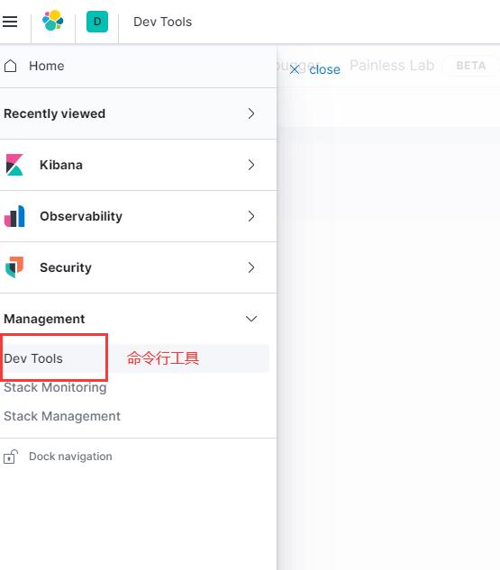

# ELK

-----------------------

## 概述

ELK是Elasticsearch、Logstash、Kibana的简称，这三者是核心套件实现日志采集、分析、展示，但并非全部。

Elasticsearch是实时全文搜索和分析引擎，提供搜集、分析、存储数据三大功能；是一套开放REST和JAVA API等结构提供高效搜索功能，可扩展的分布式系统。它构建于Apache Lucene搜索引擎库之上。

Logstash是一个用来搜集、分析、过滤日志的工具。它支持几乎任何类型的日志，包括系统日志、错误日志和自定义应用程序日志。它可以从许多来源接收日志，这些来源包括 syslog、消息传递（例如 RabbitMQ）和JMX，它能够以多种方式输出数据，包括电子邮件、websockets和Elasticsearch。

Kibana是一个基于Web的图形界面，用于搜索、分析和可视化存储在 Elasticsearch指标中的日志数据。它利用Elasticsearch的REST接口来检索数据，不仅允许用户创建他们自己的数据的定制仪表板视图，还允许他们以特殊的方式查询和过滤数据。

## 一、Elasticsearch基础

现在主流的搜索引擎大概就是：Lucene，Solr，ElasticSearch。这里是对ElasticSearch的学习。

### 1.1 Elasticsearch的功能
    
1. 分布式的搜索引擎和数据分析引擎
    
    搜索：百度，网站的站内搜索，IT系统的检索
    数据分析：电商网站，最近7天牙膏这种商品销量排名前10的商家有哪些；新闻网站，最近1个月访问量排名前3的新闻版块是哪些
    分布式，搜索，数据分析
    
2. 全文检索，结构化检索，数据分析
    
    全文检索：我想搜索商品名称包含牙膏的商品，select * from products where product_name like "%牙膏%"
    结构化检索：我想搜索商品分类为日化用品的商品都有哪些，select * from products where category_id='日化用品'
    部分匹配、自动完成、搜索纠错、搜索推荐
    数据分析：我们分析每一个商品分类下有多少个商品，select category_id,count(*) from products group by category_id
    
3. 对海量数据进行近实时的处理
    
    分布式：ES自动可以将海量数据分散到多台服务器上去存储和检索
    海联数据的处理：分布式以后，就可以采用大量的服务器去存储和检索数据，自然而然就可以实现海量数据的处理了
    近实时：检索个数据要花费1小时（这就不要近实时，离线批处理，batch-processing）；在秒级别对数据进行搜索和分析
    
    跟分布式/海量数据相反的：lucene，单机应用，只能在单台服务器上使用，最多只能处理单台服务器可以处理的数据量

### 1.2 Elasticsearch的适用场景

国外

 （1）维基百科，类似百度百科，牙膏，牙膏的维基百科，全文检索，高亮，搜索推荐
 
 （2）The Guardian（国外新闻网站），类似搜狐新闻，用户行为日志（点击，浏览，收藏，评论）+社交网络数据（对某某新闻的相关看法），数据分析，给到每篇新闻文章的作者，让他知道他的文章的公众反馈（好，坏，热门，垃圾，鄙视，崇拜）
 
 （3）Stack Overflow（国外的程序异常讨论论坛），IT问题，程序的报错，提交上去，有人会跟你讨论和回答，全文检索，搜索相关问题和答案，程序报错了，就会将报错信息粘贴到里面去，搜索有没有对应的答案
 
 （4）GitHub（开源代码管理），搜索上千亿行代码
 
 （5）电商网站，检索商品
 
 （6）日志数据分析，logstash采集日志，ES进行复杂的数据分析（ELK技术，elasticsearch+logstash+kibana）
 
 （7）商品价格监控网站，用户设定某商品的价格阈值，当低于该阈值的时候，发送通知消息给用户，比如说订阅牙膏的监控，如果高露洁牙膏的家庭套装低于50块钱，就通知我，我就去买
 
 （8）BI系统，商业智能，Business Intelligence。比如说有个大型商场集团，BI，分析一下某某区域最近3年的用户消费金额的趋势以及用户群体的组成构成，产出相关的数张报表，**区，最近3年，每年消费金额呈现100%的增长，而且用户群体85%是高级白领，开一个新商场。ES执行数据分析和挖掘，Kibana进行数据可视化

国内

    （9）国内：站内搜索（电商，招聘，门户，等等），IT系统搜索（OA，CRM，ERP，等等），数据分析（ES热门的一个使用场景）

### 1.3 elasticsearch的核心概念

    Elasticsearch			数据库
    
    -----------------------------------------
    
    Document			行
    Type				表（在7.x以后已经移除了，默认为_doc; 在6.x以后一个索引只能有一个type了，在5.x以前一个索引可以有多个type）
    Index				库

 （1）Near Realtime（NRT）：近实时，两个意思，从写入数据到数据可以被搜索到有一个小延迟（大概1秒）；基于es执行搜索和分析可以达到秒级

 （2）Cluster：集群，包含多个节点，每个节点属于哪个集群是通过一个配置（集群名称，默认是elasticsearch）来决定的，对于中小型应用来说，刚开始一个集群就一个节点很正常
 
 （3）Node：节点，集群中的一个节点，节点也有一个名称（默认是随机分配的），节点名称很重要（在执行运维管理操作的时候），默认节点会去加入一个名称为“elasticsearch”的集群，如果直接启动一堆节点，那么它们会自动组成一个elasticsearch集群，当然一个节点也可以组成一个elasticsearch集群

 （4）Document&field：文档，es中的最小数据单元，一个document可以是一条客户数据，一条商品分类数据，一条订单数据，通常用JSON数据结构表示，每个index下的type中，都可以去存储多个document。一个document里面有多个field，每个field就是一个数据字段。

 （5）Index：索引，包含一堆有相似结构的文档数据，比如可以有一个客户索引，商品分类索引，订单索引，索引有一个名称。一个index包含很多document，一个index就代表了一类类似的或者相同的document。比如说建立一个product index，商品索引，里面可能就存放了所有的商品数据，所有的商品document。
 
 （6）shard：单台机器无法存储大量数据，es可以将一个索引中的数据切分为多个shard，分布在多台服务器上存储。有了shard就可以横向扩展，存储更多数据，让搜索和分析等操作分布到多台服务器上去执行，提升吞吐量和性能。每个shard都是一个lucene index。
 
 （7）replica：任何一个服务器随时可能故障或宕机，此时shard可能就会丢失，因此可以为每个shard创建多个replica副本。replica可以在shard故障时提供备用服务，保证数据不丢失，多个replica还可以提升搜索操作的吞吐量和性能。primary shard（建立索引时一次设置，不能修改，默认5个），replica shard（随时修改数量，默认1个），默认每个索引10个shard，5个primary shard，5个replica shard，最小的高可用配置，是2台服务器。

### 1.4 使用docker安装Elasticsearch

1. 拉取docker镜像，由于国内网络原因，速度可能会比较慢或者无法下载；可以直接安装对应系统的安装包进行安装即可，基本都是解压运行即可。

	docker pull elasticsearch:7.8.0

> 镜像下载慢可以配置国内的加速

编辑编辑`/etc/docker/daemon.json`文件

    vi /etc/docker/daemon.json

添加镜像加速地址(下面这个是网易的加速地址)：

    {
      "registry-mirrors": ["http://hub-mirror.c.163.com"]
    }
> 也可以使用申请阿里云容器镜像服务ACR[https://www.aliyun.com/product/acr]；申请成功后点击管理控制台，选择镜像中心->镜像加速获取地址。    
    
重启docker

    systemctl daemon-reload
    systemctl restart docker
   
2. 创建elasticsearch容器，并启动(这里使用单机版)

    docker run -d --name es7  -p 9200:9200 -p 9300:9300 -e "discovery.type=single-node" elasticsearch:7.8.0

3. 访问 `http://192.168.1.6:9200/`

如果正常返回则说明成功，类似：

    {
      "name" : "074c8527cecd",
      "cluster_name" : "docker-cluster",
      "cluster_uuid" : "YBNpiQm8Qxmd0ma7j-1uGw",
      "version" : {
        "number" : "7.8.0",
        "build_flavor" : "default",
        "build_type" : "docker",
        "build_hash" : "757314695644ea9a1dc2fecd26d1a43856725e65",
        "build_date" : "2020-06-14T19:35:50.234439Z",
        "build_snapshot" : false,
        "lucene_version" : "8.5.1",
        "minimum_wire_compatibility_version" : "6.8.0",
        "minimum_index_compatibility_version" : "6.0.0-beta1"
      },
      "tagline" : "You Know, for Search"
    }

## 二、Kibana

kibana的界面可以很方便的查看elasticsearch的信息，也可以做图表、指标等。同时提供控制台命令操作elasticsearch。

### 使用docker安装kibana

    # 拉取kibana的镜像
    docker pull kibana:7.8.0
    # 启动kibana
    docker run -d --name kibana --link 已经启动的elasticsearch的容器ID或者是名字:elasticsearch -p 5601:5601 kibana:7.8.0  
    # 例如
    docker run -d --name kibana --link es7:elasticsearch -p 5601:5601 kibana:7.8.0

通过`http://192.168.111.44:5601`访问kibana

### 通过kibana的Console来做elasticsearch的crud和相关配置

#### elasticsearch集群状态

    GET _cat/health?v

green：每个索引的primary shard和replica shard都是active状态的
yellow：每个索引的primary shard都是active状态的，但是部分replica shard不是active状态，处于不可用的状态
red：不是所有索引的primary shard都是active状态的，部分索引有数据丢失了

> 后面加v是为了打印出更多的信息

#### 索引相关操作

    # 查询所有索引
    GET _cat/indices?v
    # 创建索引
    PUT /索引名称?pretty
    # 删除索引
    DELETE /索引名称

#### 向elasticsearch中添加和修改数据;

语法, 使用POST或者PUT都可以，存在则更新否则创建；
> 区别在于没有加ID值时（没有ID会自动生成），只能用POST表示创建；
> 需要注意的是使用PUT做更新时，其实是直接覆盖，因此需要带上所有的数据；
  
    
    POST /索引名称/_doc
    POST /索引名称/_create
    
    POST /索引名称/_doc/数据的id值
    POST /索引名称/_create/数据的id值
    
    PUT /索引名称/_doc/数据的id值
    PUT /索引名称/_create/数据的id值

只更新指定字段的值：

    POST/索引名称/_update/数据的ID值 {
        "doc":{
            // 更新内容
        }
    }

#### 查询数据

    # 查询所有
    GET /索引名称/_search
    # 根据ID查询
    GET /索引名称/_doc/数据的id值

#### 删除数据

    DELETE /索引名称/_doc/数据的id值

> 删除使用的逻辑删除，之后会统一进行物理删除
    
#### 示例

    # 添加或更新替换
    POST /ecommerce/_doc/1
    {
      "name":"小米手机",
      "desc":"支持5G、全面屏6.4",
      "price":3000,
      "producer":"小米",
      "tags":["mobile","5G"]
    }
    
    # 添加或更新替换
    PUT /ecommerce/_doc/2
    {
      "name":"华为MacBook",
      "desc":"支持5G、全面屏15.2寸",
      "price":8000,
      "producer":"Huawei",
      "tags":["笔记本电脑","huawei"]
    }
    
    # 添加或更新替换
    POST /ecommerce/_create/3
    {
      "name":"华为P40 pro",
      "desc":"支持5G、超清摄像",
      "price":12000,
      "producer":"Huawei 成都",
      "tags":["mobile","huawei","5G"]
    }
    
    # 添加
    POST /ecommerce/_doc
    {
      "name":"Ipad mini 5",
      "desc":"7.9英寸",
      "price":4000,
      "producer":"apple",
      "tags":["笔记本电脑","apple"]
    }
    
    # 更新
    POST /ecommerce/_update/1
    {
      "doc": {
        "price":2000
      }
    }
    
    # 查询
    GET /ecommerce/_search
    GET /ecommerce/_doc/1

    # 删除
    DELETE /ecommerce/_doc/4

### elasticsearch查询语句示例

#### query string search

`query string search`就是将查询条件放到http的参数上

1、查询全部

    GET /ecommerce/_search

返回字段说明：

    took：耗费了几毫秒
    timed_out：是否超时
    _shards：数据拆成几个分片，所以对于搜索请求，会打到所有的primary shard（或者是它的某个replica shard也可以）
    hits.total：查询结果的数量，即几个document
    hits.max_score：score的含义，就是document对于一个search的相关度的匹配分数，越相关，就越匹配，分数也高
    hits.hits：包含了匹配搜索的document的详细数据

2、查询名称包含`华为`的商品,并且按照售价降序排序

    GET /ecommerce/_search?q=name:华为&sort=price:desc

3、只返回name、price字段

    GET /ecommerce/_search?_source=name,price

#### query DSL

DSL：Domain Specified Language，特定领域的语言

> http request body：请求体，可以用json的格式来构建查询语法，
> 比较方便，可以构建各种复杂的语法，比query string search肯定强大多了

查询所有match_all

    GET /ecommerce/_search
    {
        "query": { "match_all": {} }
    }

查询名称包含`华为`的商品，同时按照价格降序排序

    GET /ecommerce/_search
    {
      "query": {
        "match": {
          "name": "华为"
        }
      }
      , "sort": [
        {
          "price": {
            "order": "desc"
          }
        }
      ]
    }
    
分页查询

    GET /ecommerce/_search
    {
      "query": {
        "match_all": {}
      },
      "from": 2,
      "size": 2
    }
> from 从第几条开始，起始为0
> size 返回多少条记录

指定返回的字段

    GET /ecommerce/_search
    {
      "query": {
        "match_all": {}
      },
      "_source": ["name", "price"]
    }
    
#### query filter

对数据进行过滤

搜索商品名称包含`华为`，而且售价大于8000元的商品

    GET /ecommerce/_search
    {
    "query": {
     "bool": {
       "must": [
         {
           "match": {
             "name": "华为"
           }
         }
       ],
       "filter": [
         {
           "range": {
             "price": {
               "gt": 8000
             }
           }
         }
       ]
     }
    }
    }
    
    或者
    
    GET /ecommerce/_search
    {
      "query": {
        "bool": {
          "must": {
              "match": {
                "name": "华为"
              }
            }
          ,
          "filter": {
              "range": {
                "price": {
                  "gt": 8000
                }
              }
            }
        }
      }
    }
    
> bool 里面可以写多个条件

#### full-text search（全文检索）

全文检索会将输入的搜索串拆解开来，去倒排索引里面去一一匹配，只要能匹配上任意一个拆解后的单词，就可以作为结果返回
    
    GET /ecommerce/_search
    {
      "query":{
        "match": {
          "producer": "Huawei 成都"
        }
      }
    }

#### phrase search（短语搜索）

跟全文检索相对应相反，phrase search，要求输入的搜索串，必须在指定的字段文本中，完全包含一模一样的，才可以算匹配，才能作为结果返回

     GET /ecommerce/_search
     {
       "query": {
         "match_phrase": {
           "producer": "Huawei 成都"
         }
       }
     }
 
 
#### highlight search（高亮搜索结果）

高亮搜索结果就是将匹配的字段做标识，就像百度搜索中那些匹配的内容是红色显示

    GET /ecommerce/_search
    {
      "query": {
        "match": {
          "producer": "Huawei"
        }
      },
     "highlight": {
       "fields": {
         "producer": {}
       }
     }
    }

#### 聚合：计算每个tag下的商品数量

    GET /ecommerce/_search
    {
      "size": 0, 
      "aggs": {
       "group_by_tags":{
         "terms": {
           "field": "tags"
         }
       }
      }
    }
> group_by_tags 是随意取的一个名字，待会的查询统计结果会放到这个字段中
> 加size是不返回原始数据

上面那样操作会报错，需要先执行下面的语句，更新tags字段的fielddata属性设置为true

    PUT /ecommerce/_mapping
    {
      "properties":{
        "tags":{
          "type":"text",
          "fielddata":true
        }
      }
    }
    
#### 聚合：对名称中包含yagao的商品，计算每个tag下的商品数量

    GET /ecommerce/_search
    {
      "size": 0, 
      "query": {
        "match": {
          "name": "华为"
        }
      },
      "aggs": {
        "all_tags": {
          "terms": {
            "field": "tags"
          }
        }
      }
    }

> 先执行query条件查询，然后对结果做aggs聚合处理
    
    
#### 聚合：计算每个tag下的商品的平均价格（先分组再平均）

    GET /ecommerce/_search
    {
      "size": 0, 
      "aggs": {
        "group_by_tags": {
          "terms": {
            "field": "tags"
          },
          "aggs": {
            "avg_price": {
              "avg": {
                "field": "price"
              }
            }
          }
        }
      }
    }

#### 计算每个tag下的商品的平均价格，并且按照平均价格降序排序
	
	GET /ecommerce/_search
    {
      "size": 0
      , "aggs": {
        "all_tags": {
          "terms": {
            "field": "tags", "order": {
              "avg_price": "desc"
            }
          },
          "aggs": {
            "avg_price": {
              "avg": {
                "field": "price"
              }
            }
          }
        }
      }
    }

#### 按照指定的价格范围区间进行分组，然后在每组内再按照tag进行分组，最后再计算每组的平均价格

    GET /ecommerce/_search
    {
      "size": 0, 
      "aggs": {
        "group_by_price": {
          "range": {
            "field": "price",
            "ranges": [
              {
                "from": 0,
                "to": 5000
              },
              {
                "from": 6000
              }
            ]
          },
          "aggs": {
            "group_by_tags": {
              "terms": {
                "field": "tags"
              },
              "aggs": {
                "avg_price": {
                  "avg": {
                    "field": "price"
                  }
                }
              }
            }
          }
        }
      }
    }

## 三、Elasticsearch 的分布式集群

### shard&replica机制

 （1）index包含多个shard
 
 （2）每个shard都是一个最小工作单元，承载部分数据，lucene实例，完整的建立索引和处理请求的能力
 
 （3）增减节点时，shard会自动在nodes中负载均衡
 
 （4）primary shard和replica shard，每个document肯定只存在于某一个primary shard以及其对应的replica shard中，不可能存在于多个primary shard
 
 （5）replica shard是primary shard的副本，负责容错，以及承担读请求负载
 
 （6）primary shard的数量在创建索引的时候就固定了，replica shard的数量可以随时修改
 
 （7）primary shard的默认数量是5，replica默认是1，默认有10个shard，5个primary shard，5个replica shard
 
 （8）primary shard不能和自己的replica shard放在同一个节点上（否则节点宕机，primary shard和副本都丢失，起不到容错的作用），但是可以和其他primary shard的replica shard放在同一个节点上

 （9）相同primary shard的replica shard不能放在同一个节点上；（节点宕机时，replica shard副本都丢失，起不到容错的作用）

### 单node环境下创建index

（1）单node环境下，创建一个index，有3个primary shard，3个replica shard

（2）集群status是yellow

（3）这个时候，只会将3个primary shard分配到仅有的一个node上去，另外3个replica shard是无法分配的

（4）集群可以正常工作，但是一旦出现节点宕机，数据全部丢失，而且集群不可用，无法承接任何请求

## 四、Elasticsearch内部相关实现

### 并发数据修改控制
 
Elasticsearch内部是多线程异步并发的进行修改（即可能出现后修改的先处理），采用version进行乐观锁；

具体原理：Elasticsearch每次执行更新和删除操作成功时，它的version都会自动加1，
每次执行更新删除时会带上版本号，如果版本号不一致，则会放弃此次操作；
这样就保证了后修改的先执行的情况能够正常处理，不会被先修改的覆盖掉。

#### 示例：在更新的时候带上版本号参数

    POST /ecommerce/_update/2?version=3
    {
      "doc":{
        "tags":["laptop ", "Huawei"]
      }
    }

> 当版本号version不匹配的时候会更新失败

### 使用external version来进行乐观锁并发控制

es提供了一个feature，就是说，你可以不用它提供的内部_version版本号来进行并发控制，可以基于你自己维护的一个版本号来进行并发控制。

举个列子，假如你的数据在mysql里也有一份，然后你的应用系统本身就维护了一个版本号，无论是什么自己生成的，程序控制的。
这个时候，你进行乐观锁并发控制的时候，可能并不是想要用es内部的_version来进行控制，而是用你自己维护的那个version来进行控制。

    PUT /ecommerce/_doc/1?version=2&version_type=external
    {
        "name" : "小米10Pro",
        "desc" : "支持5G、全面屏6.4",
        "price" : 3000,
        "producer" : "小米",
        "tags" : [
          "xiaomi",
          "mobile",
          "5G"
        ]
    }
    
> 在后面多加一个`version_type=external`参数，只有version版本比当前ES维护的版本号大就可以更新成功

### partial update说明

语法（url地址后面可以加版本号?version=1）：

    POST /索引名称/_update/ID值
    {
      "doc":{
            // 更新字段信息
      }
    }

使用partial update进行更新其实际执行过程如下：

1. 内部先获取document；
2. 将传过来的field更新到document的json中去；
3. 将原来的document标记为删除状态；
4. 将修改后的新的document创建出来；

> 实际上和传统的全量替换几乎一样。
> 
> 如果document不存在会报错

同时partial update将自动执行基于version的乐观锁并发控制

设置在发送冲突时进行重试的次数

    POST /ecommerce/_update/1?retry_on_conflict=2
    {
      "doc": {
        "price":3000
      }
    }

#### 优点

1. 所有查询、修改和写回操作都发生在es的一个shard内部，几乎避免了所有的网络数据传输开销，提升性能；
2. 减少了查询和修改的时间间隔，能够有效的减少并发的冲突的情况；（因为其内部操作几乎在毫秒级别）

#### 示例

    POST /ecommerce/_update/1
    {
      "doc":{
            "name" : "小米10"
      }
    }

### es的脚本支持：groovy

#### 使用内置脚本来做累加操作

将price加1

    POST /ecommerce/_update/1
    {
      "script": "ctx._source.price+=1"
    }

#### 外置脚本

这个相当于关系型数据库的存储过程，将需要执行的脚本放到es的`config/scripts`目录下

如在`config/scripts`目录下创建一个名为`add-price.groovy`文件，在里面写入如下脚本：

    ctx._source.price+=add_price

执行这个脚本：

    POST /ecommerce/_update/1
    {
      "script": {
        "lang": "groovy",
        "file": "add-price",
        "params": {
          "add_price":1
        }
      }
    }

##### 示例删除document的脚本
在`config/scripts`目录下创建一个名为`del-doc.groovy`文件，在里面写入如下脚本：

    ctx.op = ctx._source.price>price?'delete':'none'

执行脚本

    POST /ecommerce/_update/1
    {
      "script": {
        "lang": "groovy",
        "file": "del-doc",
        "params": {
          "price":5000
        }
      }
    }

#### upsert的使用

解决当在执行更新时document不存在导致更新失败的问题。

    POST /ecommerce/_update/1
    {
      "script": "ctx._source.price+=1",
      "upsert": {
        "price":0,
        "tags":[]
      }
    }

> upsert就是没有的时候对document进行初始化

### _mget批量查询

普通的查询方式只能一条一条的查询，使用mget可以实现批量查询，减少网络开销

#### 查询ID为1和2的数据

不同的index

    GET /_mget
    {
      "docs":[
        {
          "_index":"ecommerce",
          "_id":1
        },
            {
          "_index":"goods",
          "_id":2
        }
        ]
    }

同一个index

    GET /ecommerce/_mget
    {
      "docs":[
        {
          "_id":1
        },
        {
          "_id":2
        }
        ]
    }
    
同一个index且相同的filed      

    GET /ecommerce/_mget
    {
      "ids":[1,2]
      
    }

对返回的source字段进行过滤

    GET /ecommerce/_mget
    {
      "docs":[
        {
          "_id":1,
          "_source":["price","name"]
        },
        {
          "_id":2,
          "_source":"price"
        },
        {
          "_id":3,
          "_source":false
        }
        ]
    }

> 注意直接用ids来查询时不能进行字段过滤

### _bulk批量增删改

create：创建
delete：删除
update：更新

    POST /_bulk
    {"delete":{"_index":"ecommerce","_id":3}}
    {"create":{"_index":"ecommerce","_id":3}}
    {"price":5000}
    {"update":{"_index":"ecommerce","_id":3}}
    {"doc":{"price":6000}}

> 一条语句不能有换行这些，直接一行
> 在create之后可以添加需要添加的属性
> update的更新属性需要加`doc`
> 如果在一个index中可以不写index，直接跟在url上即可

    POST /ecommerce/_bulk
    {"delete":{"_id":3}}
    {"create":{"_id":3}}
    {"price":5000}
    {"update":{"_id":3}}
    {"doc":{"price":6000}}

_bulk在执行的时候，如果其中有一条语句执行失败，不会影响其他的执行，会在返回结果中将异常提示返回

#### bulk size最佳大小

bulk request会加载到内存里，如果太大的话，性能反而会下降，因此需要反复尝试一个最佳的bulk size。
一般从1000到5000条数据开始，尝试逐渐增加。另外，如果看大小的话，最好是在5~15MB之间。

### 什么是distributed document store？

围绕着document在操作，其实就是把es当成了一个NoSQL存储引擎，一个可以存储文档类型数据的存储系统，操作里面的document。

适合的的应用程序类型

（1）数据量较大，es的分布式本质，可以帮助你快速进行扩容，承载大量数据

（2）数据结构灵活多变，随时可能会变化，而且数据结构之间的关系，非常复杂，如果我们用传统数据库，那是不是很坑，因为要面临大量的表

（3）对数据的相关操作，较为简单，比如就是一些简单的增删改查，用我们之前讲解的那些document操作就可以搞定

（4）NoSQL数据库，适用的也是类似于上面的这种场景

### document数据路由原理
（1）document路由到shard上是什么意思？

一个index的数据会被分为多片，每片都在一个shard中，因此一个document只能存在一个shard中；
当有一个document需要操作时，es就需要知道这个document是放在index的那个shard上的。
这个过程就称之为document的数据路由。

（2）路由算法：shard = hash(routing) % number_of_primary_shards

举个例子来简要说明哈这个算法：
    一个index有3个primary shard（分别为P0，P1，P2），每次增删改查一个document的时候，都会带过来一个routing number，
默认就是这个document的_id（可能是手动指定，也可能是自动生成）routing = _id，假设_id=1；将这个routing值传入一个hash函数中，产出一个routing值的hash值；
然后将hash函数产出的值对这个index的primary shard的数量求余数，根据这个余数的值决定document放在那个shard上

> 决定一个document在哪个shard上，最重要的一个值就是routing值，默认是_id，也可以手动指定，保证相同的routing值，每次过来，从hash函数中，产出的hash值一定是相同的；
> 这也是为什么ES启动后设置好primary_shards数量之后，primary_shards的数量不能再更改了的原因

### document增删改内部原理

（1）客户端选择一个node发送请求过去，这个node就是coordinating node（协调节点）
（2）coordinating node，对document进行路由，将请求转发给对应的node（有primary shard）
（3）实际的node上的primary shard处理请求，然后将数据同步到replica node
（4）coordinating node，如果发现primary node和所有replica node都搞定之后，就返回响应结果给客户端

### 写一致性原理以及quorum机制剖析

consistency，one（primary shard），all（all shard），quorum（default）

我们在发送任何一个增删改操作的时候，比如说`put /index/_doc/id`，都可以带上一个`consistency`参数，指明我们想要的写一致性是什么？
`put /index/_doc/id?consistency=quorum`

    one：要求我们这个写操作，只要有一个primary shard是active活跃可用的，就可以执行
    all：要求我们这个写操作，必须所有的primary shard和replica shard都是活跃的，才可以执行这个写操作
    quorum：默认的值，要求所有的shard中，必须是大部分的shard都是活跃的，可用的，才可以执行这个写操作

#### quorum机制，写之前必须确保大多数shard都可用（也就是半数以上）

计算公式：

    quroum = int( (primary + number_of_replicas) / 2 ) + 1，当number_of_replicas>1时才生效；active状态的的shard数>=quroum才可以执行
    
    
举个例子：

    3个primary shard，number_of_replicas=1，总共有3 + 3 * 1 = 6个shard
    quorum = int( (3 + 1) / 2 ) + 1 = 3
    所以，要求6个shard中至少有3个shard是active状态的，才可以执行写操作

#### 如果节点数少于quorum数量，可能导致quorum不齐全，进而导致无法执行任何写操作

如下2个例子：

例子1：3个primary shard，replica=1，要求至少3个shard是active，3个shard按照之前学习的shard&replica机制，必须在不同的节点上，如果说只有1台机器的话，是不是有可能出现说，3个shard都没法分配齐全，此时就可能会出现写操作无法执行的情况

例子2：1个primary shard，replica=3，quorum=((1 + 3) / 2) + 1 = 3，要求1个primary shard + 3个replica shard = 4个shard，其中必须有3个shard是要处于active状态的。如果这个时候只有2台机器的话，会出现什么情况呢？

因此es提供了一种特殊的处理场景，当number_of_replicas>1时才生效，因为假如说，就一个primary shard，replica=1，此时就2个shard
(1 + 1 / 2) + 1 = 2，要求必须有2个shard是活跃的，但是可能就1个node，此时就1个shard是活跃的，如果你不特殊处理的话，导致我们的单节点集群就无法工作

#### quorum不齐全时，wait，默认1分钟，timeout，100，30s

等待期间，期望活跃的shard数量可以增加，最后实在不行，就会timeout

我们其实可以在写操作的时候，加一个timeout参数，比如说`put /index/type/id?timeout=30`，这个就是自己去设定quorum不满足条件的时候，es的timeout时长，可以缩短，也可以增长

### document查询内部原理

1. 客户端发送请求到任意一个node，成为coordinate node
2. coordinate node对document进行路由，将请求转发到对应的node，此时会使用round-robin随机轮询算法，在primary shard以及其所有replica中随机选择一个，让读请求负载均衡
3. 接收请求的node返回document给coordinate node
4. coordinate node返回document给客户端
5. 特殊情况：document如果还在建立索引过程中，可能只有primary shard有，任何一个replica shard都没有，此时可能会导致无法读取到document，
但是document完成索引建立之后，primary shard和replica shard就都有了

### bulk api的奇特json格式与底层性能优化关系

bulk api奇特的json格式

    {"action": {"meta"}}\n
    {"data"}\n
    {"action": {"meta"}}\n
    {"data"}\n

1、bulk中的每个操作都可能要转发到不同的node的shard去执行

2、如果采用比较良好的json数组格式

允许任意的换行，整个可读性非常棒，读起来很爽，es拿到那种标准格式的json串以后，要按照下述流程去进行处理

* 将json数组解析为JSONArray对象，这个时候，整个数据，就会在内存中出现一份一模一样的拷贝，一份数据是json文本，一份数据是JSONArray对象
* 解析json数组里的每个json，对每个请求中的document进行路由
* 为路由到同一个shard上的多个请求，创建一个请求数组
* 将这个请求数组序列化
* 将序列化后的请求数组发送到对应的节点上去

3、耗费更多内存，更多的jvm gc开销

占用更多的内存可能就会积压其他请求的内存使用量，比如说最重要的搜索请求，分析请求，等等，此时就可能会导致其他请求的性能急速下降
另外的话，占用内存更多，就会导致java虚拟机的垃圾回收次数更多，更频繁，每次要回收的垃圾对象更多，耗费的时间更多，导致es的java虚拟机停止工作线程的时间更多

假如：一个bulk size的请求为10M，共计100个请求就是1GB的内存占用，假设转为json对象后为2GB，如果请求数量更多，那么消耗的内存就就更多了，同时Java虚拟机的垃圾回收也会更加的耗时，导致系统性能下降。

4、使用现在的奇特格式的优点

* 不用将其转换为json对象，不会出现内存中的相同数据的拷贝，直接按照换行符切割json
* 对每两个一组的json，读取meta，进行document路由
* 直接将对应的json发送到node上去

5、最大的优势在于，不需要将json数组解析为一个JSONArray对象形成一份大数据的拷贝，浪费内存空间，这样可以尽可能地保证性能

## 五、搜索引擎

### 5.1 search结果解析（search timeout机制说明）

    took：整个搜索请求花费了多少毫秒
    hits.total：本次搜索，返回了几条结果
    hits.max_score：本次搜索的所有结果中，最大的相关度分数是多少，每一条document对于search的相关度，_score分数越大，排位越靠前
    hits.hits：默认查询前10条数据，完整数据，_score降序排序
    timeout：默认无timeout，latency平衡completeness，手动指定timeout，timeout查询执行机制
    shards：shards fail的条件（primary和replica全部挂掉），不影响其他shard。默认情况下来说，一个搜索请求，会打到一个index的所有primary shard上去，每个primary shard都可能会有一个或多个replica shard，所以请求也可以到primary shard的其中一个replica shard上去。

带上超时参数：timeout=10ms，timeout=1s，timeout=1m

    GET /_search?timeout=10m

### 5.2 multi-index和multi-type搜索模式解析以及搜索原理

#### multi-index和multi-type搜索模式

如何一次性搜索多个index和多个type下的数据

    GET /_search：               所有索引，所有type下的所有数据都搜索出来
    GET /index1/_search：        指定一个index，搜索其下所有的数据
    GET /index1,index2/_search： 同时搜索两个index下的数据
    GET /*1,*2/_search：         按照通配符去匹配多个索引
    GET /_all/_search            可以代表搜索所有index下的数据

> 也可以加删除type属性，但是es

#### 简单的搜索原理

客户端发送一个请求，会将请求分发到所有的primary shard上执行，因为每一个shard上都包含部分数据，所有每一个shard上都可能包含搜索请求的结果；
如果primary shard有 replica shard，那么请求也会发送到replica shard上去处理

### 5.3 分页搜索以及deep paging性能问题

#### 使用es进行分页搜索的语法

size，from

    GET /_search?size=10
    GET /_search?size=10&from=0
    GET /_search?size=10&from=20

#### deep paging

搜索很深就是deep paging；会很耗费性能，应当尽量避免。比如查询临近最后一页的数据，而数据在各个分片上，最后需要将各个分片返回的数据进行综合处理，每个分片实际返回数据不是每页的条数。

### 5.4 快速掌握query string search语法以及_all metadata

#### query string基础语法

    GET /demo_index/_search?q=test_field:test
    GET /demo_index/_search?q=+test_field:test
    GET /demo_index/_search?q=-test_field:test

使用+号和没有+号是一样，表示包含指定的关键词；-号表示不含

#### _all metadata的原理和作用

    # 匹配包含test的数据
    GET /demo_index/_search?q=test

直接可以搜索所有的field，任意一个field包含指定的关键字就可以搜索出来。我们在进行中搜索的时候，不是对document中的每一个field都进行一次搜索；
    
es中的_all元数据，在建立索引的时候，每插入一条document，它里面包含了多个field，此时，es会自动将多个field的值，全部用字符串的方式串联起来，变成一个长的字符串，作为_all field的值，同时建立索引；
后面如果在搜索的时候，没有对某个field指定搜索，就默认搜索_all field，其中是包含了所有field的值的。
    
举个例子
    
    {
      "name": "tom",
      "age": 25,
      "email": "tom@1qq.com",
      "address": "beijing"
    }
    
`tom 25 tom@qq.com beijing`，作为这一条document的_all field的值，同时进行分词后建立对应的倒排索引；生产环境通常不使用

### 5.5 mapping到底是什么？

自动或手动为index中的type建立的一种数据结构和相关配置，简称为mapping。

当添加数据时会dynamic mapping，自动为我们建立index，创建type，以及type对应的mapping，mapping中包含了每个field对应的数据类型，以及如何分词等设置。

#### 示例

添加一些测试数据

    PUT /website/_doc/1
    {
      "post_date": "2020-01-01",
      "title": "my first article",
      "content": "this is my first article in this website",
      "author_id": 9527
    }
    
    PUT /website/_doc/2
    {
      "post_date": "2020-01-02",
      "title": "my second article",
      "content": "this is my second article in this website",
      "author_id": 9527
    }
    
    PUT /website/_doc/3
    {
      "post_date": "2020-01-03",
      "title": "my third article",
      "content": "this is my third article in this website",
      "author_id": 9527
    }

尝试如下搜索，只会返回1条数据：

    GET /website/_search?q=2020
    GET /website/_search?q=2020-01-02
    GET /website/_search?q=post_date:2020-01-01
    GET /website/_search?q=post_date:2020

查看mapping

    GET /website/_mapping

搜索结果为什么不一致，因为es自动建立mapping的时候，设置了不同的field不同的data type。不同的data type的分词、搜索等行为是不一样的。所以出现了_all field和post_date field的搜索表现不是我们所期望的

### 5.6 精确匹配与全文搜索的对比分析

#### 精确匹配（exact value）

2020-01-01，exact value，搜索的时候，2020-01-01，才能搜索出来；如果你输入一个01，是搜索不出来的

#### 全文搜索（full text）

* 缩写 vs. 全程：cn vs. china；如2020-01-01，2020 01 01，搜索2020，或者01，都可以搜索出来；china，搜索cn，也可以将china搜索出来
* 格式转化：like liked likes；likes，搜索like，也可以将likes搜索出来
* 大小写：Tom vs tom；Tom，搜索tom，也可以将Tom搜索出来
* 同义词：like vs love；like，搜索love，同义词，也可以将like搜索出来

所有全文搜索不只是匹配完整的一个值，而是可以对值进行拆分词语后（分词）进行匹配，也可以通过缩写、时态、大小写、同义词等进行匹配。

### 5.7 倒排索引核心原理

doc1：I really liked my small dogs, and I think my mom also liked them.
doc2：He never liked any dogs, so I hope that my mom will not expect me to liked him.

分词，初步的倒排索引的建立

    |word  |doc1|doc2|
    |:     |:   |:   |
    |I     | *	|  * |
    |really| *  |    |
    |liked | *	|    |
    |my	   | *	|  * |
    |small | *	|    |
    |dogs  | *  |    |
    |and   | *  |    |
    ....

搜索`mother like little dog`，不可能有任何结果

这个是不是我们想要的搜索结果，因为在我们看来，mother和mom有区别吗？同义词，都是妈妈的意思。like和liked有区别吗？没有，都是喜欢的意思，只不过一个是现在时，一个是过去时。little和small有区别吗？同义词，都是小小的。dog和dogs有区别吗？狗，只不过一个是单数，一个是复数。

因此正常情况下在建立倒排索引的时候，会执行一个normalization操作，对拆分出的各个单词进行相应的处理，以提升后面搜索的时候能够搜索到相关联的文档的概率

重新建立倒排索引，加入normalization，再次用mother liked little dog搜索，就可以搜索到了

`mother like little dog`会先分词再normalization（时态的转换，单复数的转换，同义词的转换，大小写的转换）

    mother	--> mom
    like	--> like
    little	--> little
    dog	--> dog

doc1和doc2都会搜索出来

### 5.8 分词器的内部组成到底是什么，以及内置分词器的介绍

#### 什么是分词器

一个分词器，将一段文本拆分成一个一个的单个的单词，同时对每个单词进行normalization（时态转换，单复数转换），最后将处理好的结果才会拿去建立倒排索引。

切分词语，normalization（提升召回率【recall】）；具体包含如下：

    recall，召回率：搜索的时候，增加能够搜索到的结果的数量

    character filter：在一段文本进行分词之前，先进行预处理，比如说最常见的就是，过滤html标签（hello --> hello），& --> and（I&you --> I and you）

    tokenizer：分词，hello you and me --> hello, you, and, me

    token filter：lowercase，stop word，synonymom，dogs --> dog，liked --> like，Tom --> tom，a/the/an --> 干掉，mother --> mom，small --> little

### 5.9 query string的分词以及mapping

query string必须以和index建立时相同的analyzer进行分词

query string对exact value和full text的区别对待

> 不同类型的field，可能有的就是full text，有的就是exact value；因此上面进行搜索时查询结果不是我们预期的

#### 测试分词器

    GET /_analyze
    {
      "analyzer": "standard",
      "text": "Text to analyze"
    }

### 5.10 什么是mapping再次回炉透彻理解

* 往es里面直接插入数据，es会自动建立索引，同时建立type以及对应的mapping
* mapping中就自动定义了每个field的数据类型
* 不同的数据类型（比如说text和date），可能有的是exact value，有的是full text
* exact value，在建立倒排索引的时候，分词的时候，是将整个值一起作为一个关键词建立到倒排索引中的；full text，会经历各种各样的处理，分词，normaliztion（时态转换，同义词转换，大小写转换），才会建立到倒排索引中
* 同时呢，exact value和full text类型的field就决定了，在一个搜索过来的时候，对exact value field或者是full text field进行搜索的行为也是不一样的，会跟建立倒排索引的行为保持一致；比如说exact value搜索的时候，就是直接按照整个值进行匹配，full text query string，也会进行分词和normalization再去倒排索引中去搜索
* 可以用es的dynamic mapping，让其自动建立mapping，包括自动设置数据类型；也可以提前手动创建index和type的mapping，自己对各个field进行设置，包括数据类型，包括索引行为，包括分词器，等等

mapping，就是index的type的元数据，每个type都有一个自己的mapping，决定了数据类型，建立倒排索引的行为，还有进行搜索的行为

### 5.11 mapping的核心数据类型以及dynamic mapping    

#### 核心的数据类型

    string
    byte，short，integer，long
    float，double
    boolean
    date
#### dynamic mapping类型推测

    true or false	 -->	boolean
    123		         -->	long
    123.01		     -->	double
    2020-01-01	     -->	date
    "hello world es" -->	string/text

### 5.12 手动建立和修改mapping以及定制string类型数据是否分词

#### 如何建立索引

    analyzed      ------ 分词类型
    not_analyzed  ------ 不分词
    no            ------ 不分词同时不能被搜索

只能创建index时手动建立mapping，或者新增field mapping，但是不能update field mapping

    PUT /website
    {
      "mappings": {
        "properties": {
          "author_id": {
            "type": "long"
          },
          "title": {
            "type": "text",
            "analyzer": "english"
          },
          "content": {
            "type": "text"
          },
          "post_date": {
            "type": "date"
          },
          "publisher_id": {
            "type": "keyword"
          },
          "is_del": {
            "type":"boolean",
            "index":false
          }
        }
      }
    }

> "index":false 表示不加入索引
> "type": "keyword" 表示不分词，在7.x版本后not_analyzed已经被取消掉了

新增filed mapping

    PUT /website/_mapping
    {
      "properties":{
        
        "new_filed":{
          "type":"text",
          "index":false
        }
      }
    }

### 5.13 mapping复杂数据类型以及object类型数据底层结构

#### multivalue field

    { "tags": [ "tag1", "tag2" ]}

建立索引时与string是一样的，数据类型不能混

#### empty field

    null，[]，[null]

#### object field

    PUT /company/employee/1
    {
      "address": {
        "country": "china",
        "province": "guangdong",
        "city": "guangzhou"
      },
      "name": "jack",
      "age": 27,
      "join_date": "2020-01-01"
    }

对应这种object类型的底层数据存储示例

    "authors": [
        { "age": 26, "name": "Jack White"},
        { "age": 55, "name": "Tom Jones"},
        { "age": 39, "name": "Kitty Smith"}
    ]
    
    上面的会转换成下面这种：
    
    {
        "authors.age":    [26, 55, 39],
        "authors.name":   [jack, white, tom, jones, kitty, smith]
    }

### 5.14 search api的基础语法介绍
    
#### search api的基本语法

    GET /search
    {}

    GET /index1,index2/type1,type2/search
    {}

    GET /_search
    {
      "from": 0,
      "size": 10
    }

#### http协议中get是否可以带上request body
    
HTTP协议，一般不允许get请求带上request body，但是因为get更加适合描述查询数据的操作。

碰巧，很多浏览器，或者是服务器，也都支持GET+request body模式；如果遇到不支持的场景，也可以用POST /_search

### 5.15 快速上机动手实战Query DSL搜索语法

#### 示例什么是Query DSL

    GET /_search
    {
        "query": {
            "match_all": {}
        }
    }
#### Query DSL的基本语法
    {
        QUERY_NAME: {
            ARGUMENT: VALUE,
            ARGUMENT: VALUE,...
        }
    }

    {
        QUERY_NAME: {
            FIELD_NAME: {
                ARGUMENT: VALUE,
                ARGUMENT: VALUE,...
            }
        }
    }

示例

    GET /test_index/_search 
    {
      "query": {
        "match": {
          "test_field": "test"
        }
      }
    }
    
#### 如何组合多个搜索条件

初始数据：

    PUT /website/_doc/1
    {
      
      "title": "my elasticsearch article",
      "content": "es is very bad",
      "author_id": 110
    }
    
    PUT /website/_doc/2
    {
      
      "title": "my elasticsearch article",
      "content": "es is very good",
      "author_id": 111
    }
    
    PUT /website/_doc/3
    {
      
      "title": "my elasticsearch article",
      "content": "es is just so so",
      "author_id": 112
    }

1. title必须包含elasticsearch，content可以包含elasticsearch也可以不包含，author_id必须不为111

    GET /website/_search
    {
      "query": {
        "bool": {
          "must": [
            {
              "match": {
                "title": "elasticsearch"
              }
            }
          ],
          "should": [
            {
              "match": {
                "content": "elasticsearch"
              }
            }
          ],
          "must_not": [
            {
              "match": {
                "author_id": 111
              }
            }
          ]
        }
      }
    }    

示例2

    GET /website/_search
    {
      "query": {
        "bool": {
          "must": {
            "match": {
              "name": "tom"
            }
          },
          "should": [
            {
              "match": {
                "hired": true
              }
            },
            {
              "bool": {
                "must": {
                  "match": {
                    "personality": "good"
                  }
                },
                "must_not": {
                  "match": {
                    "rude": true
                  }
                }
              }
            }
          ],
          "minimum_should_match": 1
        }
      }
    }
    
> should 相当于or
> bool 相当于（）
> must 相当于and
> must_not 就是不等于  

### 5.16 filter与query深入对比解密：相关度，性能

#### filter与query示例

    PUT /company/_doc/1
    {
      "join_date": "2016-01-01",
      "age":33,
      "name":"tom cat"
    }
    
    PUT /company/_doc/2
    {
      "join_date": "2016-01-01",
      "age":29,
      "name":"jerry mouse"
    }

搜索请求：年龄必须大于等于30，同时join_date必须是2016-01-01

    GET /company/_search
    {
      "query": {
        "bool": {
          "must": [
            {
              "match": {
                "join_date": "2016-01-01"
              }
            }
          ],
          "filter": {
            "range": {
              "age": {
                "gte": 30
              }
            }
          }
        }
      }
    }

#### filter与query对比大解密

* filter，仅仅只是按照搜索条件过滤出需要的数据而已，不计算任何相关度分数，对相关度没有任何影响
* query，会去计算每个document相对于搜索条件的相关度，并按照相关度进行排序

一般来说，如果你是在进行搜索，需要将最匹配搜索条件的数据先返回，那么用query；如果只是要根据一些条件筛选出一部分数据，不关注其排序，那么用filter
除非是你的这些搜索条件，你希望越符合这些搜索条件的document越排在前面返回，那么这些搜索条件要放在query中；如果你不希望一些搜索条件来影响你的document排序，那么就放在filter中即可

#### filter与query性能

* filter，不需要计算相关度分数，不需要按照相关度分数进行排序，同时还有内置的自动cache最常使用filter的数据
* query，相反，要计算相关度分数，按照分数进行排序，而且无法cache结果

bool，must，must_not，should，filter
每个子查询都会计算一个document针对它的相关度分数，然后bool综合所有分数，合并为一个分数，当然filter是不会计算分数的

### 5.17 常用的各种query搜索语法

#### match all

    GET /_search
    {
        "query": {
            "match_all": {}
        }
    }

#### match

    GET /_search
    {
        "query": { "match": { "title": "my elasticsearch article" }}
    }

#### multi match

    GET /test_index/_search
    {
      "query": {
        "multi_match": {
          "query": "test",
          "fields": ["test_field", "test_field1"]
        }
      }
    }

#### range query

    GET /company/_search 
    {
      "query": {
        "range": {
          "age": {
            "gte": 30
          }
        }
      }
    }

#### term query

    GET /test_index/_search 
    {
      "query": {
        "term": {
          "test_field": "test hello"
        }
      }
    }

#### terms query

对tag指定多个分组词

    GET /_search
    {
        "query": { "terms": { "tag": [ "search", "full_text", "nosql" ] }}
    }

### 5.18 如何定位不合法的搜索以及其原因

    GET /company/_validate/query?explain
    {
      "query": {
        "match": {
          "name": "cat"
        }
      }
    }

一般用在那种特别复杂庞大的搜索下，比如一下子写了上百行的搜索，这个时候可以先用validate api去验证一下，搜索是否合法

### 5.19 如何定制搜索结果的排序规则

#### 默认排序规则

默认情况下，是按照_score降序排序的；然而，某些情况下，可能没有有用的_score，比如说filter

    GET /_search
    {
      "query": {
        "bool": {
          "filter": {
            "term": {
              "name": "cat"
            }
          }
        }
      }
    }

当然，也可以是constant_score

    GET /_search
    {
      "query": {
        "constant_score": {
          "filter": {
            "term": {
              "author_id": 1
            }
          }
        }
      }
    }

#### 定制排序规则

使用sort来定制排序规则

    GET /company/_search 
    {
      "query": {
        "constant_score": {
          "filter": {
            "range": {
              "age": {
                "gte": 25
              }
            }
          }
        }
      },
      "sort": [
        {
          "join_date": {
            "order": "asc"
          }
        }
      ]
    }

### 5.20 如何将一个field索引两次来解决字符串排序问题
如果对一个string field进行排序，结果往往不准确，因为分词后是多个单词，再排序就不是我们想要的结果了

通常解决方案是，将一个string field建立两次索引，一个分词，用来进行搜索；一个不分词，用来进行排序

示例：先创建索引

    PUT /website 
    {
      "mappings": {
        "properties": {
          "title": {
            "type": "text",
            "fields": {
              "raw": {
                "type": "keyword"
              }
            },
            "fielddata": true
          },
          "content": {
            "type": "text"
          },
          "post_date": {
            "type": "date"
          },
          "author_id": {
            "type": "long"
          }
        }
      }
    }

> 设置正排索引 "fielddata": true

添加初始数据

    PUT /website/_doc/1
    {
      "title": "first article",
      "content": "this is my first article",
      "post_date": "2017-01-01",
      "author_id": 110
    }
    
    PUT /website/_doc/2
    {
      "title": "second article",
      "content": "this is my second article",
      "post_date": "2018-01-01",
      "author_id": 111
    }   

执行查询

    GET /website/_search
    {
      "query": {
        "match_all": {}
      },
      "sort": [
        {
          "title.raw": {
            "order": "desc"
          }
        }
      ]
    }    

### 5.21 相关度评分TF&IDF算法    

#### TF&IDF算法介绍

* relevance score算法，简单来说，就是计算出，一个索引中的文本，与搜索文本，他们之间的关联匹配程度；
* Elasticsearch使用的是 term frequency/inverse document frequency算法，简称为TF/IDF算法；
* Term frequency：搜索文本中的各个词条在field文本中出现了多少次，出现次数越多，就越相关；
* Inverse document frequency：搜索文本中的各个词条在整个索引的所有文档中出现了多少次，出现的次数越多，就越不相关；

    举个例子：
       搜索请求：hello world
       
       doc1：hello, today is very good
       doc2：hi world, how are you
       
       比如说，在index中有1万条document，hello这个单词在所有的document中，一共出现了1000次；world这个单词在所有的document中，一共出现了100次；那么doc2的相关度越高

* Field-length norm：field内容长度，越长，相关度越弱       

### 5.22 内核级知识点之doc value初步探秘

搜索的时候，要依靠倒排索引；排序的时候，需要依靠正排索引，看到每个document的每个field，然后进行排序，所谓的正排索引，其实就是doc values；
在建立索引的时候，一方面会建立倒排索引，以供搜索用；一方面会建立正排索引，也就是doc values，以供排序，聚合，过滤等操作使用；
doc values是被保存在磁盘上的，此时如果内存足够，os会自动将其缓存在内存中，性能还是会很高；如果内存不足够，os会将其写入磁盘上；

倒排索引类似如下（对每个字段进行操作）：

    doc1的content字段内容: hello world you and me
    doc2的content字段内容: hi, world, how are you
    
    word		doc1	doc2
    hello		*
    world		*		*
    .......

正排索引类似如下（对整个文档进行操作）：
    
    doc1内容: { "name": "jack", "age": 27 }
    doc2内容: { "name": "tom", "age": 30 }
    
    document	name		age
    doc1		jack		27
    doc2		tom		    30	

### 5.23 分布式搜索引擎内核解密之query phase
#### query phase

1. 搜索请求发送到某一个coordinate node，构构建一个priority queue，长度以paging操作from和size为准，默认为10
2. coordinate node将请求转发到所有shard，每个shard本地搜索，并构建一个本地的priority queue
3. 各个shard将自己的priority queue返回给coordinate node，并构建一个全局的priority queue

#### replica shard如何提升搜索吞吐量

一次请求要打到所有shard的一个replica/primary上去，如果每个shard都有多个replica，那么同时并发过来的搜索请求可以同时打到其他的replica上去

### 5.24 分布式搜索引擎内核解密之fetch phase

fetch phbase工作流程

1. coordinate node构建完priority queue之后，就发送mget请求去所有shard上获取对应的document
2. 各个shard将document返回给coordinate node
3. coordinate node将合并后的document结果返回给client客户端

一般搜索，如果不加from和size，就默认搜索前10条，按照_score排序

### 5.25 搜索相关参数梳理以及bouncing results问题解决方案       

#### preference

决定了哪些shard会被用来执行搜索操作

_primary, _primary_first, _local, _only_node:xyz, _prefer_node:xyz, _shards:2,3

bouncing results问题，两个document排序，field值相同；不同的shard上，可能排序不同；每次请求轮询打到不同的replica shard上；每次页面上看到的搜索结果的排序都不一样。这就是bouncing result，也就是跳跃的结果。

搜索的时候，是轮询将搜索请求发送到每一个replica shard（primary shard），但是在不同的shard上，可能document的排序不同

解决方案就是将preference设置为一个字符串，比如说user_id，让每个user每次搜索的时候，都使用同一个replica shard去执行，就不会看到bouncing results了

#### timeout

主要就是限定在一定时间内，将部分获取到的数据直接返回，避免查询耗时过长

#### routing

document文档路由，_id路由，routing=user_id，这样的话可以让同一个user对应的数据到一个shard上去

#### search_type

default：query_then_fetch

dfs_query_then_fetch，可以提升revelance sort精准度

### 5.26 基于scoll技术滚动搜索大量数据

如果一次性要查出来10万条数据，那么性能会很差，此时一般会采取用scoll滚动查询，一批一批的查，直到所有数据都查询完处理完。

使用scoll滚动搜索，可以先搜索一批数据，然后下次再搜索一批数据，以此类推，直到搜索出全部的数据来

scoll搜索会在第一次搜索的时候，保存一个当时的视图快照，之后只会基于该旧的视图快照提供数据搜索，如果这个期间数据变更，是不会让用户看到的

采用基于_doc进行排序的方式，性能较高

每次发送scroll请求，我们还需要指定一个scoll参数，指定一个时间窗口，每次搜索请求只要在这个时间窗口内能完成就可以了；

    GET /website/_search?scroll=1m
    {
      "query": {
        "match_all": {}
      },
      "sort": [ "_doc" ],
      "size": 3
    }

获得的结果会有一个scoll_id，下一次再发送scoll请求的时候，必须带上这个scoll_id

    GET /_search/scroll
    {
        "scroll": "1m", 
        "scroll_id" : "FGluY2x1ZGVfY29udGV4dF91dWlkDXF1ZXJ5QW5kRmV0Y2gBFHg3bnJvM01CYXBadGRjZ1FELWNqAAAAAAAADY8WdXVKQzR3TzVSMEtialVYM1gxbWkzZw=="
    }

## 六、索引管理

### 6.1 索引的创建、修改、删除

#### 创建索引

指定分片信息、mapping信息

    PUT /index_demo
    {
      "settings": {
        "number_of_shards": 1,
        "number_of_replicas": 0
      },
      "mappings": {
        "properties": {
          "name":{
            "type": "text"
          }
        }
      }
    }

使用默认的配置
    
    PUT /index_pretty?pretty

#### 修改索引

    PUT /index_demo/_settings
    {
      "number_of_replicas": 1
    }

#### 删除索引

    DELETE /index_demo
    DELETE /index_1,index_2
    DELETE /index_demo*
    DELETE /_all
     
     
     
### 6.2 修改分词器以及定制自己的分词器

#### 默认的分词器standard

* standard tokenizer：以单词边界进行切分
* standard token filter：什么都不做
* lowercase token filter：将所有字母转换为小写
* stop token filer（默认被禁用）：移除停用词，比如a the it等等

#### 修改分词器的设置

* 启用english停用词token filter（创建索引的时候才可以）

    PUT /index_demo
    {
      "settings": {
        "number_of_shards": 1,
        "number_of_replicas": 0,
        "analysis": {
          "analyzer": {
            "es_std":{
              "type": "standard",
              "stopwords": "_english_"
            }
          }
        }
      },
      "mappings": {
        "properties": {
          "name":{
            "type": "text"
          }
        }
      }
    }

测试定制的分词器的效果：

    # 使用定制的
    GET /index_demo/_analyze
    {
      "analyzer": "es_std",
      "text": "a dog is in the house"
    }
    
    # 使用默认的
    GET /index_demo/_analyze
    {
      "analyzer": "standard",
      "text":"a dog is in the house"
    }

#### 定制分词器

将`&`转换为and，`a 、the`不做处理，将html标签过滤掉，将字符转为小写的

    PUT /index_demo
    {
      "settings": {
        "analysis": {
          "char_filter": {
            "&_to_and": {
              "type": "mapping",
              "mappings": ["&=> and"]
            }
          },
          "filter": {
            "my_stopwords":{
              "type": "stop",
              "stopwords": ["the", "a"]
            }
          },
          "analyzer": {
            "my_analyzer":{
              "type":"custom",
              "char_filter": ["html_strip", "&_to_and"],
              "tokenizer":"standard",
              "filter":["lowercase","my_stopwords"]
            }
          }
        }
      }
    }    

测试定制的分词器

    GET /index_demo/_analyze
    {
      "text": "tom&jerry are a friend in the house, <a>, HAHA!!",
      "analyzer": "my_analyzer"
    }
    
    
    
### 6.3 深入探秘type底层数据结构

type，是一个index中用来区分类似的数据的，类似的数据，但是可能有不同的fields，而且有不同的属性来控制索引建立、分词器；
field的value，在底层的lucene中建立索引的时候，全部是opaque bytes类型，不区分类型的；
lucene是没有type的概念的，在document中，实际上将type作为一个document的field来存储，即_type，es通过_type来进行type的过滤和筛选；
一个index中的多个type，实际上是放在一起存储的，因此一个index下，不能有多个type重名，因为那样是无法处理的；
在es7中一个index只能有一个type，默认为_doc，不推荐去自定义了。

#### 举例说明

设置的mappings如下：

    {
       "ecommerce": {
          "mappings": {
            "_type": {
              "type": "string",
              "index": "not_analyzed"
            },
            "name": {
              "type": "string"
            }
            "price": {
              "type": "double"
            }
            "service_period": {
              "type": "string"
            }
            "eat_period": {
              "type": "string"
            }
          }
       }
    }

假设有如下2条数据存入

    {
      "name": "geli kongtiao",
      "price": 1999.0,
      "service_period": "one year"
    }

    {
      "name": "aozhou dalongxia",
      "price": 199.0,
      "eat_period": "one week"
    }

在底层的存储是这样子的

    {
      "_type": "elactronic_goods",
      "name": "geli kongtiao",
      "price": 1999.0,
      "service_period": "one year",
      "eat_period": ""
    }

    {
      "_type": "fresh_goods",
      "name": "aozhou dalongxia",
      "price": 199.0,
      "service_period": "",
      "eat_period": "one week"
    }

如果存入数据没有某个filed时，将会存入一个空值；假如说，将两个type的field完全不同，放在一个index下，那么就每条数据都至少有一半的field在底层的lucene中是空值，会有严重的性能问题；
因此在es7中一个index只能有一个type，默认为_doc，不推荐去自定义了。
    

### 6.4 mapping root object剖析 

#### root object

就是某个type对应的mapping json，包括了properties，metadata（_id，_source，_type），settings（analyzer），其他settings（比如include_in_all）

    PUT /index_demo
    {
      "mappings": {
        "properties": {
          
        }
      }
    }

#### properties

type，index，analyzer

    PUT /index_demo/_mapping
    {
      "properties": {
        "title": {
          "type": "text"
        }
      }
    }

#### _source

优点：

1. 查询的时候，直接可以拿到完整的document，不需要先拿document id，再发送一次请求拿document
2. partial update基于_source实现
3. reindex时，直接基于_source实现，不需要从数据库（或者其他外部存储）查询数据再修改
4. 可以基于_source定制返回field
5. debug query更容易，因为可以直接看到_source

如果不需要上述好处，可以禁用_source；但是不建议这么做[官方说明](https://www.elastic.co/guide/en/elasticsearch/reference/current/mapping-source-field.html#disable-source-field)

    PUT /index_demo
    {
      "mappings": {
        "_source": {"enabled": false}
      }
    }

#### 标识性metadata

_index，_type，_id

### 6.5 定制化自己的dynamic mapping

#### 定制dynamic策略

    true：遇到陌生字段，就进行dynamic mapping
    false：遇到陌生字段，就忽略
    strict：遇到陌生字段，就报错

示例：

    PUT /index_demo
    {
      "mappings": {
        "dynamic":"strict",
        "properties": {
          "title":{
            "type": "text"
          },
          "address":{
            "type": "object",
            "dynamic": true
          }
        }
      }
    }

测试数据添加是否可以成功    
    
    PUT /index_demo/_doc/1
    {
      "title":"this is firestone",
      "content":"this is content",
      "address":{
        "province":"北京",
        "city":"北京"
      }
    }

由于做了现在，因此上面这个会添加失败
    
    PUT /index_demo/_doc/1
    {
      "title":"this is firestone",
      "address":{
        "province":"北京",
        "city":"北京"
      }
    }

   
   
#### 定制dynamic mapping策略

默认会按照一定格式识别date，比如yyyy-MM-dd。但是如果某个field先过来一个2017-01-01的值，就会被自动dynamic mapping成date，
后面如果再来一个"hello world"之类的值，就会报错。可以手动关闭某个type的date_detection，如果有需要，自己手动指定某个field为date类型。

    PUT /index_demo/_mapping
    {
        "date_detection": false
    }
    
    
#### 定制自己的dynamic mapping template

    PUT /index_demo
    {
      "mappings": {
        "dynamic_templates": [
          {
            "en": {
              "match": "*_en",
              "match_mapping_type": "string",
              "mapping": {
                "type": "text",
                "analyzer": "english"
              }
            }
          }
        ]
      }
    }

测试   
   
    PUT index_demo/_doc/1
    {
     "title":"this is my first article"
    }
    
    PUT index_demo/_doc/2
    {
     "title_en":"this is my first article"
    }
    
    GET /index_demo/_search
    {
      "query":{
        "match": {
          "title": "is"
        }
      }
    }

title没有匹配到任何的dynamic模板，默认就是standard分词器，不会过滤停用词，is会进入倒排索引，用is来搜索是可以搜索到的；
title_en匹配到了dynamic模板，就是english分词器，会过滤停用词，is这种停用词就会被过滤掉，用is来搜索就搜索不到了；
    
    
### 6.6 基于scoll+bulk+索引别名实现零停机重建索引

#### 重建索引

一个field的设置是不能被修改的，如果要修改一个Field，那么应该重新按照新的mapping，建立一个index，然后将数据批量查询出来，重新用bulk api写入index中；
批量查询的时候，建议采用scroll api，并且采用多线程并发的方式来reindex数据，每次scoll就查询指定日期的一段数据，交给一个线程即可；

举个例子：

（1）一开始，依靠dynamic mapping，插入数据，但是不小心有些数据是2017-01-01这种日期格式的，所以title这种field被自动映射为了date类型，实际上它应该是string类型的。

    PUT /index_demo/_doc/1
    {
      "title":"2020-01-01"
    }
    
    PUT /index_demo/_doc/2
    {
      "title":"2020-01-02"
    }

（2）当后期向索引中加入string类型的title值的时候，就会报错。

    PUT /index_demo/_doc/3
    {
      "title":"es 入门"
    }

（3）如果此时想修改title的类型，是不可能的

    PUT /index_demo/_mapping
    {
      "properties":{
        "title":{
          "type":"text"
        }
      }
    }

（4）此时，唯一的办法，就是进行reindex，也就是说，重新建立一个索引，将旧索引的数据查询出来，再导入新索引

（5）如果旧索引的名字是old_index，新索引的名字是new_index，终端java应用，已经在使用old_index在操作了，难道还要去停止java应用，修改使用的index为new_index，才重新启动java应用吗？这个过程中，就会导致java应用停机，可用性降低

（6）所以说，给java应用一个别名，这个别名是指向旧索引的，java应用先用着，java应用先用goods_index alias来操作，此时实际指向的是旧的my_index

    PUT /index_demo/_alias/goods_index

（7）新建一个index，调整其title的类型为string

    PUT /index_demo_new
    {
      "mappings": {
        "properties": {
          "title":{
            "type":"text"
          }
        }
      }
    }

（8）使用scroll api将数据批量查询出来

    GET /index_demo/_search?scroll=1m
    {
      "query": {
        "match_all": {}
      },
      "sort": ["_doc"],
      "size": 1
    }

（9）采用bulk api将scoll查出来的一批数据，批量写入新索引

    POST /_bulk
    {"index":{"_index":"index_demo_new", "_id":"1"}}
    {"title":"2020-01-01"}

（10）反复循环8~9，查询一批又一批的数据出来，采取bulk api将每一批数据批量写入新索引

（11）将goods_index alias切换到my_index_new上去，java应用会直接通过index别名使用新的索引中的数据，java应用程序不需要停机，零提交，高可用

    POST /_aliases
    {
      "actions": [
        {
          "remove": {
            "index": "index_demo",
            "alias": "goods_index"
          }
        },
        {
          "add": {
            "index": "index_demo_new",
            "alias": "goods_index"
          }
        }
      ]
    }

（12）直接通过goods_index别名来查询，是否ok
    

## 七、内核原理

### 7.1 倒排索引组成结构以及其索引不可变原因

倒排索引，是适合用于进行搜索的

倒排索引的结构：

1. 包含这个关键词的document list
2. 包含这个关键词的所有document的数量：IDF（inverse document frequency）
3. 这个关键词在每个document中出现的次数：TF（term frequency）
4. 这个关键词在这个document中的次序
5. 每个document的长度：length norm
6. 包含这个关键词的所有document的平均长度

    word		doc1		doc2
    
    dog		     *		     *
    hello		 *
    you				         *

倒排索引不可变的好处

1. 不需要锁，提升并发能力，避免锁的问题
2. 数据不变，一直保存在os cache中，只要cache内存足够
3. filter cache一直驻留在内存，因为数据不变
4. 可以压缩，节省cpu和io开销

倒排索引不可变的坏处：每次都要重新构建整个索引

### 7.2 图解剖析document写入原理（buffer，segment，commit）

#### 基本流程

1. 数据写入buffer
2. commit point
3. buffer中的数据写入新的index segment
4. 等待在os cache中的index segment被fsync强制刷到磁盘上
5. 新的index sgement被打开，供search使用
6. buffer被清空

每次commit point时，会有一个.del文件，标记了哪些segment中的哪些document被标记为deleted;
搜索的时候，会依次查询所有的segment，从旧的到新的，比如被修改过的document，在旧的segment中，会标记为deleted，在新的segment中会有其新的数据

#### 优化后的流程
在基础流程中通常写入磁盘是比较耗时，因此无法实现NTR近实时的查询。主要瓶颈在于fsync实际发生磁盘IO写数据进磁盘，是很耗时的。

写入流程别改进如下：

（1）数据写入buffer
（2）每隔一定时间，buffer中的数据被写入segment文件，但是先写入os cache
（3）只要segment写入os cache，那就直接打开供search使用，不立即执行commit

数据写入os cache，并被打开供搜索的过程，叫做refresh，默认是每隔1秒refresh一次。
也就是说，每隔一秒就会将buffer中的数据写入一个新的index segment file，先写入os cache中。
所以，es是近实时的，数据写入到可以被搜索，默认是1秒。

`POST /index_demo/_refresh`，可以手动refresh，一般不需要手动执行，没必要，让es自己搞就可以了

比如现在的时效性要求，比较低，只要求一条数据写入es，一分钟以后才让我们搜索到就可以了，那么就可以调整refresh interval

    PUT /index_demo
    {
      "settings": {
        "refresh_interval": "30s" 
      }
    }

#### 最终优化流程

1. 数据写入buffer缓冲和translog日志文件
2. 每隔一秒钟，buffer中的数据被写入新的segment file，并进入os cache，此时segment被打开并供search使用
3. buffer被清空
4. 重复1~3，新的segment不断添加，buffer不断被清空，而translog中的数据不断累加
5. 当translog长度达到一定程度的时候，commit操作发生

5-1. buffer中的所有数据写入一个新的segment，并写入os cache，打开供使用
5-2. buffer被清空
5-3. 一个commit ponit被写入磁盘，标明了所有的index segment
5-4. filesystem cache中的所有index segment file缓存数据，被fsync强行刷到磁盘上
5-5. 现有的translog被清空，创建一个新的translog

#### 基于translog和commit point，如何进行数据恢复

fsync+清空translog，就是flush，默认每隔30分钟flush一次，或者当translog过大的时候，也会flush

`POST /index_demo/_flush`，一般来说别手动flush，让它自动执行就可以了

translog，每隔5秒被fsync一次到磁盘上。在一次增删改操作之后，当fsync在primary shard和replica shard都成功之后，那次增删改操作才会成功

但是这种在一次增删改时强行fsync translog可能会导致部分操作比较耗时，也可以允许部分数据丢失，设置异步fsync translog

    PUT /index_demo/_settings
    {
        "index.translog.durability": "async",
        "index.translog.sync_interval": "5s"
    }

#### 最后优化写入流程实现海量磁盘文件合并（segment merge，optimize）
每秒一个segment file，文件过多，而且每次search都要搜索所有的segment，很耗时

默认会在后台执行segment merge操作，在merge的时候，被标记为deleted的document也会被彻底物理删除

每次merge操作的执行流程

1. 选择一些有相似大小的segment，merge成一个大的segment
2. 将新的segment flush到磁盘上去
3. 写一个新的commit point，包括了新的segment，并且排除旧的那些segment
4. 将新的segment打开供搜索
5. 将旧的segment删除

`POST /index_demo/_optimize?max_num_segments=1`，尽量不要手动执行，让它自动默认执行就可以了

## 八、Java API初步使用

### CRUD

#### 老版本（下面的方法都是过期的，在es8开始将会被移除）

引入maven依赖：

    <dependency>
        <groupId>org.elasticsearch.client</groupId>
        <artifactId>transport</artifactId>
        <version>7.8.1</version>
    </dependency>

添加日志依赖（可选）：

    <dependency>
        <groupId>org.apache.logging.log4j</groupId>
        <artifactId>log4j-api</artifactId>
        <version>2.13.3</version>
    </dependency>
    <dependency>
        <groupId>org.apache.logging.log4j</groupId>
        <artifactId>log4j-core</artifactId>
        <version>2.13.3</version>
    </dependency>

代码测试

    public static void main(String[] args) throws Exception {

        // 构建client
        Settings settings = Settings.builder()
                .put("cluster.name", "docker-cluster")
                .build();
        TransportClient client = new PreBuiltTransportClient(settings)
                .addTransportAddress(new TransportAddress(InetAddress.getByName("192.168.111.40"), 9300));

        //addDoc(client);
        //getDoc(client);
        //updateDoc(client);
        delDoc(client);
        
        client.close();
    }

    /**
     * 添加
     */
    public static void addDoc(TransportClient client) throws IOException {
        IndexResponse response = client.prepareIndex("employee", "_doc", "1")
                .setSource(XContentFactory.jsonBuilder()
                        .startObject()
                        .field("user", "tom")
                        .field("age", 18)
                        .field("position", "scientist")
                        .field("country", "China")
                        .field("join_data", "2020-01-01")
                        .field("salary", 10000)
                        .endObject())
                .get();
        System.out.println(response.getResult());
    }

    /**
     * 查询
     */
    public static void getDoc(TransportClient client){
        GetResponse documentFields = client.prepareGet("employee", "_doc", "1").get();
        System.out.println(documentFields.getSourceAsString());
    }

    /**
     * 更新
     */
    public static void updateDoc(TransportClient client) throws IOException {
        UpdateResponse response = client.prepareUpdate("employee", "_doc", "1")
                .setDoc(XContentFactory.jsonBuilder()
                        .startObject()
                        .field("salary", 1000000)
                        .endObject())
                .get();
        System.out.println(response.getResult());
    }

    /**
     * 删除
     */
    public static void delDoc(TransportClient client){
        DeleteResponse response = client.prepareDelete("employee", "_doc", "1").get();
        System.out.println(response);
    }
    
    /***
     * 查询职位中包含scientist，并且年龄在28到40岁之间
     */
    public static void search(TransportClient client){
        SearchResponse response = client.prepareSearch("employee")
                .setQuery(QueryBuilders.boolQuery().must(QueryBuilders.matchQuery("position", "scientist"))
                        .filter(QueryBuilders.rangeQuery("age").gte(28).lte(40))).setFrom(0).setSize(2).get();
        System.out.println(response);
    }
    
    /***
     * 聚合查询(需要重建mapping)
     */
    public static void search2(TransportClient client){
        SearchResponse response = client.prepareSearch("employee")
                .addAggregation(AggregationBuilders.terms("group_by_country")
                        .field("country")
                        .subAggregation(AggregationBuilders.dateHistogram("group_by_join_date")
                                .field("joinDate")
                                .dateHistogramInterval(DateHistogramInterval.YEAR)
                                .subAggregation(AggregationBuilders.avg("avg_salary").field("salary")))
                ).execute().actionGet();

        System.out.println(response);
    }

> 重建mapping语句：

    PUT /employee
    {
      "mappings": {
        "properties": {
          "age": {
            "type": "long"
          },
          "country": {
            "type": "text",
            "fields": {
              "keyword": {
                "type": "keyword",
                "ignore_above": 256
              }
            },
            "fielddata": true
          },
          "joinData": {
            "type": "date"
          },
          "name": {
            "type": "text",
            "fields": {
              "keyword": {
                "type": "keyword",
                "ignore_above": 256
              }
            }
          },
          "position": {
            "type": "text",
            "fields": {
              "keyword": {
                "type": "keyword",
                "ignore_above": 256
              }
            }
          },
          "salary": {
            "type": "long"
          }
        }
      }
    }

#### 新版本

添加maven依赖：

    <dependency>
        <groupId>org.elasticsearch.client</groupId>
        <artifactId>elasticsearch-rest-high-level-client</artifactId>
        <version>7.8.1</version>
    </dependency>

代码测试

    public static void main(String[] args) throws IOException {
        HttpHost[] httpHost = {HttpHost.create("192.168.111.40:9200")};
        RestHighLevelClient restHighLevelClient = new RestHighLevelClient(RestClient.builder(httpHost));
        // addDoc(restHighLevelClient);
        // getDoc(restHighLevelClient);
        // updateDoc(restHighLevelClient);
        delDoc(restHighLevelClient);

        restHighLevelClient.close();
    }

    /**
     * 添加
     */
    public static void addDoc(RestHighLevelClient client) throws IOException {
        IndexRequest request = new IndexRequest("employee");
        request.id("1");
        request.source(XContentFactory.jsonBuilder()
                .startObject()
                .field("user", "tom")
                .field("age", 18)
                .field("position", "scientist")
                .field("country", "China")
                .field("join_data", "2020-01-01")
                .field("salary", 10000)
                .endObject());
        IndexResponse response = client.index(request, RequestOptions.DEFAULT);
        System.out.println(response.getResult());
    }

    /**
     * 查询
     */
    public static void getDoc(RestHighLevelClient client) throws IOException {
        // 通过ID来查询
        GetRequest request = new GetRequest("employee","1");
        GetResponse response = client.get(request, RequestOptions.DEFAULT);
        // 更丰富的查询条件
        /// SearchRequest searchRequest = new SearchRequest();
        /// client.search(searchRequest, RequestOptions.DEFAULT);

        System.out.println(response.getSourceAsString());
    }

    /**
     * 更新
     */
    public static void updateDoc(RestHighLevelClient client) throws IOException {
        UpdateRequest request = new UpdateRequest("employee", "1");
        request.doc(XContentFactory.jsonBuilder()
                .startObject()
                .field("salary", 1000000)
                .endObject());
        UpdateResponse response = client.update(request, RequestOptions.DEFAULT);
        System.out.println(response.getResult());
    }

    /**
     * 删除
     */
    public static void delDoc(RestHighLevelClient client) throws IOException {
        DeleteRequest request = new DeleteRequest("employee", "1");
        DeleteResponse response = client.delete(request, RequestOptions.DEFAULT);
        System.out.println(response);
    }  
    
     /**
     * 查询职位中包含scientist，并且年龄在28到40岁之间
     */
     public static void search(RestHighLevelClient client) throws IOException {
        SearchRequest request = new SearchRequest("employee");
        request.source(SearchSourceBuilder.searchSource()
                .query(QueryBuilders.boolQuery()
                        .must(QueryBuilders.matchQuery("position", "scientist"))
                        .filter(QueryBuilders.rangeQuery("age").gte("28").lte("28"))
                ).from(0).size(2)
        );
        SearchResponse search = client.search(request, RequestOptions.DEFAULT);
        System.out.println(JSONObject.toJSONString(search.getHits()));
     }

    
      
   

## 九、深度探索搜索技术

## 十、IK中文分词器

### 安装

从github上下载安装包（或者自己编译）：

    https://github.com/medcl/elasticsearch-analysis-ik

将解压后的文件放到es的docker容器中（也可以做个文件目录的映射）：

    docker cp /home/ik es7:/usr/share/elasticsearch/plugins/

> ik目录就是解压后的文件目录
> 如果不确定plugins目录在哪儿，可以通过`docker exec -it es7 /bin/bash`命令进入容器内查看

然后重启es

    docker restart es7

### ik分词器基础知识

两种analyzer，根据自己的需要选择，但是一般是选用ik_max_word

ik_max_word: 会将文本做最细粒度的拆分，比如会将“中华人民共和国国歌”拆分为“中华人民共和国,中华人民,中华,华人,人民共和国,人民,人,民,共和国,共和,和,国国,国歌”，会穷尽各种可能的组合；

ik_smart: 会做最粗粒度的拆分，比如会将“中华人民共和国国歌”拆分为“中华人民共和国,国歌”。

### ik分词器的使用

配置mapping：

    PUT /news
    {
      "mappings": {
        "properties": {
          "content":{
            "type": "text",
            "analyzer": "ik_max_word"
          }
        }
      }
    }

### IK分词器配置文件讲解以及自定义词库

    IKAnalyzer.cfg.xml：用来配置自定义词库
    main.dic：ik原生内置的中文词库，总共有27万多条，只要是这些单词，都会被分在一起
    quantifier.dic：放了一些单位相关的词
    suffix.dic：放了一些后缀
    surname.dic：中国的姓氏
    stopword.dic：英文停用词

ik原生最重要的两个配置文件

main.dic：包含了原生的中文词语，会按照这个里面的词语去分词

stopword.dic：包含了英文的停用词，停用词，stopword

一般，像停用词，会在分词的时候，直接被干掉，不会建立在倒排索引中

### 自定义词库    

（1）自己建立词库：每年都会涌现一些特殊的流行词，网红，蓝瘦香菇，喊麦，鬼畜，一般不会在ik的原生词典里

自己补充自己的最新的词语，到ik的词库里面去

在IKAnalyzer.cfg.xml中配置自定义的词，ext_dict，custom/mydict.dic

补充自己的词语，然后需要重启es，才能生效

（2）自己建立停用词库：比如了，的，啥，么，我们可能并不想去建立索引，让人家搜索

custom/ext_stopword.dic，已经有了常用的中文停用词，可以补充自己的停用词，然后重启es

### 修改IK分词器源码来基于mysql热更新词库

热更新

每次都是在es的扩展词典中，手动添加新词语，很坑
（1）每次添加完，都要重启es才能生效，非常麻烦
（2）es是分布式的，可能有数百个节点，你不能每次都一个一个节点上面去修改

es不停机，直接我们在外部某个地方添加新的词语，es中立即热加载到这些新词语

热更新的方案

（1）修改ik分词器源码，然后手动支持从mysql中每隔一定时间，自动加载新的词库
（2）基于ik分词器原生支持的热更新方案，部署一个web服务器，提供一个http接口，通过modified和tag两个http响应头，来提供词语的热更新

用第一种方案，第二种，ik git社区官方都不建议采用，觉得不太稳定

## 定位查询

设置类型

    PUT /hotel
    {
      "mappings": {
        "properties": {
          "location":{
            "type": "geo_point"
          }
        }
      }
    }

添加数据
    
    PUT /hotel/_doc/1
    {
      "name":"四季酒店",
      "location":{
        "lat":30.558456,
        "lon":104.073273
      }
    }

> lat: 纬度，lon：经度

    PUT /hotel/_doc/2
    {
      "name":"成都威斯凯尔凯特酒店",
      "location":"30.5841,104.061939"
    }

    PUT /hotel/_doc/3
    {
      "name":"北京天安门",
      "location":{
        "lat":39.909187,
        "lon":116.397451
      }
    }

> 纬度在前，经度在后    
    
#### 查询范围内的数据（左上角和右下角的点组成的矩形内的坐标）

    GET /hotel/_search
    {
      "query": {
        "geo_bounding_box": {
          "location": {
            "top_left": {
              "lat": 40,
              "lon": 100
            },
            "bottom_right":{
               "lat": 30,
              "lon": 106
            }
          }
        }
      }
    }       

#### 查询包含成都，且在指定区域的数据

    GET /hotel/_search
    {
      "query": {
        "bool": {
          "must": [
            {
              "match": {
                "name": "成都"
              }
            }
          ],
          "filter": {
            "geo_bounding_box": {
              "location": {
                "top_left": {
                  "lat": 40,
                  "lon": 100
                },
                "bottom_right": {
                  "lat": 30,
                  "lon": 106
                }
              }
            }
          }
        }
      }
    } 

#### 多个点组成的多边型内

    GET /hotel/_search
    {
      "query": {
        "bool": {
          "must": [
            {"match_all": {}}
          ],
          "filter": [
            {
            "geo_polygon": {
              "location": {
                "points": [
                  {
                    "lat": 40,
                  "lon": 100
                  },
                  {
                   "lat": 30,
                  "lon": 106
                  },
                  {
                   "lat": 35,
                  "lon": 120
                  }
                ]
              }
            }
            }
          ]
        }
      }
    }    

#### 搜索范围内的 

    GET /hotel/_search
    {
      "query": {
        "bool": {
          "must": [
            {
              "match_all": {}
            }
          ],
          "filter": [
            {
              "geo_distance": {
                "distance": "100km",
           
                "location": {
                  "lat": 30,
                  "lon": 116
                }
              }
            }
          ]
        }
      }
    } 

#### 统计当前距离多远的酒店数

    GET /hotel/_search
    {
    "size": 0, 
      "aggs": {
        "agg_by_distance_range": {
          "geo_distance": {
            "field": "location",
            "origin": {
              "lat": 30,
              "lon": 106
            },
            "unit": "mi", 
            "ranges": [
              {
                "from": 100,
                "to": 300
              }
            ]
          }
        }
      }
    }
     